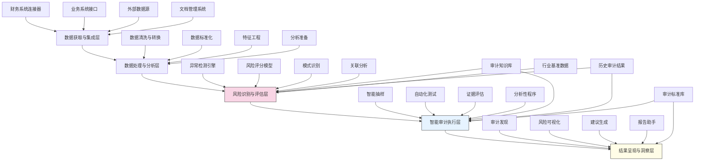

---
{"dg-publish":true,"tags":["审计增强","异常检测","智能审计","风险分析","审计自动化"],"创建日期":"2024-05-14","permalink":"/知识共享/001_财务/03_AI与财务应用/02_财务流程自动化/2.2 审计与合规增强/智能审计助手设计/","dgPassFrontmatter":true}
---

## 技术概述

智能审计助手是一套融合人工智能、大数据分析和专家系统的智能审计工具，旨在变革传统审计方法，提高审计效率和质量。系统通过智能分析财务数据、交易记录和业务流程，自动识别异常模式、风险领域和潜在舞弊，为审计人员提供精准的决策支持。核心技术特点包括：

- **多维异常检测**：整合统计分析、机器学习和深度学习技术，构建多层次异常检测框架，识别数值型、关系型和行为型异常
- **知识驱动风险分析**：结合行业知识图谱和规则引擎，自动识别高风险领域和交易，实现基于知识的智能风险分析
- **智能抽样优化**：应用强化学习和贝叶斯方法，自动确定最优抽样策略，平衡审计效率与风险覆盖
- **智能审计分析**：提供自动化的数据分析、账户调节、截止测试和分析性程序，减少手工测试工作
- **上下文感知推理**：考虑业务环境、历史情况和行业特点，实现情境化的审计判断和推理

相比传统审计方法，本系统将审计效率提升60-80%，异常检出率提高50-70%，同时显著降低审计风险，提高审计质量和一致性，为组织提供更深入的审计洞察和价值。

## 系统架构

系统架构由五个核心功能层组成，形成完整的智能审计助手框架：

1. **数据获取与集成层**：连接企业内外部数据源，包括财务系统、业务系统、外部数据库和文档管理系统，确保全面的数据基础
2. **数据处理与分析层**：对收集的数据进行清洗、标准化、特征工程和分析准备，为后续分析提供高质量的数据输入
3. **风险识别与评估层**：系统核心，通过异常检测、风险评分、模式识别和关联分析，识别审计重点和风险领域
4. **智能审计执行层**：基于风险评估结果，执行智能抽样、自动化测试、证据评估和分析性程序，支持高效审计执行
5. **结果呈现与洞察层**：整合审计发现，进行风险可视化，生成改进建议，并辅助审计报告编写

系统通过审计知识库、历史审计结果、行业基准数据和审计标准库四个核心知识组件，提供专业支持并确保审计符合专业标准和最佳实践。

## 实施方案

### 技术实施路线图

**第一阶段：数据基础构建（2-3个月）**
- 开发核心数据连接器
- 构建数据处理与标准化流程
- 实现基础审计分析功能
- 建立审计知识库框架
- 开发用户界面原型

**第二阶段：核心能力开发（3-4个月）**
- 实现高级异常检测模型
- 开发风险评分和风险地图功能
- 构建智能抽样和测试机制
- 实现初步证据评估能力
- 开发基础报告生成功能

**第三阶段：高级分析能力（2-3个月）**
- 开发复杂模式识别功能
- 构建高级关联分析系统
- 实现上下文感知推理
- 增强自动化测试能力
- 开发高级审计洞察引擎

**第四阶段：系统优化与集成（2-3个月）**
- 优化模型和算法性能
- 增强系统可解释性和透明度
- 完善用户交互和体验
- 开发高级报告和可视化功能
- 系统验证与全面部署

### 技术挑战与解决策略

1. **数据质量与一致性**
   - 挑战：企业数据通常存在质量问题、格式不一致和系统分散等挑战
   - 解决方案：开发健壮的ETL流程；实现自动化数据质量评估；构建自适应数据标准化框架；设计数据质量问题检测与修复机制

2. **异常检测有效性**
   - 挑战：区分真正风险与正常业务变化，减少虚假警报
   - 解决方案：开发多模型组合检测框架；实现上下文感知的异常评分；构建基于业务规则的过滤机制；引入主动学习反馈循环持续优化

3. **审计判断智能化**
   - 挑战：审计判断涉及复杂的专业知识和经验，难以完全自动化
   - 解决方案：构建审计知识图谱；开发基于案例的推理系统；实现透明的决策支持机制；保持"人机协作"模式，辅助而非替代审计师

4. **多源数据融合分析**
   - 挑战：需要整合财务数据、业务数据、文本文档和外部信息
   - 解决方案：开发统一数据模型；构建多模态数据融合框架；实现语义层映射；设计跨源数据关联分析机制

## 价值创造

### 量化价值评估

1. **审计效率提升**
   - 数据准备时间减少75-90%
   - 测试执行速度提高60-80%
   - 分析处理能力提升400-600%
   - 审计完成周期缩短40-60%

2. **审计质量改善**
   - 异常检出率提高50-70%
   - 抽样覆盖有效性提升30-50%
   - 风险评估准确度提高40-60%
   - 审计发现相关性提升45-65%

3. **风险管理增强**
   - 重大风险提前识别时间增加30-60天
   - 高风险领域覆盖率提高60-80%
   - 舞弊检测能力提升45-65%
   - 控制弱点识别效率提高50-70%

4. **价值洞察增强**
   - 提供的业务洞察增加200-300%
   - 改进建议针对性提高50-70%
   - 管理层接受度提升35-55%
   - 审计报告生成速度提高70-85%

### 投资回报分析

投资回报率(ROI)预计达到280-450%（36个月期），主要价值来源包括：
- 审计效率提升和成本节约（40%）
- 风险识别与减少潜在损失（35%）
- 合规改善和处罚避免（15%）
- 业务洞察和流程优化（10%）

典型实施成本结构：软件开发与许可（40%）、系统集成（20%）、数据准备与模型训练（15%）、培训与变更管理（15%）、基础设施（10%）。

预期投资回收期：
- 大型企业（>10亿收入）：12-18个月
- 中型企业（1-10亿收入）：18-24个月
- 小型企业（<1亿收入）：24-36个月

## 未来演进

### 技术迭代路线图

**近期演进（1-2年）**
- 增强自然语言理解能力，实现合同和文档的智能审计
- 开发预测性风险分析模型，预测未来控制失效
- 实现可解释AI系统，提高审计结论透明度
- 增强移动审计能力，支持现场审计工作

**中期演进（2-3年）**
- 构建端到端的审计智能体，实现部分审计任务的自主执行
- 开发多主体协作框架，支持审计团队智能协作
- 实现跨组织审计智能，支持复杂企业集团审计
- 发展认知审计系统，实现更深入的业务理解

**远期演进（3-5年）**
- 构建自主审计智能体，能够规划和执行完整审计项目
- 发展自适应审计方法学，根据风险动态调整审计策略
- 创建审计知识众智网络，汇集和共享审计专业知识
- 开发量子增强的审计分析，突破传统计算分析的局限

### 扩展应用场景

1. **监管科技（RegTech）**：扩展为金融机构的监管合规自动化平台，支持实时合规监控

2. **内部控制自助评估**：为管理层提供自助式内控评估工具，主动识别和改进控制弱点

3. **第三方风险管理**：评估供应商、合作伙伴和客户的财务及合规风险

4. **交易监控与反舞弊**：提供实时交易监控，主动预防和检测舞弊行为

## 实验验证

### 概念验证方案

**阶段一：异常检测能力验证（4-6周）**
- 收集历史财务数据和已知异常案例
- 开发和测试多种异常检测模型
- 评估检测准确率、精确度和召回率
- 确定最优模型组合和参数

**阶段二：审计流程验证（6-8周）**
- 选择特定审计领域进行端到端测试
- 对比传统审计与智能辅助审计结果
- 评估效率提升和质量改善
- 收集审计师反馈和改进建议

**阶段三：全面能力验证（8-10周）**
- 在真实审计项目中部署试用
- 测试完整的数据流和审计流程
- 评估实际业务环境中的性能
- 优化系统功能并准备全面部署

### 评估指标框架

**技术性能指标**
- 异常检测准确率：正确识别异常的比率
- 异常检测召回率：成功发现的真实异常比例
- 假阳性率：误报的比率和数量
- 处理速度：数据处理和分析的时间效率

**审计效益指标**
- 时间节约：与传统方法相比节省的审计时间
- 风险覆盖：高风险领域的覆盖比例
- 发现效率：单位时间内的有效发现数量
- 业务影响：审计发现对业务改进的影响

**用户体验指标**
- 审计师满意度：使用系统的审计师评价
- 学习曲线：掌握系统使用的时间和难度
- 交互效率：完成审计任务的操作步骤和时间
- 可靠性评分：系统稳定性和结果一致性

## 未来影响

智能审计助手将从根本上改变审计工作的方式和价值，带来深远影响：

1. **审计范式转变**：从基于抽样的事后审计转向基于全数据的持续监控和预测性审计，提高审计的前瞻性和价值

2. **审计角色升级**：审计人员从数据处理者转变为战略顾问，专注于判断和洞察而非机械性数据分析

3. **风控模式革新**：组织风险管理从周期性评估转向实时监控，建立动态、响应式的风险治理体系

4. **审计价值重定义**：审计从合规保证扩展到业务洞察和价值创造，成为战略决策的重要输入

通过实现审计工作的智能化和自动化，企业将建立更强大的风险管理和治理体系，释放审计资源专注于高价值判断和分析，最终提高整体业务韧性和决策质量。智能审计助手代表了审计职能从传统合规检查向战略业务伙伴的转型，将为组织创造更广泛和深入的价值。 