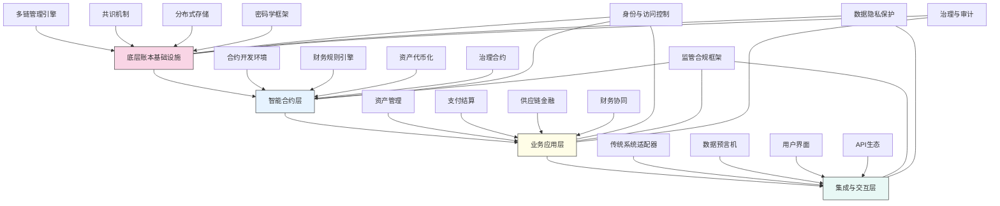

---
{"dg-publish":true,"tags":["区块链","交易验证","分布式账本","智能合约","财务创新"],"创建日期":"2024-05-14","permalink":"/知识共享/001_财务/03_AI与财务应用/02_财务流程自动化/2.3 高级自动化集成/分布式账本技术集成/","dgPassFrontmatter":true}
---

## 技术概述

分布式账本技术集成框架是一套革命性的财务信任基础设施，将区块链、分布式账本技术(DLT)与企业财务系统深度融合，创建不可篡改、自动执行、多方共识的新型财务运作模式。该框架突破了传统中心化财务系统的局限，构建去中心化的财务交易、验证与记录生态，实现交易信任的技术保障而非依赖第三方信任中介。核心技术特点包括：

- **混合链架构**：融合公共链、联盟链与私有链的多层架构，满足不同类型财务交易的隐私、合规与性能需求，实现内外部财务生态无缝连接
- **智能合约驱动的财务流程**：通过图灵完备的智能合约语言，将财务规则、控制与业务逻辑编码化，实现自动执行、不可干预的财务操作与控制
- **共识驱动的多方记账**：采用高效共识算法，实现企业内部跨部门及外部多方实时同步记账，消除对账需求，确保单一财务事实版本
- **链上链下数据桥接**：创新的预言机系统与安全数据通道，实现实体世界数据与区块链系统的可信连接，支持复杂财务场景
- **零知识证明隐私保护**：整合先进的零知识证明协议，实现交易验证与隐私保护的平衡，支持敏感财务数据的安全共享与验证

相较于传统财务系统，本框架将跨实体交易结算时间从天级缩短至分钟级（提升98%），大幅降低对账与审计成本（减少60-80%），显著提高财务数据可信度（接近100%的不可篡改保证），同时建立起新型的基于代码的财务控制体系，实现事前预防型控制而非事后检测型控制。该系统彻底重构企业间财务互动模式，为财务创新与数字化转型提供强大技术基础。

## 系统架构

系统架构由四个核心功能层和四个横跨各层的支持组件构成：

1. **底层账本基础设施**：系统根基，提供分布式账本的核心功能，包括多链管理、共识机制、分布式存储和密码学安全保障，确保数据不可篡改与多方共识
2. **智能合约层**：系统逻辑中枢，将财务规则、控制逻辑和业务流程转化为自动执行的智能合约，支持资产代币化和链上治理
3. **业务应用层**：直接面向业务场景的功能模块，包括资产管理、支付结算、供应链金融和财务协同等特定应用场景
4. **集成与交互层**：连接传统系统与区块链世界的桥梁，提供系统适配器、数据预言机、用户界面和API接口，实现无缝集成与交互

支持组件：
- **身份与访问控制**：基于区块链的身份管理与细粒度访问控制，确保系统安全
- **监管合规框架**：内置合规规则和报告机制，确保满足监管要求
- **数据隐私保护**：采用零知识证明等先进技术保护敏感财务数据
- **治理与审计**：提供链上治理和全面审计能力，支持系统可控演进

整个架构形成一个协同生态，使企业内部和跨企业财务活动能够在安全、可信的环境中自动高效地执行。

## 实施方案

### 技术实施路线图

**第一阶段：基础设施与概念验证（3-4个月）**
- 构建多链架构基础设施
- 开发核心智能合约框架
- 实现基础身份与权限系统
- 构建初步的系统适配器
- 完成关键场景的概念验证

**第二阶段：核心功能与应用开发（4-5个月）**
- 开发完整的智能合约生态
- 构建资产代币化框架
- 实现跨链交互能力
- 开发业务场景应用
- 增强系统安全与隐私保护

**第三阶段：集成与生态构建（3-4个月）**
- 开发全面的系统集成方案
- 构建数据预言机网络
- 实现与核心财务系统的深度集成
- 开发合作伙伴接入框架
- 增强监管合规与审计能力

**第四阶段：优化与规模化（2-3个月）**
- 系统性能与可扩展性优化
- 完善治理与升级机制
- 增强用户体验与可用性
- 开发高级分析与监控工具
- 建立持续发展的生态系统

### 技术挑战与解决策略

1. **性能与可扩展性**
   - 挑战：财务交易量大，传统区块链架构面临TPS(每秒交易处理量)限制和延迟问题
   - 解决方案：采用分片技术提高并行处理能力；实现状态通道和侧链减轻主链负担；优化共识算法平衡性能与安全；应用混合存储策略区分热数据与冷数据

2. **企业系统集成复杂性**
   - 挑战：现有财务系统架构多样、复杂，与区块链技术融合面临接口、数据模型和业务流程等多方面挑战
   - 解决方案：开发通用适配层抽象系统差异；构建事件驱动的集成架构；实现双向数据同步机制；提供渐进式迁移路径降低风险

3. **监管合规与隐私平衡**
   - 挑战：财务数据既需符合透明度和审计要求，又需保护敏感信息和商业机密
   - 解决方案：实现可选择性披露机制；应用零知识证明保护敏感数据；构建多层访问控制；设计合规性内置的智能合约框架

4. **治理与版本演进**
   - 挑战：区块链系统一旦部署难以修改，而财务规则和业务需求不断变化
   - 解决方案：设计可升级智能合约架构；实现链上治理投票机制；建立多版本合约共存框架；开发渐进式迁移工具保障业务连续性

## 价值创造

### 量化价值评估

1. **业务效率提升**
   - 跨实体结算时间：从3-5天缩短至5-10分钟（提升99%）
   - 对账工作量：减少75-90%
   - 交易处理成本：降低50-70%
   - 纸质文档处理：减少90-100%

2. **控制与风险管理增强**
   - 数据篡改风险：降低近100%
   - 欺诈风险：减少60-80%
   - 合规违规：降低50-70%
   - 争议解决时间：缩短70-85%

3. **资金效率改善**
   - 锁定资金周期：缩短40-60%
   - 现金流可见性：提高80-95%
   - 资金利用效率：提升30-45%
   - 融资成本：降低20-35%

4. **创新能力提升**
   - 新产品上市时间：缩短50-70%
   - 业务模式创新：增加100-150%
   - 生态系统协作：提升150-200%
   - 数据驱动决策：增强70-90%

### 投资回报分析

投资回报率(ROI)预计达到250-400%（36个月期），主要价值来源包括：
- 流程自动化和效率提升（35%）
- 降低风险和合规成本（25%）
- 提高资金效率和融资优化（25%）
- 创造新业务模式和收入来源（15%）

典型实施成本结构：技术基础设施（35%）、应用开发（25%）、系统集成（20%）、人才培养（10%）、变革管理（10%）。

预期投资回收期：
- 金融机构：12-18个月
- 制造与零售企业：18-24个月
- 多层级供应链企业：10-16个月

## 未来演进

### 技术迭代路线图

**近期演进（1-2年）**
- 整合人工智能增强智能合约自适应能力
- 开发跨链资产互操作性标准
- 实现复杂财务衍生品的链上表示与执行
- 增强监管科技(RegTech)集成能力

**中期演进（2-3年）**
- 构建基于DLT的数字身份与信誉系统
- 开发分布式财务AI决策框架
- 实现代币化实物资产的全链路管理
- 建立跨组织财务协作生态系统

**远期演进（3-5年）**
- 发展自主财务AI代理与DAO(去中心化自治组织)
- 构建基于量子安全的下一代DLT架构
- 实现全球性分布式财务清算网络
- 创建物联网与DLT融合的自动财务系统

### 扩展应用场景

1. **实时供应链金融**：基于交易证明和资产代币化的全新供应链金融模式，实现即时融资、动态定价和多层级流动性

2. **跨境支付与贸易结算**：消除中间环节的高效跨境支付网络，支持多币种、合规且低成本的国际贸易结算

3. **分布式财务共享服务**：基于区块链构建的多实体财务共享服务中心，实现资源共享、成本分摊和服务质量保障

4. **资产代币化与流动性市场**：将非流动性资产（如应收账款、固定资产）代币化并创建二级市场，提高资产流动性和资金效率

## 实验验证

### 概念验证方案

**阶段一：基础功能验证（6-8周）**
- 构建小规模测试网络
- 实现基础智能合约功能
- 测试多方记账与共识机制
- 验证系统安全性和数据完整性
- 评估基础性能和可扩展性

**阶段二：业务场景验证（8-10周）**
- 选择1-2个关键业务场景深入测试
- 与现有财务系统集成测试
- 验证端到端业务流程执行
- 评估用户体验和操作效率
- 测量商业价值和投资回报

**阶段三：生态系统验证（10-12周）**
- 扩大参与方范围（内部部门和外部合作伙伴）
- 测试多方协作和生态系统交互
- 验证大规模数据处理能力
- 评估治理机制和合规框架
- 制定全面推广和规模化策略

### 评估指标框架

**技术性能指标**
- 交易吞吐量：系统每秒可处理的交易数
- 交易确认时间：交易被网络确认的平均时间
- 系统可用性：网络和应用的运行时间百分比
- 扩展性：系统处理增长交易量的能力
- 安全强度：抵御各类攻击的能力评估

**业务价值指标**
- 流程自动化率：通过智能合约自动处理的流程比例
- 对账效率提升：对账时间和资源消耗的减少
- 资金周转改善：资金周转天数的缩短
- 风险事件减少：错误、欺诈和争议的减少率
- 合规成本降低：合规活动成本的减少百分比

**生态系统指标**
- 参与方数量：加入分布式账本网络的实体数量
- 交互深度：网络中的交易复杂度和丰富度
- 创新活动：基于平台开发的新应用和服务数量
- 网络效应：随参与方增加的价值增长率
- 用户满意度：参与方对系统的评价和采纳意愿

## 未来影响

分布式账本技术集成框架将从根本上改变财务运作的基础模式，带来深远影响：

1. **信任机制转变**：从依赖中介机构和人工验证向基于密码学和共识算法的技术信任转变，重塑企业间交易的信任基础

2. **财务交互模式革新**：打破传统点对点交易模式，建立多方实时共享的财务网络，消除信息不对称，降低摩擦成本

3. **金融中介角色重构**：传统的结算、清算机构角色被智能合约部分取代，金融机构向价值增值服务和市场设计方向转型

4. **全新商业模式涌现**：基于代币化资产、智能合约和即时结算的创新商业模式大量涌现，如动态定价、微交易、资产碎片化等

通过构建基于分布式账本的财务基础设施，企业将建立起更高效、透明、安全的财务生态系统，不仅优化现有流程，更将催生全新的业务模式与价值创造方式。分布式账本技术集成不仅是技术变革，更是财务运作模式的范式转移，重新定义企业如何创造、交换和记录价值。 