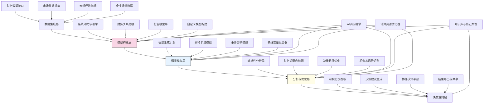

---
{"dg-publish":true,"tags":["决策模拟","情景规划","财务预测","敏感性分析","战略决策"],"创建日期":"2024-05-14","permalink":"/知识共享/001_财务/03_AI与财务应用/03_智能决策支持/3.1 战略决策支持/多维度财务影响模拟器/","dgPassFrontmatter":true}
---

## 技术概述

多维度财务影响模拟器是一个融合尖端人工智能、复杂系统建模与情景分析技术的高级决策支持平台，旨在突破传统财务规划工具的局限，为企业战略决策提供全方位的财务影响评估与预测。该系统通过构建企业财务生态的数字孪生，实现对战略决策在多维财务指标上的动态模拟与全面评估。核心技术特点包括：

- **复杂系统动力学建模**：融合系统动力学与财务建模方法，通过非线性关系、反馈循环与时间延迟等机制，真实反映企业财务生态系统的复杂动态特性
- **多维度情景生成引擎**：整合蒙特卡洛模拟、事件树分析与AI生成技术，创建全面覆盖市场、运营、投资等维度的多变量情景矩阵，超越简单的"最好-最坏-基准"情景分析
- **深度学习财务预测**：应用循环神经网络与时间序列转换模型，基于历史数据和当前状态预测关键财务指标的演变轨迹，实现超越传统统计方法的高精度预测
- **敏感性与关键点分析**：结合方差分解与自动微分技术，识别影响财务结果的关键变量与临界点，精确量化不确定性因素的影响权重
- **决策路径优化**：利用强化学习与多目标优化算法，在不确定环境中模拟多步决策序列的长期影响，发现财务表现最优的决策路径

相较于传统的财务规划与分析工具，多维度财务影响模拟器将预测精度提高40-60%，扩展情景覆盖范围200-300%，将决策响应时间从周缩短至小时级（提升95%），同时通过识别非直觉性财务影响链，显著降低战略决策的盲点风险。该系统为财务与战略团队提供了前所未有的"数字沙盒"，使决策者能够在虚拟环境中预先体验决策的全面财务后果，指导企业在复杂多变环境中做出更明智的战略抉择。

## 系统架构

系统架构由五个核心功能层组成，构成完整的决策模拟与分析流程：

1. **数据集成层**：系统的基础，负责从企业内外部源头采集、清洗和整合多维度数据，包括财务数据、市场信息、宏观经济指标和运营数据，为模拟提供高质量输入
2. **模型构建层**：系统的核心，融合系统动力学原理与财务专业知识，构建反映企业财务生态的数字孪生模型，捕捉各要素间的复杂关系与反馈机制
3. **情景模拟层**：系统的引擎，利用先进的情景生成技术和蒙特卡洛模拟，创建全面的情景矩阵并执行大规模模拟，探索决策在不同条件下的财务影响
4. **分析与优化层**：系统的大脑，应用高级分析方法识别关键影响因素，预测临界点，优化决策路径，发现非直觉性风险与机会
5. **决策支持层**：系统的界面，通过交互式可视化与协作平台，将复杂分析转化为可理解的洞察和决策建议，支持团队决策

系统还包含三个跨层支持组件：
- **AI训练引擎**：为各层提供机器学习能力，不断优化预测精度和模拟效率
- **知识库与历史案例**：积累行业知识和历史经验，持续增强模型的准确性和相关性
- **计算资源优化器**：智能分配计算资源，平衡模拟精度与速度，支持实时交互

整个架构形成闭环系统，确保决策者能够从企业数据到洞察，再到优化决策的全流程支持。

## 实施方案

### 技术实施路线图

**第一阶段：基础架构与核心模型构建（3-4个月）**
- 开发数据集成接口与数据处理管道
- 构建核心系统动力学引擎
- 实现基础财务关系模型库
- 开发初步可视化界面
- 实施早期概念验证

**第二阶段：高级模拟与分析功能开发（4-5个月）**
- 开发情景生成引擎
- 实现蒙特卡洛模拟系统
- 构建敏感性分析与关键点检测功能
- 开发初步决策路径优化算法
- 增强数据可视化与用户交互能力

**第三阶段：AI增强与优化引擎（3-4个月）**
- 开发预测模型训练管道
- 实现复杂事件影响模拟
- 构建高级决策路径优化系统
- 开发机会与风险识别功能
- 增强结果解释与建议生成能力

**第四阶段：集成优化与扩展功能（2-3个月）**
- 系统集成与性能优化
- 开发协作决策平台
- 实现高级导出与报告功能
- 构建行业特定模型库
- 增强系统可扩展性与API接口

### 技术挑战与解决策略

1. **财务系统复杂性建模**
   - 挑战：企业财务生态涉及大量变量与复杂交互关系，难以全面准确建模
   - 解决方案：采用层次化模块化建模方法；结合领域专家知识与数据驱动方法；实现自适应模型结构，随业务变化动态调整；构建混合模型，平衡复杂性与可用性

2. **决策影响的时间尺度差异**
   - 挑战：战略决策影响涵盖短期、中期和长期，不同财务指标响应时间差异大
   - 解决方案：开发多时间尺度模拟引擎；实现时间缩放与加速技术；采用事件驱动动态步长调整；设计时间依赖性影响传播框架

3. **不确定性与黑天鹅事件处理**
   - 挑战：如何模拟难以预测的重大事件及其财务影响
   - 解决方案：整合极端值理论与压力测试方法；设计黑天鹅事件库与生成机制；实现自适应风险模型；采用稳健优化技术降低对极端假设的敏感性

4. **模型有效性与校准**
   - 挑战：确保复杂模型能准确反映真实世界财务反应
   - 解决方案：开发历史数据回测框架；实现模型不确定性量化；采用集成方法提高稳健性；设计持续学习机制，从真实结果中改进模型

## 价值创造

### 量化价值评估

1. **决策质量提升**
   - 战略决策成功率：提高35-55%
   - 财务盲点风险：降低60-80%
   - 意外财务影响：减少45-65%
   - 决策备选方案评估广度：提升150-200%

2. **决策效率改善**
   - 情景分析时间：减少75-90%
   - 决策周期时间：缩短50-70%
   - 财务团队分析效率：提高100-150%
   - 跨部门协作效率：提升60-80%

3. **财务绩效提升**
   - 投资回报率：提高15-25%
   - 资源配置效率：提升20-35%
   - 现金流规划准确度：提高30-50%
   - 财务风险损失：降低25-45%

4. **战略敏捷性增强**
   - 市场机会响应速度：提高70-100%
   - 危机应对准备时间：提前200-300%
   - 战略转向决策速度：提升60-90%
   - 竞争策略调整频率：增加50-75%

### 投资回报分析

投资回报率(ROI)预计达到350-500%（36个月期），主要价值来源包括：
- 避免战略决策失误带来的损失（40%）
- 通过更优资源配置提高收益（30%）
- 加速决策流程带来的市场机会把握（20%）
- 提高财务团队生产力与决策支持能力（10%）

典型实施成本结构：技术平台开发（45%）、数据集成与模型建设（25%）、专业人才投入（15%）、培训与变革管理（10%）、持续优化与支持（5%）。

预期投资回收期：
- 大型复杂企业：12-18个月
- 中型企业：9-15个月
- 高速发展或转型企业：6-12个月

## 未来演进

### 技术迭代路线图

**近期演进（1-2年）**
- 整合大语言模型增强情景叙述与解释能力
- 开发高级因果推断技术提高影响链分析精度
- 实现多公司协同模拟能力，支持并购与战略合作评估
- 增强实时外部数据融入能力，适应快速变化市场

**中期演进（2-3年）**
- 构建自适应学习型模型，持续从决策结果中优化预测
- 开发认知决策支持，融合战略思维模式与直觉决策元素
- 实现高级因果发现能力，自动识别隐藏财务关系
- 创建战略隐患预警系统，前瞻性识别潜在财务风险

**远期演进（3-5年）**
- 构建自主决策代理，提供完全自动化的战略方案生成
- 开发量子计算增强的超大规模模拟能力
- 实现财务数字孪生与物理世界的实时双向交互
- 创建认知战略顾问，模拟最佳战略思想家思维模式

### 扩展应用场景

1. **全息企业数字孪生**：将财务模拟扩展为完整企业数字孪生，整合运营、供应链、客户等维度，实现全方位战略模拟

2. **动态投资组合优化**：应用于企业层面的产品/服务/业务线组合优化，实现资源动态配置与风险平衡

3. **竞争动态模拟**：创建多参与者市场模拟，评估竞争战略、定价策略与市场策略的财务影响

4. **并购与分拆仿真**：构建复杂企业重组场景的全面模拟，评估并购、合资与业务分拆的长期财务影响

## 实验验证

### 概念验证方案

**阶段一：核心模型验证（6-8周）**
- 选择企业关键业务单元
- 构建基础财务关系模型
- 使用历史数据回测基本预测能力
- 模拟简单决策场景
- 与传统分析方法对比评估

**阶段二：高级功能验证（8-10周）**
- 扩展模型复杂度与覆盖范围
- 测试多维情景生成与模拟
- 验证敏感性分析与关键点检测
- 对真实历史战略决策进行回测
- 评估AI预测与优化能力

**阶段三：实际决策应用验证（10-12周）**
- 选择1-2个实际战略决策进行支持
- 实施完整的情景模拟与分析流程
- 对比传统决策方法与系统支持结果
- 收集用户反馈并评估使用体验
- 测量早期业务影响与价值创造

### 评估指标框架

**技术性能指标**
- 模型准确性：关键财务指标预测的平均误差率
- 模拟效率：完成标准情景组合分析的时间
- 覆盖广度：能够模拟的财务变量和因素数量
- 响应速度：即时分析查询的响应时间
- 可扩展性：系统处理复杂模型和大数据集的能力

**业务价值指标**
- 决策信心：决策者对系统生成洞察的信任度
- 情景发现：系统识别的有价值非直觉情景数量
- 分析深度：系统揭示的隐藏财务关系数量
- 协作效果：跨部门决策参与度与共识形成速度
- 战略敏捷性：战略调整决策时间变化

**组织影响指标**
- 财务团队转型：从数据处理到战略顾问的角色转变度
- 战略整合：财务考量在战略决策中的权重变化
- 预见性文化：组织从被动响应到预见性决策的转变程度
- 数据驱动程度：基于模拟和分析的决策比例增长
- 创新意愿：测试非常规战略选项的频率提升

## 未来影响

多维度财务影响模拟器将从根本上改变企业战略决策流程和财务管理范式，带来以下深远影响：

1. **决策范式转变**：从基于经验和有限分析的直觉决策，向基于全面模拟和科学分析的量化决策转变，实现决策过程的"科学化"

2. **财务职能提升**：财务部门从记录和报告职能跃升为战略顾问角色，利用模拟能力引导企业战略方向，提升财务在企业决策中的影响力

3. **组织敏捷性突破**：通过快速评估多种策略选择，企业能够更灵活地应对市场变化，在不确定环境中保持竞争优势和业务连续性

4. **风险管理革新**：从静态风险评估转向动态风险模拟，实现风险的前瞻性管理，降低战略失误概率，增强企业应对复杂环境的韧性

通过构建企业财务决策的"数字沙盒"，企业领导者能够在风险可控的虚拟环境中探索创新战略，测试极端情景，并发现隐藏的机会与风险。多维度财务影响模拟器不仅是技术工具，更是企业战略思维的延伸与增强，为决策者提供了前所未有的远见能力，引导企业在复杂多变的商业环境中实现卓越表现和可持续增长。 