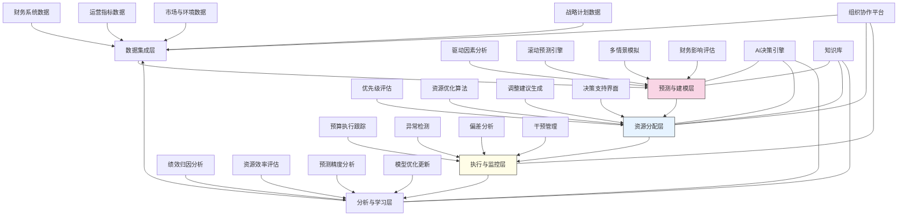

---
{"dg-publish":true,"tags":["预算管理","实时调整","资源分配","绩效跟踪","预测分析"],"创建日期":"2024-05-14","permalink":"/知识共享/001_财务/03_AI与财务应用/03_智能决策支持/3.2 运营决策优化/动态预算调整系统/","dgPassFrontmatter":true}
---

## 技术概述

动态预算调整系统是一个融合人工智能、财务工程与组织行为科学的创新型预算管理平台，旨在突破传统静态预算的局限性，实现企业资源分配的智能化、连续化与自适应化。该系统将预算从年度仪式转变为实时战略执行工具，通过构建以数据驱动、价值导向、快速响应的资源管理新范式，帮助企业在不确定环境中保持财务纪律与战略灵活性的平衡。核心技术特点包括：

- **持续滚动预测引擎**：超越传统年度预算，整合多源数据实时更新业务驱动因素，通过机器学习自动生成连续滚动预测，提供8-24个月的前瞻性视图
- **自适应资源分配框架**：基于价值驱动、市场信号与绩效反馈，构建动态资源分配逻辑，自动提出预算调整建议，确保资源配置与当前优先级一致
- **情景智能规划系统**：应用蒙特卡洛模拟与贝叶斯网络，创建多维度情景分析能力，评估不同商业假设下的财务影响，支持基于情景的资源分配决策
- **异常与机会检测**：融合统计异常检测与模式识别，持续监测预算执行与业务表现，自动识别偏差、异常与新兴机会，触发干预行动
- **绩效闭环管理**：将KPI、资源分配与组织激励紧密关联，构建实时绩效反馈机制，促进资源使用效率与战略目标达成

相较于传统的年度静态预算，动态预算调整系统将预算编制时间减少60-80%，提高预算准确度30-50%，使资源分配响应速度加快75-90%，同时将资源利用效率提升15-30%。系统通过智能化的预算流程重构，帮助企业实现"以快制胜"的财务管理模式，提高在波动环境中的适应力与竞争力。

## 系统架构

系统架构由五个核心功能层组成，形成闭环的动态预算管理流程：

1. **数据集成层**：系统的基础，整合来自财务系统、运营指标、市场环境和战略计划的多源数据，构建统一的决策数据基础
2. **预测与建模层**：系统的分析核心，识别关键驱动因素，生成滚动预测，模拟多种情景，评估财务影响，为资源分配提供前瞻性视角
3. **资源分配层**：系统的决策中枢，评估业务优先级，运行资源优化算法，生成调整建议，提供交互式决策支持，实现动态资源配置
4. **执行与监控层**：系统的控制单元，跟踪预算执行，检测异常与偏差，管理干预行动，确保资源使用符合预期与战略
5. **分析与学习层**：系统的反馈机制，分析绩效归因，评估资源效率，检验预测准确度，优化模型与规则，实现系统持续学习

系统还包含三个跨层支持组件：
- **AI决策引擎**：为预测、分配和分析提供智能算法支持，增强系统的自主决策能力
- **组织协作平台**：支持跨部门协同决策与执行，确保预算调整的组织认同与落地
- **知识库**：积累历史决策案例、业务规则和最佳实践，增强系统的上下文理解与决策智能

整个架构形成自适应优化循环，从数据到预测，再到分配、执行和反馈，构建持续进化的动态预算生态系统。

## 实施方案

### 技术实施路线图

**第一阶段：基础搭建（3-4个月）**
- 开发数据集成接口与转换逻辑
- 构建初步驱动因素分析模型
- 实现基础滚动预测功能
- 开发预算执行跟踪仪表板
- 建立预算决策协作框架

**第二阶段：核心功能开发（4-5个月）**
- 增强滚动预测的精准性与适应性
- 开发多维度情景模拟系统
- 实现自适应资源分配算法
- 构建异常检测与预警机制
- 开发绩效与预算关联分析

**第三阶段：智能优化功能（3-4个月）**
- 开发AI驱动的预算调整建议
- 实现自动化偏差分析与根因追溯
- 构建预测-执行-反馈学习循环
- 开发跨部门资源优化功能
- 增强决策支持与可视化能力

**第四阶段：系统集成与优化（2-3个月）**
- 完善用户界面与交互体验
- 增强跨系统数据流与集成
- 实现预算管理流程自动化
- 系统性能与可扩展性优化
- 用户培训与变革管理

### 技术挑战与解决策略

1. **业务驱动因素的动态识别**
   - 挑战：业务驱动因素复杂多变，关系非线性，传统统计方法难以准确捕捉动态变化
   - 解决方案：采用特征选择与因果发现算法自动识别关键驱动因素；实现混合模型框架整合领域知识与数据驱动；构建动态权重调整机制；开发驱动因素稳定性评估；建立持续学习的驱动模型更新机制

2. **预测准确性与不确定性管理**
   - 挑战：市场环境和内部条件变化快，导致预测偏差，而过于频繁调整又可能造成组织混乱
   - 解决方案：采用集成学习方法融合多种预测模型；实现预测区间而非点估计；开发信号噪音区分算法；构建预测可信度评估框架；设计分层调整机制，平衡稳定性与响应性

3. **多维目标资源优化**
   - 挑战：资源分配需平衡短期绩效、长期价值、风险控制等多维目标，存在复杂权衡
   - 解决方案：开发多目标优化框架；实现基于价值的资源分配机制；构建情景对冲策略；设计弹性预算缓冲；建立战略-战术资源分配层次体系；采用帕累托最优方法生成资源配置组合

4. **组织变革与采纳**
   - 挑战：动态预算挑战传统管理思维与流程，组织惯性与文化障碍可能阻碍系统有效实施
   - 解决方案：构建渐进式转型路径；开发协作决策界面增强透明度与参与度；实现基于角色的差异化视图；设计激励一致性机制；建立成功案例与价值可视化；提供持续培训与支持

## 价值创造

### 量化价值评估

1. **运营效率提升**
   - 预算编制与调整时间：减少60-80%
   - 财务团队分析时间占比：从20%提升至65%
   - 预算流程自动化程度：提高70-90%
   - 决策响应周期：从月降至日（提升95%）

2. **预测与决策质量**
   - 预算准确度：提高30-50%
   - 资源配置优先级一致性：提升40-60%
   - 机会识别提前量：增加15-30天
   - 风险预警准确率：提高45-65%

3. **资源使用效益**
   - 资源利用效率：提升15-30%
   - 闲置资源比例：减少25-40%
   - 战略项目资源保障：提高40-60%
   - 投资回报率：提升20-35%

4. **战略执行与协同**
   - 战略-预算一致性：提高50-70%
   - 跨部门资源协同：提升35-55%
   - 变化响应速度：提高75-90%
   - 员工预算参与度：提升60-80%

### 投资回报分析

投资回报率(ROI)预计达到200-350%（24个月期），主要价值来源包括：
- 资源使用效率提升带来的成本节约（40%）
- 更快响应市场机会带来的增量收入（30%）
- 预算流程优化节省的管理成本（20%）
-, 
- 风险提前识别避免的损失（10%）

典型实施成本结构：技术平台开发（35%）、数据集成与模型构建（25%）、流程再造与系统集成（20%）、变革管理与培训（20%）。

预期投资回收期：
- 大型企业：10-16个月
- 中型企业：8-14个月
- 高变化行业企业：6-10个月
- 项目密集型组织：7-12个月

## 未来演进

### 技术迭代路线图

**近期演进（1-2年）**
- 整合大语言模型增强财务叙事与解释生成
- 开发认知预算助手支持对话式预算分析
- 实现增强现实可视化提升预算沟通效果
- 增强预测的可解释性与透明度

**中期演进（2-3年）**
- 构建自主预算调整智能体系统
- 开发预算决策仿真环境
- 实现跨企业预算协同与标杆分析
- 创建动态资源市场机制

**远期演进（3-5年）**
- 发展具财务直觉的预算智能体
- 构建混合人机预算治理框架
- 实现预算自组织与自优化
- 创建预见性资源管理系统

### 扩展应用场景

1. **项目组合动态管理**：超越传统预算，实现项目资源的连续评估与再分配，基于项目表现与战略价值动态调整投资组合

2. **人力资源动态规划**：将员工技能、项目需求与战略目标关联，实现人力资源的敏捷分配与能力建设投资的动态优化

3. **营销投资实时优化**：基于市场反馈与绩效数据，自动调整营销渠道、活动与产品线间的预算分配，最大化营销回报

4. **研发资源自适应分配**：根据创新项目进展、技术突破与市场验证，动态调整研发资源分配，平衡探索与利用的投资组合

## 实验验证

### 概念验证方案

**阶段一：预测能力验证（6-8周）**
- 选择代表性业务单元进行测试
- 部署滚动预测引擎
- 与传统预算预测并行运行
- 比较预测准确性与前瞻性
- 测试驱动因素识别能力

**阶段二：资源分配验证（8-10周）**
- 在特定预算领域实施资源优化
- 部署调整建议生成功能
- 设计A/B测试评估调整效果
- 收集用户反馈与决策采纳度
- 评估资源使用效率改善

**阶段三：端到端流程验证（10-12周）**
- 扩展至更广泛预算领域
- 部署完整的预测-分配-执行-反馈循环
- 测试异常检测与干预管理
- 评估组织适应性与协作效果
- 量化实际业务价值创造

### 评估指标框架

**技术性能指标**
- 预测准确性：预算预测与实际结果的偏差
- 处理效率：预算编制与调整的时间消耗
- 模型适应性：对业务变化的自动调整能力
- 异常检测率：成功识别的预算异常比例
- 系统响应速度：从数据更新到决策建议的时间

**业务价值指标**
- 资源配置优化：资源分配与业务优先级一致性
- 流程效率：预算相关活动时间与成本降低
- 决策支持质量：预算调整建议的采纳率
- 组织敏捷性：对市场变化的资源响应速度
- 绩效改善：优化预算分配带来的业务绩效提升

**长期价值指标**
- 预算文化转变：从静态控制到动态管理的转变程度
- 组织能力提升：预算人员战略价值贡献的增强
- 管理思维进化：基于数据与前瞻性的决策模式形成
- 战略执行力：预算与战略目标协同达成的改善
- 环境适应力：应对不确定性与变化的组织能力提升

## 未来影响

动态预算调整系统将从根本上改变企业资源管理模式，带来深远影响：

1. **预算范式革新**：从静态控制工具转向动态战略执行引擎，使预算从年度仪式进化为连续资源优化流程，改变财务与业务的互动模式

2. **决策民主化与赋能**：打破传统自上而下的预算分配模式，构建数据驱动、透明开放的资源决策环境，促进更广泛的组织参与和智慧集成

3. **组织敏捷性提升**：通过快速资源重配置能力，增强组织应对外部变化与内部转型的能力，使组织结构更具适应性与韧性

4. **管理文化转型**：促进从固定思维到增长思维的转变，培养持续学习、快速试错、数据驱动的管理文化，增强组织创新能力与市场敏感性

通过动态预算调整，企业将能够在保持财务纪律的同时增强战略灵活性，在不确定环境中更有效地配置资源，抓住机遇并规避风险。该系统不仅是技术创新，更是管理哲学与组织文化的革新，推动企业从周期性规划走向连续性适应的全新运营模式。 