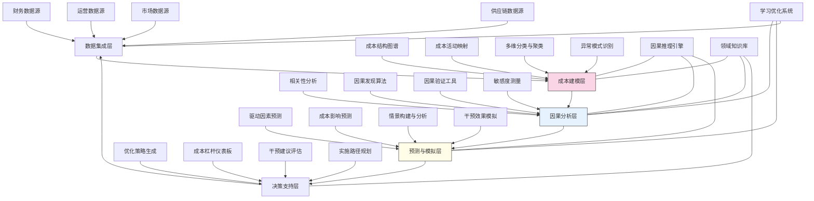

---
{"dg-publish":true,"tags":["成本分析","归因模型","预测优化","业务洞察","决策支持"],"创建日期":"2024-05-14","permalink":"/知识共享/001_财务/03_AI与财务应用/03_智能决策支持/3.2 运营决策优化/成本驱动因素自动识别/","dgPassFrontmatter":true}
---

## 技术概述

成本驱动因素自动识别系统是一个融合机器学习、因果推理与业务建模的前沿财务智能平台，旨在突破传统成本分析的表面描述与经验判断，揭示影响企业成本结构的深层次因果机制与复杂互动关系。该系统通过构建多维数据分析框架与智能因果发现算法，将成本管理从被动报告转变为主动洞察与预测控制，帮助企业从根源上优化成本结构，实现精准成本管理。核心技术特点包括：

- **多层级成本结构自动映射**：应用图谱挖掘与聚类分析，构建企业全景成本结构图，揭示成本项目间的层级关系、依赖路径与互动模式
- **复杂因果网络自动发现**：融合统计因果推断与领域知识约束，构建成本驱动因素的因果网络模型，区分直接因素、间接因素与调节因素
- **动态敏感度智能测量**：通过自适应实验设计与反事实模拟，精确量化各驱动因素对不同成本类别的影响权重与弹性系数，识别关键影响杠杆
- **多情景成本预测引擎**：整合因果模型与时序预测，构建驱动因素变化对未来成本的影响预测系统，支持多情景分析与敏感性评估
- **成本控制策略生成器**：基于驱动因素分析与影响路径，自动生成针对性的成本优化策略组合，评估干预成本与预期收益

相较于传统的成本分析方法，成本驱动因素自动识别系统能够提高成本因素识别准确率60-80%，揭示25-40%的隐藏成本关系，改善成本预测准确度30-50%，并能发现35-55%传统方法忽略的成本优化机会。系统通过精准定位成本变动的根本驱动力，帮助企业实现成本的结构性优化而非简单削减，在保持业务价值创造的同时提升资源使用效率与成本竞争力。

## 系统架构

系统架构由五个核心功能层组成，形成闭环的成本驱动因素分析与优化流程：

1. **数据集成层**：系统的基础，整合来自财务、运营、市场与供应链的多源数据，构建统一的成本分析数据基础，提供背景与环境信息
2. **成本建模层**：系统的结构化引擎，构建企业成本结构图谱，映射成本与活动关系，多维度分类与聚类成本项目，识别异常成本模式
3. **因果分析层**：系统的核心大脑，超越相关性分析，运用高级因果发现算法建立驱动因素网络，验证因果假设，量化敏感度与影响路径
4. **预测与模拟层**：系统的前瞻性工具，基于因果模型预测驱动因素与成本发展趋势，构建多种情景，模拟不同干预策略的潜在效果
5. **决策支持层**：系统的行动引擎，生成优化策略组合，提供可视化成本杠杆仪表板，评估干预建议的成本效益，规划实施路径

系统还包含三个跨层支持组件：
- **因果推理引擎**：提供先进的因果发现与验证算法支持，是系统区别于传统分析工具的核心差异点
- **领域知识库**：融合行业最佳实践、专家经验与理论模型，指导因果发现与策略生成
- **学习优化系统**：持续从结果反馈中学习，优化模型参数与假设，提高系统准确性

整个架构形成持续优化的智能循环，从数据到洞察，再到预测、决策和效果评估，构建自我完善的成本管理生态系统。

## 实施方案

### 技术实施路线图

**第一阶段：基础构建（3-4个月）**
- 开发核心数据集成接口与转换逻辑
- 构建初步成本结构图谱框架
- 实现基础相关性分析功能
- 开发成本可视化仪表板
- 建立领域知识库基础架构

**第二阶段：核心功能开发（4-5个月）**
- 增强成本结构图谱的复杂性与准确性
- 开发初步因果发现算法
- 实现成本敏感度分析功能
- 构建基础预测模型框架
- 开发策略评估与比较工具

**第三阶段：高级分析与优化（3-4个月）**
- 开发高级因果网络发现算法
- 实现多情景成本预测引擎
- 构建干预效果模拟系统
- 开发智能策略生成功能
- 增强可视化与交互分析能力

**第四阶段：系统集成与验证（2-3个月）**
- 完善因果模型验证工具
- 增强系统自学习与优化能力
- 实现端到端工作流与报告
- 系统集成与性能优化
- 用户培训与应用验证

### 技术挑战与解决策略

1. **复杂因果关系识别**
   - 挑战：企业成本体系中存在大量非线性、交互与延迟效应，传统统计方法难以准确识别真实因果关系
   - 解决方案：采用多种因果发现算法组合（包括基于约束、基于分数与基于时序的方法）；融合领域知识约束辅助因果识别；实施干预验证框架；构建置信度分级的因果网络；采用贝叶斯信念更新机制持续优化因果模型

2. **异质数据整合与解释**
   - 挑战：成本驱动因素分散在不同系统与业务领域，数据粒度、频率与质量差异大
   - 解决方案：开发多层次数据整合架构；实现语义层映射解决数据不一致；构建数据质量评估与增强管道；设计多粒度分析框架，适应不同详细度；采用迁移学习方法处理数据稀疏领域

3. **度量敏感度与影响权重**
   - 挑战：准确量化不同驱动因素对成本的影响程度复杂，影响路径多样且随条件变化
   - 解决方案：设计自然实验与准实验方法；开发反事实模拟框架；实现条件敏感度分析；构建多层次路径效应分解；采用时变权重模型捕捉动态变化；结合专家校准与数据驱动量化

4. **从洞察到行动的转化**
   - 挑战：识别的驱动因素需转化为可操作的成本优化策略，涉及复杂权衡与组织执行
   - 解决方案：构建分层策略生成框架；开发可控性与影响力矩阵分析；实现多目标优化策略组合；设计实施路径与时序规划；建立策略效果监测闭环；提供可执行的具体行动建议

## 价值创造

### 量化价值评估

1. **成本分析与预测能力**
   - 成本驱动因素识别准确率：提高60-80%
   - 隐藏关系发现能力：揭示25-40%传统方法忽略的影响因素
   - 成本预测准确度：提升30-50%
   - 分析速度：加快70-90%

2. **成本优化与控制效果**
   - 可控成本降低：实现5-15%的结构性优化
   - 成本波动减少：降低30-50%
   - 优化机会识别：发现35-55%以往未识别的优化点
   - 干预效果可预测性：提高40-60%

3. **决策支持与管理效率**
   - 财务分析师效率：提升50-70%
   - 决策支持速度：缩短60-80%
   - 情景分析能力：增强200-300%
   - 成本异常预警提前量：增加10-20个工作日

4. **战略影响与组织能力**
   - 定价策略精准度：提高25-40%
   - 产品组合优化效果：提升15-30%
   - 投资决策成本准确性：提高30-45%
   - 成本管理成熟度评级：提升1-2个等级

### 投资回报分析

投资回报率(ROI)预计达到300-500%（24个月期），主要价值来源包括：
- 识别并优化的直接成本节约（50%）
- 提高成本预测准确性降低的缓冲与浪费（20%）
- 改善分析效率节省的人力资源成本（15%）
- 更好的策略决策带来的增值（15%）

典型实施成本结构：技术平台开发（35%）、数据集成与预处理（25%）、模型开发与验证（25%）、培训与变革管理（15%）。

预期投资回收期：
- 大型制造企业：8-12个月
- 服务型企业：10-14个月
- 零售与分销企业：9-13个月
- 项目密集型组织：7-11个月

## 未来演进

### 技术迭代路线图

**近期演进（1-2年）**
- 整合大语言模型增强成本知识抽取与解释生成
- 开发认知图谱增强成本驱动因素映射
- 实现主动学习框架提高因果发现效率
- 增强异构数据处理与整合能力

**中期演进（2-3年）**
- 构建自主探索型成本智能体
- 开发跨企业成本基准与学习网络
- 实现实时成本驱动因素监测与调整
- 创建数字孪生驱动的成本模拟环境

**远期演进（3-5年）**
- 发展具备成本规划能力的决策智能体
- 构建混合人机成本优化团队
- 实现预见性成本设计与管理
- 创建自适应成本生态系统

### 扩展应用场景

1. **产品成本工程优化**：深入分析产品设计、材料选择、生产流程对成本结构的影响机制，指导成本导向的产品设计与工程决策

2. **供应链成本透明化**：揭示端到端供应链中的隐藏成本驱动因素与传导机制，优化采购策略、供应商管理与物流网络设计

3. **服务交付效率优化**：分析服务型企业的人力、流程、技术与客户互动对服务成本的影响路径，实现服务质量与成本平衡

4. **间接成本归因与控制**：解构复杂间接成本的驱动机制，实现精准归因与分配，优化支持功能的价值贡献与资源配置

## 实验验证

### 概念验证方案

**阶段一：因果发现能力验证（6-8周）**
- 选择具有已知因果关系的成本领域
- 部署因果发现算法分析历史数据
- 与传统分析方法进行对比
- 评估因果关系识别的准确性
- 测试领域知识整合效果

**阶段二：预测与敏感度分析验证（8-10周）**
- 基于识别的驱动因素构建预测模型
- 实施前瞻性预测与回溯测试
- 验证不同条件下的敏感度测量
- 评估情景分析的准确性与价值
- 收集用户反馈与改进需求

**阶段三：策略生成与实施验证（10-12周）**
- 针对特定成本类别生成优化策略
- 小规模实施所建议的干预措施
- 测量实际成本影响与预测比较
- 评估策略的可行性与实施挑战
- 验证系统学习与适应能力

### 评估指标框架

**技术性能指标**
- 因果发现准确率：与已知因果关系的一致性
- 预测精度：成本预测与实际结果的偏差
- 敏感度测量准确性：驱动因素影响权重验证
- 模型适应性：对业务变化的自动调整能力
- 计算效率：复杂因果网络分析的响应时间

**业务价值指标**
- 成本可控性：驱动因素干预后的成本影响
- 分析深度：识别的新驱动因素与关系数量
- 策略相关性：生成策略的业务可行性评分
- 决策支持质量：洞察采纳率与用户满意度
- 实施效果：优化建议实施后的实际成本改善

**长期价值指标**
- 成本文化转变：数据驱动决策的采纳程度
- 团队能力提升：财务与业务团队的分析能力成长
- 知识沉淀：系统积累的因果关系与最佳实践
- 成本意识：组织整体成本认知与管理成熟度
- 战略适应性：成本结构对战略变化的响应灵活性

## 未来影响

成本驱动因素自动识别系统将从根本上改变企业成本管理方法与文化，带来深远影响：

1. **成本思维升级**：从静态分类记录转向动态因果理解，从历史报告转向前瞻预测控制，使成本分析从财务工具演变为战略管理工具

2. **跨职能边界融合**：打破财务、运营、市场与产品开发的专业隔阂，构建统一的成本驱动视图，促进跨部门协作优化与端到端思维

3. **决策范式转变**：从直觉与经验主导转向数据与因果驱动的成本决策模式，提高组织处理复杂性与不确定性的能力，实现更系统、更科学的资源管理

4. **价值创造重构**：超越简单的成本削减，转向价值导向的结构优化，帮助企业在保持与提升价值创造能力的同时实现资源高效利用

通过深入理解成本驱动机制，企业能够在战略层面重新思考业务模式、资源配置与价值创造逻辑，将成本管理从战术性活动提升为战略性能力。成本驱动因素自动识别系统不仅是分析工具，更是推动企业竞争力与适应力提升的变革引擎，助力企业在复杂多变的市场环境中建立可持续的成本竞争优势。 