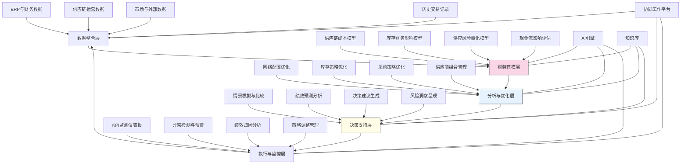

---
{"dg-publish":true,"tags":["供应链","运营效率","成本优化","财务协同","库存管理"],"创建日期":"2024-05-14","permalink":"/知识共享/001_财务/03_AI与财务应用/03_智能决策支持/3.2 运营决策优化/智能供应链财务优化/","dgPassFrontmatter":true}
---

## 技术概述

智能供应链财务优化系统是一个融合人工智能、运筹学与财务工程的创新型决策平台，旨在打破财务与供应链传统的功能壁垒，实现两大领域的深度协同与价值共创。该系统通过构建端到端的数字化供应链财务模型，将成本管理、现金流优化与供应链运营决策整合为统一的价值框架，帮助企业在保障供应链韧性的同时最大化财务绩效。核心技术特点包括：

- **供应链财务数字孪生**：构建集成成本、库存、时间与风险维度的端到端供应链财务模型，实现对供应链决策的全面财务影响模拟与评估
- **多目标供应链配置优化**：基于混合整数规划与进化算法，在考量成本、服务水平、风险与资本占用的多维约束下，优化供应网络设计与资源配置
- **动态库存-财务协同引擎**：融合库存理论与财务模型，根据需求波动、资金成本与服务水平要求，自适应优化库存策略与补货决策
- **智能采购-财务决策支持**：整合供应商风险、价格预测、付款条件与总成本分析，构建全方位采购决策优化框架，平衡短期成本与长期价值
- **供应链财务异常检测与预警**：应用机器学习识别供应链运营与财务指标的异常模式，提前预警潜在问题，推荐干预措施

相较于传统的供应链与财务分离管理模式，智能供应链财务优化系统可将总体供应链成本降低8-15%，库存占用资金减少15-30%，供应链相关营运资金需求降低10-20%，同时将供应中断风险降低30-50%，服务水平提升10-25%。该系统通过构建财务视角下的端到端供应链优化框架，使企业能够突破传统成本中心思维，将供应链转变为战略价值驱动引擎，实现财务绩效与运营韧性的双重提升。

## 系统架构

系统架构由五个核心功能层组成，形成闭环的供应链财务优化流程：

1. **数据整合层**：系统的基础，整合来自ERP、财务系统、供应链运营平台和外部市场的多源数据，构建统一的供应链财务数据视图
2. **财务建模层**：系统的核心模型，构建供应链成本结构、库存财务影响、供应风险量化和现金流评估模型，建立运营决策与财务影响的映射关系
3. **分析与优化层**：系统的大脑，运用高级分析与优化算法，在网络配置、库存策略、采购管理和供应商组合等维度生成最优决策方案
4. **决策支持层**：系统的界面，通过情景模拟、绩效预测、建议生成和风险洞察，将复杂优化结果转化为可理解、可执行的决策支持
5. **执行与监控层**：系统的反馈机制，持续监测关键绩效指标，检测异常状况，分析绩效归因，管理策略调整，确保优化方案有效执行

系统还包含三个跨层支持组件：
- **AI引擎**：为建模、优化和监控提供智能支持，实现自适应学习与决策优化
- **知识库**：积累行业最佳实践、历史案例和专家经验，增强系统的上下文理解与建议生成
- **协同工作平台**：支持财务、供应链、采购等跨部门协作，确保决策执行与反馈的闭环

整个架构构成有机整体，使供应链决策与财务绩效紧密关联，实现从数据到洞察再到优化行动的端到端价值流。

## 实施方案

### 技术实施路线图

**第一阶段：基础构建与数据整合（3-4个月）**
- 开发核心数据集成接口
- 构建初步供应链财务模型
- 实现基础成本分析功能
- 开发关键KPI监测仪表板
- 建立跨部门协作机制

**第二阶段：核心功能开发（4-5个月）**
- 构建供应链财务数字孪生模型
- 开发库存-财务协同引擎
- 实现采购决策优化功能
- 构建异常检测与预警系统
- 增强情景模拟与比较能力

**第三阶段：高级优化与分析（3-4个月）**
- 开发多目标供应链网络优化
- 实现动态风险-成本平衡策略
- 构建端到端财务影响分析
- 开发自适应供应商策略优化
- 增强预测与归因分析能力

**第四阶段：系统集成与优化（2-3个月）**
- 完善决策建议生成系统
- 增强跨部门工作流支持
- 实现高级绩效归因分析
- 系统集成与性能优化
- 用户培训与变革管理

### 技术挑战与解决策略

1. **复杂成本结构建模**
   - 挑战：供应链成本包含多层级、多维度因素，相互关联且部分隐性成本难以量化
   - 解决方案：采用层次化成本分解方法；实现基于活动的成本归因；开发混合建模框架整合确定性与估计性成本；应用机器学习识别成本驱动关系；构建持续学习的成本模型校准机制

2. **多目标决策优化**
   - 挑战：供应链决策需平衡成本、服务、风险、资本效率等多重目标，存在复杂权衡
   - 解决方案：开发基于帕累托前沿的多目标优化框架；实现目标权重动态调整机制；构建约束松弛技术处理复杂场景；设计交互式优化过程支持决策者参与；采用递进式优化策略处理大规模问题

3. **供应链不确定性管理**
   - 挑战：需求波动、供应中断、价格变化等不确定性因素显著影响供应链财务表现
   - 解决方案：融合随机优化与鲁棒优化方法；开发情景生成与压力测试框架；实现自适应风险缓解策略；构建实时监测与早期预警系统；设计动态响应规则应对突发事件

4. **跨部门协同与执行**
   - 挑战：供应链财务优化涉及多部门，目标不一致与信息孤岛阻碍协同决策与执行
   - 解决方案：构建统一绩效指标体系；开发透明共享的决策支持平台；实现基于角色的信息访问与协作机制；设计流程自动化减少手动交接；建立激励一致性机制促进全局优化

## 价值创造

### 量化价值评估

1. **成本优化与效率提升**
   - 总供应链成本：降低8-15%
   - 运输与物流成本：降低10-20%
   - 采购成本：降低5-12%
   - 供应链运营效率：提高25-40%

2. **资金效率与财务影响**
   - 库存占用资金：减少15-30%
   - 供应链现金转换周期：缩短12-25天
   - 供应链相关营运资金需求：降低10-20%
   - 供应链资产回报率：提高20-35%

3. **服务与风险平衡**
   - 交货准时率：提高15-25%
   - 库存可用性：提高10-20%
   - 供应中断风险：降低30-50%
   - 供应链波动成本：降低20-40%

4. **战略与韧性提升**
   - 供应链响应速度：提高30-50%
   - 需求变化适应能力：提升40-60%
   - 战略决策支持质量：提高45-65%
   - 供应链可持续性指标：改善15-30%

### 投资回报分析

投资回报率(ROI)预计达到250-400%（24个月期），主要价值来源包括：
- 供应链成本降低（35%）
- 库存与营运资金优化（30%）
- 服务水平提升带来的收入增长（20%）
- 风险减少与韧性提升（15%）

典型实施成本结构：技术平台开发（40%）、数据集成与模型构建（25%）、流程重设计与集成（20%）、变革管理与培训（15%）。

预期投资回收期：
- 制造业企业：9-14个月
- 零售与批发业：7-12个月
- 物流服务提供商：10-16个月
- 跨国供应网络：12-18个月

## 未来演进

### 技术迭代路线图

**近期演进（1-2年）**
- 整合大语言模型增强合同与文档分析能力
- 开发区块链支持的供应链金融优化
- 实现边缘计算增强的实时决策支持
- 增强供应商协作与透明度功能

**中期演进（2-3年）**
- 构建供应链自动化智能体网络
- 开发供应链财务自主决策引擎
- 实现多层级供应网络协同优化
- 创建预见性风险管理系统

**远期演进（3-5年）**
- 发展自适应供应生态系统管理
- 构建自治供应链资源配置能力
- 实现混合人机供应链治理架构
- 创建智能供应-需求匹配市场

### 扩展应用场景

1. **绿色供应链财务优化**：整合碳排放、环境影响与可持续发展指标，构建平衡经济收益与环境责任的供应链优化框架

2. **全球供应网络弹性规划**：评估地缘政治、贸易政策变化与区域风险对全球供应网络的财务影响，构建韧性优先的网络设计

3. **产品组合供应战略**：针对不同产品生命周期与需求特性，优化差异化的供应链配置与策略，平衡成本效率与响应速度

4. **供应链金融服务平台**：基于供应链数据与风险评估，开发供应商融资、应收账款管理与库存融资解决方案，优化整体供应链资金流

## 实验验证

### 概念验证方案

**阶段一：财务建模验证（6-8周）**
- 选择典型产品线或业务单元
- 构建初步供应链财务模型
- 验证成本结构与财务影响分析
- 测试模型对历史数据的拟合度
- 评估关键假设与敏感性分析

**阶段二：优化功能验证（8-10周）**
- 针对特定供应链决策领域（如库存策略）
- 部署优化算法与决策支持功能
- 与传统决策方法并行测试
- 比较优化结果与实际业务表现
- 收集用户反馈与改进需求

**阶段三：端到端集成验证（10-12周）**
- 扩展至更广泛的供应链决策场景
- 部署完整的数据-分析-决策流程
- 测试跨部门协作与执行效果
- 评估实际业务价值创造
- 验证系统可扩展性与长期维护性

### 评估指标框架

**技术性能指标**
- 模型准确性：财务预测与实际结果的偏差
- 优化效率：生成高质量解决方案的时间
- 数据整合质量：跨系统数据一致性与实时性
- 系统响应速度：交互式分析查询响应时间
- 可扩展性：处理复杂供应网络的能力

**业务价值指标**
- 成本改善：优化前后的成本结构变化
- 资金效率：库存周转与现金转换周期改善
- 决策效率：供应链决策流程时间缩短
- 服务水平：客户交付准时率与完整率提升
- 韧性指标：压力情景下的供应链表现

**长期价值指标**
- 战略灵活性：适应新市场与业务模式的能力
- 协同文化：跨职能协作与端到端思维的形成
- 创新能力：优化新领域与场景的扩展速度
- 可持续绩效：财务与运营改善的持久性
- 组织能力：决策质量与执行效率的提升

## 未来影响

智能供应链财务优化系统将从根本上改变企业管理供应链与财务的方式，带来深远影响：

1. **价值观念转变**：从将供应链视为成本中心转向将其定位为价值创造引擎，使财务与运营目标协同一致，创造战略竞争优势

2. **组织结构重塑**：推动传统职能部门墙壁的打破，形成以端到端价值流为核心的跨职能协作模式，实现财务、供应链、采购与业务的深度融合

3. **决策范式革新**：从静态预算与成本控制转向动态优化与价值管理，使企业能够实时平衡效率、服务、风险与资本回报，适应快速变化的市场环境

4. **供应生态进化**：超越企业边界，推动整个供应网络的财务协同与价值共创，形成更具韧性、透明度与资金效率的供应生态系统

通过智能供应链财务优化，企业将能够在复杂多变的全球商业环境中建立差异化竞争优势，实现财务绩效与运营韧性的双赢。这不仅是技术工具的应用，更是管理理念与组织能力的根本性变革，推动企业从功能孤岛走向端到端价值管理的新时代。 