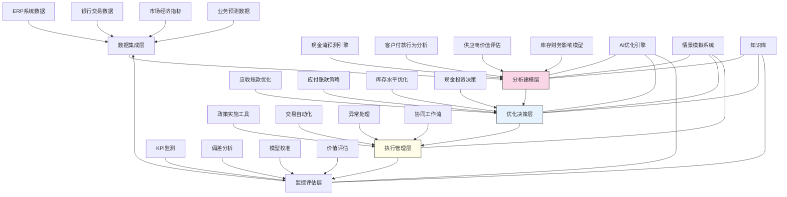

---
{"dg-publish":true,"tags":["资金管理","优化模型","现金流预测","流动性分析","智能决策"],"创建日期":"2024-05-14","permalink":"/知识共享/001_财务/03_AI与财务应用/03_智能决策支持/3.2 运营决策优化/营运资金智能管理/","dgPassFrontmatter":true}
---

## 技术概述

营运资金智能管理系统是一个融合人工智能、金融工程与运筹学的前沿决策支持平台，旨在突破传统营运资金管理的被动性、碎片化与经验依赖，实现企业流动性资源的智能化、精准化与全局优化。该系统通过构建企业现金流动态模型与多维约束优化框架，为财务决策者提供营运资金全生命周期的智能管理工具。核心技术特点包括：

- **多源现金流智能预测**：整合企业内外部数据，运用深度学习与时序分析技术，构建自适应现金流预测模型，精准捕捉季节性波动、行业趋势与异常事件影响
- **流动性风险早期预警**：应用异常检测与压力测试，建立多层次流动性风险监测体系，提前识别潜在资金缺口与流动性危机
- **应收应付智能优化**：结合客户行为分析与供应商价值评估，建立动态信用政策与付款策略优化引擎，平衡现金流改善与业务关系维护
- **库存-现金流协同优化**：融合供应链与财务视角，构建库存成本与流动性价值的联合优化模型，实现库存水平与现金可用性的全局平衡
- **动态现金投资组合**：基于企业流动性需求预测，构建短期资金投资策略生成引擎，在确保资金可用性基础上最大化闲置资金收益

相较于传统的营运资金管理方法，该系统可将现金流预测准确率提高40-60%，流动性风险识别提前10-15个工作日，营运资金周转效率提升25-40%，流动性储备优化15-30%，同时每年为企业释放占用资金相当于收入的3-8%。系统通过智能化决策支持，使企业既能应对不确定性挑战，又能释放锁定在营运资金中的价值，实现财务与业务目标的协同优化。

## 系统架构

系统架构由五个核心功能层组成，形成闭环的营运资金智能管理流程：

1. **数据集成层**：系统的基础，整合来自企业内部系统、银行平台、市场环境和业务预测的多源数据，构建营运资金管理的统一数据视图
2. **分析建模层**：系统的大脑，运用AI算法构建现金流预测、客户行为分析、供应商评估和库存影响模型，为决策提供精准洞察
3. **优化决策层**：系统的核心，基于建模结果生成应收账款策略、应付账款规划、库存水平建议和短期投资决策，实现营运资金的多维度优化
4. **执行管理层**：系统的执行单元，将优化决策转化为可操作政策和自动化交易指令，协调跨部门实施，处理执行过程中的例外情况
5. **监控评估层**：系统的反馈机制，持续监测关键绩效指标，分析实际结果与预期的偏差，校准模型参数，评估优化策略的价值创造

系统还包含三个跨层支持组件：
- **AI优化引擎**：提供跨功能层的高级优化能力，确保分析、决策和评估的智能化与精准性
- **情景模拟系统**：支持多情景分析与压力测试，评估不同条件下的营运资金表现与风险
- **知识库**：积累行业最佳实践、历史决策效果和专家经验，增强系统的上下文理解与决策智能

整个架构形成自适应优化循环，从数据洞察到策略执行再到效果评估，构建持续演进的营运资金管理生态系统。

## 实施方案

### 技术实施路线图

**第一阶段：基础构建（3-4个月）**
- 开发数据集成接口与ETL流程
- 构建初步现金流预测模型
- 实现基础客户与供应商分析
- 开发KPI监测仪表板
- 建立数据质量管理机制

**第二阶段：核心功能开发（4-5个月）**
- 增强现金流预测的精准性与适应性
- 开发多维度流动性风险评估系统
- 实现应收应付政策优化引擎
- 构建库存-现金流联合分析模型
- 开发基础现金投资决策支持功能

**第三阶段：高级分析与优化（3-4个月）**
- 开发多目标营运资金优化算法
- 实现客户支付行为预测与干预
- 构建供应商关系价值量化模型
- 开发跨供应链现金流优化功能
- 增强情景模拟与压力测试能力

**第四阶段：系统集成与优化（2-3个月）**
- 开发跨部门协同工作流
- 实现决策自动化与异常处理
- 构建自学习模型校准系统
- 系统集成与性能优化
- 用户培训与变革管理

### 技术挑战与解决策略

1. **多维度数据整合与质量**
   - 挑战：营运资金数据分散在不同系统，格式不一，实时性与准确性存在差异
   - 解决方案：构建弹性数据集成架构；开发数据质量评估与修复管道；实现渐进式数据增强策略；设计容错数据处理机制；建立数据责任制与治理框架

2. **现金流预测的不确定性**
   - 挑战：现金流受内外多因素影响，存在高度不确定性，传统模型预测准确率有限
   - 解决方案：采用集成学习方法融合多种预测算法；实现层次化预测框架区分确定性与不确定性因素；开发概率性预测模型；引入外部先导指标增强预测；构建自适应学习机制持续优化预测准确性

3. **多目标优化的平衡**
   - 挑战：营运资金优化涉及流动性、收益性、关系管理等多个目标，存在复杂权衡
   - 解决方案：开发基于帕累托最优的多目标优化框架；实现弹性约束处理机制；构建动态权重调整系统；设计情景对比与选择工具；建立基于组织价值的目标一致性评估

4. **跨部门协同与执行**
   - 挑战：营运资金优化涉及财务、采购、销售、物流等多部门，协调执行困难
   - 解决方案：构建统一的营运资金可视化平台；开发角色化决策支持界面；实现智能通知与协作工作流；设计激励一致性机制；建立跨部门价值共创框架

## 价值创造

### 量化价值评估

1. **现金流优化与释放**
   - 营运资金占收入比例：降低3-8%
   - 现金转换周期：缩短15-30天
   - 现金流预测准确率：提高40-60%
   - 自由现金流增长：提升10-20%

2. **运营效率与成本**
   - 应收账款周转率：提高20-35%
   - 坏账损失率：降低25-40%
   - 资金成本：降低15-30%
   - 资金处理人力：减少30-50%

3. **风险管理与韧性**
   - 流动性风险预警提前：10-15个工作日
   - 现金缓冲需求：降低15-30%
   - 资金短缺事件：减少50-80%
   - 危机响应时间：缩短40-60%

4. **关系管理与增长**
   - 客户满意度：提高10-20%
   - 供应商关系价值：提升15-25%
   - 业务增长支持能力：提高30-50%
   - 财务决策响应速度：提升60-80%

### 投资回报分析

投资回报率(ROI)预计达到300-450%（24个月期），主要价值来源包括：
- 降低营运资金占用释放现金流（40%）
- 减少融资需求与财务成本（25%）
- 提高闲置资金收益（15%）
- 降低坏账与流动性风险损失（10%）
- 提升财务运营效率（10%）

典型实施成本结构：技术平台开发（35%）、数据集成与管道构建（25%）、模型开发与验证（20%）、系统集成与部署（10%）、培训与变革管理（10%）。

预期投资回收期：
- 大型企业：8-12个月
- 中型企业：6-10个月
- 资本密集型企业：5-8个月
- 高增长企业：7-11个月

## 未来演进

### 技术迭代路线图

**近期演进（1-2年）**
- 整合大型语言模型增强非结构化财务数据理解
- 开发深度学习付款行为预测与干预系统
- 实现基于区块链的供应链金融集成
- 增强自适应学习与模型自校准能力

**中期演进（2-3年）**
- 构建端到端供应链资金流数字孪生
- 开发金融生态系统智能协同平台
- 实现全自动营运资金管理智能体
- 创建混合人机决策优化框架

**远期演进（3-5年）**
- 发展自主财务代理系统
- 构建跨企业资金优化网络
- 实现预见性财务管理能力
- 创建认知资金管理顾问

### 扩展应用场景

1. **动态信用管理**：基于实时数据和预测分析，为每个客户提供个性化信用政策，最大化收入同时控制风险

2. **智能供应链金融**：整合供应链与财务视角，构建基于价值贡献的供应商融资策略，优化整体供应链韧性与成本

3. **全球资金池管理**：优化跨币种、跨地区资金池结构和运作，平衡本地流动性需求与全球资金效率

4. **战略财务弹性规划**：基于多情景模拟，构建企业在不同市场环境下的财务弹性策略，增强战略执行的可持续性

## 实验验证

### 概念验证方案

**阶段一：预测能力验证（6-8周）**
- 选择代表性业务单元进行测试
- 部署现金流预测模型
- 与传统预测方法并行运行
- 比较预测准确性与提前量
- 评估模型自适应能力

**阶段二：优化策略验证（8-10周）**
- 针对特定领域（如应收账款）测试优化算法
- 设计A/B测试对比优化策略效果
- 测量关键指标改善程度
- 评估业务影响与副作用
- 收集用户反馈与体验

**阶段三：综合系统验证（10-12周）**
- 扩展至全面营运资金管理
- 部署端到端流程与决策支持
- 测试跨部门协同效果
- 评估资金释放与效率提升
- 验证系统可扩展性与稳定性

### 评估指标框架

**技术性能指标**
- 预测准确性：现金流预测的平均误差率
- 模型适应性：对业务变化的自动调整能力
- 计算效率：优化决策生成的响应时间
- 数据集成质量：数据完整性、一致性与时效性
- 系统可用性：服务水平与故障恢复能力

**业务价值指标**
- 营运资金效率：现金转换周期改善程度
- 资金释放量：优化前后的资金占用变化
- 风险控制效果：流动性风险事件减少比例
- 决策效率：财务决策流程时间缩短比例
- 跨部门协同：各部门采纳建议的比率

**长期价值指标**
- 预测能力进化：模型准确性随时间的提升
- 业务适应性：系统对业务变化的响应能力
- 知识积累：最佳实践与经验的沉淀程度
- 战略支持：对企业战略目标的贡献评估
- 组织能力提升：财务团队战略价值创造能力

## 未来影响

营运资金智能管理系统将从根本上改变企业流动性资源管理模式，带来深远影响：

1. **财务管理范式转变**：从被动的资金记录与报告转向主动的价值创造与战略支持，使营运资金从成本中心转变为价值驱动引擎

2. **跨职能边界融合**：打破财务、采购、销售、供应链等部门壁垒，形成以现金流为中心的协同决策生态，实现全局最优化资源配置

3. **企业韧性增强**：通过精准预测与智能优化，企业能够在保持更低现金储备的同时应对更大的市场波动，提高资本效率与抗风险能力

4. **价值网络协同**：将内部营运资金优化扩展至整个供应链与客户网络，通过数据共享与协同决策，实现企业生态系统的资金效率共同提升

通过营运资金智能管理，企业能够在保障业务增长和财务安全的同时，持续释放锁定在库存、应收和现金储备中的资本，提高资本回报率，增强市场竞争力。该系统不仅是技术工具，更是财务与业务战略融合的催化剂，推动企业实现从资金管理到价值管理的战略升级。 