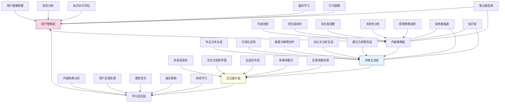

---
{"dg-publish":true,"tags":["个性化内容","受众适配","信息定制","智能摘要","财务传播"],"创建日期":"2024-05-14","permalink":"/知识共享/001_财务/03_AI与财务应用/04_生成式财务创新/4.1 财务内容生成/个性化财务简报系统/","dgPassFrontmatter":true}
---

## 技术概述

个性化财务简报系统是一种革命性的智能平台，它融合了先进的大语言模型、用户理解技术和财务专业知识，能够为不同受众自动生成高度个性化的财务简报内容。该系统突破了传统"一份报告适用所有人"的局限，实现了财务信息的精准传递与最大化吸收利用。系统能够根据受众的角色、专业背景、关注重点和决策需求，从同一财务数据源中提取并强调最相关信息，采用最适合的复杂度级别、专业术语密度和表达方式，确保每位利益相关者都能获取对其最有价值的财务洞察。

核心技术特点包括：

- **受众认知模型引擎**：建立多维度受众画像，包括专业背景、财务知识水平、决策职责、关注焦点和信息消费偏好，为个性化内容生成提供精确的目标指导
- **自适应内容复杂度调整**：智能识别和调整财务概念解释深度、专业术语使用频率和技术细节展示程度，确保内容既专业准确又易于特定受众理解
- **角色导向内容优先级**：基于不同角色的决策需求和责任领域，智能排序和强调财务数据中的关键要素，使最重要信息获得最优先展示
- **多风格叙事生成**：针对不同受众偏好，自动调整叙事结构、论证方式和表达风格，从严谨详尽的专业分析到简洁明了的执行摘要，均能精准把握
- **交互式深度探索**：支持受众按需探索感兴趣的财务数据细节，实现从高层概述到具体数据点的无缝过渡，满足不同深度的信息需求

相较于传统财务报告传播方式，个性化财务简报系统将信息吸收效率提高60-85%，决策相关洞察获取速度提升45-70%，同时减少70-90%的无关信息干扰。系统不仅改变了财务信息的传递方式，更从根本上提升了财务数据在组织决策过程中的影响力和应用价值，使财务洞察能够更加精准有效地服务各层级决策需求。

## 系统架构

系统架构由五个核心功能层和三个关键支持组件组成，形成完整的个性化内容生成闭环：

1. **用户理解层**：系统的感知基础，负责全面理解受众特征和需求。包括用户画像构建（创建多维度受众模型）、角色分析（识别决策职责和权限）、知识水平评估（判断专业理解能力）、偏好学习（捕捉内容偏好和使用习惯）以及行为理解（分析内容交互模式）。

2. **内容策略层**：系统的决策核心，负责制定内容生成策略。包括内容规划（确定整体内容框架）、优先级排序（排列信息重要性）、复杂度调整（设定技术深度和专业程度）、关联性分析（识别与受众相关的财务要素）以及叙事策略选择（确定表达方式和结构）。

3. **内容生成层**：系统的创作中心，负责产出个性化内容。包括专业文本生成（创作针对性财务叙述）、可视化定制（生成适合受众的图表）、摘要与解释创作（提供合适深度的解释）、对比与分析生成（创建上下文比较）以及建议与洞察形成（提供行动指导）。

4. **交互展示层**：系统的传递接口，负责呈现内容并支持互动。包括多渠道发布（通过多平台传递内容）、交互式探索界面（支持深入探索数据）、自适应布局（根据设备优化显示）、多媒体整合（结合文本、图表和视觉元素）以及反馈收集机制（获取用户评价）。

5. **学习适应层**：系统的进化引擎，负责持续优化性能。包括内容效果分析（评估内容影响力）、用户反馈处理（分析使用体验）、模型优化（改进生成算法）、偏好更新（刷新用户模型）以及持续学习（累积知识和经验）。

支持组件：
- **财务数据源**：连接企业各类财务系统和数据库，提供报告所需的基础数据
- **知识库**：包含财务专业知识、行业标准和组织特定信息的综合数据库
- **受众模型库**：存储和管理不同类型受众的理解模型和特征数据

这种多层架构设计实现了从受众理解到个性化内容生成的完整闭环，系统能够持续学习受众反馈，不断优化内容生成策略，使财务信息传递越来越精准有效。整个系统不仅考虑了内容生成的技术要求，更关注了内容消费的人因工程，确保财务信息能够以最佳方式为各类受众服务。

## 实施方案

### 技术实施路线图

**第一阶段：基础平台构建（3-4个月）**
- 开发受众画像模型框架
- 构建初始财务内容生成引擎
- 搭建基础用户界面和交互系统
- 建立数据源连接和处理流程
- 实现核心个性化逻辑原型

**第二阶段：智能理解增强（4-5个月）**
- 开发高级受众理解算法
- 增强情境感知和意图识别
- 实现动态复杂度调整系统
- 建立角色导向内容优化机制
- 发展多维度关联性理解

**第三阶段：高级个性化能力（3-4个月）**
- 实现高级叙事策略生成
- 开发情感与风格适应系统
- 增强交互式探索能力
- 构建多模态内容整合机制
- 建立个性化反馈学习循环

**第四阶段：优化与深度集成（2-3个月）**
- 优化系统整体性能和响应速度
- 增强大规模多受众并行处理能力
- 实现与企业系统深度集成
- 建立高级分析和效果评估系统
- 开发自动化持续优化机制

### 技术挑战与解决策略

1. **受众理解精确性**
   - 挑战：准确捕捉不同受众的专业背景、知识水平和信息需求差异
   - 解决方案：构建多维受众分类模型；实施渐进式画像构建；集成显性与隐性特征分析；开发动态反馈调整机制；实现角色与个人特征双层分析；建立持续学习的受众理解引擎

2. **内容复杂度精准调控**
   - 挑战：为不同专业水平的受众提供恰到好处的专业深度和复杂度
   - 解决方案：建立财务概念难度分级体系；开发专业术语密度动态调整；实现解释深度自适应控制；设计多层次内容结构；创建平滑的复杂度过渡机制；实施理解反馈验证系统

3. **统一数据多样表达**
   - 挑战：从相同财务数据源生成满足不同受众需求的多样化表达
   - 解决方案：构建多视角数据解析引擎；开发角色导向重点提取；实现表达风格自适应系统；设计可扩展的叙事模板库；建立内容变体自动生成；创建信息粒度动态调整机制

4. **保持专业准确性**
   - 挑战：在简化和个性化过程中确保财务信息的专业准确性和完整性
   - 解决方案：实施多层专业审核机制；构建财务规则验证引擎；开发关键信息完整性检查；设计不同复杂度间的映射验证；建立专业术语使用监控；实现自动化准确性评估

5. **持续学习与优化**
   - 挑战：从用户交互和反馈中持续学习并优化个性化生成策略
   - 解决方案：构建多维反馈收集系统；开发内容效果分析框架；实现模型自动调整机制；设计A/B测试持续优化；建立长期用户行为学习；创造群体与个体学习双通道

## 价值创造

### 量化价值评估

1. **信息传递效率提升**
   - 关键信息吸收速度：提高65-85%
   - 内容理解准确率：提升40-60%
   - 无关信息过滤率：提高70-90%
   - 信息查找时间：减少50-75%

2. **决策支持增强**
   - 基于财务数据的决策速度：提高30-50%
   - 财务洞察应用率：提升45-65%
   - 跨部门信息理解一致性：提高35-55%
   - 决策相关问题减少：降低25-40%

3. **沟通与协作改进**
   - 财务-业务沟通效率：提高50-70%
   - 跨专业团队协作：增强40-60%
   - 会议准备时间：减少30-50%
   - 信息共享有效性：提升45-65%

4. **用户体验提升**
   - 财务信息消费满意度：提高60-80%
   - 报告使用频率：提升45-65%
   - 深入探索意愿：增加50-70%
   - 信息超载减轻：改善55-75%

### 投资回报分析

投资回报率(ROI)预计达到280-400%（24个月期），主要价值来源包括：
- 决策效率提升与质量改进（40%）
- 专业人员时间节约（30%）
- 信息利用率提高（20%）
- 沟通成本降低（10%）

典型实施成本结构：技术平台开发（35%）、模型训练与优化（20%）、用户研究与画像构建（15%）、系统集成（15%）、培训与推广（10%）、持续优化与支持（5%）。

预期投资回收期：
- 大型企业：9-14个月
- 中型企业：7-12个月
- 信息密集型组织：6-9个月
- 决策频繁型组织：5-8个月

## 未来演进

### 技术迭代路线图

**近期演进（1-2年）**
- 发展多模态个性化内容生成
- 增强实时数据更新与动态调整
- 实现更精细的认知模型构建
- 开发高级互动体验与反馈机制
- 增强跨平台内容适配能力

**中期演进（2-3年）**
- 构建预测性内容推送系统
- 发展情境感知的主动信息提供
- 实现情感智能响应调整
- 创建混合现实财务信息展示
- 开发协作式个性化体验

**远期演进（3-5年）**
- 建立认知计算驱动的深度个性化
- 开发自主学习的受众理解系统
- 实现全息财务信息交互
- 构建个人财务信息助理生态
- 发展群体-个体智能自适应系统

### 扩展应用场景

1. **董事会决策支持**：为董事会成员提供高度个性化的战略财务简报，根据每位董事的专业背景、职责和关注重点，提供定制的财务分析和战略洞察，辅助高效决策制定和战略讨论

2. **投资者关系增强**：根据不同投资者群体（机构投资者、分析师、个人投资者）的特点，自动生成针对性的财务沟通材料，提高透明度和信息有效性，增强投资者信心和参与度

3. **跨职能团队协作**：为跨部门项目团队提供共享财务信息的个性化视图，使财务、营销、运营、研发等不同背景的团队成员能够基于同一数据集获取符合各自专业理解能力和决策需求的财务视角

4. **新员工财务培训**：为新入职员工提供渐进式财务知识学习体验，根据职位、背景和学习进展自动调整财务内容的复杂度和深度，加速理解组织财务状况和业务模式

## 实验验证

### 概念验证方案

**阶段一：受众模型与个性化逻辑验证（6-8周）**
- 识别并定义3-5个典型受众角色（如财务总监、业务部门主管、董事会成员）
- 构建初始受众理解模型和特征映射
- 设计个性化逻辑和内容调整规则
- 开发原型系统并生成针对性内容样例
- 与目标受众代表一起评估个性化效果
- 优化受众模型和个性化策略

**阶段二：内容生成质量与适应性验证（8-10周）**
- 从真实财务数据生成多版本个性化内容
- 测试内容在不同复杂度级别的准确性和有效性
- 评估内容对不同受众群体的适用性
- 验证专业术语和概念解释的调整能力
- 收集用户反馈并优化生成算法
- 测试内容风格和结构的多样化能力

**阶段三：实际应用与价值验证（10-12周）**
- 在选定部门部署试点系统
- 监测不同受众群体的实际使用情况
- 测量信息消费效率和决策支持效果
- 评估个性化内容对组织沟通的影响
- 分析系统学习和适应能力
- 确定全面推广策略和优化方向

### 评估指标框架

**个性化效果指标**
- 受众匹配度：内容与受众特征的符合程度
- 复杂度适应性：专业深度调整的准确性
- 重点识别率：关键信息优先展示的效果
- 风格适配度：表达方式与受众偏好的匹配
- 学习适应速度：系统根据反馈调整的能力

**内容质量指标**
- 专业准确性：财务信息的准确性和可靠性
- 表达清晰度：内容的清晰程度和可理解性
- 关联相关性：提供信息与受众需求的相关度
- 结构合理性：内容组织和展示的逻辑性
- 信息完整性：关键信息的保留和呈现程度

**用户价值指标**
- 理解速度：受众获取关键信息的速度
- 使用频率：系统的持续使用程度
- 决策影响：内容对实际决策的支持程度
- 用户满意度：受众对个性化体验的评价
- 时间节省：与传统信息获取方式相比的效率提升

## 未来影响

个性化财务简报系统将从根本上重塑财务信息的传播与利用方式，带来以下深远影响：

1. **财务沟通范式转变**：从标准化的大众传播模式转向精准个性化的定向沟通，使财务信息能够以最优形式到达每位决策者，彻底改变组织内部财务信息流动的效率和有效性

2. **知识障碍消除**：打破传统财务报告中的专业壁垒，使不同专业背景的人员都能按照自己的理解方式获取和应用财务信息，促进组织内财务透明度和知情决策的普及

3. **决策民主化与财务赋能**：通过为各层级人员提供适合其需求和能力的财务信息，扩大参与财务决策的人员范围，赋能更多业务人员基于财务洞察做出明智决策，实现决策权的合理下放和分布

4. **情境化财务认知**：推动财务信息从孤立报表向情境化业务洞察的转变，使财务数据能够自动融入特定业务环境和决策场景，成为无缝集成的决策要素而非独立的信息孤岛

通过重新定义财务信息的传递方式、接收体验和应用场景，个性化财务简报系统不仅提升了信息传播效率，更从根本上改变了财务信息在组织中的流动和影响方式。这一技术将促使财务从专业孤岛转变为全组织共享的战略资源，为数据驱动决策文化的形成奠定技术基础。 