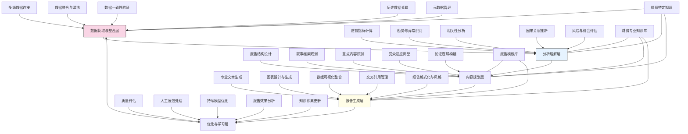

---
{"dg-publish":true,"tags":["内容生成","报告自动化","财务分析","数据叙事","智能撰写"],"创建日期":"2024-05-14","permalink":"/知识共享/001_财务/03_AI与财务应用/04_生成式财务创新/4.1 财务内容生成/智能财务报告生成器/","dgPassFrontmatter":true}
---

## 技术概述

智能财务报告生成器是一个革命性系统，通过融合大语言模型(LLM)、财务专家知识和数据分析技术，实现财务报告的全自动智能化生成。该系统突破了传统报告编写的局限，将复杂财务数据转化为结构完整、逻辑严密、洞察深刻的专业报告，同时保持叙事流畅自然的语言表达。系统实现了从数据收集、分析理解到专业撰写的端到端自动化，为财务团队释放大量专业时间，同时提升报告质量与一致性。核心技术特点包括：

- **财务专用大语言模型**：基于最先进大模型技术，通过海量财务报告与分析文档的专项训练，形成深度理解财务语境、专业术语和报告结构的领域特化模型，能够生成符合行业标准与组织风格的高质量财务文本
- **智能数据叙事引擎**：将复杂数据分析结果转化为连贯叙事，自动识别关键趋势、异常和相关性，构建逻辑严密的论证结构，将数字化信息转变为有意义的商业洞察和战略建议
- **动态报告框架生成**：根据报告目的、受众和关键信息，智能设计最优报告结构，自动决定章节安排、重点分布和展示逻辑，确保内容覆盖全面同时突出关键信息
- **多源数据整合分析**：智能连接和整合多个数据源，协调处理不同格式、周期和粒度的财务数据，自动执行必要的转换和核对，确保报告数据的准确性与一致性
- **上下文感知生成技术**：深度理解企业特定背景、历史表现和战略目标，将当期财务数据置于更广阔的商业情境中分析，生成体现整体视角和战略洞察的内容

相较于传统报告编写方法，智能财务报告生成器将报告制作时间缩短70-90%，同时提高内容质量和一致性，减少人为错误。系统不仅能生成标准财务报表说明和分析，还能根据数据自动发现并阐述业务洞察，提供战略建议，真正实现从数据到决策支持的转变。通过先进AI与财务专业知识的深度融合，系统使财务报告从繁重的合规任务转变为战略价值的重要来源。

## 系统架构

系统架构由五个核心功能层和三个关键支持组件组成，形成数据到报告的完整闭环：

1. **数据获取与整合层**：系统的数据基础，负责收集和准备分析所需的所有数据。包括多源数据连接（接入各类财务系统和数据库）、数据整合与清洗（处理不一致和缺失数据）、数据一致性验证（确保数据准确性）、历史数据关联（建立时间序列联系）以及元数据管理（维护数据上下文信息）。

2. **分析理解层**：系统的智能分析核心，负责从数据中提取有意义的洞察。包括财务指标计算（生成关键绩效指标）、趋势与异常识别（检测重要模式和变化）、相关性分析（发现变量间关系）、因果关系推断（分析潜在原因）以及风险与机会评估（预测未来影响）。

3. **内容规划层**：系统的组织设计中心，负责构思报告整体结构。包括报告结构设计（确定章节和框架）、叙事框架规划（设计信息流和故事线）、重点内容识别（确定强调内容）、受众适应调整（根据读者调整深度和风格）以及论证逻辑构建（设计说服性论述结构）。

4. **报告生成层**：系统的内容创作引擎，负责产出高质量报告文件。包括专业文本生成（撰写专业财务叙述）、图表设计与生成（创建说明性图表）、数据可视化整合（嵌入交互式图表）、交叉引用管理（维护内部引用一致性）以及报告格式化与风格（应用组织视觉标识）。

5. **优化与学习层**：系统的进化引擎，负责持续改进能力。包括质量评估（评价生成内容质量）、人工反馈处理（整合用户意见）、持续模型优化（改进语言和分析模型）、报告效果分析（跟踪报告使用情况）以及知识积累更新（扩展专业知识库）。

支持组件：
- **财务专业知识库**：包含财务理论、法规要求、行业标准和专业术语的综合数据库
- **报告模板库**：各类财务报告的结构模板、最佳实践和案例集合
- **组织特定知识**：企业特有的报告风格、战略重点、业务结构和历史背景信息

整体架构设计实现了从原始数据到专业报告的完整转化过程，通过闭环设计不断学习和优化，持续提升报告质量。系统不仅自动执行数据分析和内容生成，更能随着使用积累经验，逐步适应组织特定需求和风格。

## 实施方案

### 技术实施路线图

**第一阶段：基础平台构建（3-4个月）**
- 开发数据连接和整合核心组件
- 构建基础财务分析引擎
- 训练初版财务专用语言模型
- 实现标准报告基本结构生成
- 开发核心文本生成功能

**第二阶段：智能分析增强（4-5个月）**
- 优化多维财务分析能力
- 发展高级趋势和异常检测
- 增强因果关系推断功能
- 实现上下文感知的数据解释
- 开发智能报告结构规划

**第三阶段：高级生成与个性化（3-4个月）**
- 实现深度叙事结构构建
- 开发受众适应内容调整
- 增强图表与文本整合能力
- 建立报告质量评估体系
- 实现组织特定知识应用

**第四阶段：系统优化与集成（2-3个月）**
- 优化端到端工作流性能
- 增强人工反馈学习能力
- 开发高级报告格式定制
- 构建企业系统深度集成
- 实现报告效果跟踪分析

### 技术挑战与解决策略

1. **数据整合与质量保障**
   - 挑战：财务数据分散在多个系统，格式不一，质量参差不齐，影响分析准确性
   - 解决方案：构建智能数据验证引擎；开发跨源数据协调算法；实现异常数据自动检测；建立数据质量评分系统；设计多级数据清洗流程；实施数据一致性持续监控

2. **专业财务知识表达**
   - 挑战：AI生成的内容需符合严格的财务专业标准，准确使用专业术语和概念
   - 解决方案：构建财务领域知识图谱；开发专业术语理解与应用系统；实现概念关系映射；设计财务规则合规检查；创建行业特定表达库；实施专业准确性验证机制

3. **叙事质量与逻辑严密性**
   - 挑战：自动生成内容需具备严密的因果逻辑和清晰的论证结构
   - 解决方案：开发叙事结构验证框架；构建论证逻辑模板库；实现断言与证据匹配检查；设计逻辑连贯性评估；建立专业审阅反馈循环；实施多视角论证构建

4. **洞察发现的深度与价值**
   - 挑战：超越简单的数据描述，提供有战略价值的深度洞察和建议
   - 解决方案：构建多层次分析框架；开发商业影响推断引擎；实现跨领域关联分析；设计战略情境映射；建立历史案例学习系统；实施预测性见解生成

5. **组织适应性与专属风格**
   - 挑战：报告需反映组织独特风格、优先级和战略焦点
   - 解决方案：开发组织风格学习系统；构建风格适应转换层；实现报告历史分析；设计组织词汇和表达偏好库；建立渐进式适应机制；实施用户反馈持续优化

## 价值创造

### 量化价值评估

1. **效率与产能提升**
   - 报告编写时间：减少70-90%
   - 数据分析与处理时间：缩短60-80%
   - 报告迭代与修订周期：缩短50-70%
   - 财务团队产能：提高40-60%

2. **质量与一致性改进**
   - 报告准确性：提高35-50%
   - 内容完整性：提升40-60%
   - 分析深度：增强45-65%
   - 风格一致性：提高70-90%

3. **战略价值增强**
   - 洞察发现率：提高50-70%
   - 报告利用率：提升40-60%
   - 决策支持质量：增强35-55%
   - 风险提前识别：提高30-50%

4. **资源优化与重分配**
   - 高价值任务时间占比：提高60-80%
   - 手动数据处理需求：减少75-90%
   - 报告审阅与修正需求：降低50-70%
   - 跨部门协作效率：提升40-60%

### 投资回报分析

投资回报率(ROI)预计达到320-450%（24个月期），主要价值来源包括：
- 人力资源优化与重分配（45%）
- 报告质量与决策支持提升（30%）
- 合规风险降低（15%）
- 流程标准化与知识保存（10%）

典型实施成本结构：技术平台开发（40%）、模型训练与优化（25%）、系统集成（15%）、培训与变革管理（12%）、持续运营与支持（8%）。

预期投资回收期：
- 大型企业：10-14个月
- 中型企业：8-12个月
- 财务密集型企业：6-10个月
- 报告需求频繁组织：7-10个月

## 未来演进

### 技术迭代路线图

**近期演进（1-2年）**
- 发展实时报告自动更新能力
- 扩展多语言报告生成支持
- 增强交互式报告元素生成
- 实现跨维度财务分析整合
- 开发自适应报告结构引擎

**中期演进（2-3年）**
- 构建预测性财务叙事系统
- 开发场景模拟与分析整合
- 实现全自主洞察发现引擎
- 建立认知级组织背景理解
- 发展跨报告知识整合能力

**远期演进（3-5年）**
- 实现自主财务顾问能力
- 开发动态报告生态系统
- 构建混合智能报告协作
- 实现预测性洞察自动验证
- 创建适应性知识网络

### 扩展应用场景

1. **多利益相关方报告定制**：根据不同利益相关方（投资者、监管机构、管理层、业务部门）的关注点、专业背景和决策需求，自动生成针对性报告版本，确保同一数据集能够最有效地服务不同受众的独特需求

2. **实时财务战情室**：构建持续更新的财务分析环境，将传统的静态周期报告转变为实时更新的财务指挥中心，随着新数据的到来自动更新分析和洞察，支持更敏捷的决策过程

3. **战略情景规划支持**：将报告生成能力与情景模拟相结合，自动为不同战略情景生成完整财务影响分析报告，帮助管理层评估各种战略选择的潜在结果和风险收益状况

4. **监管与合规报告自动化**：专门针对不断变化的监管要求，开发能够自动适应新规则的报告生成系统，确保组织始终保持合规，同时显著降低合规报告的成本和风险

## 实验验证

### 概念验证方案

**阶段一：数据分析与洞察能力验证（6-8周）**
- 选择2-3个典型财务报告场景（如季度财报、管理报告）
- 收集历史数据和已完成报告样例
- 测试系统数据分析与指标计算准确性
- 评估自动趋势识别和洞察发现能力
- 与专业分析师结果对比
- 优化分析模型和洞察生成算法

**阶段二：内容生成质量验证（8-10周）**
- 基于分析结果生成报告文本和图表
- 邀请财务专家评估内容质量与专业准确性
- 测试不同报告类型和风格的适应能力
- 评估叙事逻辑性和论证结构
- 收集详细反馈并优化生成模型
- 进行A/B测试比较不同生成策略

**阶段三：实际应用与价值验证（10-12周）**
- 在选定部门部署试点系统
- 并行生成自动报告与传统人工报告
- 测量效率提升和资源节省
- 评估用户接受度和实际应用情况
- 收集决策者对报告价值的反馈
- 制定全面推广和持续优化计划

### 评估指标框架

**技术性能指标**
- 数据分析准确率：系统计算与专业分析的一致性
- 洞察发现率：自动识别关键趋势和异常的能力
- 内容生成质量：生成文本的专业性和流畅度评分
- 报告结构合理性：结构设计的逻辑性和完整性
- 系统响应性：完成报告生成的时间表现

**专业质量指标**
- 财务准确性：财务概念和术语使用的准确度
- 分析深度：超越数据表面的洞察能力
- 逻辑严密性：论证结构的严密程度
- 叙事流畅性：内容组织和过渡的自然程度
- 专业共识度：财务专家对内容质量的评价

**业务价值指标**
- 时间节省：与传统流程相比节省的工时
- 用户满意度：最终用户对报告的满意程度
- 洞察应用率：报告中洞察被实际采纳的比例
- 决策影响：基于报告做出决策的频率
- 资源优化：专业人员转向高价值工作的程度

## 未来影响

智能财务报告生成器将从根本上改变财务报告的创建方式和战略价值，带来以下深远影响：

1. **财务职能的战略转型**：将财务团队从繁重的报告编写工作中解放出来，使他们能够转向更具战略性的分析、规划和决策支持角色，提升财务作为业务伙伴的战略地位

2. **数据叙事文化的形成**：培养组织内部更强大的数据驱动文化，使数据故事讲述成为标准实践，增强组织从数据中提取价值的能力，推动更多数据支持的决策制定

3. **财务洞察民主化**：通过自动生成高质量报告，使财务洞察能更广泛地传播到组织各层级，打破传统的信息孤岛，使更多业务决策者能够及时获取和理解关键财务见解

4. **报告从静态到动态的范式转变**：颠覆传统静态周期性报告模式，走向随需应变、实时更新的动态报告范式，使财务报告能够与业务节奏保持同步，提供更及时的决策支持

通过重新定义财务报告的创建方式、内容质量和战略价值，智能财务报告生成器不仅提高了运营效率，更从根本上提升了财务信息的影响力和价值贡献。这一技术将推动财务从传统的记录和报告职能，向真正的商业洞察提供者和战略伙伴转型，在数据驱动的商业环境中发挥关键作用。 