---
{"dg-publish":true,"tags":["混合云","系统部署","云原生","弹性架构","安全架构"],"创建日期":"2024-05-14","permalink":"/知识共享/001_财务/03_AI与财务应用/05_财务人工智能系统架构/5.1 技术架构设计/混合云财务AI部署/","dgPassFrontmatter":true}
---

## 技术概述

混合云财务AI部署是一种针对财务智能系统的先进部署架构，它融合了公有云、私有云和本地基础设施的优势，为财务AI应用提供灵活、安全、合规且经济高效的运行环境。这一架构设计充分考虑了财务系统对数据安全性、合规性要求高，同时又需要先进计算能力和灵活扩展性的特殊需求，通过智能资源编排和多环境协同，实现了财务AI系统从开发到生产的高效部署和运维。

核心技术特点包括：

- **分区资源策略**：根据数据敏感性、处理类型和合规要求，采用自动化分区策略将不同AI工作负载智能分配到最合适的环境（公有云、私有云或本地系统），确保关键财务数据安全的同时最大化资源使用效率
- **无缝数据流动框架**：建立跨环境的安全数据流动通道，支持敏感数据在隐私保护前提下的安全共享和流转，使分布式部署的各组件能协同工作，避免数据孤岛
- **环境一致性保障**：通过容器化、基础设施即代码(IaC)和GitOps等技术，确保从开发到测试再到生产环境的一致性，消除"在我机器上能运行"的问题，提高部署成功率
- **智能计算负载调度**：根据AI工作负载特性、成本效益和性能需求，自动决定模型训练和推理任务的最佳执行位置，在高性能GPU实例和经济高效CPU之间智能平衡
- **多层安全架构**：实施从网络隔离、数据加密、访问控制到模型防护的全方位多层次安全策略，满足财务数据保护和合规审计的严格要求
- **动态资源弹性扩展**：基于实际业务负载和时间模式（如月末、季末、年末高峰），实现按需自动扩展和收缩计算资源，平衡性能需求和成本控制
- **版本控制与回滚机制**：提供严格的模型版本控制和快速回滚能力，确保系统稳定性并支持紧急响应，降低部署风险

相较于传统单一环境部署和纯公有云/私有云方案，混合云财务AI部署在降低总体拥有成本(25-40%)的同时，显著提升了部署灵活性(50-70%)、安全合规水平(35-55%)和运维效率(40-60%)。该方案尤其适合对数据安全有高要求，同时又需要现代AI算力和敏捷迭代能力的财务组织，提供了合规与创新的最佳平衡点。

## 系统架构

```mermaid
graph TD
    A[统一管理平面] --- B[公有云环境]
    A --- C[私有云环境]
    A --- D[本地数据中心]
    
    A1[多云编排引擎] --> A
    A2[统一监控系统] --> A
    A3[身份与访问管理] --> A
    A4[配置与合规控制] --> A
    A5[成本优化中心] --> A
    
    B1[AI模型训练集群] --> B
    B2[大规模数据处理] --> B
    B3[弹性计算资源] --> B
    B4[高级分析服务] --> B
    B5[开发与测试环境] --> B
    
    C1[高安全模型服务] --> C
    C2[内部数据处理] --> C
    C3[合规敏感工作负载] --> C
    C4[财务核心服务] --> C
    C5[中等敏感度应用] --> C
    
    D1[财务主数据系统] --> D
    D2[核心账务处理] --> D
    D3[高敏感度数据存储] --> D
    D4[本地推理服务] --> D
    D5[审计与合规系统] --> D
    
    E[混合数据服务] --- B
    E --- C
    E --- D
    
    F[统一CI/CD流水线] --- B
    F --- C
    F --- D
    
    G[安全与合规框架] --- B
    G --- C
    G --- D
    
    H[灾备与业务连续性] --- B
    H --- C
    H --- D
    
    style A fill:#f9f9f9,stroke:#333,stroke-width:1px
    style B fill:#d5e8d4,stroke:#333,stroke-width:1px
    style C fill:#dae8fc,stroke:#333,stroke-width:1px
    style D fill:#ffe6cc,stroke:#333,stroke-width:1px
```

系统架构由四个核心层次和四个贯穿性服务组成，形成完整的混合云财务AI部署框架：

1. **统一管理平面**：系统的控制中枢，负责跨环境的统一管理和协调。包括多云编排引擎（管理跨云资源分配和工作负载调度）、统一监控系统（提供全环境可视性和监控）、身份与访问管理（集中式身份验证和授权）、配置与合规控制（确保环境配置符合规范和合规要求）以及成本优化中心（分析和优化混合环境成本）。

2. **公有云环境**：系统的弹性计算层，负责高性能计算和弹性资源需求。包括AI模型训练集群（利用云GPU进行大规模模型训练）、大规模数据处理（处理非敏感大数据集）、弹性计算资源（按需扩展的计算能力）、高级分析服务（利用云原生分析工具）以及开发与测试环境（敏捷开发和测试平台）。

3. **私有云环境**：系统的安全控制层，负责处理敏感度中等的工作负载。包括高安全模型服务（部署已训练模型的安全服务环境）、内部数据处理（处理中等敏感度数据）、合规敏感工作负载（需要特定合规控制的处理）、财务核心服务（关键财务应用服务）以及中等敏感度应用（内部使用的财务应用）。

4. **本地数据中心**：系统的核心安全层，负责最敏感数据和核心处理。包括财务主数据系统（核心财务数据管理）、核心账务处理（基本财务交易处理）、高敏感度数据存储（保护最敏感的财务数据）、本地推理服务（在本地进行AI模型推理）以及审计与合规系统（满足严格的审计要求）。

贯穿性服务：
- **混合数据服务**：实现跨环境的数据访问、同步和治理，确保数据一致性和安全流动
- **统一CI/CD流水线**：提供从开发到生产的自动化部署通道，支持在不同环境中一致的发布
- **安全与合规框架**：确保所有环境满足财务系统的安全标准和合规要求
- **灾备与业务连续性**：提供跨环境的备份、恢复和业务连续性保障

这种多环境融合架构设计充分利用了各类基础设施的优势，公有云提供弹性和先进计算能力，私有云提供安全控制和中等敏感度数据处理，本地数据中心保障核心数据安全和合规要求。统一管理平面和贯穿服务确保了多环境的协同高效运行，为财务AI系统提供了安全、灵活且经济的运行基础。

## 实施方案

### 技术实施路线图

**第一阶段：基础设施准备与规划（2-3个月）**
- 完成混合环境评估和工作负载分类
- 建立跨环境网络连接和安全通道
- 实施基础身份认证和访问控制
- 设计数据分类和治理策略
- 部署基础监控和日志系统

**第二阶段：核心服务构建（3-4个月）**
- 实现统一管理平面核心功能
- 建立跨环境数据流动机制
- 部署容器化和编排基础设施
- 实施初步CI/CD流水线
- 建立安全基线和合规框架

**第三阶段：AI工作负载部署（3-4个月）**
- 配置AI模型训练环境（公有云）
- 部署模型服务基础设施（私有云）
- 实现敏感数据推理服务（本地）
- 建立模型部署和版本控制机制
- 实施资源弹性伸缩策略

**第四阶段：优化与完善（2-3个月）**
- 实现高级自动化编排和调度
- 完善成本管理和优化工具
- 增强跨环境监控和故障检测
- 优化性能和资源利用率
- 完成全面的安全审计和合规验证

### 技术挑战与解决策略

1. **环境一致性维护**
   - 挑战：确保跨公有云、私有云和本地环境的配置、依赖和运行时一致性
   - 解决方案：实施基础设施即代码(IaC)；采用容器化技术封装应用；建立环境镜像和版本控制；实现配置自动验证；部署环境漂移检测；应用持续合规监控；建立环境模板化管理

2. **数据安全与跨环境流动**
   - 挑战：在保障敏感财务数据安全的前提下，支持跨环境数据流动和处理
   - 解决方案：实施数据分类和标记系统；采用端到端加密机制；实现数据脱敏和匿名化处理；建立细粒度访问控制；部署数据流动监控系统；应用零信任安全模型；建立数据流动合规检查点

3. **混合环境运维复杂性**
   - 挑战：管理跨多种环境的系统增加了监控、故障排除和优化的复杂性
   - 解决方案：部署统一跨环境观测平台；建立集中式日志分析系统；实施统一告警和事件响应；采用AIOps辅助运维；设计服务健康地图；实现自动根因分析；建设混合环境运维知识库

4. **成本管理与优化**
   - 挑战：在多环境混合架构中优化总体拥有成本，避免资源浪费和意外支出
   - 解决方案：实施多云成本透视系统；建立工作负载经济分析模型；开发资源使用预测和规划工具；采用自动闲置资源回收；设计成本异常检测和告警；实现按业务单元的成本分摊；开发资源优化建议引擎

5. **灾备与业务连续性**
   - 挑战：在混合环境中确保关键财务AI服务的高可用性和灾难恢复能力
   - 解决方案：设计多环境容灾策略；实施服务级别自动故障转移；建立数据跨环境备份机制；开发系统韧性测试框架；采用混沌工程验证容错性；设计渐进式恢复流程；建立业务影响分析与优先级模型

## 价值创造

### 量化价值评估

1. **经济价值**
   - 基础设施总成本：降低25-40%
   - 计算资源利用率：提高30-50%
   - 按需扩展节约：增加20-35%
   - 运维工作量：减少35-55%

2. **性能与敏捷性**
   - 系统部署速度：提高50-70%
   - 资源调配时间：缩短60-80%
   - 环境配置时间：减少45-65%
   - 模型迭代周期：缩短30-50%

3. **安全与合规增强**
   - 数据安全事件：减少40-60%
   - 合规验证时间：缩短35-55%
   - 安全控制覆盖率：提高45-65%
   - 审计准备时间：减少50-70%

4. **业务连续性**
   - 系统可用性：提高至99.95-99.99%
   - 灾难恢复时间：缩短60-80%
   - 故障检测速度：提高45-65%
   - 业务中断影响：降低55-75%

### 投资回报分析

投资回报率(ROI)预计达到280-420%（30个月期），主要价值来源包括：
- 优化基础设施成本和资源利用带来的直接节约（40%）
- 部署效率提升和运维简化产生的人力成本优化（25%）
- 系统可用性提高和风险降低创造的业务价值（20%）
- 环境灵活性带来的创新加速和上市时间缩短（15%）

典型实施成本结构：基础架构建设（35%）、工具链开发与集成（25%）、安全合规框架（20%）、运维自动化（15%）、培训与转型（5%）。

预期投资回收期：
- 大型金融机构：16-20个月
- 中型财务组织：12-18个月
- 云成熟度高的企业：10-14个月
- 高计算需求场景：8-12个月

## 未来演进

### 技术迭代路线图

**近期演进（1-2年）**
- 实现自主混合环境编排和优化
- 增强零信任安全架构全覆盖
- 开发智能资源预测与预留系统
- 实现更细粒度的成本跟踪和归因
- 构建混合环境自愈能力

**中期演进（2-3年）**
- 实现边缘计算与多云无缝融合
- 构建意图驱动的基础设施管理
- 开发AI模型联邦学习跨环境架构
- 实现全环境量化安全风险评估
- 建立预测性资源优化系统

**远期演进（3-5年）**
- 发展自主运维AI代理协作网络
- 实现环境间的复杂服务编排与迁移
- 构建认知安全防御系统
- 实现零摩擦混合环境管理体验
- 建立自优化的多环境资源生态系统

### 应用场景拓展

1. **财务安全超级计算平台**：基于混合云部署建立特殊用途的财务AI安全计算环境，支持高度敏感数据的先进分析。该平台在私有云或本地环境中处理敏感数据，同时利用公有云的高性能计算资源进行模型训练，通过加密、差分隐私和联邦学习技术确保数据安全。这使金融机构能在不妥协安全性的前提下，执行复杂的欺诈检测、反洗钱模式识别和实时风险评估等计算密集型任务，显著提升对复杂金融犯罪的检测能力和监管合规水平。

2. **财务AI灾备与韧性系统**：构建跨环境的高级灾备和业务连续性保障体系，确保关键财务AI服务在任何环境故障情况下的无缝运行。系统通过智能状态同步、环境感知路由和自动故障转移，实现服务的无感知迁移和恢复。特别是对于季末、年末等财务关键时期，系统可提供预测性扩展和灾备准备，确保业务高峰期的系统稳定和数据安全。这种多环境韧性架构将财务系统潜在中断风险降至最低，保障财务决策和运营的连续性。

3. **财务监管沙箱环境**：建立专用的混合云监管合规测试环境，用于安全地验证AI模型和系统对各种财务法规的遵从性。该环境能够模拟不同司法管辖区的监管要求，并在隔离环境中使用合成或脱敏数据进行合规性测试。这使金融机构能在实际部署前全面评估AI系统的合规风险，验证模型行为符合GDPR、BaselIII/IV、CECL等监管要求，大幅减少合规风险和潜在罚款，同时加速创新应用的审批和上市时间。

4. **弹性财务分析云**：创建针对周期性财务分析需求的智能弹性计算环境，自动响应季度结算、年度报告等周期性高需求期。系统能够预测计算需求高峰并提前准备资源，在需求高峰期自动扩展到公有云，平峰期则缩减回私有云或本地环境以优化成本。这种"财务节奏感知"的基础设施不仅满足了高峰期的性能需求，也实现了资源使用的经济性和可持续性，使财务团队能够以最优成本获得及时的分析支持和洞察。

## 实验验证

### 概念验证方案

**阶段一：基础架构验证（6-8周）**
- 建立小规模混合环境概念验证
- 测试跨环境连接和数据流动
- 验证身份认证和访问控制机制
- 评估基本容器化部署流程
- 测试简单AI工作负载分发能力
- 验证基础监控和日志收集

**阶段二：工作负载测试（7-9周）**
- 部署代表性AI训练工作负载
- 测试模型在不同环境间的部署
- 验证敏感和非敏感数据处理隔离
- 评估弹性伸缩响应能力
- 测试故障场景和恢复流程
- 验证资源利用和性能表现

**阶段三：生产就绪验证（6-8周）**
- 执行全面安全和合规评估
- 测试完整CI/CD流水线功能
- 验证成本管理和优化能力
- 评估生产规模下的性能和可靠性
- 测试用户接口和运维工具体验
- 确认所有关键指标达到要求

### 验证指标体系

**基础设施效能指标**
- 资源调配速度：环境准备和配置时间
- 环境一致性：跨环境配置偏差率
- 自动化覆盖率：自动化流程占比
- 网络性能：跨环境数据传输速率
- 资源利用率：计算和存储资源使用效率

**安全与合规指标**
- 安全控制覆盖率：安全措施实施完整度
- 合规满足度：满足各项合规要求的程度
- 隔离有效性：环境间隔离的完整性
- 漏洞暴露时间：发现并修复漏洞的时间
- 权限控制精度：最小权限原则实施程度

**运维效率指标**
- 部署成功率：自动部署的成功比例
- 平均恢复时间：服务中断后恢复所需时间
- 监控覆盖率：系统可观测性的全面程度
- 自动化响应率：无人工干预解决的问题比例
- 跨环境管理效率：统一管理操作的效率

## 未来影响

混合云财务AI部署架构将从根本上改变财务技术系统的构建、部署和运营方式，带来以下深远影响：

1. **安全与创新平衡新范式**：重新定义财务技术中安全与创新的关系模式。传统上，财务系统面临"安全与创新"的两难选择，要么选择安全稳定但创新缓慢的本地部署，要么接受灵活创新但安全顾虑的纯云模式。混合云架构通过工作负载智能分区，将高安全需求与创新需求优雅地分离，使组织能够同时获得最高级别的数据保护和最前沿的AI创新能力。这种"价值导向分区"的范式将成为未来财务技术的基础模式，带来安全与创新的共赢局面。

2. **财务AI民主化加速**：显著降低先进财务AI技术的采用门槛和成本结构。混合架构使中小型财务组织能够在保持核心数据安全的前提下，通过公有云按需付费模式获取高级AI能力，避免了巨额前期基础设施投资。这将加速财务AI从大型金融机构向中小企业的扩散，创造更平等的竞争环境。长期来看，这种趋势将推动财务AI能力从稀缺竞争优势转变为普遍应用的基础能力，重塑整个行业的技术应用格局。

3. **敏捷财务运营模式兴起**：催生基于混合云的敏捷财务运营新模式。随着部署灵活性的提高和环境一致性的保障，财务AI系统的迭代速度将大幅加快，使财务团队能够以"产品思维"而非"项目思维"来管理财务技术，实现持续改进和快速响应变化。这将促使财务组织的结构从传统的功能性层级转向跨职能敏捷团队，更有效地将技术、数据和业务专业知识融合，创造出响应更快、适应性更强的财务能力。

4. **可持续财务技术实践**：推动财务技术领域的可持续发展实践。通过资源智能调度和弹性伸缩，混合云架构能够显著提高计算资源利用率，减少冗余容量和能源浪费。特别是对季节性财务工作负载（如季末、年末报告），系统可以仅在需要时扩展资源，而在低需求期自动缩减，实现资源消耗与实际需求的精准匹配。这种可持续技术实践不仅降低了运营成本，也减少了碳足迹，支持企业的ESG目标，并在长期推动整个行业向更高效、更环保的技术实践转变。

通过重新定义财务AI系统的部署模式，混合云架构不仅解决了当前的技术挑战，更重要的是为财务技术的未来演进提供了可持续的路径。它使组织能够在保持安全合规的前提下快速采纳AI创新，在确保业务连续性的同时优化资源使用，并以更敏捷的方式响应不断变化的业务需求。这一架构模式将成为财务数字化转型成功的关键基础设施范式，支持财务功能从传统交易处理中心向战略价值创造者的转变。 