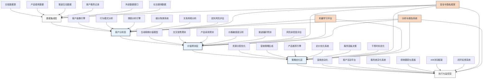

---
{"dg-publish":true,"tags":["AI财务应用","客户价值","预测模型","个性化服务","金融科技"],"创建日期":"2024-04-29","permalink":"/知识共享/001_财务/03_AI与财务应用/06_行业智能财务应用/6.2 金融服务业应用/客户价值预测与优化/","dgPassFrontmatter":true}
---

## 技术概述

客户价值预测与优化系统代表了金融机构客户关系管理的重大技术飞跃，利用人工智能、机器学习与先进分析技术，实现对客户全生命周期价值的精准预测、动态监控与持续优化。该系统超越传统的静态客户分析模型，构建多维度、前瞻性的客户价值框架，赋能金融机构实施个性化营销策略、精准资源分配和差异化服务提供，显著提升客户获取成本效益、增强客户留存率、拓展交叉销售机会，同时改善整体客户体验。

### 核心技术组件

- **多维度客户画像引擎**：整合交易历史、产品使用、渠道互动、外部数据，构建360度客户视图
- **生命周期价值预测模型**：应用高级时间序列分析与深度学习，预测长期客户价值
- **行为分析与意图识别系统**：通过行为模式挖掘和序列分析，预测客户需求和流失风险
- **情感分析与NLP引擎**：分析客户反馈、互动记录和社交媒体，评估客户满意度和情感倾向
- **智能细分与聚类系统**：自动发现客户细分群体，识别高价值机会
- **个性化推荐引擎**：基于协同过滤与深度学习，提供精准的产品和服务建议
- **价值优化决策引擎**：通过强化学习和优化算法，制定客户资源分配和干预策略

### 与传统客户分析的对比

| 特性 | 传统客户分析方法 | 智能客户价值系统 |
|------|--------------|--------------|
| 客户视角 | 静态快照，偏重历史 | 动态全生命周期，前瞻预测 |
| 数据范围 | 主要依赖内部交易数据 | 整合内外部、结构化与非结构化数据 |
| 客户细分 | 基于简单规则的预定义群组 | 基于多维特征的自动发现细分 |
| 价值定义 | 单一财务指标（如利润） | 多维度价值框架（财务+非财务） |
| 预测能力 | 短期线性预测，低精度 | 长期非线性预测，高精确性 |
| 个性化程度 | 基于群组的粗粒度个性化 | 个体级别的动态个性化 |
| 决策支持 | 被动报告，手动决策 | 主动推荐，自动化决策流程 |
| 学习能力 | 固定模型，定期手动更新 | 自适应模型，持续自动优化 |

## 系统架构

## 实施方案

### 技术实施路线图

1. **基础建设阶段**（3-5个月）
   - 数据整合与治理框架建立
   - 客户数据平台构建
   - 基础分析能力开发
   - 隐私与合规框架设计

2. **核心功能开发阶段**（4-6个月）
   - 客户画像引擎实现
   - 行为分析系统开发
   - 价值预测模型构建
   - 初级推荐系统实现

3. **高级功能与集成阶段**（3-5个月）
   - 价值优化引擎开发
   - 个性化引擎高级功能
   - 与营销自动化平台集成
   - 高级细分与目标定位

4. **智能化与扩展阶段**（持续进行）
   - 强化学习策略实现
   - 实时决策系统构建
   - 预测引擎精度优化
   - 拓展到新业务领域

### 技术依赖与资源需求

- **硬件资源**：分布式计算集群、大数据存储系统、实时处理服务器
- **软件平台**：大数据处理框架、机器学习平台、客户数据平台、API管理系统
- **数据需求**：客户交易历史、产品使用数据、服务互动记录、外部人口统计数据、市场数据
- **技术人才**：数据科学家、机器学习工程师、客户分析专家、业务领域专家、数据工程师

### 潜在挑战与应对策略

| 挑战 | 应对策略 |
|------|---------|
| 数据质量与完整性 | 实施严格的数据治理流程，开发数据验证工具，采用数据增强技术 |
| 数据隐私合规 | 设计隐私保护架构，应用数据匿名化技术，建立合规审查机制 |
| 预测模型准确性 | 开发多模型集成框架，实施持续验证机制，自动模型监控与更新 |
| 业务接受度 | 开发透明解释功能，构建可视化界面，通过试点项目证明价值 |
| 系统复杂性 | 采用模块化设计，提供简化接口，实现渐进式部署 |
| 操作整合 | 制定明确过渡计划，与现有系统无缝集成，提供全面用户培训 |

## 价值创造

### 量化效益评估

- **客户获取成本降低**：通过精准目标定位，预计降低获客成本15-25%
- **客户留存率提升**：通过预测性干预，提高高价值客户留存率8-15%
- **交叉销售收入增加**：基于个性化推荐，提升交叉销售成功率20-35%
- **客户生命周期价值增长**：通过优化策略，平均提升客户LTV 12-20%
- **营销ROI提升**：精准资源分配，提高营销投资回报率30-50%
- **服务效率提升**：差异化服务策略，降低服务成本10-18%

### ROI与成本效益分析

| 投资领域 | 投资规模估算 | 回报周期 | 预期ROI |
|---------|------------|---------|---------|
| 数据基础架构 | 200-450万元 | 12-18个月 | 150-250% |
| 分析与预测系统 | 300-550万元 | 15-24个月 | 200-350% |
| 优化与执行平台 | 250-400万元 | 12-18个月 | 200-300% |
| 持续维护与升级 | 150-250万元/年 | 持续投入 | 250-350% |
| 全系统实施 | 750-1400万元 | 18-30个月 | 200-400% |

*注：具体ROI取决于客户基础规模、产品组合复杂度和市场竞争环境*

### 竞争优势与创新价值

- **客户洞察深度**：超越竞争对手的客户理解能力，发现隐藏机会
- **服务个性化程度**：实现极致个性化体验，显著提升客户满意度
- **资源分配效率**：优化营销和服务资源，最大化投资回报
- **快速市场响应**：敏捷识别客户需求变化，领先市场推出解决方案
- **客户体验一致性**：跨渠道提供无缝客户体验，建立品牌忠诚度
- **战略决策支持**：为产品开发和市场策略提供数据驱动的决策支持

## 未来演进

### 技术迭代路线图

1. **近期（1-2年）**
   - 增强行为预测的实时能力
   - 拓展另类数据源整合
   - 提升模型可解释性，增强透明度
   - 开发高级客户旅程映射工具

2. **中期（2-3年）**
   - 实现全渠道客户体验优化
   - 发展预测性服务干预能力
   - 构建客户网络价值评估模型
   - 整合语音分析和情感识别

3. **远期（3-5年）**
   - 开发自主客户关系管理智能体
   - 建立虚拟客户服务代理
   - 实现超个性化产品设计
   - 开发客户意图预测系统

### 与未来技术趋势结合点

- **联邦学习**：在保护隐私的同时整合跨机构数据
- **增强现实**：提供沉浸式客户互动体验
- **区块链**：建立透明、安全的客户数据共享框架
- **物联网**：整合实体世界互动数据
- **计算机视觉**：分析线下分支机构客户行为

### 扩展应用场景

- **全渠道客户体验优化**：协调物理和数字渠道的客户旅程
- **智能客户服务分流**：基于价值和需求动态分配服务资源
- **客户生态系统价值最大化**：评估和优化客户网络效应
- **预测性财务咨询**：根据客户生活事件预测需求变化
- **动态忠诚度计划**：根据客户价值和行为自动调整激励措施

## 实验验证

### 概念验证(POC)方案

1. **范围界定**：
   - 选择特定客户细分（如高净值客户）
   - 聚焦2-3个价值优化场景
   - 确定明确的绩效指标和基准

2. **技术架构简化**：
   - 使用样本客户数据集
   - 构建简化的分析和预测模型
   - 开发基础推荐引擎

3. **实施步骤**：
   - 第1-3周：需求分析与数据准备
   - 第4-6周：基础模型构建
   - 第7-10周：价值预测与优化开发
   - 第11-14周：简化界面构建
   - 第15-18周：结果分析与报告

### 评估指标设计

| 类别 | 指标 | 目标值 |
|------|------|-------|
| 预测准确性 | 客户价值预测准确率 | >75% |
| | 流失预测准确率 | >80% |
| | 交叉销售成功预测 | >70% |
| 业务绩效 | 高价值客户留存提升 | >5% |
| | 营销转化率增长 | >15% |
| | 客户满意度提升 | >10% |
| 运营效率 | 营销资源利用率 | 提升>25% |
| | 客户服务成本 | 降低>12% |
| | 决策周期时间 | 减少>40% |

### 循证迭代策略

1. **测试方法**：
   - 历史数据回溯测试
   - A/B测试框架
   - 对照组设计实验

2. **数据收集机制**：
   - 客户行为跟踪
   - 干预效果评估
   - 模型预测准确度记录

3. **迭代周期**：
   - 每周指标回顾
   - 每月模型更新
   - 每季度策略优化

4. **成功标准**：
   - POC阶段：关键指标提升，证明技术可行性
   - 试点阶段：具体业务价值实现，部门采用
   - 全面部署：整体业务KPI提升，成为核心决策系统 