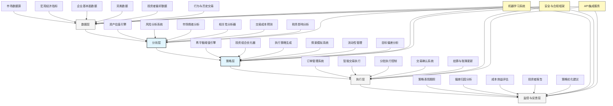

---
{"dg-publish":true,"tags":["AI财务应用","资产管理","投资组合","自动再平衡","智能投顾"],"创建日期":"2024-04-29","permalink":"/知识共享/001_财务/03_AI与财务应用/06_行业智能财务应用/6.2 金融服务业应用/资产组合自动再平衡/","dgPassFrontmatter":true}
---

## 技术概述

资产组合自动再平衡系统是人工智能与投资管理深度融合的前沿应用，通过集成先进的量化模型、预测算法与自动化执行技术，实现对投资组合的智能化、持续性优化调整。该系统超越传统的被动式再平衡方法，基于市场动态、风险因子变化和投资目标，主动识别最优平衡点和时机，精准执行必要的资产配置调整，同时考虑交易成本、税务影响和流动性约束，为机构和个人投资者提供全天候的资产优化管理。

### 核心技术组件

- **多因子投资模型**：整合宏观经济、市场动态、行业趋势等多维因子，构建动态资产估值框架
- **智能风险分析引擎**：运用高级统计和机器学习技术，实时评估不同维度的风险暴露和互相关性
- **预测性市场分析**：应用时间序列预测和自然语言处理技术，提取市场信号和趋势预判
- **自适应阈值系统**：基于历史波动性和当前市场状况，动态设定再平衡触发条件
- **多目标优化引擎**：平衡风险、回报、成本和约束条件，生成最优调整方案
- **情景模拟分析器**：通过蒙特卡洛模拟和压力测试，评估不同再平衡策略在极端情况下的表现
- **自动执行系统**：整合智能交易算法，优化执行时机和方式，降低交易成本和市场影响

### 与传统再平衡方法对比

| 维度 | 传统再平衡方法 | 资产组合自动再平衡系统 |
|------|--------------|----------------------|
| 触发机制 | 固定时间周期或固定阈值 | 智能动态阈值与多因素综合判断 |
| 执行频率 | 低频（季度/年度）或简单规则触发 | 最优频率智能决策，根据市场状态自适应 |
| 优化范围 | 简单权重恢复至目标配置 | 全局最优解考虑多维约束条件 |
| 交易成本考量 | 简单估算或事后评估 | 交易成本内置于优化模型，实时考量 |
| 市场时机把握 | 忽略或依赖人工判断 | 数据驱动的最佳交易时机识别 |
| 税务影响分析 | 极少考虑或简单处理 | 税务优化集成于决策过程 |
| 风险敏感度 | 静态风险评估 | 动态、多维度风险监控与响应 |
| 个性化程度 | 标准化方案，有限定制 | 高度个性化，适应不同投资者需求与偏好 |
| 学习能力 | 无自主学习功能 | 持续学习历史表现并优化未来决策 |

## 系统架构

## 实施方案

### 技术实施路线图

1. **基础建设阶段**（3-4个月）
   - 数据集成框架构建
   - 市场数据接口开发
   - 核心分析模块设计
   - 安全与合规框架建立

2. **核心功能开发阶段**（4-6个月）
   - 资产估值模型实现
   - 风险分析引擎开发
   - 基础优化算法构建
   - 阈值触发系统搭建

3. **高级功能与集成阶段**（3-5个月）
   - 自动执行系统开发
   - 高级优化算法实现
   - 情景分析模块构建
   - 与交易系统集成

4. **智能优化阶段**（持续进行）
   - 机器学习模型优化
   - 策略效果持续评估
   - 新资产类别支持扩展
   - 高级场景化应用开发

### 技术依赖与资源需求

- **硬件资源**：高性能计算服务器、低延迟网络基础设施、冗余存储系统
- **软件平台**：量化分析框架、机器学习库、优化算法库、市场数据处理平台
- **数据需求**：实时市场数据、宏观经济指标、资产特性数据、历史交易数据、投资者偏好
- **技术人才**：量化分析师、机器学习专家、投资策略师、金融工程师、系统架构师

### 潜在挑战与应对策略

| 挑战 | 应对策略 |
|------|---------|
| 市场数据质量与延迟 | 建立多源数据验证机制，开发异常识别系统，部署边缘计算减少延迟 |
| 模型风险与过拟合 | 实施严格的模型验证，采用集成学习减少单一模型依赖，定期回测与评估 |
| 极端市场情况适应性 | 开发特殊市场条件检测，构建防御性调整机制，设计降级执行策略 |
| 交易执行滑点控制 | 优化智能交易算法，开发流动性预测模型，实施分批执行框架 |
| 计算资源需求峰值 | 部署弹性计算架构，实施任务优先级调度，优化算法效率 |
| 监管与合规要求 | 设计内置合规检查，建立审计追踪系统，开发自动报告生成工具 |

## 价值创造

### 量化效益评估

- **投资回报优化**：通过精准的资产配置与市场时机把握，提升年化风险调整后收益1.5-3.0%
- **风险控制增强**：降低投资组合波动性10-20%，减少下行风险暴露15-25%
- **交易成本降低**：优化交易策略与执行，减少交易成本和市场影响20-35%
- **税务效益提升**：通过税务敏感再平衡策略，提高税后收益0.3-0.8%
- **运营效率提升**：自动化资产再平衡流程，减少人工决策时间80-95%
- **投资容量扩展**：系统可同时管理的资产组合增加5-10倍，实现规模经济

### ROI与成本效益分析

| 投资领域 | 投资规模估算 | 回报周期 | 预期ROI |
|---------|------------|---------|---------|
| 数据与分析基础设施 | 200-400万元 | 12-18个月 | 150-250% |
| 策略与优化引擎 | 300-500万元 | 15-24个月 | 200-350% |
| 自动执行系统 | 150-300万元 | 9-15个月 | 250-400% |
| 监控与评估平台 | 100-200万元 | 12-18个月 | 150-200% |
| 全系统实施 | 750-1400万元 | 18-30个月 | 200-300% |

*注：具体ROI取决于管理资产规模、市场环境和组织执行能力*

### 竞争优势与创新价值

- **市场时机把握**：精准识别再平衡最优时机，避免不必要交易
- **全局最优决策**：综合考量所有相关因素，而非单一维度决策
- **动态风险管理**：持续监控风险敞口，预防潜在风险积累
- **高效资本利用**：优化资本配置，提高资金使用效率
- **规模化个性定制**：大规模提供个性化投资方案
- **持续学习机制**：基于历史表现不断优化决策模型

## 未来演进

### 技术迭代路线图

1. **近期（1-2年）**
   - 扩展另类资产与衍生品支持
   - 增强ESG因素整合
   - 开发高级税务优化策略
   - 提升极端市场响应能力

2. **中期（2-3年）**
   - 整合链上资产与DeFi策略
   - 开发动态因子模型自适应系统
   - 构建跨资产类别相关性预测
   - 研发个人化风险偏好学习

3. **远期（3-5年）**
   - 建立投资组合数字孪生
   - 开发自主决策投资管理代理
   - 构建市场反身性模型
   - 整合量子计算优化技术

### 与未来技术趋势结合点

- **区块链与智能合约**：实现自动执行交易，提高透明度和效率
- **分布式计算**：扩展计算能力，支持更复杂的优化与模拟
- **量子计算**：用于解决难以处理的多目标投资组合优化问题
- **强化学习**：开发能适应变化市场环境的自适应策略
- **边缘AI**：在数据源头进行初步分析，降低延迟，提高响应速度

### 扩展应用场景

- **机构资产管理**：养老金、主权财富基金的长期资产配置优化
- **财富管理平台**：为高净值客户提供智能化资产管理服务
- **ETF与指数产品**：优化指数追踪与效率，降低跟踪误差
- **风险平价策略**：自动维持多资产风险贡献平衡
- **目标日期基金**：动态调整风险暴露以匹配时间目标

## 实验验证

### 概念验证(POC)方案

1. **范围界定**：
   - 选择特定资产类别组合（如股票、债券、商品）
   - 确定关键绩效指标（收益、风险、成本）
   - 设定明确的基准对比标准

2. **技术架构简化**：
   - 构建核心优化算法原型
   - 集成主要市场数据源
   - 开发基础回测框架

3. **实施步骤**：
   - 第1-4周：数据接口开发与历史数据收集
   - 第5-8周：再平衡策略建模与回测环境搭建
   - 第9-12周：优化算法开发与参数调整
   - 第13-16周：执行模拟与性能评估
   - 第17-20周：结果分析与策略优化

### 评估指标设计

| 类别 | 指标 | 目标值 |
|------|------|-------|
| 绩效指标 | 风险调整后收益(Sharpe) | >传统方法20% |
| | 最大回撤 | 降低>15% |
| | 跟踪误差控制 | <1.0% |
| 运营效率 | 资产覆盖能力 | >传统方法3倍 |
| | 决策周期 | 减少>90% |
| | 人工干预需求 | 降低>80% |
| 成本效益 | 交易成本 | 降低>25% |
| | 税务效率 | 提升>15% |
| | 系统运行成本 | <AUM的0.05% |

### 循证迭代策略

1. **测试方法**：
   - 历史数据回测
   - 模拟市场环境测试
   - 影子运行对比

2. **数据收集机制**：
   - 策略表现持续监控
   - 交易成本详细记录
   - 与基准策略对比分析

3. **迭代周期**：
   - 每周策略评估会议
   - 每月参数优化与调整
   - 季度全面策略审核

4. **成功标准**：
   - 技术可行性：系统稳定运行，决策可靠
   - 投资绩效：超越传统方法，达成风险收益目标
   - 扩展能力：具备扩展至更广泛资产类别和规模的潜力 