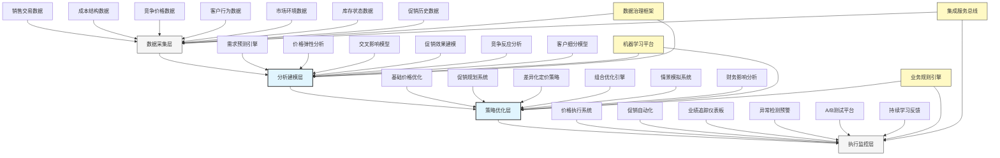

---
{"dg-publish":true,"tags":["AI财务应用","定价策略","促销效果","零售财务","收益管理"],"创建日期":"2024-04-29","permalink":"/知识共享/001_财务/03_AI与财务应用/06_行业智能财务应用/6.3 零售与消费品应用/智能定价与促销分析/","dgPassFrontmatter":true}
---

## 技术概述

智能定价与促销分析系统是融合人工智能与财务科学的尖端应用，专为零售与消费品企业设计，旨在实现定价策略与促销活动的全面优化与精准量化。该系统突破传统定价方法的局限性，建立多维度、动态化的价格决策框架，通过整合市场数据、竞争情报、消费者行为与成本结构，构建全方位的定价模型。系统能够预测价格敏感度、模拟促销效果、发现最优定价点位，并精确量化促销活动的真实财务影响，帮助企业平衡销量增长与利润提升，实现收入管理的科学化与智能化，大幅提升市场竞争力与财务表现。

### 核心技术组件

- **动态需求预测引擎**：整合多源数据预测不同价格点位的销量反应曲线
- **价格弹性建模系统**：精确计算产品与品类层级的价格敏感度与交叉弹性
- **竞争价格智能监测**：实时追踪竞争对手价格变动并评估影响
- **促销效果归因模型**：分离促销真实增量效果与基础销售和其他因素影响
- **多维促销ROI分析**：全面评估促销对销量、收入、毛利和品牌价值的影响
- **个性化价格优化**：基于客户细分实现差异化定价策略
- **价格策略仿真平台**：模拟不同定价与促销组合的市场反应和财务后果
- **整合利润影响分析**：评估价格变动对全产品组合和供应链的财务影响

### 与传统定价方法对比

| 维度 | 传统定价方法 | 智能定价与促销分析 |
|------|------------|-----------------|
| 决策基础 | 历史经验和简单成本加成 | 多元数据驱动的科学分析 |
| 分析深度 | 产品孤立分析，忽略交互影响 | 整体产品组合优化，考虑交叉效应 |
| 市场响应 | 静态假设，有限测试 | 动态模拟，持续学习与优化 |
| 竞争因素 | 简单跟踪，反应式调整 | 预测性分析，前瞻式策略 |
| 促销评估 | 简单销量比较，缺乏归因分析 | 精准增量影响量化，全面ROI评估 |
| 客户差异 | 统一定价，有限细分 | 高度个性化，动态微分定价 |
| 执行速度 | 周期性调整，响应缓慢 | 实时优化，快速市场适应 |
| 学习能力 | 有限积累，依赖人工总结 | 自动化学习，持续模型优化 |

## 系统架构

## 实施方案

### 技术实施路线图

1. **基础数据与模型构建阶段**（2-3个月）
   - 建立多源数据集成架构
   - 开发基础需求预测模型
   - 构建初步价格弹性分析
   - 实现竞争价格监测系统

2. **核心分析能力构建阶段**（3-4个月）
   - 开发促销效果归因模型
   - 实现交叉价格影响分析
   - 构建客户细分与响应模型
   - 开发基础策略优化引擎

3. **高级功能与集成阶段**（2-3个月）
   - 构建情景模拟与分析平台
   - 开发完整财务影响评估
   - 实现差异化定价框架
   - 建立执行与监控系统

4. **智能化与优化阶段**（持续进行）
   - 增强模型自学习能力
   - 扩展优化场景覆盖
   - 提升实时决策能力
   - 优化用户体验与可用性

### 技术依赖与资源需求

- **硬件资源**：高性能分析服务器、分布式计算集群、大容量存储系统
- **软件平台**：高级分析工具、机器学习框架、数据可视化平台、价格管理系统
- **数据需求**：销售交易记录、促销活动历史、成本结构数据、竞争价格数据、客户行为数据
- **技术人才**：数据科学家、价格策略专家、机器学习工程师、财务分析师、零售领域专家

### 潜在挑战与应对策略

| 挑战 | 应对策略 |
|------|---------|
| 数据质量与完整性 | 建立数据验证框架，开发异常检测算法，实施缺失数据补充技术 |
| 多因素影响隔离 | 设计对照组实验，应用高级归因模型，实施因果推断技术 |
| 复杂交互效应 | 开发整体优化模型，应用网络效应分析，实施组合测试策略 |
| 市场动态变化 | 构建持续学习框架，实施快速反馈机制，开发情景适应模型 |
| 执行一致性 | 建立价格策略协调中心，开发自动化执行工具，实施合规检查机制 |
| ROI证明困难 | 设计精确效果测量框架，实施增量影响分析，开发对比基准模型 |

## 价值创造

### 量化效益评估

- **毛利率提升**：通过优化定价策略，提高整体毛利率2-5个百分点
- **促销效率改善**：提高促销投资回报率25-40%，减少低效促销支出
- **价格灵活性提升**：将价格调整响应时间从天/周缩短至小时/分钟级
- **收入增长**：通过优化定价组合，提升销售收入3-8%
- **库存周转改善**：通过动态定价策略，提高库存周转率15-25%
- **客户价值提升**：通过个性化定价，提高客户满意度和忠诚度10-20%
- **预测准确度提高**：降低销量预测误差30-50%，改善资源规划效率

### ROI与成本效益分析

| 投资领域 | 投资规模估算 | 预期回报周期 | 投资回报率 |
|---------|------------|------------|---------|
| 数据基础设施 | 150-300万元 | 6-10个月 | 250-400% |
| 分析模型与引擎 | 200-400万元 | 8-14个月 | 300-500% |
| 优化与执行系统 | 150-300万元 | 4-8个月 | 350-600% |
| 监控与报告平台 | 100-200万元 | 3-6个月 | 200-300% |
| 全系统实施 | 600-1200万元 | 10-16个月 | 300-450% |

*注：ROI基于中型零售企业估算，实际结果因产品组合复杂度、市场竞争程度及价格灵活性而异*

### 竞争优势与创新价值

- **精准价值捕获**：最大化每个产品和客户细分的收入潜力
- **动态市场应对**：快速响应市场变化和竞争威胁
- **科学促销规划**：基于数据的促销决策，消除猜测性投入
- **全局最优定价**：考虑产品间关系，实现整体收益最大化
- **战略定价能力**：从战术反应转向战略主导的定价方法
- **增长与盈利平衡**：有效权衡市场份额与利润目标的平衡点

## 未来演进

### 技术迭代路线图

1. **近期（1-2年）**
   - 整合更多外部市场信号
   - 提升跨产品关联分析能力
   - 增强长期价格策略规划
   - 开发高级促销组合优化

2. **中期（2-3年）**
   - 实现实时动态定价能力
   - 发展预测性竞争响应模型
   - 构建全渠道协同定价框架
   - 开发端到端价值链定价优化

3. **远期（3-5年）**
   - 建立自主价格策略智能体
   - 实现全自动化促销优化
   - 发展预见性市场机会识别
   - 构建生态系统定价协同网络

### 与未来技术趋势结合点

- **边缘计算**：实现店内实时定价决策与个性化优惠
- **增强现实**：创建互动式价格体验和价值展示
- **区块链技术**：提供透明的动态定价记录与审计
- **物联网集成**：利用货架传感器实时调整电子价签
- **生成式AI**：自动创建情境化促销信息与优惠方案

### 扩展应用场景

- **会员价值定价**：基于客户终身价值的个性化价格策略
- **捆绑产品优化**：科学设计和动态调整产品组合定价
- **季节性定价策略**：优化季节性商品全生命周期价格曲线
- **新品上市定价**：数据驱动的新产品价格策略制定
- **清仓库存优化**：精准计算最佳清仓折扣力度与时机

## 实验验证

### 概念验证(POC)方案

1. **范围界定**：
   - 选择特定产品类别
   - 聚焦2-3种定价策略测试
   - 设定明确的评估指标

2. **技术架构简化**：
   - 构建基础价格弹性模型
   - 开发简化促销影响分析
   - 实现有限情景模拟能力

3. **实施步骤**：
   - 第1-3周：数据收集与准备
   - 第4-6周：基础模型构建
   - 第7-9周：策略设计与模拟
   - 第10-12周：小规模测试与分析

### 评估指标设计

| 类别 | 指标 | 目标值 |
|------|------|-------|
| 预测准确性 | 需求预测误差 | <15% |
| | 价格弹性计算准确度 | >85% |
| | 促销效果预测准确率 | >80% |
| 业务影响 | 毛利率提升 | >3% |
| | 促销ROI改善 | >25% |
| | 收入增长 | >4% |
| 运营效果 | 价格决策时间缩短 | >75% |
| | 价格错误减少 | >60% |
| | 策略执行一致性 | >90% |

### 循证迭代策略

1. **测试方法**：
   - A/B测试与控制组设计
   - 滚动测试与验证
   - 同店销售比较分析

2. **数据收集机制**：
   - 销售结果实时跟踪
   - 客户反应监测
   - 竞争响应记录

3. **迭代优化流程**：
   - 每周绩效指标回顾
   - 每两周策略微调
   - 每月模型更新与优化

4. **成功验收标准**：
   - 技术可行性：系统稳定可靠，预测准确
   - 业务价值：实现明确的财务改善指标
   - 用户接受度：营销、财务与商品团队积极采用 