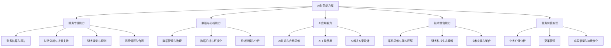

---
{"dg-publish":true,"tags":["AI财务应用","技能矩阵","能力建设","数字化人才","职业发展"],"created":"2024-04-29","permalink":"/知识共享/001_财务/03_AI与财务应用/07_实施与转型策略/7.2 人才与能力建设/AI财务技能矩阵设计/","dgPassFrontmatter":true}
---

# AI财务技能矩阵设计

## 1. 技能矩阵概述

### 1.1 设计目标

AI财务技能矩阵旨在系统化定义和评估财务数字化转型过程中所需的关键能力，为组织提供：
- 明晰的能力标准和评估维度
- 差距分析的基础工具
- 人才发展和培训的指导框架
- 招聘与选拔的能力参考模型
- 职业发展路径规划的基础

### 1.2 矩阵维度设计

本技能矩阵采用双维度设计：
- **纵向维度**：能力类别与领域分类
- **横向维度**：能力水平与熟练度等级

## 2. 能力域与关键能力

### 2.1 核心能力域划分

### 2.2 关键能力详解

#### 财务专业能力

| 能力子域 | 关键能力点 | 能力描述 |
|---------|-----------|---------|
| 财务核算与报告 | 智能化会计处理 | 理解并应用智能化会计处理技术，如自动化记账、智能审核等 |
|  | 数字化财务报告 | 设计和生成数字化财务报表，应用交互式分析和可视化 |
| 财务分析与决策支持 | 高级财务分析 | 应用高级分析方法进行财务数据挖掘和模式识别 |
|  | 智能决策支持 | 设计并应用基于AI的决策支持系统和模型 |
| 财务规划与预测 | 智能预测建模 | 构建和应用基于机器学习的预测模型 |
|  | 情景分析与模拟 | 设计和应用多变量情景分析和预测模拟 |
| 风险管理与合规 | 智能风险监控 | 应用AI技术进行风险识别、评估和监控 |
|  | 自动化合规检查 | 设计和实施自动化合规检查和预警系统 |

#### 数据与分析能力

| 能力子域 | 关键能力点 | 能力描述 |
|---------|-----------|---------|
| 数据管理与治理 | 财务数据架构 | 设计适合AI应用的财务数据架构和数据模型 |
|  | 数据质量管理 | 实施数据质量控制和治理机制 |
| 数据分析与可视化 | 分析工具应用 | 熟练应用数据分析工具进行财务数据处理和分析 |
|  | 高效数据可视化 | 设计富有洞察力的财务数据可视化和仪表板 |
| 统计建模与分析 | 统计方法应用 | 应用适当的统计方法解决财务分析问题 |
|  | 数据挖掘技术 | 应用数据挖掘技术发现财务数据中的模式和关系 |

#### AI应用能力

| 能力子域 | 关键能力点 | 能力描述 |
|---------|-----------|---------|
| AI认知与应用思维 | AI基础理解 | 理解AI核心概念、类型和应用场景 |
|  | AI应用思维 | 识别适合AI应用的财务场景和问题 |
| AI工具使用 | 预制AI工具应用 | 熟练应用现有AI工具解决财务问题 |
|  | 低代码平台应用 | 使用低代码平台定制AI解决方案 |
| AI解决方案设计 | 问题定义与解构 | 将财务问题解构为适合AI解决的形式 |
|  | 解决方案规划 | 规划AI解决方案的架构和实施路径 |

#### 技术整合能力

| 能力子域 | 关键能力点 | 能力描述 |
|---------|-----------|---------|
| 系统思维与架构理解 | 系统架构理解 | 理解企业系统架构和财务系统技术原理 |
|  | 集成思维 | 理解系统间数据流和集成原则 |
| 财务科技生态理解 | 技术趋势洞察 | 跟踪财务科技发展趋势并评估应用价值 |
|  | 生态系统理解 | 理解财务科技生态系统和主要参与者 |
| 技术实现与整合 | 需求转化与沟通 | 将业务需求转化为技术需求并有效沟通 |
|  | 项目实施与管理 | 管理AI财务项目实施过程与风险 |

#### 业务价值实现

| 能力子域 | 关键能力点 | 能力描述 |
|---------|-----------|---------|
| 业务价值分析 | 商业案例构建 | 构建AI财务应用的商业案例和价值分析 |
|  | 投资回报评估 | 设计和应用投资回报评估方法和指标 |
| 变革管理 | 组织变革引导 | 设计和实施变革管理策略和计划 |
|  | 利益相关方管理 | 管理利益相关方期望和参与 |
| 成果衡量与持续优化 | 效果评估 | 设计和实施AI项目效果评估框架 |
|  | 持续优化 | 建立并实施持续改进和优化机制 |

## 3. 能力水平与等级划分

### 3.1 五级能力等级框架

| 等级 | 等级名称 | 能力特征 | 典型角色 |
|-----|---------|---------|---------|
| L1 | 基础认知级 | 了解基本概念和应用场景 能在指导下使用工具和方法 具备基础术语理解 | 初级财务人员 财务助理 |
| L2 | 应用操作级 | 能独立应用工具和方法 理解应用原理和限制 能处理常规问题和场景 | 财务分析师 高级财务助理 |
| L3 | 高级应用级 | 能设计和优化应用方案 应对复杂问题和场景 指导他人使用工具和方法 | 高级财务分析师 财务业务伙伴 |
| L4 | 专家设计级 | 主导解决方案设计 解决创新性问题 整合多领域知识和技术 | 财务数字化经理 财务解决方案专家 |
| L5 | 战略领导级 | 规划战略方向 推动创新和变革 建立最佳实践和标准 | 财务数字化总监 首席财务技术官 |

### 3.2 能力评估标准

每个能力点按以下五个维度进行评估：

1. **知识掌握度**：对相关概念、原理和方法的理解深度
2. **应用熟练度**：在实际工作中运用的流畅性和效率
3. **解决问题能力**：应对相关领域问题的能力水平
4. **创新提升能力**：改进现有方法和创造新方法的能力
5. **知识传播能力**：向他人传授相关知识和技能的能力

## 4. 完整技能矩阵

### 4.1 财务专业人员AI技能矩阵

| 能力域/等级 | L1-基础认知级 | L2-应用操作级 | L3-高级应用级 | L4-专家设计级 | L5-战略领导级 |
|------------|--------------|--------------|--------------|--------------|--------------|
| **财务核算与报告** | 理解智能会计基本概念 能使用自动化记账工具 | 应用智能记账和审核工具 生成基础数字化报表 | 设计智能化会计流程 开发高级数字化报表 | 主导智能会计体系设计 构建创新报表分析系统 | 规划财务数字化战略 引领报告创新方向 |
| **财务分析与决策支持** | 理解基础分析方法 使用标准分析工具 | 应用多种分析工具 进行基础决策分析 | 设计高级分析模型 构建决策支持系统 | 开发创新分析框架 主导智能决策系统构建 | 建立分析最佳实践 引领决策支持变革 |
| **数据管理与分析** | 掌握基础数据处理 使用简单可视化工具 | 应用数据分析工具 创建交互式仪表板 | 设计数据分析方案 开发高级可视化模型 | 构建分析架构 主导高级分析项目 | 制定数据战略 引领分析创新 |
| **AI应用能力** | 了解AI基本概念 使用预置AI工具 | 应用AI工具解决问题 理解应用限制 | 设计AI应用方案 评估技术可行性 | 主导AI解决方案开发 整合多种AI技术 | 规划AI应用路线图 推动组织AI转型 |
| **业务价值实现** | 理解价值评估基本概念 参与变革活动 | 应用价值评估方法 支持变革实施 | 构建商业案例 设计变革管理方案 | 主导投资回报分析 领导变革项目 | 建立价值评估体系 引领组织变革 |

### 4.2 技术人员财务知识矩阵

| 能力域/等级 | L1-基础认知级 | L2-应用操作级 | L3-高级应用级 | L4-专家设计级 | L5-战略领导级 |
|------------|--------------|--------------|--------------|--------------|--------------|
| **财务基础知识** | 理解基本财务概念 了解财务报表结构 | 掌握财务分析基础 理解财务流程 | 深入理解财务管理 掌握高级财务分析 | 整合财务与技术视角 设计财务分析框架 | 构建财务技术融合视角 引领财务创新 |
| **财务业务流程** | 了解核心财务流程 识别基本流程环节 | 分析流程运作机制 识别优化机会 | 设计流程优化方案 评估技术应用点 | 主导流程重构 设计智能化流程架构 | 规划流程创新战略 建立最佳实践 |
| **财务数据理解** | 了解财务数据类型 识别基础数据关系 | 分析财务数据结构 建立数据映射 | 设计财务数据模型 构建数据关联分析 | 设计综合数据架构 开发数据整合方案 | 规划财务数据战略 引领数据创新 |
| **财务应用场景** | 了解基本应用场景 识别场景特点 | 分析场景技术需求 评估应用价值 | 设计场景解决方案 规划实施路径 | 创新应用场景设计 整合多技术方案 | 规划战略场景布局 引领创新应用 |
| **财务价值评估** | 了解基本评估方法 识别价值维度 | 应用评估工具 分析投入产出 | 设计评估框架 构建价值模型 | 开发创新评估方法 主导价值分析 | 建立价值评估体系 引领价值创造 |

## 5. 矩阵应用指南

### 5.1 评估与差距分析

1. **个人能力评估方法**
   - 能力自评问卷设计
   - 主管评估标准与流程
   - 多维度能力评估体系

2. **组织能力差距分析**
   - 现状调研与基线设定
   - 目标能力模型定义
   - 差距分析与可视化展示

3. **评估工具集**
   - 能力评估问卷模板
   - 在线评估平台设计
   - 能力雷达图生成工具

### 5.2 发展规划设计

1. **个人发展路径规划**
   - 当前能力定位分析
   - 目标角色能力需求分析
   - 个性化发展计划制定

2. **团队能力建设规划**
   - 团队能力构成分析
   - 关键能力提升重点
   - 互补型团队构建策略

3. **发展资源匹配**
   - 学习资源推荐体系
   - 发展活动设计框架
   - 导师匹配机制

### 5.3 人才管理与激励

1. **基于矩阵的招聘选拔**
   - 岗位能力需求定义
   - 面试评估框架设计
   - 能力匹配度分析方法

2. **能力导向的绩效评估**
   - 能力目标设定方法
   - 能力进步评估框架
   - 能力与绩效关联机制

3. **能力导向的激励机制**
   - 能力提升认证体系
   - 能力导向的薪酬设计
   - 能力发展荣誉体系

## 6. 矩阵维护与更新

### 6.1 常态化更新机制

1. **定期审核与调整流程**
   - 年度矩阵审核机制
   - 更新提案与评审流程
   - 变更管理与沟通机制

2. **技术趋势响应机制**
   - 新兴技术监测渠道
   - 能力需求预测方法
   - 快速更新通道设计

3. **最佳实践整合**
   - 内部实践案例收集
   - 外部标准对标分析
   - 实践转化为能力定义

### 6.2 矩阵工具与支持系统

1. **矩阵数字化管理平台**
   - 矩阵内容管理系统
   - 评估与分析功能
   - 个人发展规划工具

2. **与人才管理系统集成**
   - 与学习平台集成
   - 与招聘系统集成
   - 与绩效系统集成

## 7. 实施案例与最佳实践

### 7.1 实施案例分享

**案例一：大型制造企业财务团队转型**
- 背景：传统财务团队面临数字化转型挑战
- 应用：基于矩阵进行能力评估，设计定制化培训项目
- 结果：6个月内团队数字化能力提升35%，成功实施3个AI应用项目

**案例二：金融机构建立数字财务人才发展中心**
- 背景：建立财务与技术融合的卓越中心
- 应用：基于矩阵设计人才标准和认证体系
- 结果：建立完整认证体系，认证200+人才，孵化15个创新项目

### 7.2 实施建议与关键成功因素

1. **高层支持与资源保障**
   - 获取领导层支持
   - 确保资源充分投入
   - 建立清晰的责任机制

2. **渐进式实施策略**
   - 从试点部门开始
   - 以关键角色为切入点
   - 循序渐进扩大应用范围

3. **文化建设与变革管理**
   - 创建持续学习文化
   - 建立能力发展激励机制
   - 配套变革沟通计划 