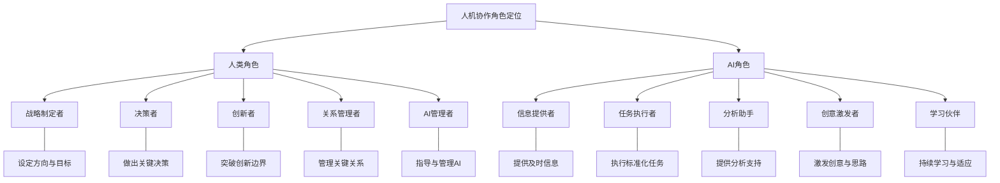
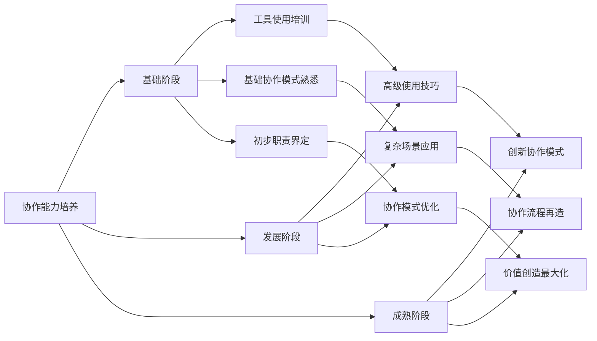

---
{"dg-publish":true,"tags":["AI财务应用","人机协作","工作流优化","角色定位","生产力提升"],"created":"2024-04-29","permalink":"/知识共享/001_财务/03_AI与财务应用/07_实施与转型策略/7.2 人才与能力建设/人机协作最佳实践/","dgPassFrontmatter":true}
---


# 财务领域人机协作最佳实践

## 1. 人机协作模式概述

### 1.1 协作理念与基本原则

人机协作是AI时代财务转型的核心模式，其基本理念是充分发挥人类和AI各自的优势，实现"1+1>2"的协同效果。协作应遵循以下原则：

- **互补性原则**：聚焦人类与AI各自优势领域，形成能力互补
- **增强性原则**：AI应作为人类能力的增强工具，而非简单替代
- **适应性原则**：协作模式应根据具体场景和成熟度灵活调整
- **进化性原则**：协作模式应随技术发展和人员适应能力不断优化
- **以人为本原则**：最终决策权和责任应保留在人类手中

### 1.2 人机优势分析

| 维度 | 人类优势 | AI优势 | 协作价值 |
|-----|---------|--------|---------|
| 思维特点 | 直觉思维<br>创造性思维<br>批判性思维<br>跨领域思维 | 逻辑推理<br>模式识别<br>概率思维<br>大规模计算 | 结合直觉与逻辑<br>增强创造力<br>优化决策质量 |
| 认知能力 | 常识理解<br>情境理解<br>抽象概念理解<br>价值判断 | 海量信息处理<br>多维数据分析<br>无偏见分析<br>快速学习 | 提升信息处理效率<br>深化分析洞察<br>减少认知偏差 |
| 工作特性 | 战略规划<br>创新设计<br>沟通协调<br>关系管理 | 重复任务执行<br>数据处理<br>模式识别<br>全天候运行 | 释放创造性时间<br>提高工作准确性<br>扩展工作能力边界 |
| 应用场景 | 不确定情境决策<br>价值权衡<br>创新突破<br>变革管理 | 标准化流程<br>海量数据分析<br>重复性任务<br>风险监测 | 聚焦高价值工作<br>提升决策质量<br>释放创新潜能 |

## 2. 协作角色定位与工作设计

### 2.1 人机角色定位框架



### 2.2 财务场景人机分工指南

| 财务流程 | 人类职责 | AI职责 | 协作方式 |
|---------|---------|--------|---------|
| **财务规划与预算** | 确定战略优先级<br>设定关键假设<br>审批预算方案<br>协调跨部门关系 | 历史数据分析<br>多情景模拟<br>预算差异监测<br>自动化数据整合 | 人类定方向与假设<br>AI生成初始方案<br>人类审核与调整<br>AI执行监测与报告 |
| **财务分析与报告** | 确定分析框架<br>解读关键洞察<br>制定行动建议<br>呈现战略影响 | 数据收集与清洗<br>标准分析执行<br>异常值识别<br>报告自动生成 | 人类确定分析需求<br>AI执行分析过程<br>人类解读与深化<br>AI辅助呈现与传达 |
| **风险管理与合规** | 设定风险偏好<br>评估重大风险<br>制定应对策略<br>管理利益相关方 | 连续风险监测<br>合规检查自动化<br>风险关联分析<br>预警信号生成 | 人类定义监控框架<br>AI执行持续监控<br>人类评估与决策<br>AI提供情报支持 |
| **交易处理与记账** | 制定会计政策<br>处理复杂交易<br>审核关键账项<br>解决特殊情况 | 常规交易处理<br>自动化分录生成<br>一致性检查<br>文档智能提取 | 人类处理例外情况<br>AI处理常规交易<br>人类审核关键事项<br>AI执行基础检查 |
| **财务决策支持** | 理解业务问题<br>设计决策框架<br>制定最终决策<br>承担决策责任 | 提供相关信息<br>执行情景分析<br>生成决策选项<br>估算决策影响 | 人类定义决策问题<br>AI提供决策支持<br>人类做出选择<br>AI跟踪决策效果 |

### 2.3 人机协作工作流设计原则

1. **清晰的交接点设计**
   - 明确人类与AI交互的时机与方式
   - 定义清晰的输入输出标准
   - 建立有效的交互反馈循环

2. **适当的人工干预机制**
   - 设定自动化与人工干预的阈值
   - 建立异常情况上报机制
   - 确保人类对关键环节的监督

3. **持续学习与改进循环**
   - 收集协作效果数据
   - 定期分析改进机会
   - 实施迭代优化策略

## 3. 协作能力建设

### 3.1 人类技能提升重点

1. **AI协作专业能力**
   - AI工具操作技能
   - 提示工程能力
   - AI输出评估能力
   - AI限制理解能力

2. **高阶认知技能**
   - 战略思维能力
   - 创造性问题解决
   - 系统思考能力
   - 逻辑与批判性思维

3. **情商与人际能力**
   - 沟通与表达能力
   - 冲突管理能力
   - 影响力与说服力
   - 团队协作能力

### 3.2 AI能力发展方向

1. **上下文理解能力**
   - 财务专业知识融入
   - 企业特定信息整合
   - 多源信息理解能力
   - 历史交互记忆能力

2. **智能协作能力**
   - 自适应交互模式
   - 个性化响应能力
   - 主动学习能力
   - 反馈接收与调整能力

3. **安全性与可靠性**
   - 输出一致性保障
   - 风险识别与控制
   - 偏见减少机制
   - 隐私保护能力

### 3.3 协作能力培养路径



## 4. 主要协作场景最佳实践

### 4.1 财务分析与决策支持

#### 4.1.1 协作模式设计

**基本流程**：
1. 人类定义分析问题和决策需求
2. AI收集相关数据并执行初步分析
3. 人类审核分析结果并提出深入问题
4. AI执行深度分析并生成决策选项
5. 人类评估选项并制定最终决策
6. AI跟踪决策执行效果并提供反馈

**关键成功因素**：
- 明确的分析框架与假设条件
- 人类对AI分析逻辑的理解
- 持续的人机对话与迭代改进
- 适当的分析透明度与可解释性

#### 4.1.2 实践案例与工具应用

**案例：投资决策分析**
- 人类定义投资标准与风险偏好
- AI筛选匹配项目并执行初步分析
- 人类识别关键考虑因素
- AI执行深度情景分析与敏感性测试
- 人类综合考量做出最终决策
- AI持续监测投资表现并提供预警

**推荐工具与方法**：
- 交互式财务模型工具
- 多情景分析框架
- 结构化决策流程设计
- 决策追踪与评估机制

### 4.2 智能财务报告与分析

#### 4.2.1 协作模式设计

**基本流程**：
1. 人类确定报告框架与关键指标
2. AI自动收集数据并生成初步报告
3. 人类审核并提出深入分析需求
4. AI执行深度分析并识别关键模式
5. 人类解读洞察并制定行动建议
6. AI自动更新与分发报告

**关键成功因素**：
- 清晰的报告标准与质量要求
- 有效的异常值处理机制
- 适当的分析深度与广度平衡
- 良好的数据可视化与叙事能力

#### 4.2.2 实践案例与工具应用

**案例：月度业绩分析报告**
- 人类定义关键绩效指标与分析维度
- AI自动收集数据并生成标准分析
- 人类审核并确定深入分析方向
- AI执行异常分析与原因推断
- 人类验证发现并提出管理建议
- AI生成最终报告并实现个性化分发

**推荐工具与方法**：
- 自动化报告生成平台
- 交互式数据可视化工具
- 智能异常检测算法
- 叙事型报告生成技术

### 4.3 预测分析与财务规划

#### 4.3.1 协作模式设计

**基本流程**：
1. 人类确定预测目标与关键变量
2. AI分析历史数据并构建初始模型
3. 人类评估模型关键假设并调整
4. AI生成多情景预测结果
5. 人类解读结果并制定应对策略
6. AI监测实际结果与预测差异

**关键成功因素**：
- 适当的模型复杂度控制
- 关键假设的清晰定义与验证
- 有效的不确定性处理机制
- 预测结果的可操作性设计

#### 4.3.2 实践案例与工具应用

**案例：现金流预测与管理**
- 人类确定现金流关键驱动因素
- AI构建预测模型并分析历史模式
- 人类评估业务环境变化因素
- AI生成多情景现金流预测
- 人类制定资金管理策略
- AI持续监测实际现金流与预警

**推荐工具与方法**：
- 混合预测模型框架
- 概率预测与区间分析
- 情景规划矩阵
- 预测精度追踪系统

### 4.4 智能审计与风险监控

#### 4.4.1 协作模式设计

**基本流程**：
1. 人类确定风险监控框架与标准
2. AI执行连续监控与异常检测
3. 人类审核预警信号并确定调查方向
4. AI收集相关证据并初步分析
5. 人类评估风险并制定应对策略
6. AI跟踪风险缓解措施效果

**关键成功因素**：
- 明确的风险标准与监控范围
- 有效的预警优先级管理
- 适当的证据收集与分析方法
- 闭环的风险处理与反馈机制

#### 4.4.2 实践案例与工具应用

**案例：智能合规监控系统**
- 人类定义合规要求与风险指标
- AI执行持续交易监控与模式识别
- 人类审核异常情况并确定调查重点
- AI收集相关证据并执行初步分析
- 人类评估合规风险并制定应对措施
- AI跟踪整改情况并持续监控

**推荐工具与方法**：
- 异常检测算法组合
- 风险评分模型
- 自动化证据收集工具
- 风险处理跟踪系统

## 5. 协作效果评估与优化

### 5.1 协作效果评估框架

#### 5.1.1 评估维度与指标

| 评估维度 | 关键指标 | 测量方法 |
|---------|---------|---------|
| **效率提升** | 任务完成时间<br>资源消耗节约<br>产出量增长<br>流程步骤减少 | 前后对比分析<br>时间追踪工具<br>资源消耗统计<br>流程映射分析 |
| **质量改进** | 错误率降低<br>准确性提升<br>一致性增强<br>合规性改善 | 质量抽检<br>错误追踪系统<br>标准差异分析<br>合规审计评估 |
| **价值创造** | 洞察深度提升<br>决策质量改善<br>创新能力增强<br>客户满意度提升 | 价值案例分析<br>决策效果评估<br>创新指标统计<br>满意度调研 |
| **体验优化** | 用户满意度<br>上手容易度<br>协作流畅度<br>信任度提升 | 用户反馈调查<br>学习曲线分析<br>交互数据分析<br>信任度测量 |

#### 5.1.2 评估流程设计

1. **目标与基线确定**
   - 明确评估目标与范围
   - 建立关键指标基线
   - 设定目标改进水平

2. **数据收集机制**
   - 设计数据收集方法
   - 建立自动化收集工具
   - 确保数据质量与一致性

3. **分析与报告流程**
   - 定期分析与报告机制
   - 可视化展示框架
   - 见解与建议生成

### 5.2 协作优化策略

#### 5.2.1 持续优化机制

1. **优化循环设计**
   ```mermaid
   graph LR
       A[数据收集] --> B[绩效分析]
       B --> C[问题识别]
       C --> D[改进设计]
       D --> E[实施变革]
       E --> F[效果评估]
       F --> A
   ```

2. **优化重点领域**
   - 交互界面与体验
   - 协作流程与交接点
   - 角色定位与职责划分
   - AI能力与适应性

3. **优化方法论**
   - 迭代式改进方法
   - A/B测试框架
   - 用户中心设计思维
   - 敏捷优化流程

#### 5.2.2 最佳实践案例

**案例一：财务分析流程优化**
- 初始状态：分析师70%时间用于数据准备
- 优化方向：重新设计人机协作流程
- 实施方法：增强AI数据准备能力，优化交互界面
- 优化结果：分析师数据准备时间减少60%，深度分析时间增加35%

**案例二：预算编制协作优化**
- 初始状态：预算编制周期长，迭代次数多
- 优化方向：改进预算建议机制
- 实施方法：增强AI情境理解能力，优化反馈循环
- 优化结果：预算周期缩短40%，预算准确性提高25%

## 6. 变革管理与协作文化构建

### 6.1 变革管理框架

#### 6.1.1 变革推进策略

1. **阶段式推进模型**
   ```mermaid
   graph TD
       A[准备阶段] --> B[试点阶段]
       B --> C[扩展阶段]
       C --> D[融合阶段]
       
       A --> A1[意识培养]
       A --> A2[领导层支持]
       A --> A3[初步能力建设]
       
       B --> B1[精选场景试点]
       B --> B2[快速反馈循环]
       B --> B3[经验沉淀与分享]
       
       C --> C1[范围扩大]
       C --> C2[标准化与规范]
       C --> C3[能力规模建设]
       
       D --> D1[深度集成]
       D --> D2[文化内化]
       D --> D3[持续创新]
   ```

2. **关键利益相关方管理**
   - 领导层：强调战略价值，提供可见支持
   - 管理层：聚焦运营效益，提供资源支持
   - 专业人员：突出专业增强，减少威胁感知
   - IT部门：强调技术协同，避免孤岛建设

3. **沟通与培训策略**
   - 分层次沟通计划设计
   - 情境化培训课程开发
   - 实践社区建立与运营
   - 变革故事与叙事构建

#### 6.1.2 阻力管理与应对

| 阻力类型 | 表现形式 | 应对策略 |
|---------|---------|---------|
| **技能焦虑** | 不愿学习新工具<br>担心技能落后<br>抵制新工作方式 | 分级培训计划<br>技能认证体系<br>同伴学习机制<br>安全实践环境 |
| **角色担忧** | 担心职位被取代<br>价值感降低<br>职业前景不明 | 明确新角色定位<br>价值贡献重塑<br>职业发展路径<br>成功案例分享 |
| **控制感丧失** | 对AI决策不信任<br>拒绝依赖自动化<br>过度干预AI流程 | 透明度设计<br>决策权清晰划分<br>渐进式自动化<br>控制机制保留 |
| **组织阻力** | 部门间协作障碍<br>资源分配冲突<br>绩效评估不匹配 | 跨部门协作机制<br>资源共享模式<br>绩效体系调整<br>组织结构优化 |

### 6.2 协作文化构建

#### 6.2.1 核心文化要素

1. **学习与适应文化**
   - 持续学习机制
   - 尝试与试错空间
   - 知识分享激励
   - 适应性思维培养

2. **团队协作文化**
   - 开放交流氛围
   - 多元观点尊重
   - 集体智慧激发
   - 共创共赢理念

3. **创新与探索文化**
   - 创新空间营造
   - 实验精神鼓励
   - 突破思维培养
   - 创新激励机制

#### 6.2.2 文化构建实践

1. **领导示范与引导**
   - 领导层使用AI工具示范
   - 高管分享协作故事
   - 通过行动展示新行为期望
   - 认可与奖励协作典范

2. **协作空间与机制**
   - 物理与虚拟协作空间设计
   - 知识与经验分享平台
   - 定期协作实践分享会
   - 跨职能协作项目设计

3. **认可与激励机制**
   - 协作成就公开认可
   - 创新应用奖励计划
   - 协作能力纳入评估体系
   - 协作成果展示机制

## 7. 未来展望与趋势应对

### 7.1 协作模式演进趋势

1. **从工具协作到伙伴协作**
   - AI从被动工具向主动伙伴转变
   - 长期合作关系构建
   - 上下文理解与适应性增强
   - 持续学习与共同成长

2. **从任务协作到决策协作**
   - 协作重点从执行层向决策层提升
   - 预测与推荐能力增强
   - 决策解释与透明度提高
   - 复杂情境理解能力提升

3. **从个体协作到集体协作**
   - 人-AI-人协作网络形成
   - 协作生态系统建立
   - 集体智能增强效应
   - 协作模式多样化与个性化

### 7.2 未来准备与应对策略

1. **前瞻性能力建设**
   - AI素养持续提升
   - 协作能力前瞻培养
   - 适应性与韧性增强
   - 学习敏捷性培养

2. **技术与伦理平衡**
   - 人类价值观念融入
   - 责任与控制机制设计
   - 伦理边界明确设定
   - 合理依赖度管理

3. **组织设计与文化适应**
   - 灵活组织结构设计
   - 网络化工作模式适应
   - 开放创新文化培养
   - 持续变革能力建设

## 8. 附录：实施工具包

### 8.1 评估与诊断工具

1. **人机协作成熟度评估问卷**
   - 技术应用成熟度维度
   - 人员能力成熟度维度
   - 流程整合成熟度维度
   - 文化适应成熟度维度

2. **协作障碍诊断工具**
   - 协作流程障碍识别
   - 技能差距评估
   - 文化阻力分析
   - 技术限制分析

### 8.2 设计与实施模板

1. **人机协作流程设计模板**
   - 职责划分矩阵
   - 交互节点设计框架
   - 例外处理流程图
   - 绩效衡量指标集

2. **协作实施计划模板**
   - 阶段性目标设定
   - 资源需求规划
   - 里程碑与时间表
   - 风险管理计划

### 8.3 最佳实践案例库

1. **财务领域协作案例集**
   - 跨行业最佳实践
   - 按职能分类案例
   - 实施经验与教训
   - 成功因素分析

2. **工具与方法资源库**
   - 推荐工具目录
   - 协作方法指南
   - 培训资源集合
   - 专家联系网络 