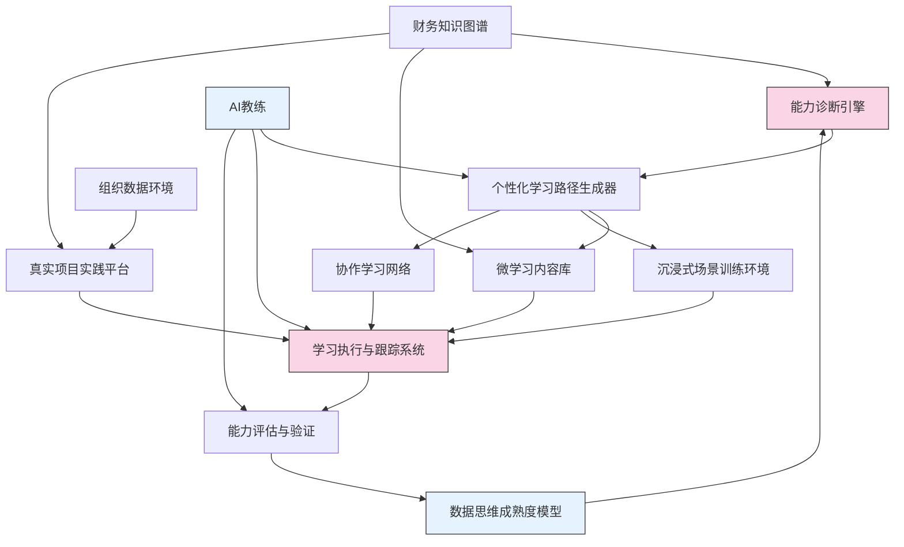

---
{"dg-publish":true,"tags":["AI财务应用","数据思维","能力建设","人才发展","财务转型"],"创建日期":"2024-05-14","permalink":"/知识共享/001_财务/03_AI与财务应用/07_实施与转型策略/7.2 人才与能力建设/数据思维培养计划/","dgPassFrontmatter":true}
---

## 技术概述

数据思维培养计划整合了认知科学、教育技术与AI技术的前沿成果，构建了一套面向财务专业人士的数据能力发展体系。该方案融合了以下核心技术：

- **自适应学习系统**：基于进化神经网络和贝叶斯知识追踪算法，精确识别学习者的知识图谱和能力盲点，动态调整学习路径
- **大语言模型辅助教学**：利用经过财务与数据分析领域微调的大模型，提供个性化学习辅导、实时反馈和案例生成
- **数据可视化认知技术**：融合视觉认知科学和信息设计理论，培养直观理解复杂数据的能力
- **沉浸式数据分析环境**：结合AR/VR技术和数据空间化技术，创造高度交互的数据探索环境
- **社会化学习网络**：基于组织网络分析和知识流动模型，促进集体智慧的涌现和隐性知识的传递

相比传统的培训方法，本系统实现了从被动学习到主动探索的转变，从静态知识到动态能力的跃升，并建立了持续进化的数据文化生态系统。

## 系统架构

系统由四个核心层次构成：
1. **诊断层**：能力诊断引擎结合财务知识图谱，评估个体当前的数据思维发展阶段
2. **学习层**：个性化学习路径生成器和多元化学习渠道（微学习、沉浸式训练、协作学习）
3. **实践层**：与组织真实数据环境连接的项目实践平台
4. **评估层**：基于行为数据的能力评估系统和数据思维成熟度模型

AI教练作为系统的智能中枢，贯穿各个层次，提供持续指导和反馈。

## 实施方案

### 技术实施路线图

**第一阶段：基础架构构建（1-3个月）**
- 构建财务数据思维能力框架和评估模型
- 开发能力诊断算法和学习路径生成引擎
- 整合微学习内容库和基础协作平台

**第二阶段：智能系统集成（3-6个月）**
- 集成并微调财务领域大语言模型，构建AI教练功能
- 开发数据可视化训练模块和交互式案例库
- 构建真实项目实践平台和数据沙盒环境

**第三阶段：高级功能开发（6-9个月）**
- 开发沉浸式数据分析训练环境
- 完善协作学习网络和组织知识流动分析
- 构建数据思维成熟度模型和持续评估机制

**第四阶段：组织集成与扩展（9-12个月）**
- 与组织人才发展系统和业务流程整合
- 开发组织级数据文化评估仪表板
- 构建自优化学习生态系统

### 技术挑战与解决策略

1. **个性化学习路径精确度**
   - 挑战：准确识别个体能力差距和最佳学习路径
   - 解决策略：结合显性测评和隐性行为分析，应用多目标优化算法，迭代优化路径推荐模型

2. **知识向能力转化的有效性**
   - 挑战：确保学习内容能有效转化为实际工作能力
   - 解决策略：采用基于认知负荷理论的学习设计，构建"学习-实践-反思"闭环，强化情境化学习

3. **大模型在财务领域的适配性**
   - 挑战：通用大模型缺乏财务专业知识和数据分析技能
   - 解决策略：结合在线学习和领域适配技术，通过持续的专家反馈改进模型表现

4. **组织数据文化的系统性变革**
   - 挑战：数据思维培养需要与组织文化变革协同
   - 解决策略：采用社会网络干预模型，识别关键节点人物，构建变革推动网络

## 价值创造

### 量化价值评估

1. **决策质量提升**
   - 数据驱动决策比例提高30-45%
   - 决策周期缩短25-40%
   - 财务预测准确度提升15-25%

2. **分析效率提升**
   - 数据处理与分析时间减少40-60%
   - 自动化报告生成率提高50-70%
   - 高价值洞察生成频率提升35-55%

3. **创新能力提升**
   - 基于数据的业务创新提案增加25-40%
   - 跨部门数据协作项目增加30-50%
   - 新分析方法采用速度提升40-60%

4. **人才发展回报**
   - 数据技能提升人员的绩效评分平均提高18-30%
   - 关键人才保留率提高15-25%
   - 财务团队在业务决策中的战略影响力提升35-50%

### 投资回报分析

投资回报率(ROI)可达180%-250%（3年期），主要来源于：
- 决策质量提升带来的机会获取和风险规避（45%）
- 工作效率提升和流程优化（30%）
- 人才竞争力和创新能力提升（25%）

投资回收期通常为12-18个月，第一阶段价值实现可在系统部署后3-6个月内实现。

## 未来演进

### 技术迭代路线图

**近期演进（1-2年）**
- 集成多模态学习体验（视觉-语言-交互）
- 构建个人数据分析助手和实时指导系统
- 发展基于因果推理的财务分析能力培养模块

**中期演进（2-3年）**
- 构建社会化元宇宙学习环境，支持沉浸式协作分析
- 发展认知增强技术，扩展人类数据分析能力边界
- 整合组织数字孪生，实现在真实业务环境中的学习

**远期演进（3-5年）**
- 构建自主进化的数据思维培养生态系统
- 发展人机协同智能体网络，创造集体智慧增强环境
- 实现情境感知的无缝数据素养辅助系统

### 扩展应用场景

1. **跨职能数据协作框架**：扩展至财务与业务部门的协作场景，培养共同数据语言

2. **领导力数据思维增强**：针对高管开发战略级数据思维培养模块

3. **数据伦理与责任**：整合数据伦理决策框架，培养负责任的数据使用文化

4. **前沿分析方法预适应**：构建新兴技术学习加速器，快速掌握前沿分析方法

## 实验验证

### 概念验证方案

**阶段一：小规模试点（30-50人，8周）**
- 选择3-5个核心财务场景，覆盖不同数据思维能力要求
- 实施基础版能力诊断和个性化学习路径
- 采用A/B测试比较传统培训和新方案效果差异

**阶段二：扩展试点（100-150人，12周）**
- 整合多部门参与者，测试跨职能协作场景
- 实施完整的学习-实践-评估闭环
- 收集定量绩效数据和定性反馈

**阶段三：组织级试点（全财务团队，16周）**
- 实施完整系统，包括组织文化干预
- 评估规模化实施的技术和管理挑战
- 验证长期可持续性和自我进化机制

### 评估指标框架

**个体层面**
- 数据能力评分变化（前测-后测）
- 工作成果质量提升（案例评估）
- 行为模式转变（数据驱动决策频率）

**团队层面**
- 协作分析能力提升
- 集体问题解决速度变化
- 数据共享行为增长

**组织层面**
- 数据文化成熟度变化
- 数据驱动创新案例数量
- 关键业务指标改善程度

实验设计采用多元混合方法，结合定量测量、观察研究和深度访谈，确保全面把握培养计划的实际效果和改进方向。

## 未来影响

数据思维培养计划不仅是技能发展项目，更是组织转型的关键催化剂。随着数据素养在财务团队中的普及和深化，将推动财务职能从数据消费者向洞察创造者的转变，重新定义财务在组织决策中的角色和价值创造方式。

长期来看，本计划将助力财务人才在新技术环境中保持相关性和竞争力，使他们能够与AI系统形成有效的人机协作关系，专注于发挥人类独特的批判性思维、创造力和战略洞察力，在自动化程度不断提高的未来财务环境中创造更高价值。 