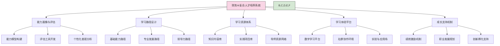

---
{"dg-publish":true,"tags":["AI财务应用","人才培养","复合型人才","技能发展","数字化转型"],"创建日期":"2024-04-29","permalink":"/知识共享/001_财务/03_AI与财务应用/07_实施与转型策略/7.2 人才与能力建设/财务AI复合人才培养/","dgPassFrontmatter":true}
---

## 技术概述

财务AI复合人才培养体系是一个面向未来的人才发展框架，旨在培养兼具财务专业知识、数据分析能力、AI技术理解和业务洞察力的新一代财务人才。这种复合型人才能够在AI与财务深度融合的环境中发挥桥梁作用，推动组织数字化转型和智能决策能力的提升。

### 核心技术栈与能力模型

财务AI复合人才的核心能力由以下五个维度构成：

1. **财务专业知识**：传统财务理论与实务，包括会计、财务分析、财务管理、税务规划等
2. **数据科学基础**：数据处理、统计分析、数据可视化、数据建模等核心数据能力
3. **AI技术理解**：机器学习、自然语言处理、预测分析等AI技术的应用级理解
4. **数字化工具应用**：财务AI工具、分析平台、编程语言(Python/R)、BI工具等的实操能力
5. **商业敏锐度**：业务理解、战略思维、跨部门协作、创新思维等软技能

### 与传统财务人才培养的比较

| 维度 | 传统财务人才培养 | 财务AI复合人才培养 | 优势与创新点 |
|------|-----------------|-------------------|------------|
| **学习内容** | 以财务专业知识为核心 侧重标准化操作流程 强调合规与控制 | 财务与技术知识双轨并行 侧重问题解决与数据驱动 强调创新与价值创造 | 培养"T型"人才结构 适应AI赋能财务环境 提升战略影响力 |
| **培养方式** | 正式培训为主 理论学习占比大 单向知识传授 | 混合学习模式 项目实践与应用为主 社群协作与知识共创 | 加速学习曲线 提高学习效果 促进知识内化 |
| **能力评估** | 以专业资格认证为主 侧重知识点掌握 规范化统一考核 | 能力组合评估 侧重实际问题解决 个性化发展路径 | 更贴合实际工作需求 激励持续学习 适应多元发展方向 |
| **发展路径** | 线性晋升路径 专业深度优先 职能边界清晰 | 多元发展网络 跨领域成长机会 流动性与适应性强 | 提供更丰富职业可能 适应组织敏捷需求 激发人才潜能 |

## 系统架构

财务AI复合人才培养体系采用模块化、阶梯式、适应性强的架构设计，确保培养过程的系统性和个性化。

### 核心组件功能

#### 1. 能力画像与评估系统

- **能力模型构建**：基于组织需求和行业趋势，构建财务AI复合人才能力模型
- **评估工具开发**：多维度评估工具，包括知识测试、技能实操、情境模拟等
- **个性化差距分析**：AI驱动的能力差距分析，生成个性化发展建议

#### 2. 学习路径设计系统

- **基础能力路径**：面向所有财务人员的AI基础知识与技能培养路径
- **专业发展路径**：针对不同财务角色定制的专业化发展路径（如AI财务分析师、智能财务规划师等）
- **领导力路径**：面向管理层的AI战略思维和变革领导能力培养

#### 3. 学习资源体系

- **知识内容库**：结构化的财务AI知识内容，包括课程、微课、案例和最佳实践
- **实践项目库**：真实业务场景下的AI应用项目，提供实践学习机会
- **导师资源网络**：内外部专家导师网络，提供指导和经验分享

#### 4. 学习体验平台

- **数字学习平台**：集成学习管理、内容分发、进度跟踪和效果评估的一体化平台
- **社群协作环境**：促进同伴学习和知识共享的虚拟协作空间
- **实验与应用场**：安全环境中实践AI工具和技术的沙盒和模拟环境

#### 5. 成长支持机制

- **绩效激励机制**：将学习成果与职业发展和绩效评估相结合
- **职业发展规划**：提供明确的财务AI职业发展路径和机会
- **创新孵化支持**：支持员工将学习成果转化为创新实践的机制

## 实施方案

### 技术实施路线图

#### 第一阶段：基础建设（0-6个月）

**目标**：建立基础框架和启动试点

**关键活动**：
1. 进行组织财务AI能力需求分析
2. 开发财务AI复合人才能力模型1.0版
3. 构建基础评估工具和方法
4. 开发核心学习内容（覆盖基础模块）
5. 搭建基础数字学习平台
6. 选择试点部门启动培养计划

**里程碑**：
- 完成能力模型框架和评估体系
- 基础学习路径和内容上线
- 首批试点人员完成评估和学习路径规划

#### 第二阶段：能力扩展（7-18个月）

**目标**：扩大覆盖范围和深化内容

**关键活动**：
1. 迭代优化能力模型和评估工具
2. 开发专业化学习路径（针对不同财务角色）
3. 扩充学习内容库（增加高级和专业内容）
4. 建立内部导师网络和社群协作机制
5. 推广到更多财务团队
6. 开发学习效果评估和改进机制

**里程碑**：
- 能力模型2.0版发布
- 专业学习路径全面覆盖
- 50%以上财务人员参与培养计划
- 建立导师网络和实践社群

#### 第三阶段：深度融合（19-36个月）

**目标**：深度融入组织文化和业务实践

**关键活动**：
1. 将AI能力发展融入绩效管理和晋升体系
2. 建立创新项目孵化机制，实现学习到应用转化
3. 开发领导力发展路径和高阶内容
4. 建立持续优化的生态系统
5. 推动跨部门协作学习和应用

**里程碑**：
- 财务AI人才发展完全融入人才管理体系
- 建立自我持续优化的学习生态
- 80%以上财务人员具备AI应用基础能力
- 形成可复制的最佳实践和案例库

### 资源与技术依赖

1. **技术平台需求**：
   - 学习管理系统（LMS）
   - 能力评估与分析工具
   - 协作与社群平台
   - 内容管理系统
   - 数据分析与学习效果评估工具

2. **人力资源需求**：
   - 项目管理团队
   - 内容开发专家（财务+技术）
   - 内部导师与教练
   - 学习体验设计师
   - 数据分析师

3. **知识资源需求**：
   - 财务AI应用案例库
   - 技术学习材料与课程
   - 行业最佳实践资源
   - 第三方专业培训资源

### 挑战与应对策略

| 挑战 | 应对策略 |
|------|----------|
| **人才画像精准性** | - 采用多维度评估方法 - 结合自评、主管评估和实操测试 - 持续迭代优化能力模型 |
| **学习动机维持** | - 设计引人入胜的学习体验 - 建立明确的激励和认可机制 - 提供实际应用场景和价值证明 |
| **理论到实践转化** | - 增加基于项目的学习 - 建立实践社群和导师指导 - 开发模拟环境和沙盒工具 |
| **个性化与规模化平衡** | - 基于AI的个性化推荐 - 模块化学习内容设计 - 核心路径与选修灵活结合 |
| **传统思维模式转变** | - 渐进式学习路径设计 - 领导层示范和文化建设 - 成功案例分享和影响力证明 |

## 价值创造

### 量化价值评估

财务AI复合人才培养计划的预期价值可从以下几个维度进行量化评估：

#### 1. 财务职能效能提升
- **生产力提升**：财务流程处理效率提高30-50%
- **决策质量改善**：基于数据的决策准确性提升25-40%
- **分析深度增强**：财务洞察的价值影响提升35-60%

#### 2. 数字化转型加速
- **财务AI项目成功率**：从行业平均的30%提升至70%以上
- **实施周期缩短**：关键数字化项目实施时间缩短40-50%
- **采纳率提高**：新型数字工具的有效采纳率提升60-80%

#### 3. 人才价值提升
- **高潜人才保留率**：提高关键人才保留率20-30%
- **内部流动增强**：跨职能流动性提升35-50%
- **创新能力提升**：员工提出的创新方案数量增加45-70%

### 投资回报率分析

| 投资领域 | 投入成本（相对比例） | 预期价值（相对比例） | ROI倍数 | 价值实现时间 |
|---------|-------------------|--------------------|---------|------------|
| 能力评估系统 | 15% | 20% | 1.3× | 短期（6-12个月） |
| 学习内容开发 | 30% | 35% | 1.2× | 中期（12-18个月） |
| 数字学习平台 | 20% | 25% | 1.3× | 中期（12-18个月） |
| 导师网络建设 | 10% | 15% | 1.5× | 短期（6-12个月） |
| 实践项目支持 | 25% | 40% | 1.6× | 长期（18-24个月） |

### 战略价值创造

1. **组织适应力增强**：培养能够推动和适应财务数字化转型的人才队伍，提升组织变革能力
2. **创新文化培育**：促进数据驱动和实验性思维在财务团队中的普及，推动创新文化形成
3. **知识资本积累**：构建组织层面的财务AI知识库和最佳实践，形成可持续的竞争优势
4. **生态系统影响**：提升与外部合作伙伴、供应商和客户进行数字化协作的能力
5. **人才市场吸引力**：增强对高素质复合型人才的吸引力，提升雇主品牌价值

## 未来演进

### 技术迭代路线图

#### 近期（1-2年）
- 完善基于AI的个性化学习推荐系统
- 开发沉浸式学习体验（AR/VR技术应用）
- 增强数据驱动的学习效果评估能力

#### 中期（2-3年）
- 导入自适应学习技术，实现动态学习路径
- 开发AI教练系统，提供实时学习指导
- 建立财务AI能力认证体系和标准

#### 长期（3-5年）
- 实现全面的智能化人才发展生态系统
- 与大型语言模型集成，创建个性化学习助手
- 发展预测性能力规划，主动适应未来技术变革

### 扩展应用场景

1. **跨职能融合培养**：扩展至财务与其他职能（如运营、营销、供应链）的交叉人才培养
2. **产业生态培养**：面向客户、供应商和合作伙伴的能力建设计划
3. **高校合作培养**：与高校联合开发预备财务AI人才培养项目
4. **内部创业孵化**：支持财务创新项目从构想到实施的全周期培养和支持机制

### 长期价值创造与影响

1. **财务职能转型**：促进财务从交易处理向价值创造和战略伙伴的转型
2. **人才结构重塑**：重构财务团队能力组合和结构，适应智能化时代需求
3. **创新能力建设**：建立持续的财务创新能力，保持竞争优势
4. **行业标准影响**：形成可推广的财务AI人才培养最佳实践和标准

## 实验验证

### 概念验证方案

#### 试点范围设计
- 选择1-2个财务子部门（如FP&A、财务运营）
- 挑选12-15名不同级别、背景的财务人员
- 实施周期为3个月

#### 试点内容设计
- 完成基础能力评估
- 实施核心学习模块（数据分析基础、AI概念、应用案例）
- 开展1-2个实践项目
- 建立小型学习社群

#### 评估指标设计
- 能力提升：前后测评对比
- 应用转化：学习内容在工作中的应用频率
- 学习体验：参与度和满意度调查
- 业务影响：试点项目创造的直接价值

### 循证迭代策略

#### 数据收集机制
- 学习行为数据：平台使用、内容互动、完成情况
- 能力发展数据：评估结果、技能应用、项目表现
- 反馈数据：结构化问卷、深度访谈、焦点小组

#### 分析与优化流程
1. 每周收集和分析学习数据
2. 每月进行内容和体验优化
3. 每季度评估整体方案有效性
4. 形成迭代改进计划并实施

#### 扩展路径设计
- 基于试点结果，确定全面推广的优先顺序和方式
- 制定分阶段扩展计划，确保资源充分支持
- 建立成功案例库，支持规模化实施

### 成功标准框架

#### 短期成功指标（3-6个月）
- 80%以上参与者完成基础学习路径
- 学习满意度达到4.0/5.0以上
- 至少30%学习内容在实际工作中得到应用

#### 中期成功指标（6-12个月）
- 参与者AI相关能力评分提升30%以上
- 至少产生3-5个可量化价值的应用案例
- 建立自我维持的学习社群生态

#### 长期成功指标（12-24个月）
- 财务团队数字化效能提升40%以上
- 形成5-8个可复制的最佳实践
- 建立可持续的财务AI人才发展机制 