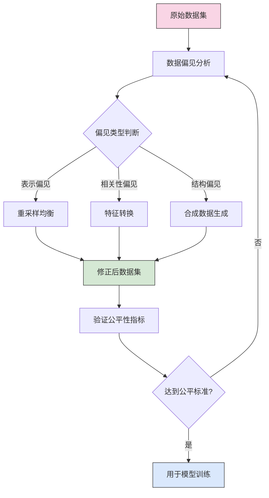

---
{"dg-publish":true,"tags":["AI财务应用","算法公平","偏见应对","公平性评估","财务伦理"],"创建日期":"2024-04-29","permalink":"/知识共享/001_财务/03_AI与财务应用/07_实施与转型策略/7.3 治理与伦理/算法偏见识别与缓解/","dgPassFrontmatter":true}
---

## 概念框架

算法偏见是指AI系统在财务决策过程中产生的系统性不公平结果，可能对特定人群、组织或业务场景造成不当影响。在财务环境中，这些偏见可能来源于历史数据中的固有偏差、特征选择不当、算法设计缺陷或模型训练过程中的盲点。算法偏见识别与缓解框架旨在系统性地发现、衡量、减轻和监控财务AI应用中的算法偏见，确保技术应用能够维护公平性、符合道德标准并增强组织的社会责任表现。

### 偏见类型分类

在财务领域，AI系统可能存在的主要偏见类型包括：

1. **表示偏见**：训练数据中某些人群或情景表示不足，导致模型对这些群体的预测精度较低
2. **测量偏见**：使用的财务指标或特征不能公平地反映不同群体的真实情况
3. **聚合偏见**：在数据预处理和特征工程中，不恰当的数据聚合方式掩盖了重要差异
4. **历史偏见**：历史财务数据反映过去的不公平做法，被模型学习并延续
5. **评估偏见**：模型评估方法或指标不能全面捕捉跨群体的公平性问题
6. **部署偏见**：模型部署环境或用户交互方式导致的应用层面偏见

## 偏见识别方法论

### 定量分析框架

#### 1. 统计公平性指标体系

**群体公平性指标**
- **统计均等率差异**：不同保护群体间的预测结果比率
  - 公式：$ΔDR = \frac{Positive\ Predictions_{group\ A}}{Total\ Predictions_{group\ A}} - \frac{Positive\ Predictions_{group\ B}}{Total\ Predictions_{group\ B}}$
  - 阈值：绝对值≤0.1为可接受范围

- **预测精度均等率**：各群体预测准确度的差异
  - 公式：$ΔAER = Accuracy_{group\ A} - Accuracy_{group\ B}$
  - 阈值：绝对值≤0.05为可接受范围

- **校准误差比较**：预测概率与实际结果一致性的群体间差异
  - 公式：$ΔCE = |Expected\ Outcome - Actual\ Outcome|_{group\ A} - |Expected\ Outcome - Actual\ Outcome|_{group\ B}$
  - 阈值：绝对值≤0.08为可接受范围

**个体公平性指标**
- **对比公平性**：相似个体获得相似预测结果的程度
  - 计算方法：配对测试方法，仅改变保护属性，观察结果变化
  - 评估标准：≥95%相似案例应获得相似结果

- **反事实公平性**：模型对假设反事实情况的稳健性
  - 计算方法：敏感性分析，评估微小变化对决策影响
  - 评估标准：敏感度系数≤0.2为可接受范围

#### 2. 多维度偏见扫描

**数据层面扫描**
- 输入特征分布分析：评估各特征在不同群体间的分布差异
- 标签分布不平衡分析：检测目标变量在不同群体间的分布偏差
- 缺失值模式分析：识别缺失数据的系统性模式是否与保护属性相关

**模型层面扫描**
- 特征重要性差异分析：比较模型对不同群体特征的依赖程度
- 决策边界分析：评估分类边界在不同人群中的位置差异
- 鲁棒性测试：评估模型对数据扰动的敏感度差异

**结果层面扫描**
- 错误类型分布分析：分析假阳性和假阴性在不同群体间的分布
- 临界案例分析：研究边界决策案例中的群体代表性
- 纵向结果分析：追踪模型预测随时间的公平性变化

### 定性分析方法

#### 1. 多利益相关方参与评估

**结构化访谈框架**
- 与不同群体代表进行系统性访谈，收集对潜在偏见的看法
- 焦点小组讨论，探索模型决策的公平性感知
- 专家审查，邀请领域专家和伦理学家评估系统

**用户参与式评估**
- 用户体验测试，观察不同用户群体与系统的交互差异
- 模拟场景测试，评估系统在各种现实场景中的公平性表现
- 开放反馈渠道，建立持续的用户偏见报告机制

#### 2. 情境分析与案例研究

**边缘案例分析**
- 识别和深入分析模型处理极端或异常案例的方式
- 评估模型在非典型财务情况下的决策公平性
- 比较不同人口统计群体中边缘案例的处理差异

**历史案例比对**
- 分析历史上有争议的财务决策案例
- 评估AI模型如何处理类似情况
- 识别潜在的类似偏见模式和改进空间

## 偏见缓解策略

### 技术缓解方法

#### 1. 数据预处理技术

**偏见数据修正**
- 重采样技术：平衡数据集中不同群体的表示
- 特征转换：减少有偏见特征的直接影响
- 合成数据生成：用公平合成数据增强训练集

**数据丰富化策略**
- 多源数据融合：整合多种数据源以减少单一来源偏见
- 替代特征开发：设计新特征减少对有偏见指标的依赖
- 上下文增强：添加额外背景信息提供更全面视角

#### 2. 算法优化方法

**约束优化模型**
- 公平性约束训练：在模型目标函数中添加公平性约束
- 多目标优化：同时优化模型精度和公平性指标
- 后处理调整：在模型输出阶段应用校准以确保公平结果

**公平表示学习**
- 不变表示学习：开发对保护属性不敏感的特征表示
- 对抗公平学习：使用对抗训练移除特征中的敏感信息
- 分布匹配：确保不同群体的模型输入表示分布相似

#### 3. 集成与混合方法

**多模型公平集成**
- 群体特定模型融合：为不同群体训练和集成专门模型
- 公平加权集成：根据公平性考量动态调整模型权重
- 分层模型应用：基于案例复杂性和风险应用不同模型

**人机协作决策**
- 智能分流决策：自动化简单案例，人工处理复杂边缘案例
- 公平性标记系统：对潜在有偏见决策进行标记以供人工审核
- 分级确定性模型：清晰传达模型预测的确定性级别

### 流程与治理对策

#### 1. 系统性偏见审计

**定期偏见审计流程**
- 建立季度算法公平性评估机制
- 执行年度全面偏见影响评估
- 针对重大模型更新进行专项公平性审核

**多维度审计方法**
- 结果审计：评估模型决策结果的跨群体公平性
- 过程审计：审查模型开发全流程中的公平性考量
- 影响审计：评估模型决策对不同利益相关者的长期影响

#### 2. 责任与透明机制

**公平性文档标准**
- 模型公平性报告：记录模型公平性评估方法和结果
- 已知限制说明：明确披露模型的群体覆盖局限性
- 数据代表性声明：阐明训练数据的人口统计覆盖范围

**申诉与纠正机制**
- 建立便捷的模型决策质疑渠道
- 实施标准化的申诉处理流程
- 开发学习型纠正系统，从申诉中改进模型

#### 3. 组织能力建设

**跨职能公平团队**
- 组建包含技术、业务、法律和伦理专家的公平性团队
- 明确角色和责任，确保公平性考量贯穿整个开发周期
- 建立激励机制，奖励提高算法公平性的创新

**培训与意识提升**
- 开发算法公平性培训课程
- 将公平性考量纳入开发人员绩效评估
- 组织定期公平性研讨会和案例分享

## 实施路线图

### 阶段性实施计划

#### 阶段一：基础建设 (0-3个月)

**目标**：建立基本偏见识别能力和组织意识

**关键任务**：
1. 进行初步偏见风险评估，识别高风险财务AI应用
2. 建立基本公平性指标和监控机制
3. 开发算法公平性的组织意识培训材料
4. 形成初步偏见识别与缓解工作组

**关键里程碑**：
- 完成高风险应用偏见评估报告
- 建立公平性指标仪表盘
- 完成第一轮员工公平性意识培训

#### 阶段二：系统强化 (4-9个月)

**目标**：系统化偏见识别与缓解能力

**关键任务**：
1. 实施全面的公平性审计框架
2. 开发和测试核心偏见缓解技术策略
3. 集成公平性考量到模型开发生命周期
4. 开发公平性文档标准和申诉机制

**关键里程碑**：
- 完成首次全面算法公平性审计
- 发布公平算法开发指南
- 建立正式的公平性治理委员会

#### 阶段三：持续优化 (10-18个月)

**目标**：建立持续改进和前瞻性偏见管理能力

**关键任务**：
1. 实施高级偏见缓解技术和创新方法
2. 建立持续学习和改进的公平性管理系统
3. 开发前瞻性偏见风险识别能力
4. 将公平性考量深度融入组织文化和决策

**关键里程碑**：
- 建立自动化偏见监控和预警系统
- 完成关键业务AI应用的公平性优化
- 发布年度算法公平性透明度报告

### 实施成功要素

**技术与数据**：
- 高质量多样化数据的可获取性
- 公平性评估工具的有效性和易用性
- 公平性优化技术的成熟度和算力需求

**组织与人员**：
- 高层领导对算法公平性的承诺和支持
- 跨职能团队的有效协作和知识共享
- 技术团队对公平性问题的意识和技能

**流程与治理**：
- 公平性考量与现有风险管理框架的整合
- 明确的角色、责任和问责机制
- 有效的监督、报告和透明度机制

## 案例研究与最佳实践

### 财务领域公平性挑战案例

#### 案例一：信贷评分系统偏见识别与缓解

**背景**：一家金融机构在其自动信贷评分系统中发现，尽管模型未直接使用性别、年龄等敏感属性，但对某些人口统计群体的批准率存在显著差异。

**识别方法**：
- 应用多维度偏见扫描，发现模型在不同年龄和区域群体间的表现差异
- 通过特征重要性分析，识别出与某些群体强相关的间接代理变量
- 使用反事实测试，确认模型对某些变量的过度敏感性

**缓解策略**：
- 实施特征转换，减少高度相关代理变量的影响
- 应用约束优化训练，在保持整体准确性的同时减少群体间差异
- 开发群体特定阈值策略，针对不同群体调整决策边界
- 建立人工审核机制，对边界案例进行专家评估

**成果**：
- 群组间批准率差异从22%降至8%
- 模型整体准确性仅下降1.2%
- 客户满意度提升15%，申诉率下降30%

#### 案例二：财务异常检测系统的公平性优化

**背景**：一个用于检测财务异常和潜在欺诈的AI系统显示对小型企业和新创企业的误报率明显高于大型企业。

**识别方法**：
- 错误类型分布分析揭示不同规模企业间的误报率差异
- 数据表示分析发现小型企业在训练数据中表示不足
- 用户反馈收集显示系统对新型商业模式的财务模式理解有限

**缓解策略**：
- 实施数据丰富化策略，增加小型和创新企业的训练样本
- 开发企业规模特定的特征工程方法
- 实施分层检测阈值，根据企业特征调整敏感度
- 建立快速申诉和学习反馈机制

**成果**：
- 小型企业误报率降低40%
- 整体检测准确率提升8%
- 系统公平性感知度提升25%

### 实施最佳实践指南

#### 技术实践

**数据管理最佳实践**
- 建立数据表示平衡审查程序，确保数据多样性
- 实施持续数据质量监控，关注群体间差异
- 采用透明的特征工程文档标准，记录潜在偏见考量

**算法开发最佳实践**
- 将公平性指标纳入模型评估标准库
- 实施A/B测试框架，评估偏见缓解策略效果
- 采用增量部署策略，密切监控生产环境中的公平性表现

#### 组织实践

**治理架构最佳实践**
- 建立专门的算法公平性审查委员会
- 实施财务AI应用的公平性风险分级制度
- 开发明确的偏见事件响应流程

**文化与能力最佳实践**
- 将公平性考量纳入产品开发初期阶段
- 建立公平性champions网络，在各团队推广最佳实践
- 开发内部公平性案例研究库和学习资源

#### 沟通与透明度实践

**内部透明最佳实践**
- 建立算法公平性内部仪表盘，追踪关键指标
- 实施定期公平性回顾会议，分享经验教训
- 开发明确的公平性目标和报告机制

**外部透明最佳实践**
- 开发适当的模型公平性外部披露框架
- 与行业伙伴和监管机构积极合作制定标准
- 建立利益相关方参与机制，收集多元视角

## 未来发展与创新方向

### 前沿研究领域

1. **因果公平性**：超越相关性分析，建立反映真实因果关系的公平性框架
2. **终身学习公平性**：研究持续学习模型中的公平性动态变化和漂移问题
3. **多属性交叉公平性**：处理多重保护属性交叉的复杂公平性问题
4. **隐私保护公平性技术**：平衡隐私保护和公平性评估的技术方法
5. **联邦学习中的公平性保障**：在分布式学习环境中确保跨组织公平性

### 政策与标准展望

1. **行业公平性标准发展**：财务领域算法公平性评估与披露标准的发展趋势
2. **监管环境变化**：算法偏见相关法规和监管要求的演变预期
3. **国际协调与合作**：全球算法公平性治理框架的发展方向
4. **公平性认证机制**：第三方公平性评估和认证体系的兴起

### 创新应用前景

1. **公平性增强工具**：专用于财务领域的算法公平性评估和优化工具的发展
2. **可解释公平AI系统**：结合公平性和可解释性的新一代财务AI系统
3. **集体参与式公平治理**：多方利益相关者参与的公平性治理新模式
4. **公平性导向的财务产品创新**：以增强金融包容性为目标的新型AI应用 