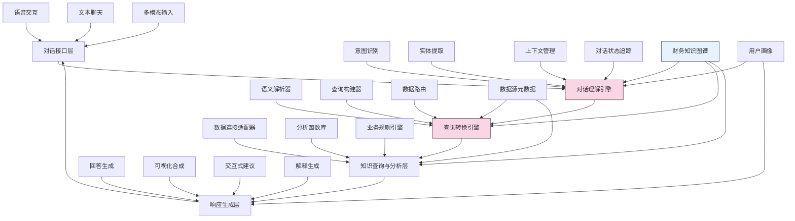

---
{"dg-publish":true,"tags":["AI财务应用","交互式分析","自然语言查询","对话系统","智能助手"],"创建日期":"2024-05-14","permalink":"/知识共享/001_财务/99_其他/AI与财务应用/01_智能财务分析/1.1 大语言模型应用/1.1 基于对话的财务数据探索/","dgPassFrontmatter":true}
---

## 技术概述

基于对话的财务数据探索系统是一种革命性的财务分析交互范式，它使用自然语言作为主要界面，让用户能够通过对话方式与复杂的财务数据进行交流互动。该系统融合了以下核心技术：

- **财务领域大语言模型**：经过财务专业数据特殊训练的大语言模型，深度理解财务术语、概念和查询意图
- **语义解析与意图识别**：将自然语言查询精确转化为结构化查询语言，识别复杂的分析意图
- **上下文感知对话管理**：维持多轮对话的连贯性，处理指代消解和对话流控制
- **自适应数据访问层**：智能连接和访问多源财务系统，构建统一的数据访问接口
- **动态可视化生成**：根据数据特性和分析需求自动生成最佳可视化表达

相较于传统的财务数据分析工具，本系统降低了技术使用门槛，显著提高了分析效率和灵活性，使财务专业人员能够摆脱SQL和复杂界面的束缚，直接用自然语言表达和探索复杂的财务分析需求。

## 系统架构

系统架构由五个核心层次构成：

1. **对话接口层**：提供多种交互方式，包括文本聊天、语音对话和多模态输入
2. **对话理解引擎**：系统的核心大脑，负责理解用户意图、提取实体并管理对话状态
3. **查询转换引擎**：将自然语言查询转换为结构化查询语句，并路由到适当的数据源
4. **知识查询与分析层**：执行查询并进行数据分析，整合多源数据结果
5. **响应生成层**：根据分析结果和用户情境生成自然语言回答和可视化内容

系统通过财务知识图谱、用户画像和数据源元数据三个关键支持组件，实现深度的语义理解、个性化分析和精准的数据访问。

## 实施方案

### 技术实施路线图

**第一阶段：基础对话能力构建（2-3个月）**
- 财务领域语言模型训练与优化
- 基础意图识别和实体提取系统开发
- 核心财务数据连接适配器构建
- 简单回答生成和基础可视化实现

**第二阶段：高级语义理解（3-4个月）**
- 上下文管理和多轮对话支持
- 复杂查询解析和SQL转换
- 财务知识图谱构建与集成
- 高级分析函数库开发

**第三阶段：智能分析增强（2-3个月）**
- 预测性分析能力整合
- 异常检测与解释生成
- 假设情景模拟支持
- 交互式探索建议机制

**第四阶段：体验优化与集成（2-3个月）**
- 用户画像和个性化分析
- 高级可视化自动生成
- 解释性增强和透明度提升
- 企业系统深度集成

### 技术挑战与解决策略

1. **财务查询的复杂性解析**
   - 挑战：财务查询通常涉及复杂的时间维度、条件筛选和计算逻辑
   - 解决策略：构建特定于财务领域的语义解析器，结合规则与学习方法，开发专门的财务计算表达式解析器

2. **多源异构数据整合**
   - 挑战：企业财务数据分散在不同系统，数据模型和访问方式各异
   - 解决策略：建立统一的元数据层和数据访问抽象，实现查询拆分和结果合并，构建虚拟统一数据视图

3. **对话上下文维护**
   - 挑战：财务分析往往需要长期上下文和复杂的分析线索跟踪
   - 解决策略：设计层次化的上下文维护机制，区分全局情境、分析会话和查询级上下文，实现长短期记忆管理

4. **分析解释与透明度**
   - 挑战：用户需要理解系统如何得出结论和建议
   - 解决策略：实现查询路径追踪，构建决策树可视化，提供交互式钻取能力，生成自然语言解释

## 价值创造

### 量化价值评估

1. **分析效率提升**
   - 财务数据查询时间减少85-95%
   - 分析场景构建速度提升70-85%
   - 报告生成时间缩短65-80%

2. **分析深度与广度**
   - 探索性分析频率增加60-80%
   - 数据关联分析覆盖面扩大45-65%
   - 异常模式发现能力提升40-60%

3. **决策支持价值**
   - 决策依据获取速度提升75-90%
   - 财务洞察生成质量提高35-55%
   - 预测分析应用频率增加50-70%

4. **用户赋能**
   - 非技术用户数据自助能力提升80-95%
   - 跨部门财务数据理解改善65-85%
   - 组织财务分析民主化程度提高55-75%

### 投资回报分析

投资回报率(ROI)预计达到250-350%（2年期），主要价值来源包括：
- 分析时间和成本节约（50%）
- 决策速度和质量提升（30%）
- 分析师和业务用户生产力提升（20%）

典型实施成本结构：技术开发（45%）、模型训练和数据准备（30%）、系统集成（15%）、变革管理（10%）。预期投资回收期为9-15个月。

## 未来演进

### 技术迭代路线图

**近期演进（1-2年）**
- 预构建财务分析模板和最佳实践
- 支持多语言财务术语和查询
- 实现多模态输入（图表识别、表格解析）
- 增强场景化分析和情景模拟能力

**中期演进（2-3年）**
- 开发主动式财务洞察推荐
- 构建协作式多人财务分析会话
- 实现跨系统业务流程自动化触发
- 融合预测性和规范性分析能力

**远期演进（3-5年）**
- 发展认知型财务分析助手
- 构建自主学习的分析体验优化
- 实现全自动化财务叙事生成
- 建立个性化财务智能体生态系统

### 扩展应用场景

1. **执行团队财务简报**：为高管提供实时财务状况对话式简报，支持即兴深入探索

2. **跨部门业务协作**：在财务、销售、运营等团队之间建立基于共同数据的协作对话

3. **审计与合规对话**：通过对话方式进行合规检查和审计查询，快速识别风险区域

4. **投资者关系管理**：为投资者提供个性化的财务数据探索体验，增强透明度和信任

## 实验验证

### 概念验证方案

**阶段一：基础能力验证（4-6周）**
- 选择3-5个常见财务查询场景
- 测试基本对话流程和查询准确性
- 评估系统对财务术语的理解能力
- 验证数据访问和结果呈现功能

**阶段二：用户体验测试（6-8周）**
- 招募15-20位不同角色财务用户
- 设计真实业务场景的使用任务
- 对比传统方法与对话式探索的效率
- 收集用户体验和功能改进建议

**阶段三：业务价值验证（8-10周）**
- 在2-3个业务部门实施试点应用
- 跟踪记录实际使用频率和应用场景
- 评估对决策过程的实际影响
- 验证不同类型用户的采纳情况

### 评估指标框架

**交互质量指标**
- 意图识别准确率：系统正确理解用户查询意图的比例
- 查询解析完成率：成功转换为有效数据查询的比例
- 对话满意度：用户对对话流畅度和自然度的评分
- 多轮对话连贯性：系统维持上下文一致性的能力

**分析能力指标**
- 查询准确性：返回结果的准确度与完整性
- 分析深度：支持的分析复杂度和维度
- 可视化适切性：自动生成可视化的相关性和清晰度
- 解释质量：系统提供的分析逻辑解释的有效性

**业务影响指标**
- 使用频率：不同角色用户的日常使用频次
- 分析时间节约：与传统方法相比节省的时间百分比
- 新洞察发现率：系统帮助发现的新业务洞察数量
- 决策影响度：基于系统分析做出决策的比例

## 未来影响

基于对话的财务数据探索系统将从根本上改变财务分析的工作方式和组织数据文化。随着系统的发展和普及，我们可以预见以下深远影响：

1. **财务分析的民主化**：使各层级员工都能便捷地获取和理解财务数据，打破数据分析的技术壁垒

2. **分析思维的转变**：从预定义报表驱动转向探索式分析，培养更加主动和好奇的数据探索文化

3. **财务角色的进化**：财务专业人员从数据整理者转变为洞察顾问，专注于高价值分析和战略支持

4. **组织决策模式变革**：实现更广泛、及时的数据驱动决策，提高组织应对变化的敏捷性

这一系统最终将成为企业财务智能的交互前沿，不仅改变工具使用方式，更将重塑财务团队与业务部门的协作关系，推动整个组织走向更加数据驱动和洞察导向的决策文化。 