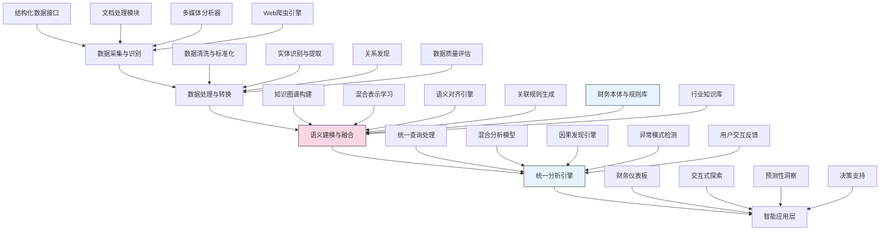

---
{"dg-publish":true,"tags":["AI财务应用","数据融合","混合分析","多模态处理","知识图谱"],"创建日期":"2024-05-14","permalink":"/知识共享/001_财务/99_其他/AI与财务应用/01_智能财务分析/1.1 大语言模型应用/1.1 结构化-非结构化财务数据整合/","dgPassFrontmatter":true}
---

## 技术概述

结构化-非结构化财务数据整合系统是一个创新性的技术框架，专为解决财务领域数据割裂问题而设计，实现了对企业内外部多源异构数据的智能融合和统一分析。该系统融合了以下核心技术：

- **多模态数据处理引擎**：基于深度学习的多模态处理技术，能够同时处理数值数据、文本文档、图表、音频会议记录等不同类型的财务信息
- **自适应知识图谱技术**：构建财务领域特化的知识图谱，自动建立结构化与非结构化数据之间的语义关联
- **混合数据表示学习**：通过联合嵌入模型，将不同来源和格式的数据映射到统一的语义空间，实现数据的关联分析
- **智能信息抽取与对齐**：采用先进的NLP技术，从非结构化数据中提取结构化信息，并与现有结构化数据智能对齐
- **因果推理增强分析**：基于图神经网络和因果推理框架，发现数据间的因果关系和深层关联模式

相比传统的数据整合方法，本系统不仅实现了技术层面的数据打通，更在语义层面实现了深度融合，能够从海量混合数据中提取一致且有价值的财务洞察，形成完整的财务叙事和分析视角。

## 系统架构

系统架构由五个核心层次构成：

1. **数据采集与识别层**：负责从多源系统获取不同类型的财务数据，包括ERP系统结构化数据、财务报告文档、分析师会议记录、市场新闻等
2. **数据处理与转换层**：对采集的异构数据进行清洗、标准化处理，并从非结构化数据中提取结构化信息
3. **语义建模与融合层**：系统核心层，基于财务本体和知识图谱技术建立数据间的语义关联，实现异构数据的统一表示
4. **统一分析引擎**：在融合的数据基础上提供一致的分析能力，包括统一查询、混合分析、因果发现等
5. **智能应用层**：面向不同使用场景的应用接口，包括可视化仪表板、交互式探索、预测分析等

系统通过财务领域本体、规则库和行业知识库提供领域知识支持，并通过用户交互反馈不断优化数据关联和分析模型。

## 实施方案

### 技术实施路线图

**第一阶段：基础构建（3-4个月）**
- 数据源连接器开发，实现对各类结构化系统的接入
- 文档和多媒体处理基础组件搭建
- 财务领域本体和基础知识图谱构建
- 数据标准化和质量评估框架实现

**第二阶段：语义融合（4-5个月）**
- 混合数据表示学习模型开发
- 实体识别与关系提取系统构建
- 知识图谱自动扩展与维护机制
- 语义对齐算法实现与优化

**第三阶段：分析引擎（3-4个月）**
- 统一查询语言和处理引擎开发
- 混合数据分析模型训练与部署
- 因果发现与推理引擎构建
- 异常检测与模式识别系统实现

**第四阶段：应用与集成（2-3个月）**
- 可视化仪表板与探索界面开发
- 预测分析与决策支持功能实现
- 与现有财务系统集成接口构建
- 系统性能优化与安全加固

### 技术挑战与解决策略

1. **数据质量与一致性挑战**
   - 挑战：来源多样的数据存在质量不均、格式不一致、时间不同步等问题
   - 解决策略：建立多层次数据质量评估框架，设计智能冲突检测与解决机制，实现数据时序对齐

2. **语义关联的准确性**
   - 挑战：在财务专业领域，准确识别不同数据间的语义关联难度高
   - 解决策略：结合领域专家知识构建财务本体，采用半监督学习方法，通过少量标注数据指导大规模关联发现

3. **混合数据表示的统一性**
   - 挑战：不同类型数据的特征空间差异大，难以在统一表示空间有效融合
   - 解决策略：采用对比学习和跨模态预训练技术，建立共享表示空间，保留各类数据特性

4. **系统扩展性与实时性**
   - 挑战：随着数据源和数据量增加，系统面临扩展性和处理实时性挑战
   - 解决策略：采用分布式架构设计，实现数据和计算的动态扩展，引入增量处理机制应对实时数据更新

## 价值创造

### 量化价值评估

1. **分析效率与深度**
   - 财务分析周期缩短65-80%
   - 数据关联发现能力提升70-90%
   - 隐藏模式识别准确率提高40-60%

2. **决策质量提升**
   - 基于完整证据链的决策准确率提升35-50%
   - 风险预警提前时间增加50-70%
   - 战略决策支持全面性提高45-65%

3. **运营效益**
   - 数据整合与管理成本降低40-60%
   - 跨部门信息共享效率提升60-80%
   - 报告生成时间减少70-85%

4. **创新能力**
   - 新业务洞察发现率提高30-50%
   - 战略机会识别速度提升40-60%
   - 创新决策支持能力增强35-55%

### 投资回报分析

投资回报率(ROI)预计达到220-320%（3年期），主要价值来源包括：
- 数据处理和分析效率提升（45%）
- 决策质量改善带来的业务收益（35%）
- 数据管理成本降低（20%）

典型实施成本结构：技术开发（40%）、系统集成（30%）、数据准备与治理（20%）、培训与变革管理（10%）。预期投资回收期为12-18个月。

## 未来演进

### 技术迭代路线图

**近期演进（1-2年）**
- 实现自动化数据质量评估与增强
- 发展基于大语言模型的财务语义理解
- 构建可解释的混合数据分析模型
- 增强实时数据处理与分析能力

**中期演进（2-3年）**
- 开发自学习数据关联发现机制
- 建立跨组织数据融合分析能力
- 实现深度因果推理和情景模拟
- 构建预测性异常检测与预警系统

**远期演进（3-5年）**
- 打造认知型财务数据融合系统
- 发展自主进化的知识图谱生态
- 实现多维度因果复杂性分析
- 建立创新型财务决策辅助智能体

### 扩展应用场景

1. **全价值链财务分析**：整合企业内部财务数据与上下游合作伙伴数据，实现端到端价值链财务透明

2. **市场-运营-财务联动分析**：融合市场数据、运营指标与财务数据，构建全景业务表现视图

3. **财务合规与风险管理**：整合结构化风险指标与非结构化合规文档，建立主动式合规风险管理系统

4. **投资组合深度分析**：结合投资标的财务数据与市场舆情、行业动态，实现多维度投资分析

## 实验验证

### 概念验证方案

**阶段一：基础能力验证（6-8周）**
- 选择3-5个关键数据源进行连接测试
- 验证知识图谱构建和实体关联能力
- 评估基本查询和分析功能
- 测试系统的数据一致性和准确性

**阶段二：业务场景测试（8-10周）**
- 选择2-3个典型财务分析场景进行应用
- 对比传统方法与新系统的分析结果差异
- 评估系统对隐藏关联的发现能力
- 测试混合数据分析的实用价值

**阶段三：规模扩展验证（10-12周）**
- 扩大数据源范围至企业全部关键系统
- 测试系统在大规模数据下的性能和稳定性
- 评估复杂查询和分析的响应时间
- 验证系统的可扩展性和容错能力

### 评估指标框架

**技术性能指标**
- 数据整合完整率：系统能够正确关联的数据比例
- 语义匹配准确率：自动建立的语义关联与专家判断的一致性
- 查询响应时间：不同复杂度查询的平均响应时间
- 系统可扩展性：处理数据量增长的能力和性能变化

**业务价值指标**
- 分析周期缩短：与传统方法相比的时间节约
- 洞察价值评分：由业务专家评定的分析洞察实用性
- 决策影响评分：系统提供的分析对决策的实际影响程度
- 用户采纳率：不同角色用户的持续使用比例

**创新能力指标**
- 新关联发现率：系统识别的传统方法未能发现的数据关联
- 预测准确性：基于混合数据的预测模型准确率
- 异常检测能力：系统识别潜在问题的提前时间和准确性
- 知识积累速度：系统知识图谱的增长和完善速度

## 未来影响

结构化-非结构化财务数据整合系统将从根本上改变企业财务数据的管理和应用方式，带来财务分析范式的转变。随着系统的发展和普及，我们可以预见以下深远影响：

1. **打破数据孤岛与认知局限**：消除传统财务分析中结构化与非结构化数据割裂的局面，创造更全面的业务理解

2. **建立企业知识共同体**：通过统一的数据语义层，促进财务、运营、市场等各部门建立共同的业务语言和知识体系

3. **实现数据驱动的财务决策**：从经验驱动转向数据驱动，同时兼顾定量分析与定性洞察的优势

4. **增强财务韧性与前瞻性**：通过综合分析多源信号，提前识别风险和机会，增强企业应对复杂环境的能力

这一系统最终将成为企业智能财务基础设施的核心组件，不仅服务于财务部门，更将成为连接企业各功能部门数据与决策的关键枢纽，推动企业数据资产价值的最大化。 