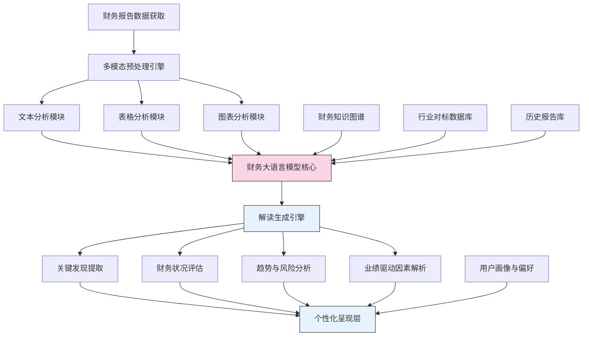

---
{"dg-publish":true,"tags":["AI财务应用","大语言模型","财务报告","智能分析","LLM应用"],"创建日期":"2024-05-14","permalink":"/知识共享/001_财务/99_其他/AI与财务应用/01_智能财务分析/1.1 大语言模型应用/大语言模型驱动的财务报告解读/","dgPassFrontmatter":true}
---

## 技术概述

大语言模型驱动的财务报告解读系统利用先进的自然语言处理技术，实现对复杂财务报告的智能理解、分析和解释。该系统融合了以下核心技术：

- **财务领域专用大模型**：基于通用大语言模型架构，通过财务文本语料库的深度微调和领域适配，使模型具备专业财务语义理解能力
- **多模态融合分析**：整合文本、表格、图表等多种模态信息，通过跨模态学习算法构建完整的报告理解能力
- **财务本体知识图谱**：融入财务领域专业知识体系，增强模型对财务概念关系和行业规则的理解
- **因果推理增强**：通过显式因果推理模块，提升对财务状况变化原因和影响的解释能力
- **适应性解读生成**：根据不同用户角色和关注点，动态生成差异化的财务解读内容

相比传统财务分析方法，该系统能够处理更大规模的报告文本，发现潜在的关联信息，提供跨期、跨企业的比较分析，并生成人类可理解的叙事性解释。

## 系统架构

系统架构由五个核心层次组成：

1. **数据获取与预处理层**：实现对多种格式财务报告的获取、解析和标准化
2. **多模态分析层**：分别处理文本、表格和图表数据，提取结构化信息
3. **大模型理解核心**：融合多模态信息和外部知识，构建报告的深度理解
4. **解读生成层**：基于理解结果，生成多维度的财务解读内容
5. **个性化呈现层**：根据用户角色和关注点，动态调整内容组织和呈现方式

系统通过知识图谱、行业对标数据和历史报告库作为补充知识源，增强对财务报告的情境化理解和比较分析能力。

## 实施方案

### 技术实施路线图

**第一阶段：基础模型构建（2-3个月）**
- 收集并预处理大规模财务报告语料库
- 基于通用大语言模型进行财务领域适配训练
- 开发基础的财务文本解析与理解功能

**第二阶段：多模态分析扩展（3-4个月）**
- 开发表格和图表的结构化信息提取模块
- 构建跨模态信息融合机制
- 集成财务知识图谱和外部数据源

**第三阶段：高级分析能力开发（4-5个月）**
- 实现跨期比较分析功能
- 开发行业对标和竞争对手比较分析
- 构建因果关系推理和解释生成模块

**第四阶段：个性化与优化（2-3个月）**
- 开发用户画像和偏好学习模块
- 实现解读内容的自适应生成与组织
- 优化系统性能、响应速度和模型精度

### 技术挑战与解决策略

1. **财务语言的专业性与复杂性**
   - 挑战：财务报告包含大量专业术语和复杂概念关系
   - 解决策略：构建财务领域词表和概念本体，结合持续的领域专家反馈进行迭代优化

2. **多模态信息的一致理解**
   - 挑战：文本、表格和图表中的信息需要协调一致的解读
   - 解决策略：设计跨模态一致性检验机制，构建多模态对齐预训练任务

3. **解读的准确性与可靠性**
   - 挑战：避免模型产生错误解读或无根据的推断
   - 解决策略：实施严格的事实核查机制，建立可追溯的推理链，增强模型的不确定性表达

4. **时效性与最新准则适应**
   - 挑战：财务准则和规定持续更新，模型需要保持最新
   - 解决策略：建立准则更新监控机制，设计增量学习框架适应新规则

## 价值创造

### 量化价值评估

1. **时间效率提升**
   - 财务报告初步分析时间减少80-90%
   - 跨企业比较分析效率提高60-75%
   - 异常与风险点识别速度提升70-85%

2. **决策质量改善**
   - 关键财务信息覆盖率提高40-60%
   - 财务决策支持的全面性提升50-65%
   - 隐藏风险和机会识别准确率增加35-45%

3. **专业能力扩展**
   - 非财务专业人员理解准确度提高75-90%
   - 财务分析师深度分析时间增加45-60%
   - 跨职能团队协作效率提升30-50%

4. **知识积累与传承**
   - 财务知识沉淀与复用率提高60-80%
   - 机构财务分析能力标准化提升50-70%
   - 新员工学习曲线缩短40-60%

### 投资回报分析

投资回报率(ROI)预期达到250-350%（2年期），主要来源于：
- 人力成本节约与效率提升（45%）
- 决策质量提高带来的价值增长（40%）
- 风险预防与及时干预（15%）

投资成本主要包括：模型训练与部署（35%）、知识库构建（25%）、系统集成（20%）、持续运维（20%）。典型项目投资回收期为8-14个月。

## 未来演进

### 技术迭代路线图

**近期演进（1-2年）**
- 集成实时经济数据和市场信息，增强宏观环境分析
- 发展多语言报告处理能力，支持全球化企业
- 构建更精细的行业垂直模型，适应不同行业特点

**中期演进（2-3年）**
- 开发主动式财务洞察推送功能，预测性识别关注点
- 构建多维度情景模拟能力，评估政策和战略影响
- 实现与企业决策系统的深度集成，形成闭环优化

**远期演进（3-5年）**
- 发展具有自主学习能力的财务智能体，持续进化分析能力
- 构建跨企业财务智慧网络，汇集集体智能
- 实现财务状况的全息视图，动态模拟未来发展路径

### 扩展应用场景

1. **投资分析扩展**：对投资组合中的企业进行自动化深度分析，识别投资价值与风险

2. **供应链财务评估**：扩展至评估供应商和合作伙伴的财务健康状况，预警潜在风险

3. **监管合规检查**：帮助企业自动审查财务报告的合规性，提前发现问题

4. **并购目标评估**：为并购活动提供深度财务尽职调查支持，识别价值点和风险点

## 实验验证

### 概念验证方案

**阶段一：基准测试（4-6周）**
- 选择10-15份典型财务报告进行基准测试
- 与专业财务分析师的人工分析结果对比
- 评估模型在关键指标识别、趋势分析和风险发现方面的表现

**阶段二：受控用户测试（6-8周）**
- 招募20-30位不同角色的内部用户进行测试
- 设计结构化任务评估系统的实用性和准确性
- 收集定量和定性反馈，识别改进点

**阶段三：扩展验证（8-10周）**
- 扩大测试范围至50-100份不同行业、规模的财务报告
- 实施A/B测试，比较不同技术方案的效果
- 验证系统在复杂场景下的鲁棒性和扩展性

### 评估指标框架

**准确性指标**
- 关键财务指标识别率：系统识别的关键指标与专家判定的匹配程度
- 解读准确率：系统生成的解读与专家解读的一致性
- 见解价值评分：由专业人员评估的见解价值和独特性

**用户体验指标**
- 理解便捷度：非专业用户对系统生成内容的理解程度
- 信任度：用户对系统解读的信任程度
- 决策支持有效性：系统对用户决策过程的促进程度

**技术性能指标**
- 处理速度：完成一份标准财务报告分析的时间
- 扩展能力：系统处理不同格式、结构和复杂度报告的能力
- 学习适应性：系统对新概念、新指标的识别和理解能力

## 未来影响

大语言模型驱动的财务报告解读系统将重塑财务分析工作的本质，从机械性的数据处理转向高价值的战略分析与决策支持。随着技术的成熟，我们预见以下深远影响：

1. **民主化专业财务知识**：使更广泛的业务人员能够理解和利用财务信息，打破信息壁垒

2. **重新定义财务分析师角色**：从数据收集和基础分析转向战略思考和创造性分析

3. **加速财务信息流动**：显著提高市场信息效率，使资本更精准地流向价值创造者

4. **增强财务透明度**：通过更一致、全面的解读，提高企业财务信息的透明度和可比性

最终，该系统将成为连接财务数据与业务决策的智能桥梁，释放财务信息的全部价值，并推动组织决策流程的根本性变革。 