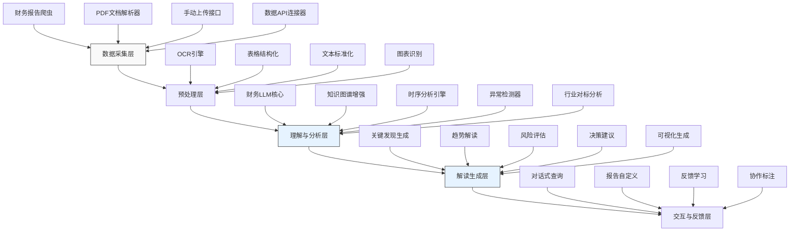

---
{"dg-publish":true,"tags":["AI财务应用","大语言模型","财务报告解读","自然语言处理","智能分析"],"创建日期":"2024-04-26","permalink":"/知识共享/001_财务/99_其他/AI与财务应用/01_智能财务分析/1.1 大语言模型驱动的财务报告解读/","dgPassFrontmatter":true}
---

大语言模型(LLM)作为自然语言处理领域的重大突破，为财务报告解读带来了革命性的转变。传统财务报告分析依赖人工进行枯燥繁琐的阅读和解读，效率低下且容易遗漏关键信息。本方案提出一种基于大语言模型的财务报告智能解读系统，能自动化提取、分析和解读财务报告中的结构化与非结构化信息，为财务分析师、投资者和管理者提供深度洞察。

## 技术概述

### AI技术栈与核心算法

本系统采用多层次技术栈，结合最先进的大语言模型与财务领域专业知识：

1. **基础大语言模型层**：采用GPT-4或类似的大型语言模型作为基础推理引擎，提供强大的自然语言理解和生成能力。

2. **财务领域适配层**：通过特定的财务报告数据集进行微调(Fine-tuning)和RAG(检索增强生成)增强，使模型更好地理解财务术语、会计准则和报表结构。

3. **多模态处理引擎**：集成OCR、表格识别和图表分析技术，处理财务报告中的多种信息形式。

4. **财务知识图谱**：构建财务领域知识图谱，包含会计准则、行业标准、企业间关系等信息，增强模型的推理能力。

5. **因果推理模块**：基于因果推理算法，分析财务数据变化的原因和潜在影响，提供更深层次的解释。

### 技术协同工作流程

这些技术组件协同工作，形成完整的解读流程：

1. 多模态处理引擎首先提取财务报告中的文本、表格和图表数据，将非结构化内容转换为结构化数据。

2. 基础LLM和财务适配层共同分析提取的信息，识别关键财务指标、趋势和异常。

3. 财务知识图谱提供上下文信息，帮助系统理解行业背景和特定企业的历史表现。

4. 因果推理模块分析指标间的关系，识别潜在的驱动因素和风险点。

5. 最终，系统生成深度解读报告，包含关键发现、趋势分析、风险预警和决策建议。

### 与传统解决方案对比

| 特性 | 传统财务报告分析 | 大语言模型驱动的财务报告解读 |
|------|-----------------|---------------------------|
| 处理速度 | 慢（数小时到数天） | 快（分钟级别） |
| 分析深度 | 受限于分析师经验 | 基于海量数据和多维度分析 |
| 一致性 | 主观性强，分析师间差异大 | 高度一致，可复现 |
| 规模能力 | 难以同时分析多报告 | 可并行处理大量报告 |
| 跨语言能力 | 受语言限制 | 多语言报告自动处理 |
| 跨期比较 | 耗时且易遗漏 | 自动进行时序比较和异常检测 |
| 洞察提取 | 依赖经验累积 | 基于数据模式和行业最佳实践 |

### 技术创新点

1. **财务语境感知注意力机制**：特别设计的注意力机制，使模型更关注财务报告中的关键信息点和敏感数据变化。

2. **动态适应性金融词汇处理**：能够识别和适应不同行业、不同企业特有的财务词汇和表达方式。

3. **跨文档推理能力**：不仅分析单份财务报告，还能关联多份历史报告、行业报告和市场数据，提供全景式解读。

4. **可解释性决策支持**：每个结论和建议都附带推理过程和依据，增强决策透明度。

## 系统架构

### 组件功能与交互

1. **数据采集层**：负责从多渠道获取财务报告数据，包括自动爬取公开财报、解析PDF文档、接收手动上传和连接外部财务数据API。

2. **预处理层**：将非结构化的报告转换为结构化数据，包括OCR识别文本、表格结构化处理、文本标准化和图表信息提取。

3. **理解与分析层**：系统的核心部分，由财务领域增强的LLM引擎驱动，结合知识图谱进行深度理解，同时进行时序分析、异常检测和行业对标分析。

4. **解读生成层**：基于分析结果，生成多维度的解读内容，包括关键发现摘要、趋势解读、风险评估、决策建议和自动化可视化图表。

5. **交互与反馈层**：提供对话式查询界面，允许用户深入探索特定财务问题，自定义报告内容，并通过反馈机制不断优化系统性能。

### 数据流与处理流程

1. 原始财务报告首先通过数据采集层获取，并传递给预处理层。

2. 预处理层将混合格式的报告拆分为结构化数据（表格数据、关键指标）和非结构化数据（管理层讨论、风险披露等）。

3. 理解与分析层接收结构化数据，进行深度分析：
   - 计算关键财务比率和指标
   - 检测异常变化和趋势
   - 与历史数据和行业基准比较
   - 应用因果推理分析变化驱动因素

4. 解读生成层将分析结果转化为有意义的解读内容，按重要性组织发现，并生成决策建议。

5. 交互层允许用户通过自然语言查询深入探索数据，如"解释毛利率下降的主要原因"或"评估公司偿债能力趋势"。

### 系统弹性与可扩展性

1. **水平扩展能力**：采用微服务架构，各功能模块独立部署，可根据负载动态扩缩容。

2. **多模型支持**：系统架构支持灵活切换或组合不同的大语言模型，如GPT-4、Claude、LLaMA等，适应技术演进。

3. **增量学习机制**：系统能从用户反馈和新数据中持续学习，不断改进解读质量。

4. **行业适配插件**：设计模块化的行业适配插件，可快速拓展至不同行业的财务报告解读需求。

## 实施方案

### 技术实施路线图

**阶段一：基础能力构建（1-3个月）**
- 搭建基础LLM调用框架
- 实现财务报告PDF解析和结构化
- 开发基础分析逻辑和指标计算
- 构建初步财务术语知识库

**阶段二：核心功能开发（3-6个月）**
- 财务领域LLM优化与微调
- 知识图谱构建与集成
- 时序分析与异常检测算法实现
- 解读生成引擎开发

**阶段三：高级功能与集成（6-9个月）**
- 因果推理模块开发
- 多源数据整合能力
- 行业对标分析实现
- 交互式查询界面开发

**阶段四：优化与扩展（9-12个月）**
- 系统性能与准确性优化
- 用户反馈收集与模型迭代
- 行业特化模型开发
- 企业系统集成接口

### 所需资源与技术依赖

**硬件资源**：
- 高性能计算服务器（优先GPU支持）
- 分布式存储系统
- 负载均衡服务器集群

**软件与技术依赖**：
- 大语言模型API（如OpenAI API、本地部署的开源LLM）
- OCR和文档处理库（如Tesseract、PDFMiner）
- 自然语言处理工具包（如HuggingFace Transformers）
- 知识图谱存储与查询系统（如Neo4j）
- 数据处理与分析框架（如Apache Spark）
- 可视化库（如D3.js、ECharts）

**人员资源**：
- 机器学习/NLP工程师
- 财务领域专家
- 全栈开发工程师
- 数据科学家
- UI/UX设计师
- 质量保证专家

### 潜在技术挑战与解决策略

| 挑战 | 解决策略 |
|------|---------|
| 财务报表格式多样性 | 开发自适应表格识别算法，建立多模板匹配系统 |
| 财务术语理解准确性 | 构建专业财务领域知识库，针对性微调模型 |
| 推理过程透明性不足 | 实现可解释AI技术，展示关键决策路径和依据 |
| 多语言报告处理 | 采用多语言预训练模型，实现跨语言知识迁移 |
| 隐私数据保护 | 实施差分隐私，支持本地部署，加密敏感信息 |
| 模型幻觉问题 | 建立财务事实核查机制，多源信息交叉验证 |
| 计算资源需求高 | 采用模型量化、知识蒸馏和增量处理技术降低资源消耗 |

### 风险管理

**数据安全风险**：
- 实施端到端加密
- 数据访问权限分级控制
- 敏感信息匿名化处理
- 合规审计日志记录

**技术实施风险**：
- 采用敏捷开发方法，快速迭代测试
- 建立技术备选方案库
- 设立技术风险预警机制
- 关键技术点提前验证

**用户采纳风险**：
- 开发直观易用的界面
- 提供详细的使用指南和培训
- 设计渐进式功能引入策略
- 建立用户反馈快速响应机制

## 价值创造

### 财务价值量化评估

**效率提升**：
- 分析时间减少约85%（从平均8小时/报告降至40分钟以内）
- 财务分析师产能提升200%以上
- 报告处理自动化率达95%

**成本节约**：
- 减少财务分析人力成本约60%
- 降低决策失误带来的机会成本，保守估计提升投资回报率3-5%
- 减少合规风险和相关潜在罚款，年均可节约合规成本约20%

**收入增长**：
- 更快捷准确的洞察支持更敏捷的市场响应，提升市场份额1-2%
- 为高管提供更及时的战略建议，促进新业务增长3-5%
- 外部服务商可将此作为增值服务，创造新收入流（增加服务收入15-20%）

### ROI分析

| 投资项目 | 估算成本 | 预期回报 | 回收期 |
|---------|---------|---------|--------|
| 初始开发成本 | $500,000-800,000 | - | - |
| 年度运营成本 | $150,000-250,000/年 | - | - |
| 效率提升与人力节约 | - | $400,000-600,000/年 | 12-18个月 |
| 决策质量提升 | - | $300,000-800,000/年 | 18-24个月 |
| 合规风险降低 | - | $200,000-400,000/年 | 24-36个月 |
| 总计 | 首年$650,000-1,050,000 | $900,000-1,800,000/年 | 18-24个月 |

### 决策质量提升

1. **洞察深度增强**：
   - 自动发现常规分析可能忽略的细微趋势和模式
   - 实现跨期、跨公司的复杂关联分析
   - 将定性信息（如管理层讨论）与定量指标相结合

2. **决策速度提升**：
   - 将财务报告解读时间从天级缩短到分钟级
   - 支持即时查询，快速响应紧急决策需求
   - 自动监控关键指标，提前预警风险

3. **分析全面性提升**：
   - 全面覆盖所有财务报表、附注和管理层讨论
   - 自动整合外部市场数据和行业基准
   - 考虑非财务因素对财务表现的影响

### 竞争优势创新

1. **信息不对称优势**：在竞争对手仍依赖传统分析方法时，获得更快更深入的市场洞察。

2. **智能资源配置**：基于更精准的财务趋势预测，优化资源分配和投资决策。

3. **战略敏捷性**：加速财务闭环，实现更快的业务调整和战略转向。

4. **人才优化**：将财务分析师从重复性工作中解放出来，集中于高价值策略分析。

5. **跨部门协同**：提供统一的财务解读，促进财务、运营、销售等部门的协同决策。

## 未来演进

### 技术迭代路线图

**近期（1-2年）**：
- 整合结构化与非结构化财务数据的深度分析能力
- 开发针对特定行业的专业解读模型
- 增强多语言、多地区财务报告处理能力

**中期（2-3年）**：
- 实现财务预测与模拟能力，进行"假设情景"分析
- 开发跨企业价值链分析，识别上下游关系影响
- 集成宏观经济数据，提供更广阔的分析视角

**远期（3-5年）**：
- 实现自主财务策略建议能力，提供决策方案组合
- 开发自适应学习系统，根据实际结果持续优化建议质量
- 构建财务数字孪生，实现实时财务健康监控和预测

### 与未来AI技术趋势结合点

1. **多代理协作系统**：部署专门的AI代理处理不同类型的财务信息（税务、投资、运营成本等），协同工作提供综合解读。

2. **认知架构整合**：整合记忆、推理、学习等认知功能，构建更像人类专家的财务分析系统。

3. **神经符号结合**：将神经网络的模式识别能力与符号逻辑的精确推理相结合，提高财务分析的准确性和可解释性。

4. **生成式辅助分析**：利用生成式AI创建各种财务情景和预测，帮助决策者评估不同路径的潜在结果。

### 扩展应用场景

1. **投资尽职调查**：自动化评估潜在投资目标的财务健康状况和风险。

2. **智能财务审计**：辅助审计师快速识别异常模式和潜在风险点。

3. **竞争情报分析**：通过分析竞争对手财报，自动生成竞争态势报告。

4. **ESG和可持续性评估**：解读非财务报告，评估企业ESG表现和长期可持续性。

5. **实时财务控制台**：结合实时财务数据，构建动态财务监控系统。

## 实验验证

### 概念验证(POC)方案

**阶段一：基础能力验证**
- 选取10-15份不同行业的公开财务报告
- 测试基础报表识别和结构化能力
- 验证核心财务指标自动计算准确性
- 评估基本解读生成质量

**阶段二：分析深度验证**
- 设计15-20个复杂财务分析问题
- 对比AI解读与专业分析师解读
- 测试跨期分析和趋势识别能力
- 验证异常检测和风险评估准确性

**阶段三：用户价值验证**
- 招募3-5家企业财务团队参与测试
- 实际业务场景应用测试
- 收集用户体验和实用性反馈
- 验证决策支持有效性

### 评估指标

**技术性能指标**：
- 报表识别准确率 ≥ 95%
- 财务指标计算准确率 ≥ 99%
- 关键信息提取完整率 ≥ 90%
- 系统响应时间 ≤ 3分钟（标准报告）

**分析质量指标**：
- 关键发现相关性评分 ≥ 4.0/5.0
- 解读准确性评分 ≥ 4.2/5.0
- 与专业分析师一致率 ≥ 85%
- 额外洞察发现率 ≥ 20%

**用户价值指标**：
- 时间节约率 ≥ 80%
- 决策信心提升评分 ≥ 4.0/5.0
- 用户满意度 ≥ 4.5/5.0
- 持续使用意愿 ≥ 90%

### A/B测试设计

**测试组设置**：
- A组：传统人工财务分析
- B组：AI辅助财务分析
- C组：完全AI自动化财务分析

**测试场景**：
1. 季度财报快速解读
2. 财务异常检测
3. 投资决策支持
4. 竞争对手分析

**测量指标**：
- 完成时间
- 分析正确率
- 洞察发现数量
- 决策者满意度

### 迭代策略

1. **数据驱动迭代**：基于解读准确性数据，持续改进模型

2. **用户反馈循环**：建立用户反馈渠道，定期收集并优化系统

3. **持续学习机制**：系统自动记录成功与失败案例，应用增量学习

4. **专家审核流程**：定期由财务专家审核系统输出，提供改进建议

5. **竞争性测试**：定期与市场上其他解决方案进行对比测试，确保技术领先性

大语言模型驱动的财务报告解读系统代表了财务分析的未来方向，通过智能技术显著提升企业理解和利用财务数据的能力。该系统不仅能提高分析效率和准确性，更能挖掘传统方法难以发现的深层洞察，为企业决策提供强有力的支持。随着大语言模型技术的不断进步和财务领域知识的深度融合，这一系统将持续演进，成为未来智能财务的核心组成部分。 