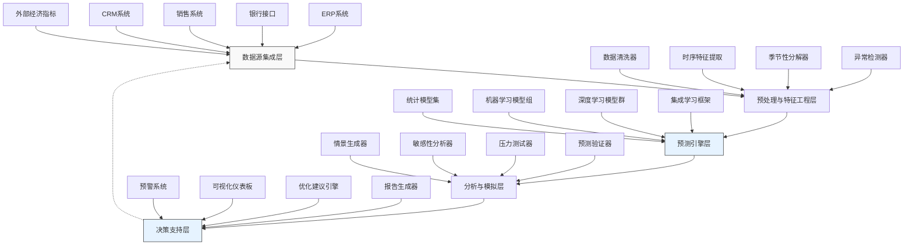

---
{"dg-publish":true,"tags":["AI财务应用","预测系统","现金管理","流动性预测","智能预测","财务规划"],"创建日期":"2024-05-01","permalink":"/知识共享/001_财务/99_其他/AI与财务应用/01_智能财务分析/1.2 智能预测与预警/1.2 现金流动态预测系统/","dgPassFrontmatter":true}
---

现金流动态预测系统是一种结合机器学习和财务建模的创新解决方案，旨在解决传统现金流预测方法精度不足、响应滞后且难以适应复杂业务环境的问题。在当前经济波动性增加、业务模式快速变化的背景下，精准的现金流预测对企业生存和发展至关重要。本方案通过整合多源数据输入、构建自适应预测模型和动态反馈机制，为财务决策者提供高精度、实时更新的现金流预测，帮助企业优化资金管理、把握投资机会并有效应对流动性风险。

## 技术概述

### AI技术栈与核心算法

现金流动态预测系统采用多层架构设计，融合多种先进技术实现高精度预测：

1. **数据整合与处理层**：
   - **多源数据采集**：自动从ERP、银行系统、销售平台等获取结构化和非结构化数据
   - **时序数据预处理**：季节性分解、异常检测和处理、缺失值智能填充
   - **特征工程**：自动识别关键预测因子、时滞特征提取、衰减系数建模
   - **数据增强**：通过历史模拟和情景生成扩充训练数据集

2. **预测模型层**：
   - **集成模型架构**：结合统计模型(ARIMA、ETS)、机器学习(XGBoost、LightGBM)和深度学习(LSTM、Transformer)的混合预测系统
   - **层次化预测**：自顶向下和自底向上双向预测协调机制
   - **概率预测框架**：生成完整现金流分布而非单点预测，包含置信区间
   - **多时间尺度预测**：同时生成日、周、月、季度预测并保持一致性

3. **情景与敏感性分析层**：
   - **情景模拟引擎**：模拟不同业务条件下的现金流变化
   - **压力测试模块**：评估极端情况下的现金流韧性
   - **敏感性分析**：识别对现金流影响最大的关键变量
   - **变量关联网络**：可视化展示因素间相互影响关系

4. **智能决策支持层**：
   - **异常预警系统**：提前识别潜在现金流缺口和风险
   - **优化建议引擎**：生成资金调度和管理的智能建议
   - **流动性仪表板**：直观展示关键指标和预测结果
   - **主动预警机制**：根据预测结果自动触发预警和通知

### 技术协同工作流程

系统各组件协同工作，形成闭环的预测-分析-决策-反馈流程：

1. 数据整合层持续从各系统采集最新财务和业务数据，构建丰富的特征集。

2. 预测模型层基于最新数据生成多时间尺度、多情景的现金流预测。

3. 情景分析层评估不同条件下的现金流表现，识别关键影响因素。

4. 决策支持层将预测结果转化为可操作的管理建议和预警信号。

5. 反馈机制收集实际结果与预测的偏差，持续优化模型性能。

### 与传统预测方法对比

| 特性 | 传统现金流预测方法 | 现金流动态预测系统 |
|------|-------------------|-------------------|
| 预测精度 | 中低（平均误差20-40%） | 高（平均误差降至5-15%） |
| 更新频率 | 低（通常月度更新） | 高（每日甚至实时更新） |
| 时间尺度 | 有限（通常单一尺度） | 多尺度（日、周、月、季、年） |
| 输入数据 | 有限（主要为历史财务数据） | 广泛（财务、运营、市场、宏观因素） |
| 情景分析 | 基础（手动调整参数） | 高级（自动化情景生成与分析） |
| 适应性 | 低（难以适应业务变化） | 高（自我学习和适应新模式） |
| 不确定性量化 | 弱（通常只有点预测） | 强（概率分布和置信区间） |
| 异常识别 | 被动（事后识别） | 主动（预测性识别） |

### 技术创新点

1. **自适应学习框架**：系统通过持续比较预测与实际结果，自动调整模型参数和权重，实现在不断变化的业务环境中保持预测准确性。

2. **因果关系识别**：超越简单相关性分析，运用因果推断技术识别真正驱动现金流变化的关键因素，提供更可靠的解释和预测。

3. **多维度现金流预测**：不仅预测总体现金流，还细分客户类型、业务线、地区等维度，提供精细化管理依据。

4. **长短期平衡机制**：创新性融合短期波动因素与长期趋势模型，确保预测在各时间尺度上的一致性和准确性。

5. **主动学习策略**：系统持续识别预测不确定性高的区域，智能建议额外数据收集点，不断提升模型性能。

## 系统架构

### 组件功能与交互

1. **数据源集成层**：负责收集和整合各种影响现金流的数据：
   - 内部财务数据（应收账款、应付账款、历史现金流）
   - 销售和运营数据（订单、库存、生产计划）
   - 外部市场数据（行业趋势、竞争对手信息）
   - 宏观经济指标（利率、通胀率、汇率）
   - 季节性和特殊事件数据（促销、假期影响）

2. **预处理与特征工程层**：转换原始数据为模型可用的高质量特征：
   - 数据清洗和标准化处理
   - 时序特征提取（趋势、季节性、周期性）
   - 关联特征构建（跨系统数据关联）
   - 动态特征选择（基于预测贡献度）

3. **预测引擎层**：多模型协同生成现金流预测：
   - 统计模型处理基本时序模式
   - 机器学习模型捕捉复杂非线性关系
   - 深度学习模型识别长期依赖关系
   - 集成框架整合各模型优势提高整体准确性

4. **分析与模拟层**：评估现金流在不同情景下的表现：
   - 自动生成业务相关情景
   - 分析关键变量对现金流的影响
   - 模拟极端条件测试财务韧性
   - 验证预测结果的稳健性和可靠性

5. **决策支持层**：转化预测和分析为可操作的决策建议：
   - 提前预警潜在现金流问题
   - 推荐最优资金调配策略
   - 可视化展示预测结果和关键洞察
   - 生成决策支持报告和建议

### 数据流与处理流程

1. **数据采集与同步阶段**：
   - 定期自动从各系统采集最新数据
   - 确保数据时间对齐和一致性
   - 识别并标记数据质量问题
   - 建立数据依赖关系图谱

2. **数据转换与特征提取阶段**：
   - 时间序列分解与特征提取
   - 多源数据关联与融合
   - 特征重要性评估与选择
   - 特征工程与变换优化

3. **模型训练与预测阶段**：
   - 并行训练多种预测模型
   - 评估各模型在不同时间尺度的性能
   - 优化模型集成权重
   - 生成概率分布预测结果

4. **情景分析与解释阶段**：
   - 构建多元情景矩阵
   - 执行敏感性和假设分析
   - 生成预测解释和归因
   - 识别关键变动点和影响因素

5. **决策支持与反馈阶段**：
   - 基于预测生成行动建议
   - 监控预测与实际的偏差
   - 收集用户决策和反馈
   - 持续优化整个预测系统

### 系统弹性与可扩展性

1. **模块化设计**：系统采用松耦合的组件架构，支持灵活扩展和替换单个模块。

2. **可扩展数据连接器**：标准化的数据接口设计，可轻松添加新数据源。

3. **模型即服务**：预测模型封装为微服务，支持独立部署和扩展。

4. **分布式计算支持**：核心算法支持分布式计算，适应大规模数据处理需求。

5. **可配置预测管道**：支持通过配置而非编码方式调整预测流程和参数。

## 实施方案

### 技术实施路线图

**阶段一：基础能力构建（1-2个月）**
- 搭建核心数据收集管道
- 实现基本统计预测模型
- 开发初步可视化界面
- 建立预测验证框架

**阶段二：高级预测功能（2-4个月）**
- 实现机器学习和深度学习模型
- 开发模型集成框架
- 构建多时间尺度预测能力
- 完善现金流细分预测

**阶段三：情景分析与决策支持（3-5个月）**
- 实现情景模拟和敏感性分析
- 开发预警和建议生成系统
- 构建交互式决策支持界面
- 实施自适应学习机制

**阶段四：高级集成与优化（4-6个月）**
- 开发高级可视化和分析工具
- 实现与其他财务系统深度集成
- 构建预测性能自监控系统
- 优化算法性能和计算效率

### 所需资源与技术依赖

**硬件资源**：
- 计算服务器（支持模型训练和情景模拟）
- 数据存储系统（支持时序数据高效存储）
- 高性能数据库（支持复杂查询和分析）
- 备份和恢复系统（确保数据安全）

**软件与框架**：
- 数据处理：Apache Spark、Pandas、Dask
- 机器学习：Scikit-learn、XGBoost、LightGBM
- 深度学习：TensorFlow、PyTorch、Keras
- 时序分析：Prophet、StatsModels、Kats
- 可视化：D3.js、Plotly、Tableau

**人员技能需求**：
- 数据科学家（时序分析和预测建模）
- 财务分析师（业务规则和指标定义）
- 数据工程师（数据流水线和集成）
- 前端开发工程师（交互式仪表板）
- DevOps工程师（系统部署和监控）

### 潜在技术挑战与解决策略

| 挑战 | 解决策略 |
|------|---------|
| 数据质量不一致 | 实施多层数据验证、异常检测和智能数据修复机制 |
| 预测精度波动 | 采用集成学习和自适应模型选择，动态调整模型权重 |
| 业务剧烈变化 | 实现增量学习和模型快速适应机制，加入变化点检测 |
| 计算资源需求高 | 设计资源优化策略，包括模型压缩和选择性计算 |
| 多时间尺度一致性 | 开发专门的协调算法确保不同预测尺度间的一致性 |
| 解释性不足 | 整合可解释AI技术，提供预测归因和可视化解释 |
| 系统复杂度管理 | 实施模块化设计和清晰接口定义，简化系统维护 |

### 风险管理

**实施风险**：
- 采用增量式开发策略，确保核心功能优先完成
- 建立严格的测试和验证流程，减少部署风险
- 准备后备方案和回滚机制，应对系统问题
- 设计简化版本作为应急备用系统

**数据风险**：
- 实施严格的数据治理和安全控制
- 建立完整的数据血缘跟踪和审计
- 定期进行数据质量评估和清理
- 制定数据恢复和灾备方案

**预测风险**：
- 明确传达预测的不确定性和限制
- 持续监控预测性能并及时调整
- 提供多种预测情景而非单一结果
- 建立预测偏差警报和修正机制

## 价值创造

### 财务价值量化评估

**运营效率提升**：
- 现金流预测准确度提高35-50%
- 资金管理决策时间减少60-75%
- 资金使用效率提升15-25%
- 短期投资收益增加8-15%

**风险管理改进**：
- 流动性风险事件减少40-60%
- 融资成本降低5-12%
- 未预期现金缺口减少50-70%
- 紧急融资需求减少30-45%

**战略价值**：
- 投资决策质量提升25-40%
- 资本配置效率提高15-30%
- 财务计划可靠性增强40-55%
- 战略规划信息增加50-80%

### ROI分析

| 投资项目 | 估算成本 | 预期回报 | 回收期 |
|---------|---------|---------|--------|
| 初始开发成本 | $250,000-400,000 | - | - |
| 年度运营成本 | $80,000-120,000/年 | - | - |
| 资金效率提升 | - | $150,000-300,000/年 | 10-16个月 |
| 借贷成本降低 | - | $100,000-200,000/年 | 12-20个月 |
| 流动性风险减少 | - | $200,000-350,000/年 | 8-14个月 |
| 人力效率提升 | - | $80,000-150,000/年 | 16-24个月 |
| 总计 | 首年$330,000-520,000 | $530,000-1,000,000/年 | 7-12个月 |

### 竞争优势创新

1. **主动现金管理**：从被动响应转向主动预测和优化，提前数周甚至数月识别机会和风险。

2. **资本使用最优化**：基于精确预测优化资金调配，减少闲置资金和紧急融资需求。

3. **情景驱动决策**：通过多种预测情景评估各选项风险和回报，增强决策质量。

4. **战略敏捷性**：快速评估市场变化和战略决策对现金流的影响，提高组织应变能力。

5. **融资条件改善**：凭借更可靠的现金流预测增强与金融机构谈判能力，获取更优条件。

6. **投资者信心提升**：向投资者展示先进的财务管理能力，增强市场信心和企业估值。

## 未来演进

### 技术迭代路线图

**近期（1-2年）**：
- 增强数据自动抽取和整合能力
- 开发更精细的行业特定预测模型
- 实现移动端和警报系统集成
- 增强预测解释性和可视化能力

**中期（2-3年）**：
- 整合外部非结构化数据（新闻、社交媒体）
- 发展预测性智能建议系统
- 实现跨业务部门协同预测
- 增强自然语言交互和查询能力

**远期（3-5年）**：
- 构建完全自主的资金优化系统
- 实现与其他企业系统的深度集成
- 发展数字孪生技术模拟企业现金生态
- 建立行业基准和比较分析框架

### 与未来AI技术趋势结合点

1. **因果推理**：应用因果AI技术识别真正驱动现金流变化的业务因素，而非简单相关性。

2. **小样本学习**：针对罕见事件和新业务模式，利用小样本学习快速适应有限历史数据。

3. **神经符号系统**：结合神经网络的学习能力和符号逻辑的业务规则，创建更可靠的预测系统。

4. **对抗学习**：利用生成对抗网络创建更丰富、更真实的情景模拟数据。

5. **多模态融合**：整合数值、文本、图像等多种数据形式，全面捕捉影响现金流的因素。

### 扩展应用场景

1. **供应链-财务协同优化**：将现金流预测与供应链决策集成，实现财务约束下的供应链优化。

2. **动态定价与收入管理**：结合现金流预测辅助定价决策，平衡短期现金需求与长期价值。

3. **并购财务分析**：评估并购活动对企业现金流的短期冲击和长期影响。

4. **预算动态调整**：基于现金流预测实时调整部门预算，确保资源最优分配。

5. **战略投资组合管理**：利用现金流预测指导长期战略投资决策和资本分配。

## 实验验证

### 概念验证(POC)方案

**阶段一：历史数据回测**
- 收集过去12-24个月的现金流数据
- 构建基础预测模型并验证准确性
- 与现有预测方法进行比较
- 评估潜在改进空间和价值

**阶段二：预测系统原型**
- 建立包含核心功能的系统原型
- 进行受控环境下的实时预测测试
- 验证多种业务场景的预测性能
- 收集用户反馈优化用户体验

**阶段三：生产环境试点**
- 选择特定业务单元进行完整系统试点
- 同时运行现有系统和新系统进行对比
- 监控关键性能指标和业务价值
- 优化系统准备全面部署

### 评估指标

**技术评估指标**：
- 预测准确度（MAPE < 15%）
- 提前预警时间（至少提前2-4周）
- 计算效率（更新耗时 < 30分钟）
- 系统可用性（> 99.5%）

**业务评估指标**：
- 现金持有优化（闲置资金减少 > 20%）
- 融资成本降低（> 8%）
- 流动性风险事件减少（> 40%）
- 资金计划准确性提高（> 35%）

**用户评估指标**：
- 用户采纳率（> 85%）
- 决策支持满意度（> 4.2/5.0）
- 报告使用频率（每周至少3次）
- 系统推荐接受率（> 70%）

### 实验设计

**对照实验**：
- 传统预测方法（电子表格和简单模型）
- 单一算法预测（仅统计或仅机器学习）
- 完整的动态预测系统

**场景测试**：
1. 正常业务周期预测
2. 业务波动与季节性变化
3. 市场冲击模拟（如利率变化）
4. 重大业务决策影响（如扩张或收缩）

**评估方法**：
- 定量性能指标（MAPE、MAE、RMSE）
- 预测区间覆盖率分析
- 财务决策影响模拟
- 用户体验和决策改进调查

### 迭代优化策略

1. **持续性能监控**：建立预测性能仪表板，跟踪关键指标变化。

2. **自动模型评估**：定期评估各模型贡献度，调整集成权重。

3. **智能特征选择**：动态评估特征重要性，优化特征集。

4. **用户反馈循环**：收集用户反馈并快速迭代改进。

5. **定期基准测试**：与最新算法和行业最佳实践比较，确保系统保持先进性。

现金流动态预测系统代表了财务预测领域的重大技术飞跃，通过整合先进的AI技术与深厚的财务知识，为企业提供前所未有的现金管理能力。其核心价值不仅在于提高预测准确性，更在于通过前瞻性洞察支持战略决策，帮助企业在不确定环境中保持财务弹性和竞争优势。随着系统持续演进和企业数字化程度提高，这一系统有望成为未来智能财务管理的基石，重新定义企业资金管理的最佳实践。 