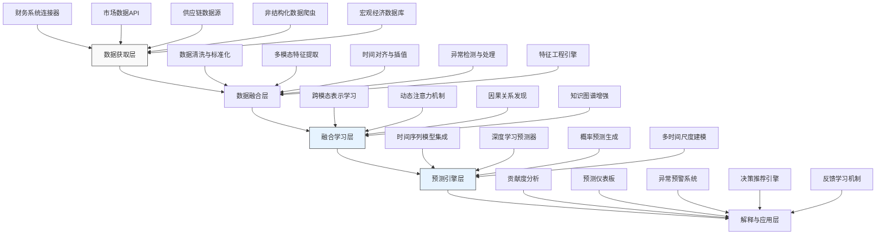

---
{"dg-publish":true,"tags":["AI财务应用","多源数据","预测框架","机器学习","数据融合","智能预测"],"创建日期":"2024-04-26","permalink":"/知识共享/001_财务/99_其他/AI与财务应用/01_智能财务分析/1.2 智能预测与预警/多源数据融合预测框架/","dgPassFrontmatter":true}
---

在财务决策环境日益复杂的今天，单一数据源已无法满足高精度预测需求。传统财务预测主要依赖历史财务数据，忽略了市场情绪、供应链动态、宏观经济指标等外部因素的影响，导致预测准确性不足。本方案提出一种创新的多源数据融合预测框架，通过整合内外部结构化与非结构化数据，应用先进的机器学习算法和深度融合技术，显著提升财务预测的准确性、及时性和可解释性。

## 技术概述

### AI技术栈与核心算法

多源数据融合预测框架采用分层架构的技术栈，结合多种先进算法实现智能预测：

1. **数据融合层**：
   - **多模态特征提取**：采用专门的特征提取网络处理不同类型数据（时间序列、文本、图像等）
   - **异构数据对齐**：基于动态时间规整(DTW)和语义对齐技术，解决不同数据源时间粒度和格式差异
   - **缺失数据处理**：结合概率图模型和深度生成网络进行智能数据补全和噪声过滤

2. **融合学习层**：
   - **注意力机制**：动态分配不同数据源的权重，根据预测场景和历史表现自适应调整
   - **跨模态表示学习**：将不同模态数据映射到统一语义空间，实现深层特征融合
   - **因果发现算法**：基于因果推理和贝叶斯网络识别关键驱动因素和依赖关系

3. **预测引擎层**：
   - **混合预测模型**：集成时间序列模型(Prophet、ARIMA)、深度学习模型(Transformer)和梯度提升树(XGBoost)
   - **多任务学习框架**：同时预测多个相关财务指标，利用指标间关系提升整体准确性
   - **概率预测机制**：生成预测分布而非单点预测，提供不确定性评估和风险分析

4. **解释与校准层**：
   - **模型可解释性模块**：基于SHAP值和LIME技术，解释各因素对预测结果的贡献
   - **自动偏差检测**：持续监控预测偏差，识别系统性误差来源
   - **主动学习机制**：根据预测误差和不确定性，智能选择需要人类专家验证的预测

### 技术协同工作流程

这些技术组件协同工作，形成端到端的预测流程：

1. 数据获取系统从多个来源收集内外部数据，包括财务系统、市场数据、供应链信息、新闻媒体等。

2. 数据融合层将异构数据标准化、对齐和预处理，生成融合特征表示。

3. 融合学习层分析各数据源的相关性和重要性，构建综合表示并发现因果关系。

4. 预测引擎基于融合数据和发现的模式，生成多指标的概率预测和多时间尺度的预测序列。

5. 解释与校准层提供直观的预测解释，标识关键影响因素，并随着新数据到来不断优化模型。

### 与传统解决方案对比

| 特性 | 传统财务预测方法 | 多源数据融合预测框架 |
|------|-----------------|---------------------|
| 数据来源 | 主要使用历史财务数据 | 整合财务、市场、社交媒体、宏观经济等多源数据 |
| 预测精度 | 中等（平均误差15-25%） | 高（平均误差降至7-12%） |
| 时效性 | 通常为月度或季度预测 | 支持实时至年度多尺度预测 |
| 适应性 | 面对市场变化表现差 | 能够快速适应新趋势和突发事件 |
| 可解释性 | 有限或缺乏 | 提供因素贡献分析和直观解释 |
| 不确定性处理 | 通常提供单点预测 | 生成概率分布和置信区间 |
| 自适应学习 | 需要人工干预重新训练 | 支持在线学习和自动适应 |

### 技术创新点

1. **多层次融合架构**：不同于简单的数据拼接，采用从特征、表示到决策的多层次融合策略，最大化提取跨源信息。

2. **财务领域知识增强**：将财务领域知识（如会计恒等式、季节性规律）编码到神经网络结构中，确保预测结果符合财务规则。

3. **动态源选择机制**：根据不同预测目标和历史准确性，自动选择最相关的数据源组合，优化计算资源和预测效果。

4. **多级时间尺度建模**：同时在日、周、月、季度和年度级别建模，捕捉不同时间尺度的模式和关系。

5. **异常情景适应性**：特别设计的对抗训练和异常情景模拟模块，提高模型在黑天鹅事件中的表现。

## 系统架构

### 组件功能与交互

1. **数据获取层**：负责连接和采集各类数据源，包括：
   - 内部财务系统（ERP、账务系统、交易数据）
   - 市场数据（股价、汇率、商品价格、行业指数）
   - 供应链信息（订单、库存、物流数据）
   - 非结构化数据（新闻、社交媒体、分析报告）
   - 宏观经济指标（GDP、CPI、失业率、央行政策）

2. **数据融合层**：处理异构数据并创建一致的融合表示：
   - 对不同来源数据进行清洗、标准化和质量评估
   - 针对不同数据类型（结构化、半结构化、非结构化）应用专门的处理流程
   - 解决时间粒度不匹配和数据缺失问题
   - 生成融合特征空间，保留各数据源的信息并减少冗余

3. **融合学习层**：深度分析数据间关系，构建预测基础：
   - 学习不同数据源间的相互关系和影响模式
   - 识别关键因果链和影响路径
   - 动态评估各数据源在不同情境下的重要性
   - 构建多模态语义表示，支持跨源信息共享

4. **预测引擎层**：基于融合表示生成精确预测：
   - 集成多种预测算法，针对不同类型指标选择最优组合
   - 同时预测多个财务指标，确保结果一致性
   - 生成概率分布而非单点预测，提供不确定性评估
   - 在多个时间尺度上建模，支持短期和长期预测

5. **解释与应用层**：将预测转化为可操作的洞察：
   - 解释预测背后的主要驱动因素及其贡献度
   - 提供直观的可视化界面展示预测结果和置信区间
   - 监测异常模式并触发预警机制
   - 根据预测结果生成决策建议
   - 收集用户反馈不断优化模型和预测

### 数据流与处理流程

1. **数据采集阶段**：
   - 定期和实时采集多源数据
   - 对每个数据源进行初步验证和质量检查
   - 标记数据元数据（来源、时间戳、可靠性评分）

2. **预处理阶段**：
   - 标准化不同尺度的数值型数据
   - 处理文本数据提取情绪和关键信息
   - 对时序数据进行时间对齐和重采样
   - 处理缺失值和离群值

3. **特征融合阶段**：
   - 创建跨源特征组合
   - 应用降维技术处理高维特征空间
   - 使用注意力机制学习特征重要性
   - 建立特征间关系图谱

4. **预测生成阶段**：
   - 根据预测目标选择适当的模型组合
   - 生成概率分布和置信区间
   - 通过集成方法合并多模型预测
   - 应用领域约束确保结果合理性

5. **解释与优化阶段**：
   - 生成因素贡献度分析
   - 识别预测中的不确定性来源
   - 将新数据反馈到模型进行在线更新
   - 定期重新评估模型性能和数据源价值

### 系统弹性与可扩展性

1. **模块化设计**：系统采用微服务架构，各功能模块独立部署，便于扩展和替换。

2. **数据源灵活性**：支持动态添加、移除或替换数据源，无需重构整个系统。

3. **计算资源弹性**：根据预测任务复杂度和紧急程度自动调整计算资源分配。

4. **行业适配能力**：提供行业特定模块，可根据不同行业特点定制数据源选择和模型参数。

5. **多租户支持**：支持多企业独立部署和共享基础架构模式，满足不同规模企业需求。

## 实施方案

### 技术实施路线图

**阶段一：基础建设（1-3个月）**
- 搭建核心数据集成框架
- 实现主要内部数据源连接
- 开发基础数据处理和清洗流程
- 构建初始特征工程管道

**阶段二：融合能力开发（3-5个月）**
- 实现多模态特征提取模块
- 开发跨源数据对齐算法
- 构建表示学习和融合框架
- 整合外部数据源API连接

**阶段三：预测引擎构建（4-6个月）**
- 实现模型集成和自动选择机制
- 开发多时间尺度预测能力
- 构建概率预测生成模块
- 设计异常情景检测和处理机制

**阶段四：应用与优化（5-8个月）**
- 开发可视化和交互界面
- 实现预测解释和贡献度分析
- 构建预警和决策建议系统
- 设计反馈收集和模型优化机制

### 所需资源与技术依赖

**硬件资源**：
- 分布式计算集群（支持实时和批量处理）
- 高性能存储系统（支持结构化和非结构化数据）
- GPU/TPU加速器（用于深度学习模型训练）
- 负载均衡服务器（确保系统稳定性）

**软件与框架**：
- 数据处理：Apache Spark、Kafka、Airflow
- 机器学习：TensorFlow、PyTorch、LightGBM
- 因果分析：DoWhy、CausalML
- 时序分析：Prophet、Kats、GluonTS
- 可视化：Plotly、D3.js、ECharts

**人员技能需求**：
- 数据工程师（数据集成和流处理）
- 机器学习工程师（算法实现和优化）
- 财务领域专家（特征设计和结果验证）
- 全栈开发工程师（应用开发和系统集成）
- DevOps工程师（部署和运维）

### 潜在技术挑战与解决策略

| 挑战 | 解决策略 |
|------|---------|
| 数据源质量不一致 | 实施质量评分机制，动态调整不同源的权重 |
| 预测偏移问题 | 采用漂移检测和自适应更新的在线学习方法 |
| 处理延迟数据 | 设计两阶段预测机制，先用可用数据预测，后续补充更新 |
| 黑天鹅事件应对 | 构建异常情境模拟库，通过对抗训练提高鲁棒性 |
| 计算资源需求高 | 实施预测任务优先级管理，针对不同指标采用不同复杂度模型 |
| 模型解释困难 | 结合SHAP、LIME和财务领域知识构建多层次解释框架 |
| 预测不确定性量化 | 融合贝叶斯方法和集成技术估计可靠的置信区间 |

### 风险管理

**数据风险**：
- 制定严格的数据访问控制和隐私保护机制
- 持续监控数据质量和一致性
- 建立数据源可靠性评估体系
- 定期进行数据审计和合规检查

**技术风险**：
- 实施渐进式部署策略，避免全系统同时迁移
- 建立灾备和回滚机制
- 进行定期压力测试和性能评估
- 维护技术栈多样性，避免单点技术依赖

**业务风险**：
- 与现有财务流程并行运行初期阶段
- 设计清晰的差异警报机制
- 建立用户信任培养计划
- 开发详细的操作手册和培训材料

## 价值创造

### 财务价值量化评估

**预测准确性提升**：
- 现金流预测误差降低40-60%
- 收入预测准确率提高25-35%
- 成本预测偏差减少30-50%
- 异常财务事件提前预警时间增加200%

**效率提升**：
- 预测流程自动化程度达95%以上
- 预测周期从平均5天缩短至小时级
- 财务分析师工作效率提升60-80%
- 财务报告准备时间减少40%

**决策价值**：
- 优化现金管理，降低闲置资金20-30%
- 提升库存管理精度，减少库存成本15-25%
- 改善风险管理，降低不良债务率10-15%
- 准确预测市场波动，降低对冲成本20-30%

### ROI分析

| 投资项目 | 估算成本 | 预期回报 | 回收期 |
|---------|---------|---------|--------|
| 初始开发成本 | $400,000-700,000 | - | - |
| 年度运营成本 | $120,000-180,000/年 | - | - |
| 现金流优化 | - | $300,000-500,000/年 | 10-14个月 |
| 库存优化 | - | $200,000-400,000/年 | 12-18个月 |
| 风险管理改善 | - | $250,000-450,000/年 | 15-20个月 |
| 决策效率提升 | - | $180,000-350,000/年 | 18-24个月 |
| 总计 | 首年$520,000-880,000 | $930,000-1,700,000/年 | 12-16个月 |

### 竞争优势创新

1. **预见性洞察**：提前识别市场趋势和变化，比竞争对手更早做出战略调整。

2. **精细化运营**：基于高精度预测实现更精细的资源配置和运营计划。

3. **全局视角**：将内外部数据整合提供全局视角，打破信息孤岛。

4. **风险早期预警**：提前数周至数月预测潜在风险，增强应对能力。

5. **科学决策流程**：替代直觉决策，建立基于数据和证据的决策文化。

6. **资源优化配置**：准确预测需求和资源需求，避免过度配置或短缺。

## 未来演进

### 技术迭代路线图

**近期（1-2年）**：
- 扩展非结构化数据处理能力，整合更多文本和媒体信息
- 增强实时预测能力，支持分钟级更新
- 开发更精确的财务领域知识图谱
- 实现更细粒度的部门和业务线预测

**中期（2-3年）**：
- 整合供应链网络和客户行为预测
- 开发跨企业预测协作框架
- 实现自动化假设情景分析
- 增强对极端事件的预测能力

**远期（3-5年）**：
- 构建完全自主的预测和决策支持系统
- 实现数字孪生融合的财务模拟环境
- 开发跨市场和跨行业的联合预测能力
- 实现预测与自动执行的闭环系统

### 与未来AI技术趋势结合点

1. **因果AI与可解释机器学习**：结合最新因果推理技术，不仅预测"会发生什么"，还能解释"为什么会发生"和"如何影响结果"。

2. **自监督学习和小样本学习**：减少对大量标记数据的依赖，能够从有限数据中快速学习新模式。

3. **联邦学习**：实现跨企业和跨部门的预测协作，同时保护敏感数据隐私。

4. **神经符号融合**：结合神经网络的学习能力和符号推理的解释能力，构建更强大的混合智能系统。

5. **自适应神经网络架构**：根据预测任务和可用数据自动设计最优网络结构。

### 扩展应用场景

1. **场景预测器**：构建"假设情景"分析工具，帮助管理层评估不同决策路径的财务影响。

2. **供应链金融优化**：整合供应链数据和财务预测，优化付款条件、库存和资金流。

3. **动态预算系统**：实现数据驱动的动态预算调整，替代传统静态年度预算。

4. **并购目标评估**：深入分析潜在并购目标的财务表现和未来价值。

5. **战略资源配置**：从企业整体视角优化跨部门资源分配，最大化整体回报。

## 实验验证

### 概念验证(POC)方案

**阶段一：数据融合能力验证**
- 选取3-5个核心数据源进行集成测试
- 验证不同数据类型处理流程的有效性
- 测试时间对齐和数据缺失处理能力
- 评估处理延迟和数据质量控制效果

**阶段二：预测能力验证**
- 使用历史数据进行回测
- 比较不同单源模型与融合模型的性能差异
- 测试在不同时间尺度的预测准确性
- 验证概率预测的校准性

**阶段三：业务应用验证**
- 选择1-2个重要财务指标进行并行预测测试
- 与传统方法并行运行3-6个月进行比较
- 收集用户反馈关于预测解释的清晰度和实用性
- 评估预警系统的准确性和及时性

### 评估指标

**技术评估指标**：
- MAPE (平均绝对百分比误差) < 10%
- 覆盖率 (实际值落入预测区间比例) > 85%
- 预测区间宽度 (越窄越好，保持覆盖率)
- 数据处理时延 < 15分钟

**业务评估指标**：
- 决策影响评分 (基于决策者反馈) > 4.2/5.0
- 预警准确率 > 80%
- 预警提前期 (相比传统方法) > 200%
- 预测修正频率 (越低越好) < 15%

**用户体验指标**：
- 系统响应时间 < 3秒
- 解释清晰度评分 > 4.0/5.0
- 可视化有效性评分 > 4.3/5.0
- 用户采纳率 > 85%

### 实验设计

**基线比较实验**：
- 传统时间序列方法 (ARIMA, ETS)
- 单源机器学习模型 (仅使用财务数据)
- 简单融合模型 (特征级拼接)
- 多源融合预测框架 (完整系统)

**情景测试**：
1. 标准业务周期预测
2. 季节性波动预测
3. 突发事件应对预测
4. 结构性变化预测

**统计评估方法**：
- 配对样本t检验比较不同方法
- 交叉验证确保结果稳定性
- 蒙特卡洛模拟评估不确定性传播
- 敏感性分析识别关键影响因素

### 迭代优化策略

1. **持续监控框架**：建立预测性能实时监控系统，自动识别性能下降。

2. **数据源价值评估**：定期评估各数据源的贡献，优化数据采集策略。

3. **模型库进化**：持续测试新算法，自动评估并纳入性能更好的模型。

4. **自动超参数优化**：实施自动化超参数调优，持续优化模型性能。

5. **用户反馈循环**：建立结构化的用户反馈收集机制，驱动系统改进。

多源数据融合预测框架通过整合多样化数据源和先进AI技术，重新定义了财务预测的可能性边界。它不仅提高了预测的准确性和及时性，更提供了深度解释和决策支持能力，帮助企业在复杂多变的环境中保持领先。随着更多数据源的整合和AI技术的进步，这一框架将持续演进，成为企业智能决策的核心基础设施。 