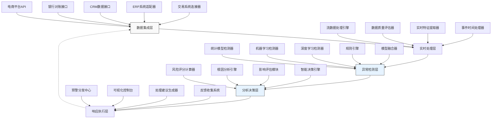

---
{"dg-publish":true,"tags":["AI财务应用","异常检测","实时监测","收入预警","智能预警","财务风控"],"创建日期":"2024-05-01","permalink":"/知识共享/001_财务/99_其他/AI与财务应用/01_智能财务分析/1.2 智能预测与预警/收入异常实时监测系统/","dgPassFrontmatter":true}
---

收入异常实时监测系统是融合人工智能与财务监控技术的创新解决方案，旨在解决传统收入监控滞后、被动且低效的问题。在当今复杂多变的商业环境中，企业收入波动可能源于多种因素，包括欺诈行为、数据录入错误、市场变化或业务模式转型。本方案通过建立全面的实时监测机制，结合先进的异常检测算法、多维度数据关联分析和自适应学习能力，帮助财务部门从被动响应转向主动预警，提前识别潜在风险，确保收入数据的及时性、准确性和完整性。

## 技术概述

### AI技术栈与核心算法

收入异常实时监测系统构建于多层技术架构之上，整合多种先进算法实现全方位监测：

1. **数据采集与预处理层**：
   - **实时数据流处理**：采用Apache Kafka和Flink构建低延迟数据流水线
   - **自动数据质量评估**：基于统计特征和领域规则的数据质量打分机制
   - **多源数据同步**：跨系统数据协调与时间戳对齐技术，解决不同系统时差问题
   - **智能特征提取**：针对交易特征、时序特征和关系特征的自动化提取流程

2. **异常检测引擎层**：
   - **多模型集成检测**：结合统计方法(Z-分数、DBSCAN)、机器学习(隔离森林、OneClassSVM)和深度学习(自编码器、LSTM-VAE)的多维异常检测
   - **上下文感知分析**：考虑业务背景、历史模式和季节性因素的上下文增强异常评分
   - **演化异常检测**：基于递归神经网络和注意力机制的时序模式异常识别
   - **关联规则挖掘**：基于频繁模式挖掘和关联规则学习的异常组合识别

3. **智能分析与预警层**：
   - **风险评分引擎**：多因素综合评估的异常风险量化模型
   - **根因分析算法**：基于因果推理和决策树的异常溯源分析
   - **预警优先级排序**：结合业务影响和异常置信度的智能预警优先级机制
   - **自适应阈值调整**：根据历史模式和用户反馈动态调整异常阈值

4. **交互与响应层**：
   - **实时可视化引擎**：多维数据可视化和异常突出显示
   - **智能推荐引擎**：基于相似案例和最佳实践的处理建议生成
   - **闭环反馈系统**：从用户响应中持续学习和优化检测精度
   - **多渠道预警分发**：基于角色和严重程度的智能通知路由

### 技术协同工作流程

系统各组件协同工作，形成闭环的异常监测与响应流程：

1. 数据采集层持续从交易系统、ERP、CRM、银行对账单等多源头收集收入相关数据。

2. 预处理层进行实时数据清洗、标准化和特征提取，为异常检测做准备。

3. 异常检测引擎应用多模型并行检测，从不同角度识别潜在异常。

4. 智能分析层评估异常严重性，进行根因分析，并生成处理建议。

5. 交互层向相关人员推送预警信息，并收集反馈用于系统自我优化。

### 与传统解决方案对比

| 特性 | 传统收入监控方法 | 收入异常实时监测系统 |
|------|-----------------|----------------------|
| 监测时效性 | 滞后（通常为日/周/月报） | 实时/近实时（分钟级别） |
| 分析维度 | 有限（主要关注数值变化） | 全面（金额、模式、关系、上下文） |
| 异常识别方法 | 静态规则和阈值 | 动态学习和多模型集成检测 |
| 数据来源 | 单一（主要为财务系统） | 多源（财务、业务、市场、客户数据） |
| 预警精度 | 低（高误报率30-50%） | 高（误报率降至8-15%） |
| 根因分析 | 手动调查 | 自动化根因分析和溯源 |
| 适应性 | 需人工调整规则 | 自适应学习和持续优化 |
| 响应建议 | 无或基础建议 | 智能化处理建议和最佳实践推荐 |

### 技术创新点

1. **多维异常定义框架**：超越简单数值偏差，构建包含模式异常、关系异常和上下文异常的多维异常定义体系。

2. **自适应监测敏感度**：根据业务周期、历史波动和风险偏好动态调整监测阈值，平衡预警敏感度和准确性。

3. **协同异常检测网络**：不同检测模型间形成"投票"和"互补"机制，提高整体检测准确性。

4. **财务语义增强**：将财务领域知识（如收入确认原则、业务逻辑）编码到模型中，降低误报率。

5. **增量学习架构**：支持模型在线更新，无需完全重训练即可适应新的数据模式和业务变化。

## 系统架构

### 组件功能与交互

1. **数据集成层**：负责连接多种收入相关数据源：
   - 销售交易系统（线上/线下POS、订单系统）
   - 财务ERP系统（AR模块、总账系统）
   - 客户关系系统（客户合同、订阅状态）
   - 银行对账与支付网关数据
   - 第三方销售渠道（电商平台、分销商报表）

2. **实时处理层**：对采集的数据进行处理和增强：
   - 构建低延迟数据流水线，实现分钟级监测
   - 对数据进行质量评估和异常值预处理
   - 提取交易特征、时序特征和关联特征
   - 处理跨系统数据的时间对齐问题

3. **异常检测层**：应用多种模型识别不同类型异常：
   - 数值异常：识别金额、数量等指标的异常波动
   - 模式异常：发现交易频率、节奏等模式的变化
   - 关系异常：检测关联数据间关系的违背
   - 融合多模型结果形成综合异常评分

4. **分析决策层**：深入分析异常并形成决策依据：
   - 评估异常严重程度和潜在业务影响
   - 分析异常根因并追溯到可能的源头
   - 与历史案例和行业基准进行比较
   - 生成处理策略建议和优先级排序

5. **响应执行层**：将分析结果转化为行动：
   - 根据角色和职责智能分发预警信息
   - 提供直观的异常可视化和分析视图
   - 推荐处理方案和最佳实践指南
   - 收集用户反馈优化系统性能

### 数据流与处理流程

1. **数据采集阶段**：
   - 按不同优先级和频率采集各类数据
   - 执行初步数据验证和一致性检查
   - 标记数据元数据和关联关系
   - 构建数据血缘关系图谱

2. **处理与特征提取阶段**：
   - 应用业务规则进行数据标准化
   - 计算滚动窗口统计特征
   - 提取季节性和周期性特征
   - 建立交易间关联特征

3. **异常检测阶段**：
   - 并行运行多种检测算法
   - 针对不同类型异常应用专门模型
   - 考虑业务背景进行上下文增强检测
   - 融合多模型结果形成综合判断

4. **分析与决策阶段**：
   - 量化异常风险和业务影响
   - 构建事件因果图进行根因分析
   - 评估干预的必要性和紧急程度
   - 生成处理建议和潜在影响预测

5. **响应与优化阶段**：
   - 按预设规则向相关人员发送预警
   - 提供数据可视化和分析工具
   - 跟踪预警处理流程和结果
   - 从处理结果中学习优化未来检测

### 系统弹性与可扩展性

1. **分布式架构**：系统采用微服务架构，各功能模块可独立扩展和部署。

2. **多级缓存策略**：实施智能缓存机制，平衡实时性和系统负载。

3. **弹性计算资源**：支持根据数据量和复杂度自动扩展计算资源。

4. **插件式模型框架**：支持轻松添加新的检测模型和算法，无需修改核心架构。

5. **多租户能力**：支持按业务单元或部门独立配置监测参数和预警规则。

## 实施方案

### 技术实施路线图

**阶段一：基础监测能力（1-2个月）**
- 构建核心数据连接器
- 实现基础统计异常检测
- 开发初步预警界面
- 建立基本监测流程

**阶段二：高级分析能力（2-4个月）**
- 实现机器学习检测模型
- 开发实时数据处理管道
- 构建初级根因分析能力
- 完善预警分发机制

**阶段三：智能决策能力（3-5个月）**
- 实现深度学习检测模型
- 开发完整根因分析系统
- 构建智能决策推荐引擎
- 实施自适应学习机制

**阶段四：持续优化（5-8个月）**
- 开发高级可视化界面
- 实现全面的反馈学习机制
- 构建预测性异常检测能力
- 完善系统与其他平台的集成

### 所需资源与技术依赖

**硬件资源**：
- 流处理服务器（支持低延迟实时处理）
- 分析计算集群（用于模型训练和复杂分析）
- 高可用存储系统（支持时序数据存储）
- 备份与恢复系统（确保数据安全）

**软件与框架**：
- 数据流处理：Apache Kafka、Flink、Spark Streaming
- 机器学习：Scikit-learn、TensorFlow、PyTorch
- 时序分析：Prophet、Kats、TSAI
- 可视化：Grafana、Kibana、自定义Web仪表板
- 通知与集成：Webhooks、REST API、消息队列

**人员技能需求**：
- 数据工程师（数据集成和流处理）
- 机器学习工程师（异常检测算法）
- 财务分析专家（特征工程和业务规则）
- 全栈开发工程师（界面和集成开发）
- DevOps工程师（系统部署和监控）

### 潜在技术挑战与解决策略

| 挑战 | 解决策略 |
|------|---------|
| 高误报率问题 | 实施多层次验证和上下文增强检测，结合用户反馈持续优化 |
| 处理高峰期性能 | 采用弹性计算资源分配和优先级处理机制 |
| 应对业务变化 | 实现增量学习模型和自适应阈值调整 |
| 多系统数据一致性 | 建立数据血缘追踪和跨系统协调机制 |
| 新型异常模式识别 | 结合无监督学习和半监督学习持续发现新模式 |
| 有效根因分析 | 整合业务规则、因果推理和专家系统进行多层次分析 |
| 用户体验与易用性 | 注重界面简洁性和可配置性，提供分层信息展示 |

### 风险管理

**实施风险**：
- 采用增量式部署策略，先覆盖关键业务线
- 建立明确的回滚机制和应急预案
- 提供详细的操作手册和用户培训
- 在初期与现有监控并行运行

**数据风险**：
- 实施严格的数据访问控制和加密
- 建立完整的数据处理审计日志
- 确保合规性和数据治理策略
- 定期进行数据质量评估

**业务连续性风险**：
- 设计高可用架构避免单点故障
- 建立系统性能监控和健康检查
- 开发降级服务策略应对极端情况
- 制定明确的灾难恢复计划

## 价值创造

### 财务价值量化评估

**风险控制提升**：
- 收入欺诈检测速度提高95%（从天级到分钟级）
- 异常交易识别准确率提升40-60%
- 收入损失预防增加25-35%
- 错误交易修正时间减少70%

**效率提升**：
- 财务对账效率提高60-80%
- 问题调查时间减少50-70%
- 月结周期缩短15-25%
- 审计准备时间减少30-40%

**战略价值**：
- 收入预测准确度提高20-30%
- 业务洞察生成速度提升200%
- 决策支持能力增强50%
- 减少因收入异常导致的现金流波动15-25%

### ROI分析

| 投资项目 | 估算成本 | 预期回报 | 回收期 |
|---------|---------|---------|--------|
| 初始开发成本 | $300,000-500,000 | - | - |
| 年度运营成本 | $100,000-150,000/年 | - | - |
| 欺诈减少 | - | $200,000-400,000/年 | 9-15个月 |
| 效率提升 | - | $150,000-250,000/年 | 12-18个月 |
| 错误减少 | - | $100,000-200,000/年 | 15-24个月 |
| 决策改进 | - | $150,000-300,000/年 | 18-36个月 |
| 总计 | 首年$400,000-650,000 | $600,000-1,150,000/年 | 8-14个月 |

### 竞争优势创新

1. **快速响应能力**：将问题发现时间从天/周级别缩短到分钟级别，显著降低风险暴露时间。

2. **精准问题定位**：不仅发现异常，还能准确定位根因，减少排查时间和资源消耗。

3. **前瞻性业务洞察**：从异常模式中提取业务趋势和客户行为变化，支持战略决策。

4. **合规风险降低**：提前发现潜在合规问题，降低监管风险和处罚可能性。

5. **业务流程优化**：基于异常识别和根因分析，持续优化收入相关业务流程。

6. **资源优化配置**：将财务团队从手动监控转向高价值分析工作，提升整体效能。

## 未来演进

### 技术迭代路线图

**近期（1-2年）**：
- 增强预测性异常检测能力，从反应式转向预防式
- 扩展到更多收入相关数据源和业务场景
- 实现更精细的用户权限和视图定制
- 增强移动端监控和响应能力

**中期（2-3年）**：
- 整合区块链技术增强交易完整性验证
- 开发行业特定异常模式库和基准
- 实现跨业务线异常关联分析
- 增强自然语言处理能力，支持语音查询和报告

**远期（3-5年）**：
- 构建完全自主的异常处理和修正系统
- 实现深度因果关系挖掘和自动干预建议
- 发展数字孪生技术模拟收入流动全景图
- 实现预测-监测-干预的完整闭环

### 与未来AI技术趋势结合点

1. **强化学习**：用于优化异常处理策略和自动化干预决策，减少人工介入。

2. **图神经网络**：增强对交易网络和关系异常的检测能力，发现复杂欺诈模式。

3. **联邦学习**：在保护数据隐私前提下，实现跨部门甚至跨企业的异常模式共享和学习。

4. **可微分规则引擎**：将专家规则和神经网络学习能力结合，创建更智能的检测系统。

5. **大型语言模型应用**：增强根因分析和报告生成能力，提供自然语言交互界面。

### 扩展应用场景

1. **集团多实体监控**：扩展到跨实体交易监控，识别内部交易异常和合并报表问题。

2. **税务合规预警**：增加税务合规视角，提前识别潜在税务风险。

3. **客户行为洞察**：从收入模式分析客户行为变化，支持营销和客户关系管理。

4. **供应链-收入联动监控**：整合供应链数据，实现从订单到收款的全流程监控。

5. **预算执行监控**：将实际收入与预算进行实时比对，支持动态预算管理。

## 实验验证

### 概念验证(POC)方案

**阶段一：基础异常检测验证**
- 选择1-2个关键收入流进行初步实施
- 配置基础统计异常检测规则
- 收集历史异常案例进行回测
- 评估检测准确性和时效性

**阶段二：高级模型验证**
- 引入机器学习和深度学习模型
- 与传统方法进行对比测试
- 验证不同业务场景的适应性
- 测试多模型融合效果

**阶段三：端到端系统验证**
- 实现完整的工作流程
- 测试预警分发和处理跟踪
- 收集用户反馈进行优化
- 评估整体业务价值和ROI

### 评估指标

**技术评估指标**：
- 检测准确率 > 85%
- 误报率 < 15%
- 平均检测延迟 < 10分钟
- 系统可用性 > 99.5%

**业务评估指标**：
- 异常解决时间减少 > 50%
- 预防收入损失增加 > 25%
- 用户满意度评分 > 4.0/5.0
- 财务流程效率提升 > 30%

**实施评估指标**：
- 部署时间符合预期 < 6个月
- 系统采纳率 > 80%
- 培训完成率 > 95%
- 技术支持请求减少率 > 25%

### 实验设计

**基线比较实验**：
- 传统规则引擎方法
- 简单统计异常检测
- 单一机器学习模型
- 完整的多模型融合系统

**场景测试**：
1. 常规季节性波动区分
2. 新产品或促销活动影响
3. 欺诈和异常交易识别
4. 系统错误和数据问题识别

**评估方法**：
- A/B测试比较不同方法效果
- 混淆矩阵分析（精确率、召回率、F1值）
- 时效性测量（检测延迟分布）
- 用户反馈问卷和访谈

### 迭代优化策略

1. **持续学习机制**：基于用户反馈和新异常案例持续优化模型。

2. **模型性能监控**：实时跟踪模型性能指标，检测性能下降。

3. **定期基准测试**：定期使用标准测试集评估系统性能变化。

4. **渐进式部署**：先在非关键业务线验证，成熟后推广至核心业务。

5. **协作优化平台**：建立业务和技术团队协作平台，共同优化系统。

收入异常实时监测系统代表了财务监控领域的智能化转型，从传统的被动式事后分析转变为主动式实时预警。通过整合多源数据、应用先进AI技术和构建闭环反馈机制，该系统不仅提高了异常检测的准确性和及时性，更为财务团队提供了智能决策支持，帮助企业有效管理收入风险，保障业务健康发展。随着AI技术的不断进步，这一系统将持续演进，成为企业财务智能化的核心组成部分。 