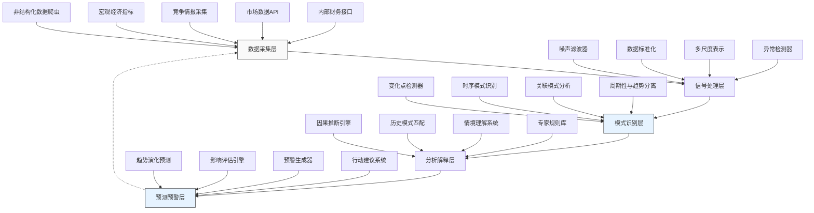

---
{"dg-publish":true,"tags":["AI财务应用","趋势分析","早期预警","信号识别","智能预测","财务洞察"],"创建日期":"2024-05-01","permalink":"/知识共享/001_财务/99_其他/AI与财务应用/01_智能财务分析/1.2 智能预测与预警/智能趋势信号识别/","dgPassFrontmatter":true}
---

智能趋势信号识别系统是一种融合前沿人工智能与财务分析的创新解决方案，致力于解决传统趋势分析滞后性强、主观因素影响大且缺乏前瞻性的问题。在当今复杂多变的商业环境中，企业需要更早识别市场和业务趋势变化，以便及时调整战略和行动。本方案通过整合多维度数据源、应用先进模式识别算法和自适应学习机制，帮助企业从数据噪声中提取有价值的趋势信号，实现从被动跟随市场到主动把握机会的转变，为企业在激烈竞争中建立先发优势。

## 技术概述

### AI技术栈与核心算法

智能趋势信号识别系统基于多层次技术架构，集成多种前沿算法实现弱信号早期检测：

1. **信号获取与预处理层**：
   - **多源数据采集**：整合内部财务数据、市场数据、竞争对手信息和宏观经济指标
   - **噪声过滤技术**：采用小波变换和自适应滤波器消除随机波动
   - **异常过滤与保留**：智能区分纯异常与趋势初始信号
   - **多尺度分析**：在不同时间窗口和数据粒度下检测信号

2. **模式识别与信号检测层**：
   - **变化点检测算法**：结合贝叶斯变化点检测、CUSUM算法识别时序数据中的转折点
   - **趋势萌芽识别**：使用分形分析、相变理论识别趋势形成的早期阶段
   - **网络效应分析**：基于图神经网络分析指标间关联变化
   - **周期性分离**：运用傅里叶分析与季节性分解区分周期波动与新兴趋势

3. **上下文理解与分析层**：
   - **因果推断引擎**：运用因果发现算法识别潜在驱动因素
   - **情境匹配系统**：与历史相似情境比对分析可能演化路径
   - **非结构化数据融合**：整合新闻、社交媒体等信息增强信号理解
   - **领域知识增强**：融入行业专家规则和经验

4. **预测与预警层**：
   - **趋势演化预测**：模拟信号发展轨迹及潜在影响
   - **风险与机会评估**：量化新趋势带来的风险与机会
   - **主动预警系统**：基于趋势信号强度和预测影响智能分级预警
   - **决策建议生成**：针对识别的趋势提供行动建议

### 技术协同工作流程

系统各组件协同工作，形成从数据到洞察的完整链条：

1. 信号获取层持续从多源头收集数据，进行预处理和初步筛选。

2. 模式识别层运用多种算法从预处理数据中识别潜在趋势信号。

3. 上下文理解层对检测到的信号进行分析，确认其有效性和潜在成因。

4. 预测与预警层评估趋势信号的演化路径和潜在影响，生成预警信息。

5. 反馈机制追踪信号演变和预警准确性，持续优化系统敏感度和精度。

### 与传统趋势分析方法对比

| 特性 | 传统趋势分析方法 | 智能趋势信号识别系统 |
|------|-----------------|----------------------|
| 信号识别时机 | 滞后（趋势明显形成后） | 超前（趋势萌芽阶段） |
| 分析维度 | 有限（主要关注单一指标） | 全面（多维度交叉验证） |
| 分析方法 | 线性和简单模式 | 非线性和复杂模式 |
| 数据来源 | 结构化财务数据 | 结构化+非结构化混合数据 |
| 识别准确率 | 中（误报和漏报常见） | 高（平衡敏感性和特异性） |
| 因果理解 | 弱（多基于相关性） | 强（基于因果分析） |
| 前瞻性 | 低（反映已发生趋势） | 高（预测未成形趋势） |
| 适应性 | 低（固定模式和阈值） | 高（自适应学习新模式） |

### 技术创新点

1. **弱信号放大框架**：独特的信号增强算法，能够从数据噪声中提取和放大尚未明显但有潜在意义的微弱趋势信号。

2. **多源信号协同验证**：跨数据源的信号交叉验证机制，降低单一数据源可能带来的误导。

3. **情境感知分析**：超越纯数据模式识别，将信号置于业务环境、市场状况和宏观经济环境中进行解读。

4. **动态阈值调整**：基于历史准确率、业务周期和风险承受度自动调整信号识别敏感度。

5. **启发式学习机制**：系统通过分析历史信号的真实影响，不断完善识别算法和参数。

## 系统架构

### 组件功能与交互

1. **数据采集层**：负责收集影响企业财务和业务趋势的多源数据：
   - 内部财务和业务数据（销售、成本、利润、客户行为）
   - 市场及行业数据（市场份额、竞争对手动态）
   - 宏观经济指标（GDP、利率、通胀率、就业数据）
   - 非结构化数据（新闻、社交媒体、行业报告）
   - 供应链数据（供应商状况、物流信息）

2. **信号处理层**：转换原始数据为可分析的信号：
   - 去除数据中的噪声和随机波动
   - 标准化不同来源的数据格式和尺度
   - 创建多尺度数据表示以捕捉不同时间周期的变化
   - 初步识别和标记可能的异常点

3. **模式识别层**：应用多种算法识别潜在趋势信号：
   - 检测时间序列中的关键变化点
   - 识别指标间的联动和先导关系
   - 分析复杂非线性模式
   - 区分周期性波动和真正的趋势变化

4. **分析解释层**：对识别的信号进行深度分析：
   - 探索潜在的因果关系
   - 与历史模式和案例进行比对
   - 结合业务上下文评估信号的意义
   - 整合领域专家知识增强解释

5. **预测预警层**：基于识别的信号生成前瞻性洞察：
   - 预测趋势的可能演化路径
   - 评估趋势对不同业务领域的潜在影响
   - 根据信号强度和潜在影响生成分级预警
   - 提出应对策略和行动建议

### 数据流与处理流程

1. **数据获取与同步阶段**：
   - 定时采集各源数据并统一时间标记
   - 执行数据完整性和一致性检查
   - 补充缺失数据和修正异常值
   - 构建数据关联图谱

2. **信号处理与提取阶段**：
   - 应用信号处理技术降低噪声
   - 执行时间序列分解分离趋势和周期成分
   - 计算各种统计特征和技术指标
   - 准备不同时间尺度的数据视图

3. **模式识别与评估阶段**：
   - 并行运行多种检测算法
   - 交叉验证不同算法的检测结果
   - 评估信号的强度和置信度
   - 初步排除虚假信号

4. **上下文分析与解释阶段**：
   - 将信号置于业务和市场环境中解读
   - 探索可能的因果机制和驱动因素
   - 评估与历史相似模式的比对结果
   - 生成初步解释和意义描述

5. **预测与建议阶段**：
   - 基于识别的信号预测未来发展
   - 量化潜在影响范围和程度
   - 生成针对各级决策者的预警信息
   - 提出具体行动建议和应对方案

### 系统弹性与可扩展性

1. **模块化信号处理**：采用模块化设计，可灵活添加或替换特定信号处理和检测算法。

2. **可定制敏感度**：允许按业务单元或指标类型调整信号检测的敏感度和阈值。

3. **动态资源分配**：根据数据量和分析复杂度动态调整计算资源。

4. **领域适应性**：支持添加行业特定的模式库和专家规则，适应不同行业特点。

5. **API驱动架构**：提供标准化接口，便于与其他企业系统集成和扩展。

## 实施方案

### 技术实施路线图

**阶段一：基础信号识别（1-2个月）**
- 构建核心数据采集管道
- 实现基本时序异常检测
- 开发初步趋势可视化界面
- 建立信号检测评估框架

**阶段二：高级模式分析（2-3个月）**
- 实现多算法信号检测系统
- 开发信号交叉验证机制
- 构建初步因果分析功能
- 完善多维度信号展示

**阶段三：上下文理解（3-4个月）**
- 实现非结构化数据整合
- 开发情境匹配与解释系统
- 构建趋势演化预测模型
- 实施自适应学习机制

**阶段四：决策支持与优化（4-5个月）**
- 开发趋势影响评估引擎
- 实现智能预警分级系统
- 构建行动建议生成功能
- 完善系统性能和用户体验

### 所需资源与技术依赖

**硬件资源**：
- 数据处理服务器（支持实时和批量数据处理）
- 分析计算集群（用于运行复杂模式识别算法）
- 时序数据存储系统（优化时间序列数据访问）
- 高性能网络（确保多源数据实时收集）

**软件与框架**：
- 数据处理：Spark、Flink、Pandas
- 机器学习：Scikit-learn、TensorFlow、PyTorch
- 时序分析：Prophet、TSAI、Kats、tsfresh
- 因果分析：DoWhy、CausalImpact
- 可视化：D3.js、Plotly、ECharts

**人员技能需求**：
- 数据科学家（时序分析和模式识别）
- 财务分析师（提供领域知识和解释）
- 数据工程师（数据采集和预处理）
- 全栈开发工程师（系统集成和界面开发）
- 领域专家（行业趋势判断和规则定义）

### 潜在技术挑战与解决策略

| 挑战 | 解决策略 |
|------|---------|
| 信噪比低问题 | 采用多层次滤波和信号增强，结合统计显著性测试 |
| 虚假信号识别 | 实施多源数据交叉验证和历史模式比对 |
| 动态环境适应 | 开发自适应阈值调整和增量学习机制 |
| 解释性挑战 | 整合专家知识和可解释AI技术，提供直观解释 |
| 计算资源需求 | 实施智能计算调度和分级计算策略 |
| 指标间复杂关系 | 应用图网络和关系挖掘技术识别隐性关联 |
| 特定领域适应 | 提供行业模板和自定义功能满足不同行业需求 |

### 风险管理

**实施风险**：
- 采用迭代式开发方法，确保核心功能优先实现
- 在关键业务领域先试点再推广
- 制定明确的回滚计划和应急措施
- 保持与现有分析系统并行运行一段时间

**信号质量风险**：
- 建立信号质量评估机制
- 实施严格的信号验证流程
- 保持适当的人工审核环节
- 持续监控和优化检测算法

**决策支持风险**：
- 明确传达信号的不确定性和置信度
- 提供多种可能的趋势解释和情景
- 强调系统作为决策辅助而非替代
- 建立趋势预警评估和反馈机制

## 价值创造

### 财务价值量化评估

**战略优势提升**：
- 提前识别市场趋势时间增加45-90天
- 决策窗口期扩大30-60%
- 战略转向速度提升40-60%
- 机会把握率提高25-40%

**风险管理改进**：
- 财务风险提前预警时间增加50-75%
- 风险缓解成本降低20-35%
- 突发事件应对准备时间增加60-90%
- 损失避免率提高15-30%

**运营效率优化**：
- 资源配置效率提升20-35%
- 业务调整成本降低15-25%
- 投资决策精准度提高30-45%
- 产品策略调整速度提升40-60%

### ROI分析

| 投资项目 | 估算成本 | 预期回报 | 回收期 |
|---------|---------|---------|--------|
| 初始开发成本 | $200,000-350,000 | - | - |
| 年度运营成本 | $70,000-120,000/年 | - | - |
| 战略机会把握 | - | $300,000-600,000/年 | 8-14个月 |
| 风险提前缓解 | - | $200,000-400,000/年 | 10-16个月 |
| 决策质量提升 | - | $150,000-300,000/年 | 12-20个月 |
| 资源优化配置 | - | $100,000-200,000/年 | 15-24个月 |
| 总计 | 首年$270,000-470,000 | $750,000-1,500,000/年 | 6-10个月 |

### 竞争优势创新

1. **先发优势获取**：识别趋势信号比竞争对手更早，为战略转向赢得宝贵时间窗口。

2. **隐藏风险预防**：发现传统方法难以识别的潜在风险，提前做好防范措施。

3. **资源配置优化**：基于趋势预判优化资源分配，减少无效投入和机会成本。

4. **创新机会发现**：从复杂数据模式中识别新兴需求和创新机会。

5. **业务韧性增强**：通过提前预警和准备，增强企业面对市场变化的适应能力。

6. **战略敏捷性提升**：缩短从信号识别到决策执行的时间，增强组织应变速度。

## 未来演进

### 技术迭代路线图

**近期（1-2年）**：
- 增强非结构化数据处理能力
- 融入更多外部数据源和维度
- 实现更精细的行业特定信号库
- 优化信号置信度评估机制

**中期（2-3年）**：
- 发展预测性仿真和情景模拟
- 增强因果关系推断能力
- 整合大规模知识图谱增强解释
- 开发协作式趋势分析平台

**远期（3-5年）**：
- 构建自主趋势假设生成与验证
- 实现趋势信号与战略执行闭环
- 发展数字孪生技术模拟趋势影响
- 建立行业趋势共享与比较网络

### 与未来AI技术趋势结合点

1. **因果发现AI**：应用自动因果结构学习识别趋势背后的真实驱动因素，提供更深入的洞察。

2. **自监督学习**：利用大量未标记数据自主学习正常模式，提高异常和新趋势识别能力。

3. **神经符号系统**：结合深度学习和符号推理，融合数据驱动和专家知识的优势。

4. **大型多模态模型**：整合文本、数值和视觉数据，全面捕捉趋势信号。

5. **元学习框架**：快速适应新模式和新环境，减少对大量历史数据的依赖。

### 扩展应用场景

1. **产品生命周期预测**：识别产品早期衰退或新机会信号，支持及时转型。

2. **人才市场趋势分析**：预测人才需求变化和薪资趋势，优化人力资源策略。

3. **竞争动态预警**：提前识别竞争对手策略转变信号，制定应对措施。

4. **供应链风险预测**：检测供应链中的早期问题信号，防范潜在中断。

5. **市场情绪分析**：整合社交媒体和新闻数据，预测品牌感知变化趋势。

## 实验验证

### 概念验证(POC)方案

**阶段一：回溯测试验证**
- 选择历史上已确认的重要趋势转变点
- 应用信号检测算法验证能否提前识别
- 测量趋势识别的提前时间和准确性
- 评估不同算法和参数的性能

**阶段二：实时监测试点**
- 在选定业务领域部署实时监测系统
- 记录所有检测到的潜在趋势信号
- 追踪信号演变和真实趋势确认情况
- 评估系统敏感度和特异性

**阶段三：决策影响评估**
- 将系统生成的趋势洞察应用于决策过程
- 对比使用系统前后的决策质量和及时性
- 量化趋势预警带来的具体业务价值
- 收集用户反馈和改进建议

### 评估指标

**技术评估指标**：
- 趋势提前识别率（> 70%）
- 趋势平均提前时间（> 45天）
- 虚假信号率（< 25%）
- 信号解释满意度（> 4.0/5.0）

**业务评估指标**：
- 战略决策时间窗口增加（> 30%）
- 风险预防成功率（> 40%）
- 资源重分配效率提升（> 20%）
- 机会利用转化率（> 25%）

**用户评估指标**：
- 分析师采纳率（> 80%）
- 决策者信任度（> 4.2/5.0）
- 系统使用频率（每周至少4次）
- 反馈响应满意度（> 4.0/5.0）

### 实验设计

**对比实验**：
- 传统趋势分析方法（如移动平均和图表分析）
- 单维度信号检测（如仅财务指标）
- 完整的多维趋势信号系统

**场景测试**：
1. 市场增长放缓信号检测
2. 竞争格局变化预警
3. 消费者偏好转变识别
4. 供应链中断早期信号

**评估方法**：
- ROC曲线和AUC分析（平衡敏感性和特异性）
- 提前预警时间分布统计
- 决策影响案例研究
- 用户体验和工作流程评估

### 迭代优化策略

1. **信号质量反馈循环**：记录所有信号及其最终确认情况，持续优化检测算法。

2. **智能敏感度调整**：基于历史表现自动调整不同领域和指标的检测阈值。

3. **模型多样性管理**：评估并优化不同检测模型的组合，提高整体系统稳健性。

4. **增量特征工程**：持续评估和添加新的信号特征，提高检测能力。

5. **用户交互优化**：基于用户使用模式和反馈，改进界面和分析流程。

智能趋势信号识别系统代表了财务分析与人工智能结合的前沿应用，通过提前识别业务和市场环境中的微弱变化信号，帮助企业从被动响应转向主动预判。系统的核心价值在于将海量复杂数据转化为可操作的前瞻性洞察，为管理层提供战略决策的时间优势和视角广度。随着技术不断演进和企业数据生态日益丰富，这一系统有望成为智能企业的"早期预警雷达"，协助企业在不确定环境中把握先机、规避风险、持续创新。 