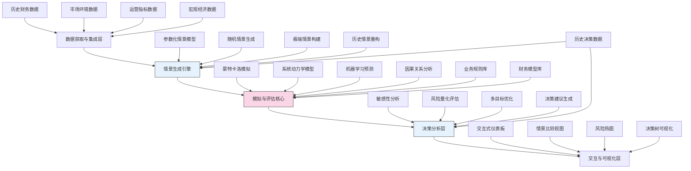

---
{"dg-publish":true,"tags":["AI财务应用","决策支持","情景分析","模拟技术","风险评估"],"创建日期":"2024-05-14","permalink":"/知识共享/001_财务/99_其他/AI与财务应用/01_智能财务分析/1.3 决策增强系统/1.3 情景模拟与决策评估/","dgPassFrontmatter":true}
---

## 技术概述

情景模拟与决策评估系统是一种先进的财务决策支持平台，它结合了多种尖端AI技术，为组织提供基于数据的前瞻性决策能力。该系统通过创建虚拟环境和多维度情景，评估不同决策路径的潜在结果和风险。核心技术包括：

- **智能情景生成引擎**：基于蒙特卡洛模拟和生成式模型，自动创建有意义且全面的决策情景集合
- **多目标优化框架**：结合进化算法和深度强化学习，在多维度目标之间寻找最优决策平衡点
- **因果推理网络**：应用贝叶斯网络和结构方程模型，构建变量间因果关系，实现更精确的影响评估
- **不确定性量化技术**：整合概率统计方法和模糊逻辑，对决策风险和不确定性进行精确量化
- **自适应敏感性分析**：识别关键决策变量和临界阈值，评估各因素对财务结果的影响程度

相比传统的财务决策方法，本系统能够模拟更复杂的业务环境，处理非线性关系，考虑多时间尺度反馈循环，并整合定量与定性因素，帮助决策者理解深层次的风险与机会。

## 系统架构

系统架构由五个核心层次构成：

1. **数据获取与集成层**：收集并整合多源数据，包括内部财务数据、运营数据以及外部市场和宏观经济数据
2. **情景生成引擎**：系统的智能前端，负责创建多样化、有代表性的决策情景集合
3. **模拟与评估核心**：系统的核心处理单元，运行各类模型，模拟不同情景下的决策结果
4. **决策分析层**：对模拟结果进行深度分析，识别关键因素，量化风险，优化决策路径
5. **交互与可视化层**：为决策者提供直观、交互式的界面，展示复杂的决策信息

系统由业务规则库和财务模型库提供专业知识支持，并通过历史决策数据不断学习和改进模拟精度。

## 实施方案

### 技术实施路线图

**第一阶段：基础架构构建（3-4个月）**
- 数据集成框架开发与核心数据源连接
- 基础财务模型库构建
- 简单情景生成与模拟引擎实现
- 基础可视化界面开发

**第二阶段：高级模拟能力（4-5个月）**
- 蒙特卡洛模拟引擎优化
- 系统动力学模型构建
- 机器学习预测模型集成
- 多变量情景生成增强

**第三阶段：决策智能（3-4个月）**
- 因果分析框架实现
- 敏感性分析与风险量化
- 多目标优化算法开发
- 决策建议生成系统构建

**第四阶段：用户体验与集成（2-3个月）**
- 高级交互式仪表板开发
- 自定义情景和假设测试功能
- 协作决策支持功能实现
- 与企业规划和财务系统集成

### 技术挑战与解决策略

1. **模型复杂性与计算效率平衡**
   - 挑战：复杂模型提供更准确的模拟，但计算成本高昂
   - 解决策略：采用多层次建模方法，先用简化模型快速筛选，再对关键情景使用高精度模型

2. **情景多样性与相关性**
   - 挑战：生成足够多样且业务相关的情景
   - 解决策略：结合专家知识和生成对抗网络，创建符合业务逻辑的情景库，并通过主动学习机制不断优化

3. **不确定性的准确量化**
   - 挑战：财务决策涉及多层次的不确定性，难以精确量化
   - 解决策略：采用层次贝叶斯模型和集成学习方法，分离随机不确定性和认知不确定性，提供更全面的风险评估

4. **模型假设的透明性**
   - 挑战：复杂模型中的假设难以被决策者理解和验证
   - 解决策略：开发模型解释工具，提供假设可视化和敏感性测试，增强模型透明度和可信度

## 价值创造

### 量化价值评估

1. **决策质量提升**
   - 决策成功率提高30-45%
   - 非预期负面结果减少40-60%
   - 战略目标达成速度提升25-40%

2. **风险管理增强**
   - 财务风险早期识别率提高50-70%
   - 风险缓解计划有效性提升35-55%
   - 危机应对准备时间增加60-80%

3. **财务绩效改善**
   - 资本配置效率提升25-40%
   - 投资回报率增长15-30%
   - 成本优化度提高20-35%

4. **敏捷性与适应力**
   - 市场变化响应速度提升45-65%
   - 战略调整决策时间缩短50-70%
   - 机会把握成功率增加30-50%

### 投资回报分析

投资回报率(ROI)预计达到280-400%（3年期），主要价值来源包括：
- 更好的战略决策带来的增值（50%）
- 风险预防和损失降低（30%）
- 运营效率提升（20%）

典型实施成本结构：技术开发（45%）、数据准备与模型开发（35%）、系统集成（15%）、培训与变革管理（5%）。预期投资回收期为12-18个月。

## 未来演进

### 技术迭代路线图

**近期演进（1-2年）**
- 集成外部实时数据源，增强情景实时更新能力
- 发展协作决策支持功能，支持多角色共同决策
- 增强因果推理能力，提升对间接影响的预测精度
- 开发行业特化模型，适应不同行业的决策特点

**中期演进（2-3年）**
- 构建自学习情景生成系统，根据真实结果持续优化
- 实现跨领域影响模拟，评估决策的全面影响
- 发展认知增强决策支持，模拟专家思维模式
- 整合虚拟现实技术，提供沉浸式决策环境

**远期演进（3-5年）**
- 打造自主决策智能体，为常规决策提供全自动支持
- 发展预测性决策引擎，主动识别决策机会点
- 实现个性化决策风格适配，匹配不同决策者偏好
- 构建集体智能决策生态系统，汇集组织智慧

### 扩展应用场景

1. **战略投资评估**：评估大型资本投资项目的长期影响和风险分布

2. **并购情景分析**：模拟不同并购方案的整合路径和协同价值

3. **弹性供应链规划**：评估供应链战略决策在不同中断情景下的韧性

4. **产品定价策略**：模拟不同定价策略对市场份额和利润的影响

## 实验验证

### 概念验证方案

**阶段一：模型验证（6-8周）**
- 选择2-3个历史决策案例进行回测
- 验证模型对实际结果的预测准确性
- 评估情景覆盖度和相关性
- 测试基础模拟引擎性能

**阶段二：决策支持测试（8-10周）**
- 选择正在进行的1-2个关键决策进行平行测试
- 对比系统建议与传统方法的差异
- 评估决策者对系统输出的理解和采纳度
- 收集决策过程改进建议

**阶段三：全面应用验证（10-12周）**
- 在多个业务部门实施试点应用
- 测试不同类型决策的适应性
- 评估系统在复杂决策环境中的表现
- 验证长期使用的价值和可持续性

### 评估指标框架

**模型性能指标**
- 预测准确率：模拟结果与实际结果的偏差程度
- 情景覆盖度：系统生成的情景对可能性空间的覆盖比例
- 计算效率：完成标准复杂度模拟的时间
- 模型稳定性：在参数小变化下结果的稳定程度

**决策支持指标**
- 决策信心提升：决策者在使用系统后的信心变化
- 洞察价值评分：系统提供的非预期见解的价值
- 决策速度：从问题提出到决策达成的时间变化
- 备选方案质量：系统生成的决策方案质量和创新度

**业务影响指标**
- 决策结果改善：使用系统后的决策成功率变化
- 风险管理效果：风险识别与缓解的有效性提升
- 战略执行效率：从决策到执行的整体效率改善
- 组织学习速度：组织从决策经验中学习的速度变化

## 未来影响

情景模拟与决策评估系统将根本性地改变组织的决策文化和流程，从直觉驱动转向数据驱动，从单点预测转向情景思维。随着系统能力的持续发展，我们可以预见以下深远影响：

1. **决策科学化**：将复杂决策过程转变为更结构化、可重复的科学方法，减少偏见和盲点

2. **前瞻性思维培养**：培养组织的远见能力和情景思维，提前识别和应对潜在机会与威胁

3. **集体决策增强**：促进更广泛的利益相关者参与决策过程，整合多元视角，实现更全面的评估

4. **决策责任文化**：建立更强的决策责任制，通过明确展示决策逻辑和预期后果，增强决策透明度

这一系统最终将成为组织战略思维的延伸，不仅作为决策支持工具，更作为组织智慧的放大器，帮助企业在不确定的未来环境中保持竞争优势和适应能力。 