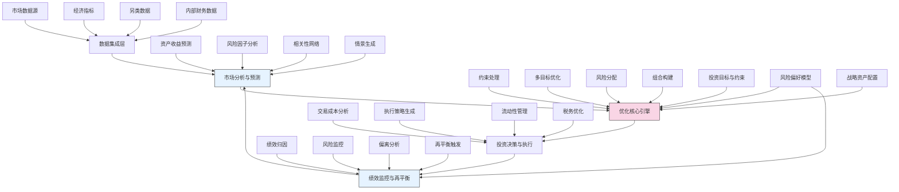

---
{"dg-publish":true,"tags":["AI财务应用","资源配置","优化算法","投资决策","风险管理"],"创建日期":"2024-05-14","permalink":"/知识共享/001_财务/99_其他/AI与财务应用/01_智能财务分析/1.3 决策增强系统/1.3 投资组合智能优化/","dgPassFrontmatter":true}
---

## 技术概述

投资组合智能优化系统是一种前沿的资源配置技术平台，它融合了人工智能、金融工程和运筹学的最新进展，为企业和机构提供科学、动态的资本配置解决方案。该系统突破了传统投资组合理论的局限，能够适应复杂多变的市场环境，平衡短期收益与长期战略目标。核心技术包括：

- **多层次机器学习预测引擎**：整合时间序列模型、深度学习和图神经网络，对资产收益、风险和相关性进行多尺度预测
- **高维优化算法**：采用进化计算、凸优化和强化学习的混合策略，在高维约束空间中寻找最优资源配置方案
- **动态风险建模**：结合极值理论、小波分析和分位数回归，捕捉市场风险的动态演化和尾部风险
- **多目标适应性框架**：采用帕累托优化和偏好学习，平衡收益、风险、流动性、ESG等多维目标
- **情景压力测试系统**：利用生成式模型和蒙特卡洛模拟，创建并评估投资组合在极端市场情景下的表现

相比传统投资组合管理方法，本系统能够处理更复杂的资产类别和市场条件，整合宏观经济视角与微观资产特性，实现更精细化的风险建模和更个性化的投资目标定制。

## 系统架构

系统架构由五个核心层次和闭环设计构成：

1. **数据集成层**：汇集并处理多源数据，包括传统市场数据、宏观经济指标、替代数据和内部财务数据
2. **市场分析与预测**：系统的智能洞察层，负责对资产表现进行多维度预测和分析
3. **优化核心引擎**：系统核心，根据预测、约束和目标执行复杂的投资组合优化
4. **投资决策与执行**：转化优化结果为实际执行方案，考虑交易成本、流动性和执行策略
5. **绩效监控与再平衡**：持续监控投资组合表现，分析偏离，并触发智能再平衡

系统通过投资目标设定、风险偏好模型和战略资产配置框架提供决策支持，形成一个完整的投资决策闭环。

## 实施方案

### 技术实施路线图

**第一阶段：基础架构构建（2-3个月）**
- 数据集成管道开发与主要数据源连接
- 基础市场预测模型构建
- 核心优化算法框架实现
- 基本投资组合分析界面开发

**第二阶段：高级分析能力（3-4个月）**
- 高级机器学习预测模型开发与集成
- 风险建模与因子分析增强
- 相关性网络与异常检测实现
- 情景生成与压力测试系统构建

**第三阶段：优化引擎升级（3-4个月）**
- 多目标优化算法实现
- 复杂约束处理系统开发
- 动态风险分配机制
- 自适应投资组合构建

**第四阶段：决策支持与集成（2-3个月）**
- 执行策略优化与交易成本分析
- 高级绩效归因与监控系统
- 智能再平衡触发机制
- 与交易执行系统集成

### 技术挑战与解决策略

1. **市场预测的不确定性**
   - 挑战：金融市场本质上难以精确预测，特别是在异常事件期间
   - 解决策略：采用集成学习和概率预测方法，提供预测区间而非点估计，结合稳健优化技术处理预测误差

2. **高维优化的复杂性**
   - 挑战：大规模资产组合优化面临维度灾难和局部最优陷阱
   - 解决策略：实现分层优化策略，结合启发式算法与传统优化方法，采用并行计算加速搜索过程

3. **动态风险结构捕捉**
   - 挑战：资产间相关性和风险特性在不同市场环境下快速变化
   - 解决策略：开发自适应协方差估计和动态时变风险模型，结合高频数据和市场压力指标调整风险评估

4. **实时计算与决策速度**
   - 挑战：复杂优化在大规模资产池上计算成本高昂
   - 解决策略：采用近似算法和增量优化技术，结合GPU加速和分布式计算，实现实时优化响应

## 价值创造

### 量化价值评估

1. **投资绩效提升**
   - 风险调整后收益率提高15-30%
   - 下行风险降低25-40%
   - 最大回撤减少20-35%

2. **资源配置效率**
   - 资本利用效率提升30-45%
   - 流动性管理优化度提高25-40%
   - 闲置资金减少40-60%

3. **风险管理增强**
   - 尾部风险识别准确率提升50-70%
   - 市场冲击抵御能力增强30-50%
   - 风险敞口透明度提高60-80%

4. **决策质量改善**
   - 资产配置决策时间缩短65-85%
   - 市场机会把握率提高30-50%
   - 投资组合一致性与策略匹配度提升40-60%

### 投资回报分析

投资回报率(ROI)预计达到300-500%（3年期），主要价值来源包括：
- 投资绩效改善带来的增值（60%）
- 运营效率提升和成本节约（25%）
- 风险损失减少（15%）

典型实施成本结构：技术开发与软件（40%）、数据获取与处理（35%）、专业服务与培训（15%）、系统集成与维护（10%）。预期投资回收期为10-16个月。

## 未来演进

### 技术迭代路线图

**近期演进（1-2年）**
- 整合替代数据源，增强市场预测能力
- 发展自然语言处理分析引擎，从文本数据中提取投资信号
- 实现多时间层次优化，平衡短期交易与长期战略
- 开发个性化风险偏好学习功能

**中期演进（2-3年）**
- 构建自强化学习优化引擎，通过市场交互不断改进
- 实现跨资产类别的统一建模与优化
- 发展认知智能决策支持，模拟专家思维过程
- 整合区块链技术，提升透明度和交易执行

**远期演进（3-5年）**
- 打造自主投资智能体，实现全自动化资产管理
- 发展集成宏观经济模拟的投资环境系统
- 实现群体智能优化，整合多专家视角
- 构建金融数字孪生系统，模拟复杂市场生态

### 扩展应用场景

1. **企业现金管理**：优化短期流动性与长期投资回报的平衡

2. **多资产类别配置**：扩展至传统与另类资产的统一配置框架

3. **养老金投资管理**：结合长期负债特性的资产配置策略

4. **跨币种资源优化**：考虑汇率风险和全球市场联动的国际资本配置

## 实验验证

### 概念验证方案

**阶段一：回测验证（4-6周）**
- 选择3-5年历史数据进行系统回测
- 评估不同市场环境下的策略表现
- 对比传统方法与智能优化方法的绩效差异
- 测试风险管理机制的有效性

**阶段二：模拟投资测试（6-8周）**
- 设立模拟投资账户进行实时运行
- 与现有投资流程并行测试
- 评估系统在当前市场环境中的决策质量
- 收集投资专业人员的反馈

**阶段三：小规模实盘验证（8-12周）**
- 选择小部分实际资产进行系统管理
- 严格控制风险参数和投资限制
- 实时监控系统决策和市场变化
- 验证实际执行效率和成本

### 评估指标框架

**绩效指标**
- 绝对收益率：与基准相比的超额收益
- 风险调整收益：夏普比率、索提诺比率等
- 最大回撤：投资组合价值下降的最大幅度
- 波动率：收益率的标准差和条件风险值

**优化质量指标**
- 效率前沿接近度：实际组合与理论最优前沿的距离
- 约束满足度：满足投资约束的精确程度
- 优化稳定性：小参数变化下解的稳定性
- 计算效率：优化过程的完成时间和资源消耗

**实用性指标**
- 用户满意度：投资决策者对系统的评价
- 易用性评分：界面友好度和操作直观性
- 解释清晰度：系统决策逻辑的可理解程度
- 适应性评估：应对不同市场环境的能力

## 未来影响

投资组合智能优化系统将深刻改变机构和企业的资本配置方式，从传统的周期性静态调整转向连续的智能动态管理。随着系统能力的不断发展，我们可以预见以下深远影响：

1. **资源配置的民主化**：先进的投资组合技术将从少数精英机构扩展到更广泛的组织，提高整体市场的资源配置效率

2. **风险管理的演进**：从简单的分散化转向智能化风险分配，实现更精准的风险预测和管理，增强金融体系的稳定性

3. **投资决策流程重塑**：投资专业人员角色转变为战略规划和系统监督，将日常策略执行交给AI系统，实现人机协作的最佳结合

4. **投资理念的转变**：超越传统的风险收益分析框架，向更全面的目标导向投资方法转变，考虑更多维度的投资影响

这一系统最终将成为组织财务智能的核心组件，不仅提升投资表现，更实现资源的最优化分配，为组织创造长期可持续的财务价值。 