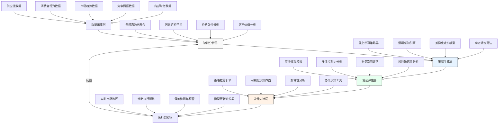

---
{"dg-publish":true,"tags":["AI财务应用","定价策略","机器学习","竞争分析","动态定价"],"创建日期":"2024-04-27","permalink":"/知识共享/001_财务/99_其他/AI与财务应用/01_智能财务分析/1.3 决策增强系统/定价策略AI助手/","dgPassFrontmatter":true}
---

## 技术概述

定价策略AI助手是一个融合多种前沿AI技术的智能决策支持系统，专为企业定价决策提供数据驱动的智能分析与建议。该系统突破了传统定价方法的局限性，将大语言模型、强化学习、因果推理和市场模拟技术有机结合，创建了一个具有感知、分析、预测和推荐能力的综合定价智能体。

### 核心技术栈

1. **多模态大语言模型**：处理结构化财务数据与非结构化市场信息，实现跨模态的定价影响因素分析
2. **强化学习算法**：通过与市场环境持续交互优化定价策略，适应动态市场变化
3. **因果推理引擎**：识别价格变动与市场反应之间的因果关系，避免相关性误导
4. **市场模拟系统**：基于智能体模型构建市场微观结构，模拟不同价格策略的市场反应
5. **贝叶斯优化框架**：在不确定条件下寻找最优定价点，平衡探索与利用

### 技术协同工作机制

定价策略AI助手通过"感知-分析-预测-推荐-验证"的闭环机制解决复杂定价问题：

1. **市场感知层**通过多模态大语言模型处理各类市场信号，包括竞争对手定价变动、消费者情绪、供应链状况等
2. **因果分析层**应用因果推理技术识别真正影响定价效果的关键因素，避免假相关
3. **策略生成层**结合强化学习和博弈论模型，生成适应不同市场情境的定价策略组合
4. **模拟验证层**在数字孪生市场环境中测试价格策略，预测可能的市场反应和财务影响
5. **推荐执行层**为决策者提供可解释的定价建议，支持人机协作决策

### 技术创新点

1. **混合智能架构**：融合符号推理和神经网络，结合领域知识与数据驱动方法
2. **因果定价模型**：突破传统相关性分析限制，构建价格-反应的因果结构
3. **市场微观模拟**：基于智能体的市场模拟超越简单预测，实现策略效果的前瞻性评估
4. **适应性学习机制**：系统通过持续学习市场反应动态调整定价策略的生成逻辑
5. **解释性设计**：全流程可解释的分析过程，支持决策者理解和干预

### 与传统解决方案对比

| 特性 | 传统定价方法 | 基础AI定价 | 定价策略AI助手 |
|------|------------|-----------|-------------|
| 数据处理 | 主要结构化数据 | 结构化+部分非结构化 | 全面多模态数据融合 |
| 市场理解 | 静态分析 | 预测性分析 | 因果理解+动态适应 |
| 策略生成 | 预设规则或模板 | 优化算法 | 情境感知+强化学习 |
| 验证机制 | 事后评估 | 简单预测 | 市场模拟+数字孪生 |
| 学习能力 | 无 | 批量更新 | 持续学习+适应性调整 |
| 决策支持 | 数据报告 | 建议生成 | 可解释推荐+情景分析 |

## 系统架构

### 组件功能说明

1. **数据采集层**：整合多源数据，建立统一数据基础
   - 内部财务数据：成本结构、毛利率、价格历史等
   - 竞争情报数据：竞争对手价格、产品对比、市场份额
   - 市场趋势数据：行业走势、消费意愿、宏观经济指标
   - 消费者行为数据：购买模式、价格敏感度、客户细分
   - 供应链数据：供应成本变动、库存状况、生产能力

2. **智能分析层**：处理原始数据，提取洞察和关系
   - 多模态数据融合：整合不同来源和格式的数据
   - 因果结构学习：识别价格与销量、利润等指标的因果关系
   - 价格弹性分析：不同客户群体、渠道和产品的价格敏感度
   - 客户价值分析：基于客户终身价值的差异化定价基础

3. **策略生成层**：基于分析创建最优定价方案
   - 强化学习策略器：通过持续学习市场反应优化定价决策
   - 情境感知引擎：识别不同市场情境并匹配适当策略
   - 差异化定价模型：为不同客户群体、渠道设计差异化价格
   - 动态调价算法：根据实时市场变化调整价格

4. **验证评估层**：测试策略可行性和预期效果
   - 市场微观模拟：基于智能体的市场反应模拟
   - 多情境对比分析：在不同市场条件下测试策略效果
   - 财务影响评估：预测对销量、收入、利润的影响
   - 风险敏感性分析：评估不确定性和风险因素

5. **决策支持层**：辅助人类决策者制定最终决策
   - 策略推荐引擎：提供定价建议及对比分析
   - 可视化决策界面：直观展示数据和策略效果
   - 解释性分析：提供推荐背后的逻辑和依据
   - 协作决策工具：支持团队协作决策流程

6. **执行监控层**：监控策略实施效果并持续学习
   - 实时市场监控：跟踪市场对价格变化的反应
   - 策略执行跟踪：监控策略实施的一致性
   - 偏差检测与预警：识别实际结果与预期的差异
   - 模型更新触发器：决定何时更新模型和策略

### 数据流说明

1. **输入数据流**：系统持续接收市场数据、竞争情报、内部财务指标
2. **分析数据流**：原始数据经过清洗、融合，转化为市场洞察和因果模型
3. **策略数据流**：市场洞察被策略引擎转化为可执行定价建议
4. **验证数据流**：策略在模拟环境中产生结果数据，用于评估
5. **决策数据流**：推荐策略、预期效果、风险分析提供给决策者
6. **反馈数据流**：市场实际反应数据回流到系统，用于持续学习

## 实施方案

### 技术实施路线图

**第一阶段：基础建设（1-3个月）**
- 建立统一数据平台，整合内部财务数据与外部市场数据
- 开发基础分析引擎，提供初步的价格弹性分析
- 搭建系统基础架构，确定技术栈和集成框架
- 完成数据预处理管道和数据质量保障机制

**第二阶段：核心功能开发（3-6个月）**
- 开发因果推理引擎，构建价格-反应因果模型
- 实现多模态数据分析能力，整合结构化与非结构化数据
- 构建基础市场模拟环境，支持初步策略测试
- 开发强化学习模型，支持基础策略优化

**第三阶段：高级功能实现（6-9个月）**
- 完善智能体市场模拟系统，提升仿真精度
- 增强策略生成引擎，实现情境感知和差异化定价
- 开发决策支持界面，提供交互式分析和可视化
- 实现策略解释机制，提高推荐透明度

**第四阶段：集成与优化（9-12个月）**
- 系统集成与端到端测试，确保各组件协同工作
- 性能优化与扩展性增强，支持大规模数据处理
- 用户体验改进，完善决策流程和交互模式
- 安全性与合规性保障，确保数据和算法安全

### 技术依赖与资源需求

**硬件资源**
- 高性能计算服务器：用于模型训练和市场模拟（推荐配置：64核CPU，512GB RAM，8-16张GPU）
- 数据存储系统：支持结构化和非结构化数据的混合存储（推荐：分布式存储系统，初始容量20TB，可扩展）
- 网络基础设施：高带宽、低延迟网络支持实时数据流（推荐：10Gbps以上网络带宽）

**软件资源**
- 数据处理框架：Apache Spark、Kafka、Airflow
- 机器学习框架：PyTorch、TensorFlow、Hugging Face Transformers
- 因果推理工具：DoWhy、CausalNex
- 数据库系统：PostgreSQL、MongoDB、Redis
- 可视化工具：Dash、Plotly、D3.js

**人力资源**
- 数据科学家：3-5人，负责模型开发和优化
- 机器学习工程师：3-4人，负责模型实现和部署
- 软件开发工程师：4-6人，负责系统架构和界面开发
- 财务分析专家：2-3人，提供领域知识和验证
- 项目经理：1-2人，协调资源和进度
- 质量保障工程师：2-3人，确保系统质量和性能

### 潜在技术挑战与解决策略

**挑战1：数据质量与集成问题**
- **解决策略**：
  - 实施严格的数据治理框架，建立数据质量评估机制
  - 开发智能数据清洗和异常检测流程，自动处理数据问题
  - 设计弹性数据集成架构，适应不同数据来源和格式
  - 建立数据版本控制和溯源机制，确保分析可复现

**挑战2：因果关系识别的复杂性**
- **解决策略**：
  - 结合领域知识和数据驱动方法，构建初始因果假设
  - 实施自然实验和干预分析，验证因果关系
  - 采用多种因果推理方法交叉验证，提高可靠性
  - 建立因果推理的不确定性量化框架，避免错误推断

**挑战3：市场模拟的准确性问题**
- **解决策略**：
  - 基于历史数据校准模拟参数，提高基线准确性
  - 采用多智能体建模方法，捕捉市场复杂动态
  - 实施持续学习机制，根据实际市场反应调整模型
  - 融合专家知识和启发式规则，增强模型在稀疏数据区域的表现

**挑战4：策略推荐的可解释性**
- **解决策略**：
  - 开发分层解释框架，从高层战略到具体因素提供解释
  - 实现对比解释方法，说明不同策略的优劣
  - 可视化关键决策因素和影响路径，提高透明度
  - 设计交互式解释界面，允许用户探索决策逻辑

### 风险管理

**技术风险**
- **过拟合风险**：通过交叉验证、正则化和多样化训练数据缓解
- **算法偏见**：实施公平性评估和偏见检测机制
- **系统可靠性**：采用冗余设计、故障恢复和持续监控保障

**业务风险**
- **市场反应误判**：建立分级策略实施机制，先小范围测试再扩大
- **定价错误影响**：设计安全阈值和人工审核机制，防止极端定价
- **竞争对手反应**：模拟多种竞争反应场景，制定应对策略

## 价值创造

### 财务价值量化

**收入提升**
- 精准定价策略预计可提高产品组合收入3-8%
- 差异化定价机制可增加客户生命周期价值5-12%
- 动态调价能力可在市场波动期间增加收入弹性，提高稳定性

**成本节约**
- 减少定价决策时间80-90%，显著提升定价团队效率
- 降低价格战风险，预计可避免1-3%的不必要折扣
- 优化库存周转，减少因定价不当导致的滞销成本

**利润增长**
- 综合收入提升和成本控制，预计带来4-10%的毛利率改善
- 实现客户群体和产品线的利润结构优化
- 提高促销活动ROI，减少无效促销支出

### 投资回报分析

| 投资项目 | 估计成本(万元) | 预期年化回报(万元) | 投资回报期 |
|---------|--------------|------------------|-----------|
| 系统开发 | 300-500 | 不适用 | 纳入总体ROI |
| 数据基础设施 | 100-200 | 不适用 | 纳入总体ROI |
| 人力资源 | 200-300/年 | 不适用 | 纳入总体ROI |
| 运维成本 | 50-100/年 | 不适用 | 纳入总体ROI |
| **总体投资** | **650-1100** | **1300-2600** | **6-10个月** |

> 注：回报估算基于年销售额10亿元的中型企业，较大或较小规模企业可按比例调整

### 决策质量提升

**战略决策增强**
- 提供基于数据的产品定位和价格策略，减少主观判断
- 支持更精准的市场细分和价值定位，优化产品组合
- 提供竞争动态分析，支持更敏捷的战略调整

**战术执行优化**
- 实现地区、渠道和客户级别的定价精细化管理
- 优化促销设计和执行，提高营销投资回报
- 支持供应链和定价协同优化，平衡供需关系

**风险管理改进**
- 提前识别价格敏感性变化，避免市场份额损失
- 预测竞争对手可能的价格动作，制定预案
- 评估宏观经济和行业趋势对定价环境的影响

### 竞争优势创造

**市场响应速度**
- 将定价决策周期从周/月级别缩短到日/小时级别
- 能够快速响应市场变化和竞争动态，抓住窗口机会
- 支持实时A/B测试，快速验证价格假设

**客户价值匹配**
- 更精准地将价格与客户感知价值对齐
- 降低价格敏感客户流失率，提高客户满意度
- 识别并提取高价值客户的价值溢价

**创新定价模式**
- 支持订阅、使用量计费、价值分成等创新定价模型
- 实现动态捆绑和个性化产品组合定价
- 开发基于结果和价值的前沿定价策略

## 未来演进

### 技术迭代路线图

**短期演进（1-2年）**
- 增强多模态分析能力，整合更多非结构化数据源
- 提升因果推理精度，构建更复杂的市场动态模型
- 强化实时计算能力，支持更快速的市场响应
- 改进用户界面，提供更直观的决策支持体验

**中期演进（2-3年）**
- 集成知识图谱技术，建立市场实体关系网络
- 发展跨市场协同优化能力，实现多产品线定价协调
- 建立预测性维护机制，自动识别模型偏差和性能下降
- 增强自主学习能力，减少人工干预需求

**长期演进（3-5年）**
- 实现完全自主的定价智能体，具备自我监督和自我改进能力
- 建立开放集市场理解能力，应对前所未见的市场情境
- 发展元学习能力，快速适应新产品和新市场
- 构建解释性AI框架，实现决策过程的完全透明化

### 与未来AI技术结合点

**量子计算**
- 利用量子算法加速复杂市场模拟，处理更大规模优化问题
- 应用量子机器学习改进模型训练效率和准确性
- 探索量子强化学习在复杂价格策略空间中的应用

**神经符号系统**
- 融合符号推理和神经网络，结合领域知识与数据驱动学习
- 构建可解释的定价规则体系，提高决策透明度
- 实现人类专家与AI系统的知识协同创造

**数字孪生技术**
- 构建完整市场环境的数字孪生体，提供高保真模拟
- 实现实体经济与数字模型的实时同步和预测
- 支持虚拟实验室功能，安全测试创新定价策略

**边缘AI部署**
- 将定价智能分布到销售终端和渠道，支持本地化决策
- 实现低延迟响应，适应快速变化的市场环境
- 建立分布式学习网络，整合多点市场洞察

### 扩展应用场景

**产品开发与创新**
- 支持基于价值的产品设计和功能优先级排序
- 提供新产品定价策略和上市价格优化
- 评估产品创新的市场接受度和价格空间

**渠道管理**
- 优化多层分销体系的价格结构和激励机制
- 平衡不同渠道间的价格关系，避免渠道冲突
- 设计渠道专属促销策略，最大化渠道参与度

**客户关系管理**
- 基于客户生命周期价值的动态定价策略
- 个性化折扣和促销方案，提高客户忠诚度
- 设计客户升级路径和交叉销售价格策略

**供应链协同**
- 将定价决策与库存管理和产能规划协同优化
- 根据供应链约束调整价格，平衡供需关系
- 设计能够应对供应链中断的韧性定价策略

### 长期价值影响

**组织能力提升**
- 培养数据驱动的定价文化和决策模式
- 建立跨职能协作机制，整合销售、营销和财务视角
- 发展前瞻性市场感知能力，提前识别价格机会和风险

**行业实践变革**
- 推动行业从成本加成模式向价值定价模式转变
- 改变传统的周期性定价审查为连续优化模式
- 引领创新定价模式的探索和应用

**市场生态塑造**
- 促进更高效的市场定价机制形成，减少价格摩擦
- 支持更透明的价值传递，优化市场资源配置
- 建立更平衡的供应商-企业-客户价值分配体系

## 实验验证

### 概念验证(POC)方案

**第一阶段：数据准备与基线建立（4-6周）**
- 收集过去12-24个月的定价历史和销售数据
- 建立关键定价指标和业务KPI的基线
- 识别2-3个具有代表性的产品线或市场进行初步测试
- 设置数据处理和分析环境

**第二阶段：模型开发与初步验证（8-10周）**
- 开发基础价格弹性分析模型和市场反应预测
- 构建简化版市场模拟环境，测试基本定价情境
- 实现第一版策略推荐引擎，生成初步定价建议
- 与业务专家一起评估模型输出与专家判断的一致性

**第三阶段：受控环境测试（6-8周）**
- 在隔离环境中模拟真实定价决策流程
- 与传统定价方法进行对比分析
- 使用历史数据的反事实分析验证策略效果
- 测量决策时间、策略质量和预测准确性

**第四阶段：小规模实施（8-12周）**
- 选择1-2个低风险产品线或区域市场进行实测
- 实施A/B测试，比较AI助手与传统方法的实际效果
- 收集用户反馈，优化系统功能和界面
- 评估初步业务影响和价值实现情况

### 评估指标

**技术性能指标**
- 预测准确性：销量预测平均绝对百分比误差(MAPE) < 10%
- 响应时间：策略生成延迟 < 30秒（标准分析），< 5分钟（深度分析）
- 可扩展性：支持每日处理 > 1000个SKU的定价优化
- 学习效率：模型准确性每月提升 > 2%（初始阶段）

**业务效果指标**
- 收入提升：测试组比对照组提高 > 3%
- 毛利率改善：测试组比对照组提高 > 2个百分点
- 定价效率：定价决策时间减少 > 70%
- 市场响应：价格调整实施周期缩短 > 60%

**用户采纳指标**
- 推荐采纳率：> 70%的AI建议被用户接受或调整后采用
- 用户满意度：系统易用性和决策支持评分 > 4.0（5分制）
- 活跃使用度：目标用户群每周使用频率 > 3次
- 功能覆盖率：> 80%的定价决策场景可由系统支持

### A/B测试设计

**测试结构**
- 控制组：使用传统定价方法和流程
- 测试组A：使用AI助手的建议，但有人工审核和调整
- 测试组B：更高程度自动化，仅对超出阈值的建议进行人工审核

**测试维度**
- 产品维度：选择高/中/低价值产品线
- 市场维度：选择不同竞争强度和价格敏感度的市场
- 时间维度：覆盖普通销售期和促销活动期
- 客户维度：覆盖不同客户细分和渠道类型

**执行方法**
- 随机分配测试单元（产品-市场组合）到不同测试组
- 设定明确的测试周期（建议8-12周）
- 实施严格的数据收集和监控协议
- 建立应急回滚机制，防范不良影响

### 循证迭代策略

**数据收集机制**
- 自动化日志记录系统，捕捉所有定价决策和结果
- 用户反馈收集界面，获取定性评价和改进建议
- 市场反应监控系统，跟踪价格变动效果
- 竞争动态追踪，记录竞争对手反应模式

**分析评估流程**
- 周度快速评估：检查关键指标趋势和异常
- 月度深度分析：全面评估系统性能和业务效果
- 季度战略回顾：评估长期影响和战略调整需求
- 年度全面审核：综合评价技术和业务价值

**迭代优化机制**
- 持续模型更新：根据新数据自动优化预测模型
- 功能迭代发布：每2-4周推出新功能和改进
- 用户体验优化：基于用户反馈持续改进界面和流程
- 策略调整：根据市场环境变化和竞争动态调整策略框架

**成功标准**
- 阶段1（3-6个月）：系统稳定运行，核心功能验证有效
- 阶段2（6-12个月）：实现明确的业务价值，用户广泛采纳
- 阶段3（12-18个月）：形成持续优化机制，价值持续释放
- 最终成功：定价策略AI助手成为标准决策工具，带来可量化的竞争优势

## 总结

定价策略AI助手代表了AI技术在财务决策领域的前沿应用，通过整合多模态大语言模型、因果推理、强化学习和市场模拟等技术，构建了一个智能化、自适应的定价决策支持系统。该系统不仅能提供准确的价格建议，还能解释推荐背后的逻辑，支持人机协作决策。

通过系统化的实施方案和迭代优化策略，定价策略AI助手有望为企业带来显著的财务价值，包括收入提升、利润增长和效率改进。更重要的是，它将推动组织发展数据驱动的定价文化，塑造更前瞻的市场感知能力，最终形成难以复制的竞争优势。

随着技术的演进和应用场景的扩展，定价策略AI助手将逐步发展为一个全面的价值管理平台，超越传统定价工具的局限，引领企业财务决策向智能化、动态化和价值导向转型。 