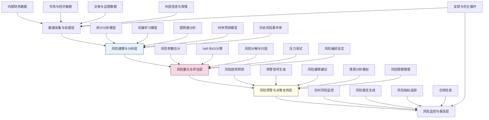

---
{"dg-publish":true,"tags":["AI财务应用","风险评估","量化分析","财务预警","风险管理"],"创建日期":"2024-05-14","permalink":"/知识共享/001_财务/99_其他/AI与财务应用/01_智能财务分析/1.3 决策增强系统/财务风险量化评估/","dgPassFrontmatter":true}
---

## 技术概述

财务风险量化评估系统是一个综合性智能平台，旨在应用先进的人工智能技术对企业财务风险进行全面评估、量化和预警。该系统整合了金融工程、统计建模、机器学习与大数据分析技术，实现对市场风险、信用风险、流动性风险、操作风险等多维度风险的精准识别、量化计算和前瞻性预警。核心技术特性包括：

- **多源数据融合分析**：整合财务报表、市场数据、宏观指标、新闻舆情等多源数据，构建全维度风险感知体系
- **非线性风险建模**：运用深度学习、图神经网络等技术捕捉财务指标间复杂的非线性关系和隐藏的风险模式
- **情景压力测试引擎**：基于蒙特卡洛模拟和经济情景生成，分析在极端市场条件下的财务表现
- **风险传导分析**：利用因果推理和网络分析方法，评估风险在业务单元、供应链和金融网络中的传导路径
- **动态风险预警系统**：结合时序分析和异常检测算法，提前识别财务风险预警信号

相较于传统风险评估方法，本系统具备更强的预测性、更细粒度的风险分解、更高的计算效率，以及对复杂风险关联性的深入理解能力，为企业财务决策提供科学、量化的风险决策支持。

## 系统架构

系统架构由五个核心功能层组成，形成完整的风险管理闭环：

1. **数据采集与处理层**：负责从多源渠道收集内外部数据，进行清洗、标准化和特征工程，为风险分析提供高质量数据基础
2. **风险建模与分析层**：应用多元统计方法、机器学习和网络分析技术，构建各类风险的预测模型和分析框架
3. **风险量化与评估层**：系统核心，进行风险参数估计、风险价值计算、风险分解与归因分析，转化为可量化指标
4. **风险预警与决策支持层**：根据量化结果生成风险趋势预测和预警信号，提供风险缓释建议
5. **风险监控与报告层**：实时监控风险指标变化，生成定制化风险报告，并提供合规检查功能

系统通过风险偏好设定、风险限额管理以及反馈与优化循环三个核心机制，实现风险管理的个性化、自适应和持续改进。

## 实施方案

### 技术实施路线图

**第一阶段：基础构建（3-4个月）**
- 数据源接入与处理管道开发
- 基础风险指标体系构建
- 初步统计风险模型实现
- 风险报告模板设计
- 用户界面原型开发

**第二阶段：核心功能开发（4-5个月）**
- 高级机器学习风险模型开发
- VaR与ES计算引擎实现
- 压力测试模块开发
- 风险分解与归因分析系统
- 基础预警机制构建

**第三阶段：高级分析能力（3-4个月）**
- 图神经网络风险传导模型
- 情景生成与模拟系统
- 深度学习异常检测实现
- 风险缓释推荐引擎
- 高级可视化分析工具

**第四阶段：智能化与集成（3-4个月）**
- AI风险预测模型优化
- 自动化报告系统完善
- 决策支持功能增强
- 风险管理工作流集成
- 系统全面测试与优化

### 技术挑战与解决策略

1. **数据质量与可用性**
   - 挑战：金融数据存在缺失、不一致和时滞问题，难以获得高质量的风险评估基础数据
   - 解决方案：开发高级异常值检测和数据修复算法；利用半监督学习处理标签缺失问题；构建合成数据生成器增强稀有风险场景的训练样本

2. **模型解释性与可信度**
   - 挑战：复杂风险模型往往是黑盒，难以向决策者清晰解释风险评估结果
   - 解决方案：集成SHAP、LIME等模型解释技术；开发因果推理引擎；构建可视化风险归因系统

3. **极端事件预测**
   - 挑战：传统模型难以准确预测低频高影响的极端风险事件
   - 解决方案：开发极值理论(EVT)与深度学习结合的混合模型；构建复杂网络级联失效模拟系统；利用迁移学习从相似领域学习风险模式

4. **风险量化标准化**
   - 挑战：不同类型风险难以统一到标准化度量框架中进行整合评估
   - 解决方案：开发多层次风险等效转换框架；构建基于效用理论的风险统一度量体系；引入贝叶斯网络整合不同风险维度

## 价值创造

### 量化价值评估

1. **风险预测与预防**
   - 潜在损失减少20-35%
   - 风险事件提前预警时间增加30-60天
   - 重大风险事件识别准确率提高40-60%

2. **决策质量提升**
   - 风险调整后收益率提高10-20%
   - 资本效率提升15-25%
   - 风险评估时间减少60-80%

3. **风险管理效率**
   - 风险报告生成时间减少85-95%
   - 风险分析师产能提升100-150%
   - 风险相关合规成本降低30-50%

4. **战略适应性**
   - 市场变化响应速度提升50-70%
   - 业务决策周期缩短30-50%
   - 风险调整后的新业务成功率提高25-40%

### 投资回报分析

投资回报率(ROI)预计达到300-500%（3年期），主要价值来源包括：
- 避免的风险损失（45%）
- 资本优化带来的效率提升（25%）
- 运营效率和人力成本节约（20%）
- 战略决策质量提升（10%）

典型实施成本结构：技术开发与数据科学（50%）、数据采集与集成（20%）、业务流程重组（15%）、培训与变革管理（15%）。

预期投资回收期：
- 大型企业：12-18个月
- 中型企业：18-24个月
- 高风险行业（如金融服务）：9-15个月

## 未来演进

### 技术迭代路线图

**近期演进（1-2年）**
- 整合替代数据源如卫星图像、物联网传感器数据进行风险评估
- 发展跨市场、跨资产类别的风险关联性分析能力
- 增强自然语言处理能力，从非结构化数据中提取风险信号
- 开发可解释AI系统，提高风险评估的透明度

**中期演进（2-3年）**
- 构建端到端的风险数字孪生系统，实现实时风险模拟
- 发展金融网络稳定性分析框架，评估系统性风险
- 整合区块链技术，提高风险数据的可追溯性和完整性
- 开发自动化风险缓释执行系统，实现风险控制的智能化

**远期演进（3-5年）**
- 构建自主学习型风险管理智能体，能够主动发现新型风险模式
- 发展认知风险分析系统，结合人类专家与AI的优势
- 创建跨组织风险共享与协作网络，形成行业风险智能体系
- 开发量子计算风险模型，突破传统计算在复杂风险建模方面的局限

### 扩展应用场景

1. **供应链风险管理**：评估和预测供应链中断风险，优化供应商组合

2. **ESG风险评估**：量化环境、社会和治理相关风险，支持可持续发展决策

3. **网络安全风险量化**：将网络安全风险转化为财务影响指标，优化安全投资

4. **声誉风险管理**：监控和预测潜在的声誉风险事件，评估财务影响

## 实验验证

### 概念验证方案

**阶段一：历史数据分析（4-6周）**
- 收集3-5年历史财务和风险数据
- 构建基础风险模型并回测性能
- 分析历史风险事件的预测能力
- 评估不同风险指标的预测效力

**阶段二：平行运行测试（8-10周）**
- 与现有风险评估系统并行运行
- 比较新旧系统的风险识别效果
- 在不干预决策的情况下记录模型预测
- 评估系统响应时间和计算效率

**阶段三：有限领域部署（10-12周）**
- 在特定业务部门或风险类型上部署
- 将系统输出集成到风险决策流程
- 收集用户反馈和改进建议
- 评估实际业务价值和效率提升

### 评估指标框架

**预测准确性指标**
- 风险预测准确率：模型预测与实际风险事件的匹配度
- 预警提前时间：系统预警与风险事件发生的时间差
- 误报率：错误风险预警占总预警的比例
- AUC和ROC曲线：评估风险分类模型的性能

**风险量化质量指标**
- VaR/ES回测效果：预测风险值与实际损益比较
- 风险分解准确度：风险归因的精确程度
- 压力测试有效性：极端情景模拟与实际极端事件对比

**系统性能指标**
- 计算效率：风险计算和报告生成时间
- 数据处理能力：系统能处理的数据量和更新频率
- 系统稳定性：无故障运行时间和故障恢复速度
- 用户满意度：风险管理团队对系统功能的评价

## 未来影响

财务风险量化评估系统将从根本上改变企业风险管理的方式，从被动响应向主动预防转变，从定性判断向定量分析转变。随着系统的普及和发展，我们预见以下深远影响：

1. **风险文化变革**：企业将从风险规避向量化风险管理转变，形成以数据和模型为基础的风险决策文化

2. **风险智能民主化**：高级风险分析能力将从专业风险管理部门向业务一线扩展，使每个决策者都具备风险智能

3. **资本配置优化**：基于精确风险评估的资本配置将提高整体经济效率，减少资源错配

4. **风险管理职能转型**：风险管理人员从手动监控和分析向战略决策支持和模型治理转变

这一系统最终将使企业具备"风险智能"，不仅能够应对已知风险，更能前瞻性地识别新兴风险，为企业在不确定环境中创造可持续的竞争优势和价值保障。 