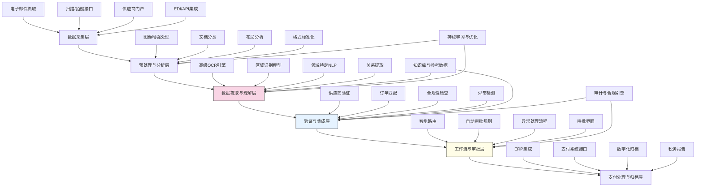

---
{"dg-publish":true,"tags":["文档处理","信息提取","发票管理","OCR技术","智能审核"],"创建日期":"2024-05-14","permalink":"/知识共享/001_财务/99_其他/AI与财务应用/02_财务流程自动化/2.1 智能流程机器人/智能发票处理系统/","dgPassFrontmatter":true}
---

## 技术概述

智能发票处理系统是一个结合先进计算机视觉、自然语言处理和机器学习技术的综合性解决方案，旨在彻底变革传统发票处理流程。该系统能够自动捕获、识别、验证和处理各类电子及纸质发票，将繁琐的手动处理转变为高效、准确的自动化流程。核心技术特点包括：

- **多模态发票捕获**：支持多渠道发票获取，包括扫描、邮件附件、电子发票系统、移动拍照和供应商门户等
- **高级OCR与文档理解**：利用深度学习增强的OCR技术，结合文档布局分析，实现复杂发票格式的精准识别
- **智能数据提取与验证**：应用领域特定的NLP模型，提取关键字段信息并进行多重验证，包括供应商信息、税务合规性和金额计算
- **自动匹配与三方对账**：智能匹配采购订单、收货单与发票信息，实现三单自动对账
- **异常检测与欺诈防护**：利用统计分析和机器学习识别可疑发票模式，防范重复付款和欺诈风险

相比传统发票处理方法，本系统将处理时间从数天缩短至数分钟，准确率提升至95%以上，同时显著减少人工干预需求，并通过高效审核流程加快付款周期，优化供应商关系和现金流管理。

## 系统架构

系统架构由六个核心功能层组成，形成完整的发票处理智能闭环：

1. **数据采集层**：负责从多个渠道获取发票数据，包括电子邮件附件、扫描/拍照、供应商门户和电子数据交换接口，确保全渠道发票捕获
2. **预处理与分析层**：对获取的发票文档进行图像增强、文档分类、布局分析和格式标准化，为精确识别做准备
3. **数据提取与理解层**：系统核心，利用高级OCR引擎和专业领域模型，识别并提取发票关键信息，包括标头、行项目、税费和总计金额
4. **验证与集成层**：对提取的数据进行供应商验证、订单匹配、合规性检查和异常检测，确保数据准确性和合法性
5. **工作流与审批层**：根据预定规则自动路由发票，处理例外情况，并提供人工审批界面，确保处理合规性
6. **支付处理与归档层**：与ERP和支付系统集成，完成付款流程，并进行数字化归档和税务数据整合

系统通过知识库与参考数据、持续学习与优化以及审计与合规引擎三个核心支持机制，不断提升识别准确性，保证处理合规性，并持续优化系统性能。

## 实施方案

### 技术实施路线图

**第一阶段：基础功能构建（2-3个月）**
- 开发多渠道发票采集接口
- 构建基础OCR功能和初级数据提取能力
- 实现简单的验证规则和异常检测
- 开发基础审批工作流
- 建立ERP系统集成

**第二阶段：高级识别与验证（3-4个月）**
- 增强OCR引擎，提高复杂布局识别能力
- 开发领域特定NLP模型提升数据提取准确率
- 构建供应商信息库和历史发票数据库
- 实现高级验证和三单自动匹配
- 开发异常检测与欺诈防护功能

**第三阶段：智能流程优化（2-3个月）**
- 实现智能审批路由与决策规则
- 开发自适应学习机制，持续优化识别模型
- 构建高级异常处理和升级流程
- 增强数据分析和报告功能
- 完善用户界面和交互体验

**第四阶段：系统集成与扩展（2-3个月）**
- 深度集成ERP、采购和支付系统
- 优化端到端处理流程和系统性能
- 开发高级合规性检查和税务报告功能
- 构建供应商门户和自助服务功能
- 系统测试、优化和全面部署

### 技术挑战与解决策略

1. **多样化发票格式识别**
   - 挑战：不同供应商、不同国家和行业的发票格式各异，难以构建统一识别模型
   - 解决方案：开发模板自学习系统，根据供应商自动构建特定模板；采用迁移学习技术提高新格式适应性；构建层次化识别模型处理不同结构复杂度

2. **信息提取准确性**
   - 挑战：复杂表格、特殊符号和低质量扫描件导致的识别错误
   - 解决方案：多模型集成提高鲁棒性；上下文感知信息提取；知识图谱辅助验证；结合规则与统计模型进行后处理修正

3. **合规性与税务复杂性**
   - 挑战：不同国家和地区税务规则复杂多变，难以保证全球合规
   - 解决方案：构建动态更新的税务规则引擎；开发多层次验证框架；整合专业税务知识库；与税务系统API集成

4. **系统集成与数据流转**
   - 挑战：需要与多个现有系统（ERP、采购、支付、档案）无缝集成
   - 解决方案：采用API优先架构；开发灵活的集成适配器；使用事件驱动架构促进系统间通信；构建中央数据转换层标准化数据流

## 价值创造

### 量化价值评估

1. **效率与生产力提升**
   - 发票处理时间减少85-95%
   - 人工数据输入需求降低90-98%
   - 处理能力提升400-600%
   - 财务人员可处理更多战略性工作，生产力提升35-50%

2. **准确性与合规性改善**
   - 数据录入准确率提高至99%以上
   - 合规异常检出率提高65-80%
   - 重复付款风险降低95%以上
   - 审计准备时间减少70-85%

3. **成本节约**
   - 每张发票处理成本降低60-80%
   - 纸质存储和管理成本降低90%以上
   - 因错误和延迟导致的罚款减少75-90%
   - 早付折扣捕获率提高40-60%

4. **供应商关系优化**
   - 付款周期缩短50-70%
   - 供应商查询减少60-80%
   - 争议解决时间缩短70-85%
   - 供应商满意度提高30-50%

### 投资回报分析

投资回报率(ROI)预计达到300-500%（24个月期），主要价值来源包括：
- 直接人力成本节约（45%）
- 错误减少和效率提升（25%）
- 早付折扣捕获（15%）
- 纸质处理与存储成本降低（10%）
- 合规性提升和罚款减少（5%）

典型实施成本结构：软件开发与许可（40%）、系统集成（25%）、数据迁移与清理（15%）、培训与变更管理（15%）、基础设施（5%）。

预期投资回收期：
- 大型企业（>5000张发票/月）：6-8个月
- 中型企业（1000-5000张发票/月）：8-12个月
- 小型企业（<1000张发票/月）：12-18个月

## 未来演进

### 技术迭代路线图

**近期演进（1-2年）**
- 增强移动设备捕获与处理能力
- 引入对话式AI助手协助异常处理
- 开发预测性付款计划优化功能
- 整合区块链技术提高发票真实性验证

**中期演进（2-3年）**
- 开发供应商行为分析与风险评估模型
- 构建端到端采购到付款智能体系
- 实现实时税务合规性与优化建议
- 开发跨企业发票协作网络平台

**远期演进（3-5年）**
- 发展认知分析引擎实现深度支出洞察
- 构建自主优化的采购-发票-付款生态系统
- 创建数字身份与智能合约支持的无发票交易系统
- 开发融合量子计算的超大规模发票处理能力

### 扩展应用场景

1. **采购流程智能化**：向上游扩展至需求管理、供应商选择和合同管理的智能化

2. **供应商关系管理平台**：整合发票数据与供应商绩效评估，构建智能供应商管理体系

3. **现金流与资金规划**：基于发票处理数据进行高精度现金流预测和资金规划

4. **费用与支出分析**：提供深度支出分析和优化建议，支持成本控制决策

## 实验验证

### 概念验证方案

**阶段一：基础功能验证（4-6周）**
- 选择特定类型发票进行OCR和数据提取测试
- 评估不同质量扫描件的识别准确率
- 测试基本验证规则的有效性
- 确定关键性能指标和优化方向

**阶段二：业务流程集成（6-8周）**
- 在有限业务场景中实施端到端流程
- 测试与ERP系统的集成
- 评估自动化审批流程效果
- 收集用户反馈并调整系统功能

**阶段三：全面测试与优化（8-10周）**
- 扩展至多类型发票处理
- 进行高容量处理压力测试
- 测试异常情况识别和处理能力
- 优化系统性能和用户体验
- 制定全面部署策略

### 评估指标框架

**技术性能指标**
- OCR准确率：文本识别的字符级准确度
- 数据提取准确率：关键字段提取的准确性
- 处理速度：单张发票完整处理的平均时间
- 异常检测率：成功识别异常和错误的比率

**业务效率指标**
- 自动化率：无人工干预完成处理的发票比例
- 处理吞吐量：系统每小时/天可处理的发票数量
- 入账周期：从接收到入账的平均时间
- 审批效率：审批流程完成的平均时间

**价值实现指标**
- 成本节约：每张发票处理成本的降低
- 付款周期：发票接收到付款的平均时间
- 早付折扣捕获：成功获取早付折扣的比例
- 用户满意度：财务人员和审批人对系统的评价

## 未来影响

智能发票处理系统将从根本上改变企业财务运营模式和供应链生态，产生深远影响：

1. **无纸化财务运营**：发票处理将全面数字化，消除传统纸质流程，建立环保高效的财务运营模式

2. **财务角色转型**：财务人员将从数据录入者转变为数据分析师和战略顾问，关注更高价值的决策支持工作

3. **采购-付款一体化**：发票处理将与采购和付款流程无缝集成，形成端到端的智能采购支付生态系统

4. **供应链关系变革**：买方与供应商将建立更加透明、高效的财务互动关系，减少争议并加速资金流转

通过实现发票处理的全面自动化和智能化，企业将释放大量财务资源，减少错误和欺诈风险，加速付款周期，优化现金流管理，创造显著的财务和运营价值。随着技术的持续发展，未来的发票处理将不仅是一个自动化操作，更将成为企业财务智能的重要组成部分，提供深入的支出分析和优化洞察。 