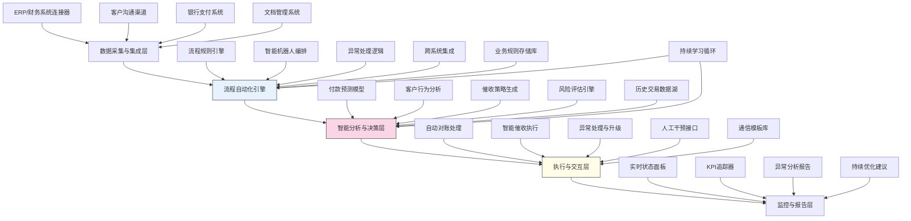

---
{"dg-publish":true,"tags":["流程自动化","RPA增强","应收账款","现金流管理","智能催收"],"创建日期":"2024-05-14","permalink":"/知识共享/001_财务/99_其他/AI与财务应用/02_财务流程自动化/2.1 智能流程机器人/端到端应收账款自动化/","dgPassFrontmatter":true}
---

## 技术概述

端到端应收账款自动化系统是一个集成AI技术与流程机器人(RPA)的智能解决方案，旨在彻底革新传统应收账款管理流程。该系统通过无缝连接从客户订单到付款确认的完整生命周期，实现应收账款全流程的数字化、自动化与智能化。核心技术特点包括：

- **智能文档处理**：利用计算机视觉和NLP技术，自动处理和提取各类财务文档（订单、发票、对账单等）中的关键信息
- **自动化账务匹配**：应用机器学习算法进行智能匹配，自动核对发票与收款信息，处理部分付款和多发票匹配场景
- **预测性现金流分析**：结合历史付款模式和客户信用数据，生成高精度的收款预测模型
- **智能催收策略引擎**：基于客户画像和付款行为分析，自动生成个性化催收策略和沟通模板
- **端到端流程编排**：基于高级RPA技术，实现跨系统业务流程自动化，无需人工干预完成复杂操作序列

与传统应收账款管理方法相比，本系统将处理效率提升75-90%，错误率降低90%以上，同时通过智能催收策略显著改善DSO(应收账款周转天数)指标，优化企业现金流周期与运营资金效率。

## 系统架构

系统架构由五个核心功能层组成，形成端到端的应收账款自动化闭环：

1. **数据采集与集成层**：负责连接和集成企业内外部数据源，包括ERP系统、银行支付平台、文档管理系统和客户沟通渠道，实现数据的无缝流转
2. **流程自动化引擎**：系统核心层，负责流程规则定义、机器人任务编排、异常处理逻辑和跨系统操作集成，实现业务流程的端到端自动化
3. **智能分析与决策层**：应用机器学习算法进行付款预测、客户行为分析、智能催收策略生成和风险评估，为自动化流程提供智能决策支持
4. **执行与交互层**：执行自动对账、智能催收、异常处理等具体操作，同时提供必要的人工干预接口，确保流程完整性
5. **监控与报告层**：提供全面的可视化仪表板，实时监控流程执行状态，追踪关键绩效指标，分析流程异常并提供持续优化建议

系统通过业务规则存储库、历史交易数据湖、通信模板库和持续学习循环四个核心机制，确保流程的规范执行、数据的充分利用、沟通的专业一致和系统的持续进化。

## 实施方案

### 技术实施路线图

**第一阶段：基础自动化（2-3个月）**
- 建立ERP和银行系统集成接口
- 开发基础RPA机器人流程（发票处理、付款匹配）
- 构建初步流程监控仪表板
- 开发基础规则引擎和流程模板
- 用户界面设计与原型开发

**第二阶段：智能分析能力（3-4个月）**
- 开发付款预测模型和现金流预测功能
- 构建客户支付行为分析系统
- 实现基础智能对账功能
- 开发异常识别和处理流程
- 完善流程监控和报告功能

**第三阶段：高级自动化功能（2-3个月）**
- 开发智能催收策略引擎
- 实现多渠道自动催收执行
- 构建端到端流程编排与监控
- 开发高级对账与匹配算法
- 增强异常处理与自动解决能力

**第四阶段：系统优化与集成（2-3个月）**
- 实现全流程闭环与无缝衔接
- 优化机器学习模型性能
- 开发自助服务客户门户
- 完善绩效分析与优化建议功能
- 系统集成测试与生产部署

### 技术挑战与解决策略

1. **系统集成复杂性**
   - 挑战：需要集成多个异构系统（ERP、银行系统、CRM等），数据格式和接口各不相同
   - 解决方案：采用API优先架构，设计灵活的集成适配器；利用ETL工具构建标准化数据转换流；开发通用连接器框架支持多种集成协议

2. **非结构化文档处理**
   - 挑战：客户发票、支付凭证等文档格式多样，难以准确提取结构化信息
   - 解决方案：结合OCR与深度学习的文档理解技术；构建针对财务文档的特定领域模型；设计混合人工+AI审核工作流确保关键数据准确性

3. **复杂付款场景处理**
   - 挑战：处理部分付款、打包付款、多发票匹配等复杂场景时逻辑繁琐
   - 解决方案：开发适应性强的匹配算法组合；构建基于图模型的交易关系推理引擎；设计灵活的业务规则配置系统应对不同付款场景

4. **系统可扩展性**
   - 挑战：随着业务规模扩大和流程复杂性增加，系统需要保持高性能和可扩展性
   - 解决方案：采用微服务架构设计；实现负载均衡与自动扩展；使用消息队列解耦核心处理流程；基于容器技术实现灵活部署

## 价值创造

### 量化价值评估

1. **运营效率提升**
   - 应收账款处理时间减少80-95%
   - 人工干预需求降低75-85%
   - 每月结账周期缩短2-4天
   - 财务人员产能提升150-200%

2. **现金流改善**
   - DSO(应收账款周转天数)减少15-30%
   - 坏账率降低25-40%
   - 可预测现金流准确率提高60-80%
   - 营运资金需求减少10-20%

3. **成本节约**
   - 应收账款管理人力成本降低50-70%
   - 纸质处理与管理费用降低80-95%
   - 催收外包费用减少60-80%
   - 错误处理与修正成本降低85-95%

4. **客户体验提升**
   - 账单准确率提高至99.5%以上
   - 账单查询响应时间缩短90%
   - 客户支付选项多样化增加50%
   - 客户满意度提升25-40%

### 投资回报分析

投资回报率(ROI)预计达到250-400%（18个月期），主要价值来源包括：
- 人力成本节约（40%）
- 现金流改善带来的财务收益（30%）
- 坏账减少和收款改善（20%）
- 运营和流程效率提升（10%）

典型实施成本结构：软件与系统开发（45%）、流程设计与集成（25%）、训练与实施（20%）、系统维护与支持（10%）。

预期投资回收期：
- 大型企业：6-9个月
- 中型企业：9-12个月
- 小型企业：12-15个月

## 未来演进

### 技术迭代路线图

**近期演进（1-2年）**
- 增强移动端催收和应收账款管理能力
- 整合区块链技术提高交易透明度和追溯能力
- 引入对话式AI助手简化应收账款查询和处理
- 开发更复杂的付款行为预测模型，包含外部市场因素

**中期演进（2-3年）**
- 构建智能合约自动执行的付款协议系统
- 发展客户信用健康监控和预警系统
- 整合供应链金融平台，提供灵活融资选项
- 开发跨币种、跨区域的统一应收账款管理能力

**远期演进（3-5年）**
- 构建完全自主的应收账款管理智能体
- 发展动态定价与支付条件优化系统
- 创建基于区块链的分布式供应链金融生态
- 开发认知计算驱动的财务关系和商业行为分析系统

### 扩展应用场景

1. **供应商财务关系管理**：扩展至应付账款流程，实现完整的现金流周期管理

2. **客户信用与关系管理**：整合CRM系统，构建基于支付行为的深度客户洞察

3. **财务合规自动化**：将合规检查与审计跟踪自动集成到应收账款流程中

4. **财资管理优化**：与资金管理系统集成，优化短期投资与资金配置决策

## 实验验证

### 概念验证方案

**阶段一：流程自动化验证（4-6周）**
- 选择1-2个高频重复的应收账款子流程
- 实现基础RPA自动化并衡量效率提升
- 验证系统与ERP及银行系统的集成能力
- 确定最佳流程设计和例外处理机制

**阶段二：智能分析能力验证（6-8周）**
- 使用历史数据构建付款预测模型原型
- 评估预测准确率与可靠性
- 测试客户分群和个性化策略效果
- 优化模型与分析算法

**阶段三：端到端流程测试（8-10周）**
- 实现完整流程链接，从发票生成到收款确认
- 进行有限生产环境测试，并行运行与现有系统
- 收集过程数据与绩效指标
- 优化流程并确定全面部署方案

### 评估指标框架

**效率指标**
- 处理时间：从发票创建到结算确认的平均时间
- 自动化率：无需人工干预完成的交易百分比
- 处理容量：系统每日/每月可处理的交易量
- 人工干预率：需要手动处理的异常情况比例

**准确性指标**
- 对账准确率：系统自动对账的准确性
- 文档处理准确率：从文档中提取信息的准确性
- 预测准确度：现金流和付款预测的准确性
- 错误率：系统处理过程中的错误发生率

**业务价值指标**
- DSO减少：应收账款周转天数的改善
- 坏账率变化：坏账发生率的变化
- 收款效率：催收活动的成功率和响应时间
- 客户满意度：与应收账款流程相关的客户体验评分

## 未来影响

端到端应收账款自动化系统将从根本上改变企业财务运营模式，转变传统财务职能，并带来深远的业务价值：

1. **财务运营模式转型**：从交易处理中心转变为战略价值伙伴，财务团队将把精力从重复性工作转向增值分析和决策支持

2. **客户关系重新定义**：通过数据驱动的个性化财务互动，建立更紧密的客户财务关系，提高客户满意度和忠诚度

3. **财务与业务整合深化**：应收账款数据与销售、市场、产品数据的整合将提供全方位业务洞察，支持更全面的商业决策

4. **财务风险管理优化**：端到端可视性和预测能力将大幅提升财务风险管理水平，降低现金流波动和坏账风险

通过实现应收账款管理的全面自动化和智能化，企业将释放大量财务资源，重新聚焦于支持业务增长和创新，同时大幅改善营运资金效率和客户体验，为公司创造持续的竞争优势和财务价值。 