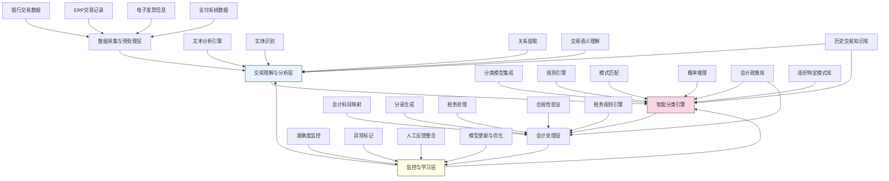

---
{"dg-publish":true,"tags":["智能分类","自学习系统","自动记账","交易分析","会计智能"],"创建日期":"2024-05-14","permalink":"/知识共享/001_财务/99_其他/AI与财务应用/02_财务流程自动化/2.1 智能流程机器人/自适应记账与分类/","dgPassFrontmatter":true}
---

## 技术概述

自适应记账与分类系统是一套融合机器学习、自然语言处理和规则引擎的智能会计解决方案，能够自动识别、分析和分类各类财务交易，并执行相应的会计处理。该系统不仅能根据既定规则进行自动记账，更能通过持续学习不断提高分类准确性，适应会计变化和业务演变。核心技术特点包括：

- **多源交易理解**：整合银行流水、电子发票、支付系统和ERP数据，实现跨来源的交易数据理解与关联
- **上下文感知分类**：结合交易描述、历史模式、交易方信息和业务背景，实现高精度的智能科目分类
- **持续学习机制**：从人工纠正和历史决策中不断学习，自动调整分类模型和决策规则
- **自动会计分录生成**：基于交易性质和会计规则，自动生成完整的会计分录，包括复杂的多科目和税务处理
- **自适应规则引擎**：能够根据组织特定的会计政策和行业标准自动调整处理规则，确保合规性

相比传统记账方法，本系统将手动分类工作减少90%以上，提高分类准确率至95-98%，同时显著加速月结流程，减少会计差错，并通过持续学习实现分类准确度的逐步提升，适应业务变化和财务政策调整。

## 系统架构

系统架构由五个核心功能层组成，形成完整的自适应记账闭环：

1. **数据采集与预处理层**：从多个来源获取交易数据，进行标准化、清洗和初步结构化，为后续分析奠定基础
2. **交易理解与分析层**：使用NLP和文本分析技术深入理解交易描述，识别关键实体和关系，提取交易语义信息
3. **智能分类引擎**：系统核心，整合多种分类算法、规则引擎和模式匹配技术，对交易进行智能分类决策
4. **会计处理层**：根据分类结果自动生成会计分录，处理税务计算，并进行合规性验证
5. **监控与学习层**：持续监控分类准确度，标记异常，整合人工反馈，并不断优化模型和规则

系统通过会计政策库、历史交易知识库、组织特定模式库和税务规则引擎四个核心知识组件，提供决策支持并确保处理符合组织要求和监管标准。闭环学习机制使系统能够不断进化，提高准确性并适应变化。

## 实施方案

### 技术实施路线图

**第一阶段：基础功能构建（2-3个月）**
- 开发数据采集与集成接口
- 构建基础NLP文本分析能力
- 实现初级分类模型和规则引擎
- 开发基础会计分录生成功能
- 建立监控和学习框架

**第二阶段：智能分类优化（3-4个月）**
- 增强文本分析和语义理解能力
- 开发混合分类模型（规则+ML）
- 构建上下文感知分类功能
- 完善各类交易的处理规则
- 实现自动税务处理功能

**第三阶段：自适应能力构建（2-3个月）**
- 开发持续学习与模型调优机制
- 构建异常检测与处理流程
- 实现动态规则调整功能
- 优化复杂交易处理能力
- 增强用户反馈整合机制

**第四阶段：高级功能与集成（2-3个月）**
- 开发高级语义理解和推理能力
- 构建预测性分类推荐
- 实现跨期交易智能处理
- 优化系统性能和可扩展性
- 完成与财务系统的深度集成

### 技术挑战与解决策略

1. **交易描述多样性与模糊性**
   - 挑战：银行和支付系统中的交易描述常常简短、不规范，甚至含有缩写和代码
   - 解决方案：开发特定领域的文本解析器；构建交易方信息库辅助理解；结合多源数据进行交叉验证；开发模糊匹配和推理算法

2. **会计分类的复杂依赖关系**
   - 挑战：准确分类可能依赖于交易历史、业务背景、会计政策等多种因素
   - 解决方案：构建图结构知识表示；开发多层次上下文理解模型；实现基于交易链条的推理；整合业务规则与统计模型

3. **持续学习与系统稳定性平衡**
   - 挑战：持续学习可能导致模型漂移和不一致的分类结果
   - 解决方案：实施渐进式学习策略；建立分类信心指标；开发版本控制和回滚机制；构建变化检测与适应性调整框架

4. **行业和组织特异性**
   - 挑战：不同行业和组织有特定的会计科目和处理规则
   - 解决方案：开发模块化和可配置的分类模型；实现快速领域适应技术；创建组织特定知识库；提供自定义规则接口

## 价值创造

### 量化价值评估

1. **效率与生产力提升**
   - 手动记账工作减少90-95%
   - 会计处理时间缩短85-90%
   - 月结周期缩短40-60%
   - 会计人员可专注于分析和决策支持，生产力提升35-50%

2. **准确性与数据质量提升**
   - 分类准确率提高至95-98%
   - 会计错误减少80-90%
   - 数据一致性提高75-85%
   - 差错更正工作减少85-95%

3. **合规性与控制加强**
   - 会计政策执行一致性提高至95%
   - 审计准备时间减少60-75%
   - 合规风险降低70-85%
   - 财务问题检测提前30-45天

4. **业务洞察增强**
   - 实时财务报告可用性提高95%
   - 业务交易分析速度提升80-90%
   - 财务数据粒度和质量提升65-80%
   - 决策支持能力增强50-70%

### 投资回报分析

投资回报率(ROI)预计达到280-450%（24个月期），主要价值来源包括：
- 人力成本节约（50%）
- 错误减少与效率提升（25%）
- 合规与控制改善（15%）
- 业务洞察与决策支持增强（10%）

典型实施成本结构：软件开发与许可（45%）、系统集成（20%）、数据准备与迁移（15%）、模型训练与优化（10%）、培训与变更管理（10%）。

预期投资回收期：
- 大型企业（>5000笔月交易）：8-12个月
- 中型企业（1000-5000笔月交易）：12-18个月
- 小型企业（<1000笔月交易）：18-24个月

## 未来演进

### 技术迭代路线图

**近期演进（1-2年）**
- 增强多语言处理能力，支持跨国业务
- 开发高级异常模式检测，提前识别会计问题
- 实现智能审计支持功能，自动准备审计材料
- 扩展对非结构化交易文档的处理能力

**中期演进（2-3年）**
- 构建预测性记账模型，预测和建议未来交易处理
- 开发会计政策影响模拟系统，评估政策变更
- 实现跨实体和复杂组织结构的智能记账
- 发展智能会计顾问功能，提供会计处理建议

**远期演进（3-5年）**
- 创建自主会计智能体，能够独立处理复杂会计决策
- 开发认知会计系统，理解和解释会计处理逻辑
- 构建基于区块链的分布式会计记录和验证网络
- 实现全面集成的财务智能系统，打通计划、执行、记录和分析

### 扩展应用场景

1. **预算与实际对比分析**：将交易自动映射到预算类别，实现实时预算执行监控

2. **财务控制与合规管理**：基于交易模式识别潜在控制问题，支持财务控制自动化

3. **现金流管理与预测**：结合交易分类和付款模式，提供精确的现金流预测

4. **业务绩效分析**：自动将交易关联到业务单元、项目和客户，支持多维度绩效分析

## 实验验证

### 概念验证方案

**阶段一：基础分类验证（4-6周）**
- 收集历史交易数据，构建初始训练集
- 开发和测试基础分类模型
- 验证不同类型交易的分类准确率
- 确定关键改进点和优化方向

**阶段二：会计处理验证（6-8周）**
- 实现自动化会计分录生成
- 测试各类交易的处理规则
- 验证税务处理准确性
- 评估处理逻辑的完整性

**阶段三：学习与适应性测试（8-10周）**
- 实施持续学习机制
- 模拟会计政策变更，测试适应能力
- 构建长期准确率跟踪框架
- 评估系统在生产环境的表现
- 完善学习机制并准备全面部署

### 评估指标框架

**技术性能指标**
- 分类准确率：正确分类交易的百分比
- 处理速度：每分钟可处理的交易数量
- 学习效率：系统从反馈中改进的速度
- 异常检测率：成功识别异常交易的比率

**业务效率指标**
- 自动处理率：无需人工干预的交易百分比
- 错误率：系统引入的会计错误数量
- 处理时延：从交易发生到完成记账的时间
- 适应性指标：系统应对新类型交易的能力

**价值实现指标**
- 人工工时节约：减少的手动记账工时
- 月结时间：完成月度结账所需的天数
- 数据质量指标：一致性、完整性和准确性评分
- 用户满意度：会计和财务人员对系统的评价

## 未来影响

自适应记账与分类系统将从根本上改变财务记账与会计处理模式，带来深远影响：

1. **会计职能转型**：会计人员将从数据处理者转变为数据分析师和业务顾问，专注于解释财务结果和支持决策

2. **实时财务洞察**：实现近乎实时的财务状况可见性，消除传统记账滞后，为业务决策提供及时支持

3. **智能财务操作**：从人工驱动的财务操作转向AI驱动的智能财务体系，提高效率的同时降低错误风险

4. **财务合规自动化**：从手动检查转向系统化的合规监控，实现更高效、更全面的财务控制

通过实现记账与分类的全面自动化和智能化，企业将释放大量财务资源，加速财务流程，提高数据质量，并为业务决策提供更及时、更精确的财务信息。随着系统不断学习和进化，未来的财务记录将从被动的历史记录转变为主动的业务洞察引擎，为组织创造更大的战略价值。 