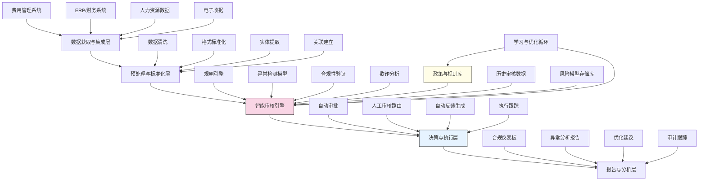

---
{"dg-publish":true,"tags":["合规审核","规则引擎","费用管理","异常检测","智能审批"],"创建日期":"2024-05-14","permalink":"/知识共享/001_财务/99_其他/AI与财务应用/02_财务流程自动化/2.1 智能流程机器人/费用自动审核与合规检查/","dgPassFrontmatter":true}
---

## 技术概述

费用自动审核与合规检查系统是一套融合人工智能、大数据分析和自动化规则引擎的智能解决方案，旨在彻底革新传统费用审核流程。该系统能够自动验证员工提交的各类费用申请和报销单据，确保其符合公司政策、行业规范和法律法规要求，同时检测异常模式和潜在欺诈行为。核心技术特点包括：

- **多层次规则引擎**：构建层次化、可配置的规则体系，从基础合规性到复杂场景判断，实现全面灵活的合规检查
- **智能异常检测**：结合监督学习和无监督学习方法，识别异常费用模式和行为偏差，发现传统规则难以捕捉的问题
- **上下文感知分析**：考虑员工角色、部门、地区、出差历史等多维背景信息，实现基于情境的智能审核
- **自适应学习机制**：系统持续从审批历史和人工判断中学习，不断优化检测模型和规则参数
- **自然语言理解**：分析费用描述、收据内容和通信记录，验证费用真实性和合理性

相比传统费用审核方法，本系统将审核时间缩短90%以上，错误检出率提高65-85%，同时显著减少人工审核负担，大幅降低不合规和欺诈风险，提高整体费用管理效率和透明度。

## 系统架构

系统架构由五个核心功能层组成，形成完整的费用审核智能闭环：

1. **数据获取与集成层**：负责从费用管理系统、ERP、HR系统和电子收据中获取并整合数据，建立费用审核的全面数据基础
2. **预处理与标准化层**：对收集的数据进行清洗、标准化和结构化处理，提取关键实体并建立数据间的关联关系
3. **智能审核引擎**：系统核心，集成规则引擎、异常检测模型、合规性验证和欺诈分析功能，执行全方位的费用审核
4. **决策与执行层**：根据审核结果自动批准合规费用，将可疑项目路由给人工审核，生成反馈并跟踪执行情况
5. **报告与分析层**：提供合规状况仪表板、异常分析报告、优化建议和审计跟踪，支持管理决策和持续改进

系统通过政策与规则库、历史审核数据、风险模型存储库和学习与优化循环四个核心支持机制，持续更新规则库，优化检测模型，实现系统的自我完善和进化。

## 实施方案

### 技术实施路线图

**第一阶段：基础规则引擎构建（2-3个月）**
- 开发基础规则配置框架
- 实现核心政策规则集
- 建立数据集成接口
- 开发初级异常检测功能
- 构建基础审批工作流

**第二阶段：智能分析能力（3-4个月）**
- 开发高级异常检测模型
- 构建上下文感知分析功能
- 实现多级验证策略
- 开发自动反馈生成系统
- 增强数据可视化和报告功能

**第三阶段：自适应能力构建（2-3个月）**
- 开发机器学习优化模块
- 实现规则自动调优功能
- 构建复杂场景检测能力
- 开发预测性风险评估
- 增强用户界面和交互体验

**第四阶段：高级功能与集成（2-3个月）**
- 开发高级自然语言理解功能
- 实现图分析欺诈检测
- 构建政策影响模拟功能
- 开发高级合规报告与分析
- 系统测试、优化和部署

### 技术挑战与解决策略

1. **政策复杂性和多变性**
   - 挑战：企业政策通常复杂多变，不同部门、地区和员工级别可能适用不同规则
   - 解决方案：开发动态规则引擎，支持层次化政策定义；实现规则版本控制与历史追踪；构建基于角色的规则适配框架

2. **异常行为识别难度**
   - 挑战：费用欺诈和异常行为通常具有隐蔽性，单纯依靠规则难以全面检测
   - 解决方案：部署多模型集成检测策略，结合监督学习和无监督异常检测；利用图分析识别复杂关系模式；开发时序异常检测捕捉行为变化

3. **上下文理解能力**
   - 挑战：费用合理性往往依赖于特定情境，缺乏情境理解会导致误判
   - 解决方案：构建多维员工画像；整合出差、项目和业务活动数据；开发情境感知模型评估费用合理性；利用NLP理解费用描述和相关文本

4. **系统可解释性**
   - 挑战：AI驱动的决策需要清晰解释，以支持审核人员理解和接受系统判断
   - 解决方案：开发分层可解释性框架；提供规则触发可视化；构建决策路径追踪；实现异常检测解释机制；开发用户友好的解释界面

## 价值创造

### 量化价值评估

1. **效率与生产力提升**
   - 费用审核时间减少90-95%
   - 人工审核工作量降低70-85%
   - 审批周期缩短75-90%
   - 财务人员可专注于高价值任务，生产力提升30-45%

2. **合规性与控制增强**
   - 不合规费用检出率提高65-85%
   - 政策执行一致性提高至95%以上
   - 欺诈检测准确率提高50-70%
   - 审计发现问题减少80-90%

3. **成本节约**
   - 不合规和过度支出减少15-25%
   - 欺诈损失降低40-60%
   - 审核人力成本降低60-75%
   - 审计准备和合规成本降低50-65%

4. **员工体验改善**
   - 报销周期缩短70-85%
   - 首次提交通过率提高40-60%
   - 费用政策理解度提升50-70%
   - 员工满意度提高30-45%

### 投资回报分析

投资回报率(ROI)预计达到250-400%（18个月期），主要价值来源包括：
- 减少不合规和过度支出（35%）
- 人力成本节约（30%）
- 欺诈损失降低（20%）
- 合规管理效率提升（15%）

典型实施成本结构：软件开发与许可（45%）、数据集成与清理（20%）、政策规则配置（15%）、培训与变更管理（15%）、基础设施（5%）。

预期投资回收期：
- 大型企业（>5000名员工）：6-9个月
- 中型企业（500-5000名员工）：9-12个月
- 小型企业（<500名员工）：12-18个月

## 未来演进

### 技术迭代路线图

**近期演进（1-2年）**
- 发展移动设备实时审核与反馈
- 引入对话式AI助手指导合规提交
- 开发预测性费用建议功能
- 增强不同语言和地区的合规支持

**中期演进（2-3年）**
- 构建跨组织费用基准与比较系统
- 发展智能费用优化建议引擎
- 实现全自动收据验证与欺诈检测
- 开发政策影响模拟与优化平台

**远期演进（3-5年）**
- 构建自治型费用管理智能体
- 发展预算-费用一体化智能系统
- 创建基于区块链的分布式合规验证网络
- 开发认知计算驱动的财务行为理解系统

### 扩展应用场景

1. **采购合规管理**：扩展至采购请求和合同的自动合规检查，确保全面支出合规

2. **项目财务管理**：整合项目管理系统，实现基于项目预算和进度的智能费用控制

3. **旅行与会议管理**：提供行程规划与预订集成，在费用产生前进行合规指导

4. **税务合规与优化**：增强税务规则引擎，自动识别税务风险并提供优化建议

## 实验验证

### 概念验证方案

**阶段一：基础规则验证（4-6周）**
- 选择特定类型费用实现基础规则审核
- 测试规则引擎准确性和效率
- 验证系统与现有费用系统集成
- 评估基础功能的用户体验

**阶段二：智能分析能力验证（6-8周）**
- 使用历史数据训练异常检测模型
- 测试特定场景的上下文感知分析
- 评估模型检测效果与误报率
- 优化模型和算法性能

**阶段三：端到端流程验证（8-10周）**
- 实施完整审核流程，从提交到批准
- 与现有审核系统并行运行
- 收集关键绩效指标和用户反馈
- 优化系统功能和用户体验
- 制定全面部署方案

### 评估指标框架

**技术性能指标**
- 规则执行准确率：规则正确应用的比率
- 异常检测精度：真阳性/(真阳性+假阳性)
- 异常检测召回率：真阳性/(真阳性+假阴性)
- 处理速度：单笔费用完成审核的平均时间

**业务效率指标**
- 自动批准率：无需人工干预的费用比例
- 政策偏差检测：发现的政策违规数量
- 审批周期：从提交到最终决定的平均时间
- 误报率：系统错误标记的费用比例

**价值实现指标**
- 费用合规率：符合政策的费用占比提高
- 平均费用金额：特定类别费用的平均金额变化
- 欺诈检出：系统识别的欺诈案例数量与价值
- 用户满意度：员工和审核人员对系统的评价

## 未来影响

费用自动审核与合规检查系统将从根本上改变企业费用管理模式，产生深远影响：

1. **费用文化转型**：从事后控制转向主动指导，建立自律和透明的费用文化，减少合规摩擦

2. **财务控制模式变革**：从抽样检查转向全面、实时的智能监控，提高控制效力同时减少管控资源

3. **数据驱动政策优化**：基于费用模式和异常分析，持续优化公司政策，平衡控制与业务需求

4. **财务角色转型**：审核人员从交易验证者转变为异常调查者和政策顾问，提供更高价值服务

通过实现费用审核的全面自动化和智能化，企业将建立更高效、更透明的费用管理体系，大幅降低合规风险和财务损失，同时提升员工体验和财务运营效率。随着系统持续学习和演进，未来的费用管理将从被动控制转向主动引导，从单纯的合规检查转向全面的支出智能管理。 