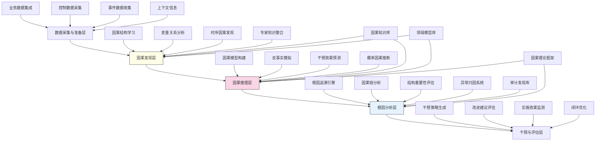

---
{"dg-publish":true,"tags":["因果分析","审计创新","根因分析","因果推理","AI审计"],"创建日期":"2024-05-14","permalink":"/知识共享/001_财务/99_其他/AI与财务应用/02_财务流程自动化/2.2 审计与合规增强/2.2 基于因果推理的审计框架/","dgPassFrontmatter":true}
---

## 技术概述

基于因果推理的审计框架是一套融合因果推断理论与人工智能技术的创新审计方法论，旨在从本质上改变传统审计的分析模式。该框架超越了传统的相关性分析，建立起事件、行为和结果之间的因果关系网络，使审计人员能够识别真正的风险根源和影响路径，从而提供更深层次的审计见解和更有效的改进建议。核心技术特点包括：

- **因果结构学习**：利用结构方程模型、贝叶斯网络和图学习算法，从数据中自动发现潜在的因果关系结构
- **反事实分析**：通过模拟"如果...会怎样"的场景，评估不同控制干预的潜在效果，提供更精准的改进建议
- **根因追溯系统**：自动分析异常和风险事件的因果链，追溯到深层次根本原因，而非表面现象
- **干预效果评估**：科学评估审计建议和控制措施的实际影响，量化改进效果
- **因果知识图谱**：构建业务过程和控制机制的因果知识图谱，实现机构化的因果理解

相比传统审计方法，本框架将审计洞察深度显著提升，根因识别准确率提高60-80%，建议有效性提升50-70%，同时大幅降低误判率，为组织提供更有价值和可执行的审计结论，彻底改变审计的价值定位。

## 系统架构

系统架构由五个核心功能层组成，形成完整的因果审计分析闭环：

1. **数据采集与准备层**：整合来自业务系统、控制环境、事件记录和上下文信息的多维数据，为因果分析奠定基础
2. **因果发现层**：通过因果结构学习、变量关系分析、时序因果发现和专家知识整合，识别数据中隐含的因果结构
3. **因果推理层**：利用已发现的因果关系，构建精确的因果模型，进行反事实模拟、干预效果预测和概率推断
4. **根因分析层**：系统核心，整合根因追溯引擎、因果链分析、结构重要性评估和异常归因系统，实现深层次的问题溯源
5. **干预与评估层**：基于因果理解生成干预策略，评估改进建议，监测实施效果，形成闭环优化机制

系统通过因果知识库、领域模型库、审计发现库和因果理论框架四个核心支持组件，确保因果分析的科学性、领域相关性和持续改进。

## 实施方案

### 技术实施路线图

**第一阶段：基础因果框架构建（3-4个月）**
- 开发核心数据集成接口
- 构建初步因果结构学习算法
- 实现基础变量关系分析功能
- 建立因果知识库框架
- 开发基础可视化原型

**第二阶段：因果推理能力开发（4-5个月）**
- 开发高级因果模型构建功能
- 实现反事实模拟引擎
- 构建干预效果预测系统
- 开发概率因果推断模块
- 增强因果可视化能力

**第三阶段：根因分析系统（3-4个月）**
- 开发完整的根因追溯引擎
- 构建因果链分析功能
- 实现结构重要性评估
- 开发异常归因系统
- 增强专家知识整合机制

**第四阶段：干预评估与系统优化（2-3个月）**
- 开发干预策略生成功能
- 构建改进建议评估系统
- 实现实施效果监测机制
- 开发闭环优化功能
- 系统集成测试与部署

### 技术挑战与解决策略

1. **因果关系识别复杂性**
   - 挑战：从纯观察数据中准确识别真实因果关系存在理论和实践难度
   - 解决方案：结合多种因果发现算法；整合领域专家知识约束；采用时序信息强化因果推断；实现假设验证机制确认因果性

2. **数据质量与混杂因素**
   - 挑战：审计数据通常存在缺失、不平衡和潜在混杂因素，影响因果推断准确性
   - 解决方案：开发因果充分性检测；实现倾向得分匹配和工具变量方法；采用敏感性分析评估稳健性；构建缺失数据的因果推断方法

3. **因果模型可解释性**
   - 挑战：复杂因果模型需要清晰解释以支持审计判断
   - 解决方案：开发分层因果解释框架；构建视觉化因果路径展示；提供交互式假设探索工具；设计针对不同利益相关者的解释模板

4. **从因果洞察到有效行动**
   - 挑战：将因果分析转化为可操作的审计建议和干预措施
   - 解决方案：开发基于因果的干预优化算法；构建成本-效益评估模型；设计实施路径规划工具；提供基于模拟的干预效果预测

## 价值创造

### 量化价值评估

1. **审计质量提升**
   - 根因识别准确率：提高60-80%
   - 误判率：降低50-70%
   - 控制改进有效性：提高50-70%
   - 审计发现深度：增加200-300%

2. **审计效率改善**
   - 复杂问题分析时间：减少40-60%
   - 假设验证效率：提高70-90%
   - 审计范围优化：效率提升35-55%
   - 重复审计需求：减少60-80%

3. **业务价值增强**
   - 控制环境改善：效果提升45-65%
   - 流程优化准确性：提高50-70%
   - 问题解决持久性：提高40-60%
   - 预防性控制效果：提升55-75%

4. **战略与创新支持**
   - 战略决策信息质量：提高40-60%
   - 系统性风险识别：效果提升50-70%
   - 创新阻碍因素识别：准确度提高45-65%
   - 变革管理成功率：提高30-50%

### 投资回报分析

投资回报率(ROI)预计达到250-400%（36个月期），主要价值来源包括：
- 提高控制有效性和问题解决持久性（40%）
- 减少审计资源浪费和重复工作（25%）
- 降低业务风险和合规成本（20%）
- 提升战略决策质量和创新支持（15%）

典型实施成本结构：技术开发与集成（45%）、数据准备与模型训练（20%）、因果知识建设（15%）、人员能力建设（15%）、基础设施（5%）。

预期投资回收期：
- 大型复杂组织：18-24个月
- 中型组织：12-18个月
- 高风险行业（金融、医疗等）：9-15个月

## 未来演进

### 技术迭代路线图

**近期演进（1-2年）**
- 整合自然语言处理，实现非结构化数据的因果发现
- 开发动态因果模型，捕捉时变因果效应
- 实现因果迁移学习，跨审计项目复用因果知识
- 增强人机协作因果分析，提高专家知识整合效率

**中期演进（2-3年）**
- 构建多层次因果网络，从微观交易到宏观系统的全景因果视图
- 开发认知因果引擎，模拟人类因果推理过程
- 实现自动化因果假设生成与验证
- 创建因果数字孪生，模拟组织系统的因果动态

**远期演进（3-5年）**
- 构建自主因果审计智能体，能够独立进行端到端因果审计
- 开发跨组织因果分析网络，识别行业和生态系统层面的因果关系
- 实现量子增强因果计算，突破经典计算的因果分析局限
- 创建通用因果理解系统，实现跨领域的因果知识迁移

### 扩展应用场景

1. **业务转型与变革管理**：应用因果分析预测转型措施的连锁效应，识别成功关键因素

2. **风险智能与预警**：基于因果模型构建前瞻性风险预警系统，预测风险传导路径

3. **组织运营优化**：识别组织效率和绩效的深层因果驱动因素，指导精准优化

4. **战略决策支持**：为高管提供基于因果的决策支持，模拟战略选择的系统性影响

## 实验验证

### 概念验证方案

**阶段一：因果发现验证（6-8周）**
- 选择特定业务领域和历史数据
- 应用多种因果发现算法
- 与专家判断对比验证
- 评估因果结构准确性和稳定性

**阶段二：根因分析能力验证（8-10周）**
- 选择历史审计发现和问题案例
- 应用根因追溯引擎进行分析
- 与传统方法结果对比
- 评估根因识别深度和准确性

**阶段三：完整审计应用验证（10-12周）**
- 在实际审计项目中应用框架
- 测试从数据分析到建议生成的全流程
- 评估干预建议的实施效果
- 收集审计团队反馈并优化系统
- 制定全面部署策略

### 评估指标框架

**技术性能指标**
- 因果发现准确率：通过模拟和专家验证的准确性
- 模型稳健性：对数据变化和噪声的敏感度
- 推理效率：复杂因果分析的计算时间
- 可扩展性：处理大规模因果网络的能力

**审计应用指标**
- 根因识别深度：相比传统方法识别的因果层级
- 建议针对性：因果导向建议的精准度
- 审计效率：完成复杂分析的时间节约
- 知识累积率：系统因果知识的增长速度

**业务价值指标**
- 问题解决持久性：实施建议后问题的复发率
- 控制改进效果：通过因果指导改进的控制有效性
- 决策支持价值：管理层对因果分析价值的评价
- 审计洞察创新：产生新型洞察的能力

## 未来影响

基于因果推理的审计框架将从根本上改变审计工作的方法论和价值定位，带来深远影响：

1. **审计范式的认知转型**：从"发现什么"向"为什么发生"的根本转变，使审计成为组织的深度学习机制

2. **审计目标的扩展**：从合规保证和风险识别扩展到系统性问题解决和组织学习，为管理决策提供因果洞察

3. **审计方法的科学化**：将因果推理这一科学方法论引入审计领域，提高审计结论的科学性和可靠性

4. **审计职能的战略升级**：审计从监督者转变为变革促进者和系统优化者，在组织战略中扮演更积极角色

通过实现审计的因果推理能力，企业将建立更加智能和有效的风险管理和业务优化机制，能够识别并解决问题的根本原因，而非仅仅应对表面现象。基于因果推理的审计框架不仅是技术工具的革新，更是审计思维方式的根本转变，将使审计职能在数字时代焕发新的生命力和战略价值。 