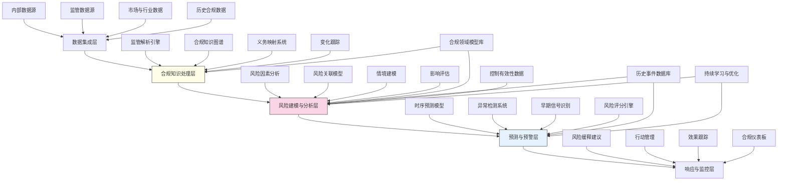

---
{"dg-publish":true,"tags":["合规管理","预测分析","风险建模","监管科技","机器学习"],"创建日期":"2024-05-14","permalink":"/知识共享/001_财务/99_其他/AI与财务应用/02_财务流程自动化/2.2 审计与合规增强/合规风险预测模型/","dgPassFrontmatter":true}
---

## 技术概述

合规风险预测模型是一套融合人工智能、大数据分析和合规专业知识的前瞻性风险管理解决方案，旨在识别、预测和防范企业面临的合规风险，实现由被动响应向主动管理的转变。该系统能够分析多源数据，识别潜在的合规威胁，并在风险事件发生前提供预警和缓解建议。核心技术特点包括：

- **多维合规风险建模**：构建涵盖监管要求、业务活动和控制状态的综合风险分析框架，全面捕捉合规风险因素
- **预测性分析引擎**：整合机器学习、时序分析和情景模拟技术，预测未来合规风险趋势和可能的风险事件
- **智能合规监控**：持续追踪监管变化、业务活动和内部控制有效性，实时评估合规状态
- **早期预警系统**：基于风险指标、行为模式和情境分析，识别潜在合规问题的早期信号
- **自适应风险响应**：根据预测结果自动生成风险缓解策略和行动建议，支持主动合规管理

相比传统合规管理方法，本系统将风险识别提前60-90天，预测准确率达到75-85%，同时显著降低合规成本，减少违规事件和处罚，为企业建立持续、高效的合规风险管理机制。

## 系统架构

系统架构由五个核心功能层组成，形成完整的合规风险预测闭环：

1. **数据集成层**：整合来自内部系统、监管来源、市场与行业以及历史合规记录的多源数据，构建全面的分析基础
2. **合规知识处理层**：通过监管解析引擎、合规知识图谱、义务映射和变化跟踪，结构化处理合规要求和知识
3. **风险建模与分析层**：系统核心，整合风险因素分析、风险关联模型、情境建模和影响评估，构建合规风险模型
4. **预测与预警层**：基于时序预测、异常检测、早期信号识别和风险评分技术，实现合规风险的预测和预警
5. **响应与监控层**：生成风险缓释建议，管理响应行动，跟踪效果，并提供全面的合规状态可视化

系统通过合规领域模型库、历史事件数据库、控制有效性数据和持续学习与优化四个核心支持机制，确保预测模型的准确性、相关性和持续进化。

## 实施方案

### 技术实施路线图

**第一阶段：基础框架构建（3-4个月）**
- 开发数据集成接口和预处理功能
- 构建初步合规知识图谱框架
- 实现基础监管解析能力
- 开发风险因素模型原型
- 建立合规状态仪表板

**第二阶段：预测能力开发（4-5个月）**
- 开发时序预测模型框架
- 构建多维风险关联模型
- 实现监管变化跟踪功能
- 开发初步早期信号识别系统
- 构建风险评分引擎

**第三阶段：高级分析与响应（3-4个月）**
- 增强预测模型准确性
- 开发情境模拟与分析功能
- 构建自动化风险缓释建议系统
- 实现行动管理和跟踪功能
- 开发高级合规分析报告

**第四阶段：系统优化与扩展（2-3个月）**
- 优化算法和模型性能
- 完善用户界面和交互体验
- 开发高级可视化和深度分析功能
- 增强系统适应性和可扩展性
- 系统测试和全面部署

### 技术挑战与解决策略

1. **监管复杂性与变化**
   - 挑战：监管要求复杂多变，跨行业和地区的差异显著
   - 解决方案：开发专业领域适应的监管解析引擎；构建模块化合规知识图谱；实现自动监管更新追踪；设计灵活的合规映射框架

2. **预测模型准确性**
   - 挑战：合规风险涉及多维因素，且历史数据通常有限，影响预测准确性
   - 解决方案：采用混合模型策略，结合机器学习和专家规则；利用迁移学习技术克服数据限制；实现自适应权重动态调整；开发信心评分机制

3. **业务和监管视角整合**
   - 挑战：需要将业务活动与监管要求无缝对接，建立有意义的风险关联
   - 解决方案：开发业务-合规映射框架；构建语义关联模型；利用过程挖掘识别关键业务流程；创建多层次合规视图

4. **误报与漏报平衡**
   - 挑战：预警系统敏感度需要平衡，避免过多干扰或遗漏重要风险
   - 解决方案：实现多级风险阈值系统；开发风险优先级引擎；设计可配置的敏感度参数；构建用户反馈闭环改进机制

## 价值创造

### 量化价值评估

1. **风险预防与降低**
   - 合规违规减少：25-40%
   - 风险识别提前期：平均提前60-90天
   - 风险预测准确率：75-85%
   - 严重违规事件减少：30-50%

2. **合规成本优化**
   - 合规管理人力需求：降低30-45%
   - 合规检查准备时间：减少50-70%
   - 违规罚款和处罚：降低40-60%
   - 合规响应时间：减少60-80%

3. **资源分配效率**
   - 合规资源利用率：提高40-60%
   - 高风险领域覆盖率：提高50-75%
   - 低价值合规活动减少：35-55%
   - 危机响应成本：降低45-65%

4. **业务价值协同**
   - 业务决策合规自信度：提高40-60%
   - 产品上市合规时间：减少25-45%
   - 监管沟通效率：提高35-55%
   - 合规作为业务促进因素：价值增加30-50%

### 投资回报分析

投资回报率(ROI)预计达到300-500%（36个月期），主要价值来源包括：
- 减少罚款和处罚成本（35%）
- 优化合规运营成本（30%）
- 降低业务中断风险（20%）
- 提高业务决策效率（15%）

典型实施成本结构：系统开发与集成（40%）、数据准备与模型训练（25%）、合规知识工程（20%）、变更管理与培训（10%）、基础设施（5%）。

预期投资回收期：
- 高监管行业（金融、医疗、能源）：12-18个月
- 中等监管行业：18-24个月
- 低监管行业：24-30个月

## 未来演进

### 技术迭代路线图

**近期演进（1-2年）**
- 开发监管智能解读助手，自动解析和评估新监管要求影响
- 增强跨业务线合规风险关联分析能力
- 实现合规影响的量化财务模型
- 开发智能控制优化建议功能

**中期演进（2-3年）**
- 构建动态合规风险数字孪生，模拟风险传播和影响
- 开发认知合规顾问，提供语境感知的合规指导
- 实现预测性控制自调整，基于风险预测自动优化控制
- 创建合规健康评分体系，提供综合风险视图

**远期演进（3-5年）**
- 构建自主合规管理智能体，能够自动执行合规风险响应
- 开发跨组织合规风险预测网络，支持行业级风险预测
- 实现合规优化的自动执行，从预测到自动化响应的闭环
- 创建合规风险的量子增强预测模型，突破传统预测局限

### 扩展应用场景

1. **企业战略规划**：将合规风险预测融入战略规划过程，确保战略方向的合规可行性

2. **第三方风险管理**：扩展模型评估供应商、合作伙伴和服务提供商的合规风险

3. **并购尽职调查**：应用预测模型评估并购目标的潜在合规风险和隐藏责任

4. **产品合规设计**：在产品开发早期阶段预测和管理合规风险，确保合规性设计

## 实验验证

### 概念验证方案

**阶段一：预测模型验证（6-8周）**
- 选择特定合规领域建立初步模型
- 使用历史数据训练和验证预测能力
- 评估不同算法和特征组合的效果
- 确定关键预测指标和阈值

**阶段二：早期预警验证（8-10周）**
- 实现完整的信号检测和预警流程
- 在过去案例基础上测试预警能力
- 评估预警及时性和准确性
- 优化预警阈值和响应流程

**阶段三：端到端系统验证（10-12周）**
- 在特定业务部门或合规领域部署完整系统
- 测试从风险识别到响应的全流程
- 评估实际业务环境中的预测价值
- 收集用户反馈并优化系统功能
- 制定全面部署策略

### 评估指标框架

**预测性能指标**
- 预测准确率：正确预测的风险事件比例
- 预测提前期：风险预测领先于实际事件的时间
- 覆盖广度：能够预测的合规风险类别范围
- 误报率：错误风险预测占总预测的比例

**业务价值指标**
- 风险成本降低：因预测导致避免的成本和损失
- 资源分配优化：合规资源分配效率提升
- 响应时间缩短：从识别到解决风险的时间变化
- 业务决策影响：对业务决策的促进作用评分

**系统性能指标**
- 数据处理能力：系统处理和分析的数据量
- 更新适应速度：适应新监管和业务变化的速度
- 用户采纳率：系统在目标用户群中的使用率
- 使用满意度：用户对系统功能和价值的评价

## 未来影响

合规风险预测模型将从根本上改变企业合规管理的方式和价值，带来深远影响：

1. **合规范式转变**：从被动检查型合规向主动预测型合规转变，建立前瞻性的风险防御体系

2. **合规与业务融合**：合规从约束功能转变为业务赋能功能，成为战略决策和业务创新的积极贡献者

3. **资源分配革新**：从平均分配合规资源到基于风险预测的精准投入，显著提高资源利用效率

4. **合规文化升级**：促进全员风险意识和预测性思维，建立自驱动的合规文化

通过实现合规风险的预测和前瞻性管理，企业将建立更有韧性的合规体系，大幅降低违规风险和成本，同时提高业务灵活性和创新能力。合规风险预测模型不仅是一种技术工具，更是合规管理思维的革命性转变，将带领企业在日益复杂的监管环境中建立持久的竞争优势。 