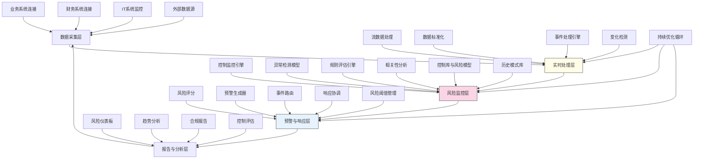

---
{"dg-publish":true,"tags":["实时审计","风险识别","持续监控","预警系统","审计自动化"],"创建日期":"2024-05-14","permalink":"/知识共享/001_财务/99_其他/AI与财务应用/02_财务流程自动化/2.2 审计与合规增强/持续审计监控系统/","dgPassFrontmatter":true}
---

## 技术概述

持续审计监控系统是一套结合实时数据分析、人工智能和自动化技术的先进审计平台，旨在从根本上改变传统的周期性审计模式。该系统不仅能够实时监控企业的财务和业务活动，还能及时识别风险信号、控制缺陷和异常行为，使审计从事后检查转变为实时监控和预警。核心技术特点包括：

- **实时数据监控**：通过系统集成和流数据处理技术，实现对关键业务流程和财务交易的持续、近实时监控
- **智能风险识别**：应用机器学习算法和行为分析技术，自动识别各类风险模式、异常交易和控制偏离
- **智能预警机制**：基于多维风险评估和阈值管理，构建自适应预警系统，根据风险严重程度执行分级预警
- **自动化控制测试**：持续自动执行关键控制测试，评估控制有效性，及时发现控制弱点和失效
- **闭环响应管理**：跟踪风险发现从识别到解决的全过程，形成完整的风险管理闭环

相比传统周期性审计，本系统将风险识别提前80-95%，覆盖率提高至接近100%，同时显著提升审计效率，降低合规成本，为企业建立全天候的风险防护机制，实现"永不关闭的审计"理念。

## 系统架构

系统架构由五个核心功能层组成，形成完整的持续审计监控闭环：

1. **数据采集层**：负责连接各类业务系统、财务系统、IT系统和外部数据源，实现多源数据的实时获取
2. **实时处理层**：通过流数据处理、数据标准化、事件处理和变化检测，将原始数据转化为可分析的结构化信息
3. **风险监控层**：系统核心，整合控制监控、异常检测、规则评估和相关性分析功能，实现对风险信号的持续监控
4. **预警与响应层**：对识别的风险进行评分，生成相应级别的预警，并协调后续响应行动
5. **报告与分析层**：提供实时风险仪表板、趋势分析、合规报告和控制评估，支持管理决策

系统通过控制库与风险模型、风险阈值管理、历史模式库和持续优化循环四个核心支持机制，确保监控的准确性、相关性和持续改进。整体架构形成闭环，使系统能够从自身运行中不断学习和优化。

## 实施方案

### 技术实施路线图

**第一阶段：基础框架构建（3-4个月）**
- 开发核心系统连接器和数据采集接口
- 构建基础流数据处理框架
- 实现初级风险规则引擎
- 开发基础预警机制
- 建立监控仪表板原型

**第二阶段：核心功能开发（4-5个月）**
- 增强实时数据处理能力
- 开发高级异常检测模型
- 构建完整控制监控引擎
- 实现风险评分和分级预警
- 开发响应管理工作流

**第三阶段：高级分析能力（3-4个月）**
- 开发相关性和模式分析功能
- 构建自适应学习模型
- 实现复杂事件处理
- 增强预测性风险识别
- 开发高级分析和报告功能

**第四阶段：系统优化与扩展（2-3个月）**
- 优化系统性能和可扩展性
- 完善用户界面和体验
- 增强数据可视化能力
- 开发多维度分析工具
- 系统测试和生产部署

### 技术挑战与解决策略

1. **实时数据处理复杂性**
   - 挑战：需要处理大量异构系统的实时数据流，保证低延迟和高可靠性
   - 解决方案：采用分布式流处理架构；实现智能数据缓冲和批处理平衡；开发健壮的错误处理机制；使用适应性连接器确保系统整合

2. **误报与漏报平衡**
   - 挑战：过于敏感会产生大量误报，而过于保守则可能错过重要风险信号
   - 解决方案：开发自适应阈值系统；实现多级确信度评分；构建上下文感知过滤机制；利用用户反馈持续优化检测精度

3. **业务中断最小化**
   - 挑战：持续监控不应对业务系统性能产生重大影响
   - 解决方案：设计低侵入性数据采集方法；实现智能采样和监控频率调整；开发资源使用限制器；构建高效缓存策略

4. **变化适应能力**
   - 挑战：业务流程和系统不断变化，监控系统需要灵活适应
   - 解决方案：构建模块化和可配置的监控架构；实现自动变化检测；开发元数据驱动的适应性规则引擎；提供自助式监控配置工具

## 价值创造

### 量化价值评估

1. **风险管理强化**
   - 风险识别提前时间：平均提前80-95%（从月/季度到实时/每日）
   - 风险覆盖范围：从抽样10-30%提升至90-100%
   - 重大风险事件减少：30-50%
   - 控制失效识别率：提高60-80%

2. **审计效率提升**
   - 人工审计工作减少：65-85%
   - 数据收集和处理时间：减少90-95%
   - 审计报告生成速度：提高70-90%
   - 审计人员产能：提升200-300%

3. **合规成本降低**
   - 合规管理成本：降低30-50%
   - 违规处罚风险：降低60-80%
   - 审计和检查成本：降低40-60%
   - 补救成本：降低50-70%（通过早期发现）

4. **业务价值增强**
   - 管理层决策支持：提升60-80%
   - 业务流程效率：提高15-30%
   - 控制环境改善：40-60%
   - 风险文化提升：30-50%

### 投资回报分析

投资回报率(ROI)预计达到300-500%（36个月期），主要价值来源包括：
- 降低风险事件损失与罚款（40%）
- 减少审计和合规管理成本（35%）
- 提高业务流程效率（15%）
- 优化决策和资源分配（10%）

典型实施成本结构：系统开发与集成（45%）、数据处理基础设施（20%）、模型开发与训练（15%）、变更管理与培训（15%）、维护与支持（5%）。

预期投资回收期：
- 大型企业（复杂多系统环境）：12-18个月
- 中型企业（中等复杂度）：18-24个月
- 高监管行业（金融、医疗等）：9-15个月

## 未来演进

### 技术迭代路线图

**近期演进（1-2年）**
- 增强自我学习能力，基于历史数据和反馈自动优化监控规则
- 开发智能根因分析，自动识别问题根源和系统性风险
- 实现预测性风险监控，预测潜在风险趋势和控制弱点
- 增强第三方风险监控和供应链风险识别能力

**中期演进（2-3年）**
- 构建跨组织审计协作网络，支持集团和多法律实体环境
- 开发认知审计能力，理解业务语境和判断合理性
- 实现智能控制自优化，自动提出控制改进建议
- 发展自治响应机制，自动执行预定义的风险响应措施

**远期演进（3-5年）**
- 创建审计智能体，能够自主执行完整审计任务
- 开发基于区块链的不可篡改审计证据链
- 构建完全自主运行的风险防御系统，最小化人工监督
- 实现全息业务监控，创建业务运营的数字孪生用于风险模拟

### 扩展应用场景

1. **合规管理自动化**：扩展为完整的法律法规合规监控平台，实时跟踪法规变化和合规状态

2. **第三方风险监控**：建立对供应商、合作伙伴和服务提供商的持续监控，实现全供应链风险管理

3. **ESG绩效监控**：监控和评估环境、社会和治理相关控制和指标，支持可持续发展目标

4. **业务绩效监控**：将审计监控扩展到业务KPI和关键成功因素，支持业务优化决策

## 实验验证

### 概念验证方案

**阶段一：监控能力验证（6-8周）**
- 选择关键业务流程和控制点
- 实现基础实时数据采集
- 开发和测试初步监控规则
- 评估系统响应时间和准确性

**阶段二：预警机制验证（8-10周）**
- 实现完整预警流程
- 测试不同类型风险的识别能力
- 评估误报率和漏报率
- 优化预警阈值和评分机制

**阶段三：端到端流程验证（10-12周）**
- 在有限业务范围内部署完整系统
- 测试从监控到响应的闭环流程
- 评估业务影响和价值实现
- 收集用户反馈并优化系统
- 准备全面部署方案

### 评估指标框架

**技术性能指标**
- 数据采集延迟：从交易发生到系统捕获的时间
- 监控覆盖率：系统能够监控的控制点和风险点比例
- 系统可靠性：系统正常运行时间和服务级别
- 处理容量：系统每小时/天可处理的事件和交易量

**监控有效性指标**
- 风险检出率：成功识别的风险事件比例
- 误报率：错误触发的预警占总预警的比例
- 预警提前时间：比传统方法提前发现风险的时间
- 风险评分准确性：风险评分与实际影响的相关性

**业务价值指标**
- 风险成本降低：减少的风险事件损失和处罚
- 合规成本节约：减少的合规管理和审计成本
- 响应时间改善：从识别到解决风险的平均时间
- 用户满意度：业务和审计人员对系统的评价

## 未来影响

持续审计监控系统将从根本上转变传统审计模式，带来深远影响：

1. **审计范式转变**：从周期性、事后审计转向持续性、实时审计，彻底改变审计的时间模式和价值模式

2. **风险管理变革**：从静态评估转向动态监控，建立实时、适应性强的风险识别和响应体系

3. **组织控制文化升级**：促进从被动合规到主动风险管理的控制文化转变，增强全员风险意识

4. **审计职能重塑**：审计人员从数据收集和测试执行者转变为风险顾问和控制专家，创造更高战略价值

通过实现审计的持续化和自动化，企业将建立全天候的风险防护系统，大幅提升风险识别的及时性和全面性，同时降低合规成本，提高业务运营效率。持续审计监控系统代表了未来审计的发展方向，是财务和业务流程自动化的重要组成部分，将重新定义审计在数字时代的角色和价值。 