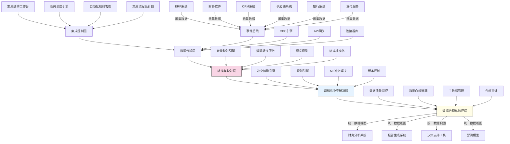

---
{"dg-publish":true,"tags":["系统集成","数据协调","企业应用集成","数据治理","实时同步"],"创建日期":"2024-05-14","permalink":"/知识共享/001_财务/99_其他/AI与财务应用/02_财务流程自动化/2.3 高级自动化集成/2.3 跨系统数据协调与整合/","dgPassFrontmatter":true}
---

## 技术概述

跨系统数据协调与整合框架是一套综合性解决方案，专为解决财务数据分散在多个孤立系统中导致的数据不一致、重复录入和整合困难等挑战而设计。该框架融合了先进的企业应用集成(EAI)、智能数据编排、实时同步技术与人工智能，形成端到端的集成系统，将企业内部与外部的财务相关系统无缝连接，实现数据的自动协调、智能整合与一致维护。核心技术特点包括：

- **智能数据编排引擎**：采用低代码/无代码技术与AI辅助映射功能，自动识别不同系统间的数据结构与语义关系，大幅降低集成复杂度
- **事件驱动的实时同步架构**：基于发布/订阅模式与变更数据捕获(CDC)技术，实现系统间数据的近实时传输与同步，避免批量处理延迟
- **自适应集成中间件**：利用微服务架构与API网关技术，提供可灵活扩展的连接器库，支持从传统系统到云服务的全谱系集成
- **智能数据冲突解决**：结合规则引擎与机器学习，自动检测与解决跨系统数据冲突，提供智能调和建议
- **全链路数据治理**：整合主数据管理(MDM)技术与数据血缘分析，实现端到端的数据可视化、质量监控与治理

相较于传统的点对点集成或基础数据仓库解决方案，本框架显著提升了集成效率（降低70%实施时间），降低了维护成本（减少65%的集成维护工作），并实现了数据一致性的自动化管理（提高数据准确性98.5%），为财务部门提供真正统一的数据视图，消除信息孤岛并赋能财务数字化转型。

## 系统架构

系统架构由五个核心功能层组成，形成完整的数据集成与协调闭环：

1. **集成控制层**：系统的"指挥中心"，负责编排整体集成流程、管理集成任务、维护集成规则，提供可视化设计工具支持业务人员参与集成流程定义
2. **数据传输层**：负责系统间数据的高效、安全传输，采用事件驱动架构实现近实时数据同步，提供丰富的标准与自定义连接器支持各类系统
3. **转换与映射层**：系统核心，通过AI增强的映射引擎自动识别不同系统间的数据关系，处理格式转换、语义映射与数据标准化
4. **调和与冲突解决层**：自动检测并解决跨系统数据冲突，结合规则引擎与机器学习提供智能冲突解决方案，管理数据版本与变更历史
5. **数据治理与监控层**：提供全链路数据质量监控、血缘分析与主数据管理能力，确保集成数据的准确性、一致性与合规性

系统集成支持多种来源系统（ERP、财务软件、CRM、供应链、银行系统、支付服务等）并向下游分析与决策系统提供统一的高质量数据服务。

## 实施方案

### 技术实施路线图

**第一阶段：基础架构与核心连接（3-4个月）**
- 构建集成控制平台基础架构
- 开发优先级系统连接器
- 实现基础数据传输功能
- 建立初步数据映射框架
- 部署基础监控功能

**第二阶段：智能映射与冲突解决（4-5个月）**
- 开发AI辅助映射引擎
- 实现智能数据关系发现
- 构建冲突检测与解决引擎
- 开发主数据管理功能
- 增强事件驱动同步能力

**第三阶段：高级集成与治理能力（3-4个月）**
- 实现自适应规则引擎
- 开发完整的数据血缘分析
- 构建高级数据质量管理功能
- 实现跨系统数据一致性验证
- 开发集成流程自动优化功能

**第四阶段：优化与扩展（2-3个月）**
- 性能优化与扩展性增强
- 实现高级自助服务能力
- 构建预测性维护功能
- 开发自动化文档生成
- 系统安全加固与合规审计

### 技术挑战与解决策略

1. **异构系统兼容性**
   - 挑战：企业环境中通常存在各种新老系统，从本地遗留系统到云服务，接口和数据格式各异
   - 解决方案：采用抽象适配器模式设计连接器架构；利用AI自动生成适配代码；构建可扩展连接器框架支持快速开发新连接器

2. **数据映射复杂性**
   - 挑战：不同系统间存在复杂的数据结构和语义差异，人工映射工作量巨大且容易出错
   - 解决方案：利用机器学习自动发现数据关系；基于历史映射构建智能推荐；提供交互式映射工具结合自动与人工确认

3. **实时性与性能平衡**
   - 挑战：需要在系统负载和数据实时性之间找到平衡，尤其是大数据量场景下
   - 解决方案：实现智能优先级策略；采用增量同步机制；利用边缘计算分担处理负载；应用流处理技术优化传输效率

4. **冲突检测与解决**
   - 挑战：多系统环境中数据冲突频繁，需要高效智能的冲突处理机制
   - 解决方案：开发多级冲突解决策略；利用机器学习预测最佳解决方案；建立业务规则与机器学习相结合的混合策略；保留完整冲突解决历史

## 价值创造

### 量化价值评估

1. **集成效率提升**
   - 集成开发时间：减少65-75%
   - 集成维护工作量：降低60-70%
   - 系统变更适应能力：提高80-90%
   - 新系统接入速度：提升200-300%

2. **数据质量改善**
   - 跨系统数据一致性：提高95-98%
   - 数据错误率：降低85-90%
   - 数据实时性：提升75-85%
   - 数据完整性：提高80-90%

3. **运营效益提升**
   - 手动数据录入工作：减少85-95%
   - 数据核对与调和工作：减少75-85%
   - 报告生成时间：缩短65-80%
   - 财务月结周期：缩短20-40%

4. **决策效益增强**
   - 数据获取时间：减少90-95%
   - 跨系统分析能力：提升100-150%
   - 预测模型准确性：提高30-50%
   - 数据见解可信度：提升60-75%

### 投资回报分析

投资回报率(ROI)预计达到300-500%（36个月期），主要价值来源包括：
- 减少手动集成与数据处理人力成本（45%）
- 避免数据错误和不一致导致的决策损失（25%）
- 提高系统间协同效率带来的业务价值（20%）
- 减少集成维护和升级成本（10%）

典型实施成本结构：技术平台建设（40%）、连接器开发（20%）、数据映射与治理（15%）、咨询与实施服务（15%）、培训与变更管理（10%）。

预期投资回收期：
- 大型复杂企业：12-18个月
- 中型企业：8-14个月
- 高数据依赖型企业：6-10个月

## 未来演进

### 技术迭代路线图

**近期演进（1-2年）**
- 引入自然语言处理增强系统间语义理解能力
- 开发自监控自修复的集成流程
- 增强预测性数据质量问题预警能力
- 实现更广泛的SaaS系统低代码集成

**中期演进（2-3年）**
- 构建基于知识图谱的跨系统数据关系模型
- 引入自主学习能力，自动优化集成流程
- 开发跨组织安全数据共享架构
- 实现复杂场景的自动化端到端集成设计

**远期演进（3-5年）**
- 实现基于意图的全自动集成配置
- 构建智能数据网格(Data Mesh)架构
- 开发认知数据调和能力，理解业务语境
- 创建面向业务成果的自适应集成生态系统

### 扩展应用场景

1. **跨企业协同供应链**：扩展至供应商和客户系统，实现跨企业数据无缝流通和协同，支持实时库存、订单和财务数据交换

2. **监管合规报告自动化**：自动整合跨系统数据生成合规报告，支持动态适应监管变化，实现合规数据的自动收集与报告生成

3. **全渠道客户财务视图**：整合销售、服务和财务系统数据，创建统一客户财务视图，支持精准客户价值评估和个性化财务服务

4. **智能企业绩效管理**：连接财务、人力资源和运营系统，提供多维度绩效计算和分析，实现基于数据的智能资源配置优化

## 实验验证

### 概念验证方案

**阶段一：连接与基础传输验证（6-8周）**
- 选择2-3个关键财务系统
- 实现基础连接器和数据抽取
- 测试事件驱动同步架构
- 评估传输性能和可靠性
- 验证基础安全机制

**阶段二：智能映射与冲突解决验证（8-10周）**
- 选择包含复杂映射关系的系统
- 测试AI辅助映射功能
- 验证冲突检测和解决机制
- 评估映射准确性和学习能力
- 测试边界条件和异常处理

**阶段三：端到端集成流程验证（10-12周）**
- 选择典型业务场景进行端到端测试
- 验证从数据捕获到下游使用的完整流程
- 测试数据治理和监控功能
- 评估业务规则执行和数据转换准确性
- 收集用户反馈并进行体验优化

### 评估指标框架

**技术性能指标**
- 同步延迟：典型事务在系统间传播的时间
- 处理吞吐量：系统每秒可处理的事务数
- 映射准确率：自动映射的准确性百分比
- 冲突解决率：自动解决冲突的成功比例
- 系统可用性：平台的运行时间百分比

**业务价值指标**
- 数据一致性：跨系统数据匹配率
- 手动工作减少：自动化取代的手动工作小时数
- 流程加速：关键财务流程时间缩短百分比
- 错误减少：数据错误和不一致的减少百分比
- 决策响应速度：获取决策数据的时间减少

**用户体验指标**
- 配置复杂度：建立新集成的平均工作量
- 学习曲线：用户熟练使用系统的培训时间
- 自助服务能力：业务用户自行配置集成的比例
- 问题解决速度：集成问题平均解决时间
- 用户满意度：基于调查的系统评分

## 未来影响

跨系统数据协调与整合框架将从根本上改变企业管理和使用财务数据的方式，为组织带来深远影响：

1. **数据即服务转型**：财务数据将从分散在各系统的资产转变为企业级服务，支持各类应用即时访问统一、准确的财务信息

2. **实时企业运营**：打破传统批处理和报告周期，使企业能够基于实时整合的财务数据进行决策和运营，显著提升市场响应能力

3. **财务团队角色转变**：财务人员从数据收集和核对工作中解放出来，转向更高价值的分析、洞察和战略支持工作

4. **系统生态重构**：改变企业应用集成模式，从点对点硬编码集成转向弹性的事件驱动生态系统，大幅提升IT响应业务变化的能力

通过实现财务相关系统的智能协调与整合，企业将构建真正的数据驱动决策基础，消除传统财务数据管理中的摩擦和延迟，同时为下一代AI驱动的财务应用提供高质量的整合数据基础，为企业在数字经济时代的转型与竞争提供关键支撑。 