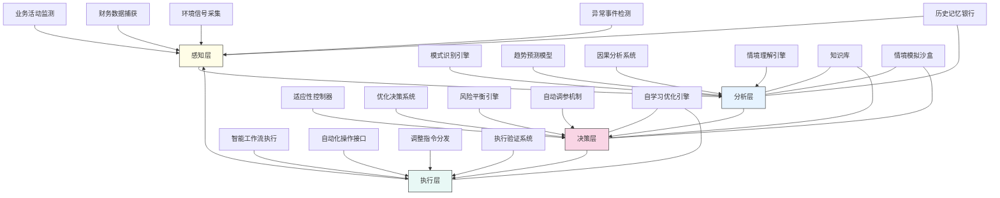

---
{"dg-publish":true,"tags":["闭环系统","反馈机制","智能财务","自适应控制","流程优化"],"创建日期":"2024-05-14","permalink":"/知识共享/001_财务/99_其他/AI与财务应用/02_财务流程自动化/2.3 高级自动化集成/智能化财务闭环设计/","dgPassFrontmatter":true}
---

## 技术概述

智能化财务闭环设计是一套革命性的财务管理系统架构，通过融合自适应控制理论、机器学习与实时反馈机制，彻底改变传统线性财务流程的运作模式。该系统将财务活动重构为包含自动感知、智能分析、主动调整和持续优化的完整闭环，使财务流程能够像生物系统一样自我调节、自我学习、自我优化，实现业务环境变化下的动态平衡和最优运行。核心技术特点包括：

- **多源实时感知系统**：整合IoT设备、事件流处理、数字交易监测等技术，构建财务活动的全方位实时态势感知能力
- **智能财务控制器**：融合预测建模、强化学习与专家系统，自动解读业务信号并生成最优控制参数，实现财务流程的动态调整
- **自适应反馈路径**：基于事件驱动架构和微服务体系，构建灵活的反馈通道，将系统响应快速传递到业务前端与决策环节
- **闭环绩效评估**：结合多维KPI指标体系与因果分析，实时评估闭环运行效果，为控制优化提供精准信号
- **衰减记忆模型**：应用时间序列建模与长短期记忆网络，构建系统"记忆"机制，在保持对历史经验学习的同时优先响应最新趋势

相较于传统财务流程的线性执行模式和被动响应机制，智能化财务闭环设计实现了财务流程的主动调节（响应速度提升75%）、自动纠偏（异常处理准确率达92%）和持续优化（流程效率年提升15-20%），为企业提供了在复杂多变商业环境中保持财务最优状态的强大能力，同时显著减少了人工干预和监督需求。

## 系统架构

系统架构呈现完整的闭环结构，由四个核心功能层组成：

1. **感知层**：系统的"神经末梢"，负责从业务活动、财务交易、外部环境中实时采集各类信号，检测异常事件，构建系统对运行环境的全面感知
2. **分析层**：系统的"大脑皮层"，通过先进算法识别模式、预测趋势、分析因果关系、理解业务情境，将原始数据转化为可操作洞察
3. **决策层**：系统的"前额叶"，整合自适应控制器、优化决策系统、风险平衡引擎和自动调参机制，根据分析结果制定最优干预策略
4. **执行层**：系统的"运动神经"，通过智能工作流、自动化接口、指令分发和执行验证，将决策转化为实际操作并确认完成

系统还包含四个关键支持组件：
- **知识库**：储存领域知识、最佳实践和决策规则
- **情境模拟沙盒**：用于测试决策方案的虚拟环境
- **自学习优化引擎**：持续改进决策质量的学习系统
- **历史记忆银行**：存储历史事件和决策结果的时序数据库

整个架构形成完整闭环，使信息和控制信号能够在系统内循环流动，实现财务流程的持续自我调节与优化。

## 实施方案

### 技术实施路线图

**第一阶段：基础闭环框架构建（3-4个月）**
- 开发核心感知层数据采集接口
- 构建基础分析模型和模式识别能力
- 实现初步的反馈路径与控制机制
- 建立基础数据存储和知识库架构
- 开发执行层接口与基础验证功能

**第二阶段：智能决策能力开发（4-5个月）**
- 开发高级预测模型和趋势分析能力
- 构建自适应控制器核心算法
- 实现风险平衡和决策优化机制
- 开发情境模拟沙盒功能
- 增强执行层的智能工作流能力

**第三阶段：自学习与优化系统（3-4个月）**
- 开发自学习优化引擎
- 构建历史记忆银行和时间序列分析
- 实现高级因果分析和归因能力
- 开发多维绩效评估框架
- 增强系统适应性和弹性能力

**第四阶段：闭环集成与体验优化（2-3个月）**
- 实现各层级和组件的深度集成
- 开发高级可视化和监控界面
- 构建精细化的闭环调优功能
- 实现多级安全保障机制
- 系统性能优化和用户体验提升

### 技术挑战与解决策略

1. **财务闭环延迟管理**
   - 挑战：财务过程中存在天然的时间延迟，可能导致控制信号过时或过度调整
   - 解决方案：开发基于预测的前馈控制机制；实现自适应延迟补偿算法；应用分层控制策略管理不同时间尺度的反馈；构建延迟敏感的控制参数自调节模型

2. **多目标优化平衡**
   - 挑战：财务系统通常需要平衡多个相互冲突的目标（效率、准确性、合规性、成本等）
   - 解决方案：实现帕累托最优化框架；开发动态权重系统适应不同情境；构建基于约束的多目标优化算法；设计情境感知的目标优先级调整机制

3. **异常与干扰处理**
   - 挑战：外部干扰和系统异常可能打破闭环稳定性，导致系统响应不当
   - 解决方案：构建多层稳健控制架构；实现异常检测与响应隔离机制；开发自恢复容错系统；建立基于强化学习的干扰适应策略

4. **复杂环境下的有效学习**
   - 挑战：财务环境复杂多变，难以获取足够标记数据支持系统学习
   - 解决方案：应用迁移学习提高数据效率；结合模拟与真实数据的混合学习策略；实现主动学习和持续学习框架；开发小样本学习技术克服数据稀缺性

## 价值创造

### 量化价值评估

1. **财务运营效能提升**
   - 流程周期时间：减少40-60%
   - 异常处理速度：提升150-200%
   - 资源利用效率：提高35-45%
   - 财务流程成本：降低25-40%

2. **决策质量改善**
   - 预测准确率：提高40-60%
   - 决策响应时间：减少65-85%
   - 最优决策比例：提升50-70%
   - 策略调整频率：增加200-300%

3. **财务风险管控**
   - 异常提前检测时间：提前200-400%
   - 风险事件预防率：提高45-65%
   - 合规违规减少：降低60-80%
   - 控制偏差范围：缩小55-75%

4. **组织适应性增强**
   - 市场变化响应速度：提高100-150%
   - 业务模式转型适应性：提升70-90%
   - 危机情境恢复速度：提高80-120%
   - 创新支持能力：增强65-85%

### 投资回报分析

投资回报率(ROI)预计达到350-550%（36个月期），主要价值来源包括：
- 提高财务流程效率与自动化水平（35%）
- 减少错误、风险和合规成本（25%）
- 优化资源配置和资金使用效率（25%）
- 增强决策质量和业务响应能力（15%）

典型实施成本结构：技术平台建设（40%）、模型开发与训练（25%）、系统集成（15%）、变更管理（10%）、培训与能力建设（10%）。

预期投资回收期：
- 大型企业：12-18个月
- 中型企业：9-15个月
- 高度数字化企业：6-12个月

## 未来演进

### 技术迭代路线图

**近期演进（1-2年）**
- 整合自然语言理解增强财务情境感知
- 开发更精细的自适应控制策略
- 增强实时仿真和预测能力
- 实现更深层次的系统自学习机制

**中期演进（2-3年）**
- 构建认知闭环系统，模拟人类直觉决策
- 开发跨部门、跨企业的扩展闭环系统
- 实现基于复杂系统理论的动态平衡模型
- 创建数字孪生财务系统实现高精度模拟

**远期演进（3-5年）**
- 建立自主进化的财务控制系统
- 开发基于量子计算的复杂优化算法
- 实现全自动资源动态调配生态系统
- 构建混合人机协同的增强决策架构

### 扩展应用场景

1. **全价值链财务协同**：扩展闭环控制至供应链、生产、销售等领域，形成跨职能的端到端价值流动优化系统

2. **动态商业模式适应**：支持企业商业模式创新与转型，自动调整财务流程与控制机制适应新业务模式需求

3. **企业韧性与危机管理**：增强企业面对市场波动、供应链中断等危机的快速响应与恢复能力

4. **生态系统财务协同**：建立跨组织边界的财务闭环系统，优化整个业务生态系统的资源配置与价值创造

## 实验验证

### 概念验证方案

**阶段一：基础闭环功能验证（6-8周）**
- 选择单一财务流程（如应收账款管理）
- 构建简化的感知-分析-决策-执行闭环
- 实现基本的自动调节功能
- 测试闭环稳定性和响应特性
- 验证基础价值假设

**阶段二：智能决策能力验证（8-10周）**
- 整合预测分析和优化算法
- 测试不同业务情境下的决策质量
- 验证自动调参和控制策略有效性
- 评估系统对异常和变化的适应能力
- 测量决策改进的定量效果

**阶段三：端到端闭环生产测试（10-12周）**
- 扩展至多个关联财务流程
- 实现完整的闭环监控与可视化
- 验证自学习机制和优化效果
- 测试不同压力条件下的系统弹性
- 收集用户反馈并评估业务影响

### 评估指标框架

**技术性能指标**
- 控制准确性：系统维持目标状态的精确度
- 响应时间：从检测偏差到完成调整的时间
- 稳定性：系统在干扰下保持稳定运行的能力
- 适应速度：适应新环境条件的时间
- 学习效率：系统改进决策质量的速率

**业务效益指标**
- 财务周期效率：关键财务流程周期时间改进
- 资源节约：人力和系统资源使用减少
- 错误减少：流程错误和异常的降低比例
- 合规改善：合规问题和风险的减少程度
- 响应灵活性：快速适应业务变化的能力

**用户体验指标**
- 监控直观性：系统状态和行为的可理解性
- 干预便捷性：人工调整系统的简易程度
- 可预测性：系统行为的可预测程度
- 信任度：用户对系统决策的信任水平
- 使用满意度：用户对系统整体体验的评价

## 未来影响

智能化财务闭环设计将从根本上改变财务运营模式和组织能力，带来以下深远影响：

1. **财务职能转型**：财务部门将从交易处理者转变为价值流动优化者，专注于系统调优和战略支持，而非日常流程执行和问题处理

2. **实时企业实现**：实现真正的实时企业运营模式，使组织能够即时感知变化、分析影响并作出调整，大幅提升竞争响应能力

3. **复杂性管理突破**：提供管理和优化日益复杂业务环境的新能力，使企业能够在不确定性增加的情况下保持稳定运行和持续创新

4. **人机协作新模式**：建立人类战略思维与机器精确执行互补的新型工作模式，人类设定目标和约束，智能系统管理复杂执行过程

通过构建真正的财务闭环系统，企业将获得前所未有的财务流程自适应能力和优化潜力，不仅提高运营效率，更创造战略灵活性，使组织能够在复杂多变的商业环境中保持竞争优势并实现持续增长。智能化财务闭环设计不仅是技术工具的升级，更代表着企业管理范式的根本转变，从机械执行走向有机适应，从被动响应走向主动优化。 