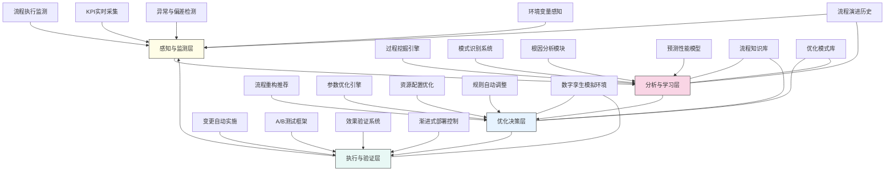

---
{"dg-publish":true,"tags":["流程优化","自适应系统","智能流程","持续改进","财务自动化"],"创建日期":"2024-05-14","permalink":"/知识共享/001_财务/99_其他/AI与财务应用/02_财务流程自动化/2.3 高级自动化集成/财务流程自优化框架/","dgPassFrontmatter":true}
---

## 技术概述

财务流程自优化框架是一套融合人工智能、过程挖掘、机器学习与智能决策系统的创新解决方案，旨在打造具有感知、学习、适应与进化能力的财务流程生态系统。该框架突破了传统流程改进的人工分析与周期性优化模式，建立起持续自我监测、自主学习、主动调整和自我进化的财务流程管理新范式。核心技术特点包括：

- **实时流程挖掘引擎**：基于先进事件日志处理和过程挖掘算法，持续分析财务流程执行痕迹，自动发现流程实际执行路径、瓶颈、变异和偏差
- **流程智能分析系统**：结合多维度流程KPI监测与因果分析，利用机器学习识别影响流程性能的关键因素，提供科学的优化依据
- **自适应流程配置**：应用强化学习与自动决策系统，根据业务环境变化和性能反馈，自动调整流程参数、规则和执行路径
- **智能资源动态配置**：融合预测分析与资源优化算法，实现人力、系统和时间资源的动态分配，保障流程最优运行
- **流程设计自动生成**：结合生成式AI与进化算法，基于历史数据和最佳实践，自动生成和推荐优化的流程设计方案

相较于传统的流程管理方法，本框架实现了财务流程的持续优化（效率提升率从年均5-8%提高到15-20%），大幅降低了流程变异与循环（降低60-75%），显著提高了资源利用率（提升30-45%），同时减少了人工流程分析与优化工作（削减80-90%）。该系统不仅能适应业务环境的变化和业务量的波动，更能主动学习并内化组织经验，形成持续演进的财务流程能力体系。

## 系统架构

系统架构由四个核心功能层构成完整的自优化闭环：

1. **感知与监测层**：作为系统的"感官"，通过全方位的数据采集点，持续监测流程执行情况、性能指标、异常事件和环境变化，为优化提供基础数据
2. **分析与学习层**：作为系统的"大脑"，融合过程挖掘、模式识别、根因分析和预测建模，将原始数据转化为流程洞察和优化方向
3. **优化决策层**：作为系统的"控制中枢"，整合多种优化策略，生成流程重构方案、参数调整建议、资源配置优化和规则调整方案
4. **执行与验证层**：作为系统的"执行器"，负责实施优化方案、进行实验验证、测量优化效果并控制变更风险

系统还包含四个核心支持组件：
- **流程知识库**：储存流程最佳实践、行业标准和历史优化案例
- **优化模式库**：包含各类流程优化模式和方法论
- **数字孪生模拟环境**：用于模拟测试优化方案的虚拟环境
- **流程演进历史**：记录流程变更和演进的完整历史

整个架构形成闭环系统，实现财务流程的连续监测、分析、优化和验证循环，支持流程能力的持续提升和自我进化。

## 实施方案

### 技术实施路线图

**第一阶段：基础感知与分析能力构建（3-4个月）**
- 部署流程执行监测系统
- 实现KPI实时采集功能
- 构建基础过程挖掘引擎
- 开发初步流程模式识别能力
- 建立流程知识库基础框架

**第二阶段：智能分析与决策能力开发（4-5个月）**
- 增强过程挖掘与分析功能
- 开发高级根因分析系统
- 构建流程性能预测模型
- 实现初步流程重构推荐
- 开发参数优化与资源配置引擎

**第三阶段：自适应优化系统构建（3-4个月）**
- 开发完整的优化决策系统
- 构建数字孪生模拟环境
- 实现A/B测试与验证框架
- 开发渐进式变更部署控制
- 增强自适应学习与优化能力

**第四阶段：自主进化能力与集成优化（2-3个月）**
- 实现跨流程优化协同
- 开发自主设计生成能力
- 构建端到端优化生态系统
- 增强异常情境适应能力
- 实现系统性能与用户体验优化

### 技术挑战与解决策略

1. **复杂财务流程建模**
   - 挑战：财务流程通常涉及多部门、多系统和复杂业务规则，难以全面准确建模
   - 解决方案：采用分层流程模型结构；结合形式化建模与数据驱动发现；实现混合建模技术综合静态与动态特性；开发上下文感知的流程表示方法

2. **优化决策的不确定性管理**
   - 挑战：流程优化决策涉及多因素权衡和不确定预测，存在决策风险
   - 解决方案：建立多情境模拟和敏感性分析框架；实现基于风险的决策优化；采用增量式优化策略控制变更范围；设计优化回滚机制保障系统安全

3. **流程与组织协同适应**
   - 挑战：流程优化必须考虑组织文化、人员能力和变革接受度
   - 解决方案：开发用户反馈采集与分析系统；设计自适应学习曲线管理；实现变革接受度预测与管理；构建人机协同优化模式

4. **多目标优化平衡**
   - 挑战：财务流程优化需平衡效率、质量、风险控制等多个相互制约的目标
   - 解决方案：实现帕累托最优化框架；开发动态优先级管理系统；应用约束满足优化算法；设计情境感知的目标权重动态调整

## 价值创造

### 量化价值评估

1. **流程效率提升**
   - 流程周期时间：减少30-50%
   - 手动操作步骤：减少60-80%
   - 等待时间：降低50-70%
   - 流程变异：减少65-85%

2. **资源优化**
   - 人力资源效率：提高35-55%
   - 系统资源利用率：提升40-60%
   - 峰值容量需求：降低30-45%
   - 闲置资源比例：减少50-70%

3. **质量与合规改善**
   - 流程错误率：降低55-75%
   - 合规偏差：减少65-85%
   - 流程一致性：提高70-90%
   - 数据质量：提升45-65%

4. **组织灵活性增强**
   - 流程变更速度：提高100-200%
   - 业务需求响应能力：提升80-120%
   - 异常处理能力：增强75-95%
   - 流程创新频率：提高60-80%

### 投资回报分析

投资回报率(ROI)预计达到300-500%（36个月期），主要价值来源包括：
- 人力资源效率提升与释放（40%）
- 流程周期时间缩短带来的业务价值（25%）
- 错误减少与合规改善（20%）
- 系统资源优化与IT成本降低（15%）

典型实施成本结构：技术平台构建（45%）、系统集成（20%）、组织变革（15%）、数据准备与模型训练（15%）、持续支持（5%）。

预期投资回收期：
- 大型复杂企业：14-20个月
- 中型企业：10-16个月
- 高流程成熟度企业：8-12个月

## 未来演进

### 技术迭代路线图

**近期演进（1-2年）**
- 整合自然语言处理增强流程语义理解
- 开发基于大语言模型的流程智能助手
- 增强预测分析的准确性与前瞻性
- 实现更细粒度的自适应流程控制

**中期演进（2-3年）**
- 构建具象化流程数字孪生体系
- 开发认知流程引擎模拟人类判断
- 实现流程创新自动生成与评估
- 建立跨组织流程协同优化网络

**远期演进（3-5年）**
- 构建自主进化的流程生态系统
- 开发流程意图理解与自动实现技术
- 实现业务语义到流程自动转化
- 打造混合人机流程协同新范式

### 扩展应用场景

1. **端到端财务价值流优化**：扩展自优化范围至整个财务价值链，实现从交易捕获到报告分析的全程智能优化

2. **业务-财务流程协同优化**：打破财务与业务流程界限，建立端到端的业务-财务流程协同优化机制

3. **流程创新孵化器**：利用框架积累的知识和模拟能力，自动生成和测试创新性流程设计，推动财务流程模式创新

4. **流程韧性强化**：增强财务流程应对外部冲击和内部变化的适应能力，构建高韧性财务流程体系

## 实验验证

### 概念验证方案

**阶段一：单一流程优化验证（6-8周）**
- 选择关键财务流程（如月结流程）
- 部署基础监测与分析组件
- 实现简化的优化建议功能
- 测试流程参数自动调整
- 评估初步优化效果

**阶段二：多流程协同优化验证（8-10周）**
- 扩展至3-5个相互关联的财务流程
- 测试跨流程分析与优化能力
- 验证资源动态配置功能
- 评估协同优化效果
- 测试异常情境应对能力

**阶段三：全面自优化系统验证（10-12周）**
- 扩展至关键财务流程群组
- 启用完整的自优化闭环功能
- 测试自主学习与进化能力
- 验证大规模部署的稳定性
- 收集全面用户反馈和业务影响数据

### 评估指标框架

**技术性能指标**
- 流程发现准确率：系统识别真实流程路径的准确度
- 优化建议质量：建议被接受并成功实施的比例
- 分析速度：完成流程分析的时间
- 适应性响应：系统适应流程变化的速度
- 预测准确性：流程性能预测的准确度

**业务效益指标**
- 流程周期效率：关键财务流程周期时间改善
- 资源利用率：人力和系统资源的利用改善
- 高价值任务比例：财务人员从事战略任务的时间占比
- 流程成本降低：流程运行总成本的减少比例
- 错误与返工率：流程错误和重复工作的降低

**用户体验指标**
- 系统可理解性：用户理解优化建议和原理的程度
- 控制平衡感：用户对系统自主性与人工控制平衡的满意度
- 学习曲线：用户掌握系统功能的时间
- 工作满意度：财务人员对新流程模式的满意程度
- 业务支持效果：业务部门对优化后财务流程的评价

## 未来影响

财务流程自优化框架将从根本上改变财务运营模式和组织结构，带来深远影响：

1. **财务工作性质转型**：财务人员角色从流程执行者转变为流程设计师和战略顾问，专注于高价值判断与决策活动，而非重复性流程任务

2. **财务组织结构重塑**：传统按职能划分的财务组织将向敏捷团队转型，围绕端到端价值流组织，财务流程自优化系统成为核心业务引擎

3. **财务能力新范式**：组织财务能力从静态流程走向动态适应系统，形成持续学习、自我调节、不断进化的财务流程生态

4. **人机协作新模式**：建立人类战略指导与机器优化执行相结合的新型协作模式，人类设定目标与约束，系统负责连续优化与改进

通过构建真正的自优化财务流程系统，企业将获得前所未有的财务敏捷性和效率，释放大量人力专注于增值活动，提升财务对业务的支持质量，同时建立持续改进的组织文化和能力。财务流程自优化框架不仅是技术工具，更是一种全新的财务运营哲学，引领企业从工业时代的标准化流程迈向智能时代的自适应系统。 