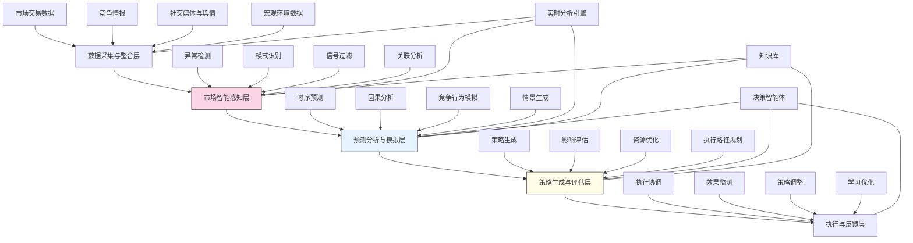

---
{"dg-publish":true,"tags":["市场分析","预测响应","实时决策","竞争情报","需求预测"],"创建日期":"2024-05-14","permalink":"/知识共享/001_财务/99_其他/AI与财务应用/03_智能决策支持/3.1 战略决策支持/市场动态响应系统/","dgPassFrontmatter":true}
---

## 技术概述

市场动态响应系统是一个融合尖端人工智能、大数据分析与市场模拟技术的创新型决策支持平台，专为企业应对快速变化的市场环境而设计。该系统突破传统市场分析的被动性与滞后性限制，建立"感知-理解-预测-响应"的闭环智能体系，实现市场信号的实时捕捉、复杂模式的智能识别、发展趋势的精准预测以及响应策略的自动生成。核心技术特点包括：

- **全谱市场信号雷达**：整合结构化与非结构化数据源，实现市场价格、销量、消费者行为、舆情情绪等多维度信号的实时采集、过滤与归一化处理
- **市场变化智能感知引擎**：运用深度学习与复杂事件处理，识别市场异常波动、竞争动态变化与需求转换信号，提供市场早期预警
- **高阶预测与仿真系统**：结合时间序列分析、因果推理与Agent模拟，构建市场发展路径预测与多情景模拟能力，量化不确定性
- **竞争对手行为预测器**：基于博弈论与强化学习，分析竞争对手历史决策模式，预测其可能反应，优化企业战略互动
- **自适应响应策略生成器**：智能融合企业战略目标、资源约束与市场情景，自动生成最优响应策略组合，配置执行时序与资源分配

相较于传统的市场分析与响应系统，市场动态响应系统将市场变化感知速度提高60-80%，预测准确率提升30-50%，响应决策速度加快70-90%，并能比竞争对手更早识别市场机会与威胁3-5个工作日。该系统帮助企业从被动适应转向主动塑造，构建面向市场波动的敏捷型企业决策体系，实现"以快打慢"的市场竞争优势。

## 系统架构

系统架构由五个核心功能层组成，形成完整的市场感知-响应流程：

1. **数据采集与整合层**：系统的感官，整合内外部数据源，包括市场交易数据、竞争情报、社交媒体舆情和宏观环境数据，构建全方位市场感知网络
2. **市场智能感知层**：系统的神经，运用多种AI算法处理原始数据，识别市场异常、发现隐藏模式、过滤噪音信号、分析多维关联，实现市场变化的智能感知
3. **预测分析与模拟层**：系统的大脑，综合时序预测、因果分析、竞争行为模拟和情景生成，构建多情景市场预测能力，评估不同市场路径的概率与影响
4. **策略生成与评估层**：系统的思维，基于市场预测自动生成响应策略，评估不同策略的潜在影响，优化资源配置，规划执行路径
5. **执行与反馈层**：系统的行动，协调跨部门执行，监测响应效果，动态调整策略，并将结果反馈至系统进行持续学习与优化

系统还包含三个跨层支持组件：
- **实时分析引擎**：为数据处理与分析提供低延迟计算能力，支持毫秒级市场感知与响应
- **决策智能体**：基于增强学习的自主决策单元，能够根据市场变化自主生成与优化响应策略
- **知识库**：积累历史市场变化、策略效果与行业知识，增强系统对市场行为的理解与预测能力

整个架构形成闭环智能体系，实现从市场信号采集到响应效果评估的全流程覆盖，为企业提供即时、智能的市场响应能力。

## 实施方案

### 技术实施路线图

**第一阶段：基础能力构建（3-4个月）**
- 开发核心数据采集与整合接口
- 构建实时数据处理管道
- 实现基础市场异常检测功能
- 开发初步预测模型框架
- 建立基础知识库结构

**第二阶段：智能分析能力开发（4-5个月）**
- 开发高级市场模式识别算法
- 实现多源数据关联分析
- 构建时序与因果预测模型
- 开发竞争行为分析与预测功能
- 增强实时计算与处理能力

**第三阶段：预测与响应功能（3-4个月）**
- 开发情景生成与模拟系统
- 实现自动响应策略生成
- 构建策略影响评估模型
- 开发资源优化与路径规划
- 增强学习与优化算法

**第四阶段：系统整合与优化（2-3个月）**
- 开发跨部门执行协调机制
- 实现策略效果实时监测
- 构建自适应调整功能
- 系统集成与性能优化
- 用户界面与体验完善

### 技术挑战与解决策略

1. **市场数据多源异构**
   - 挑战：市场数据来源多样，格式不统一，质量参差不齐，难以有效整合
   - 解决方案：设计灵活的数据适配器架构；开发智能数据清洗与归一化管道；构建多源数据可信度评估机制；实现渐进式数据融合算法

2. **市场信号与噪音区分**
   - 挑战：市场变化中包含大量随机波动与噪音，难以识别真正有价值的信号
   - 解决方案：采用多层次信号过滤机制；应用自适应阈值设定；实现信号稳定性评估；开发基于历史模式的异常检测算法；引入人类专家验证回路

3. **复杂竞争行为预测**
   - 挑战：竞争对手行为受多种因素影响，存在战略欺骗与非理性决策，难以准确预测
   - 解决方案：构建竞争者行为模型库；应用多智能体模拟；实现博弈论与行为经济学模型；开发竞争对手画像系统；持续学习与更新竞争预测模型

4. **响应策略实时生成**
   - 挑战：市场环境快速变化，要求在有限时间内生成有效响应策略，同时考虑多重约束
   - 解决方案：预构建策略模板库；采用分层决策方法；实现启发式搜索算法；开发基于案例的推理系统；应用并行计算加速策略评估

## 价值创造

### 量化价值评估

1. **市场响应能力提升**
   - 市场变化感知时间：缩短60-80%
   - 策略制定周期：缩短70-90%
   - 决策质量：提高30-50%
   - 战略执行协调：提升40-60%

2. **预测与风险管理能力**
   - 市场趋势预测准确率：提高30-50%
   - 早期风险预警提前量：增加3-5个工作日
   - 情景覆盖广度：提升150-200%
   - 决策可靠性：提高35-55%

3. **竞争优势与市场表现**
   - 市场机会把握率：提高40-60%
   - 竞争对抗成功率：提升35-55%
   - 资源配置效率：提高25-45%
   - 市场份额稳定性：提升30-50%

4. **运营效率与协同**
   - 跨部门协作效率：提高45-65%
   - 决策与执行一致性：提升50-70%
   - 信息透明度：提高60-80%
   - 组织学习速度：提升40-60%

### 投资回报分析

投资回报率(ROI)预计达到350-500%（36个月期），主要价值来源包括：
- 市场机会更快把握带来的增量收入（40%）
- 市场风险提前规避减少的损失（25%）
- 资源配置优化带来的效率提升（20%）
- 竞争优势加强带来的市场份额增长（15%）

典型实施成本结构：技术平台开发（35%）、数据采集与整合（25%）、模型开发与验证（20%）、系统集成与部署（10%）、人员培训与变革管理（10%）。

预期投资回收期：
- 快消品行业：6-9个月
- 零售与电商：8-12个月
- 金融服务：9-14个月
- 制造业：12-18个月

## 未来演进

### 技术迭代路线图

**近期演进（1-2年）**
- 整合大型语言模型增强非结构化数据理解
- 开发自主行动的市场探测智能体
- 引入联邦学习实现跨企业数据协作
- 增强因果推理能力提高预测可解释性

**中期演进（2-3年）**
- 构建自进化市场仿真环境
- 开发认知市场洞察系统
- 实现全自动策略生成与执行
- 创建市场数字孪生体系

**远期演进（3-5年）**
- 发展具备市场直觉的通用人工智能
- 构建企业战略自主智能体
- 实现跨市场关联分析与响应
- 创建混合人机市场决策系统

### 扩展应用场景

1. **产品定价优化**：实时响应竞争对手价格变动、原材料成本波动与消费者需求变化，动态调整产品定价策略

2. **供应链弹性管理**：感知供应链中断风险信号，预测潜在供应链中断，生成多源采购与库存优化策略

3. **营销活动动态调整**：监测营销活动实时效果，识别消费者反应模式，自动调整营销信息、渠道与资源配置

4. **产品组合优化**：分析产品生命周期信号，预测产品需求变化趋势，指导产品淘汰与新品引入决策

## 实验验证

### 概念验证方案

**阶段一：市场感知能力验证（6-8周）**
- 选择特定产品与市场进行测试
- 部署数据采集与异常检测模块
- 与传统市场监测方法并行运行
- 比较系统识别市场变化的速度与准确性
- 评估噪音过滤与信号增强效果

**阶段二：预测能力验证（8-10周）**
- 针对特定市场指标进行预测测试
- 应用多模型预测方法
- 对比不同预测周期的准确率
- 测试竞争对手行为预测能力
- 验证情景生成的合理性与覆盖面

**阶段三：响应策略验证（10-12周）**
- 选择特定市场事件进行响应测试
- 自动生成多种响应策略方案
- 评估策略可行性与预期效果
- 模拟执行策略并收集反馈
- 测试策略调整与优化能力

### 评估指标框架

**技术性能指标**
- 数据处理延迟：市场事件发生到感知的时间
- 异常检测准确率：真实异常的识别率与误报率
- 预测精度：不同时间尺度的预测误差
- 计算效率：复杂情景下的响应生成时间
- 系统可靠性：持续运行稳定性与容错能力

**业务价值指标**
- 决策速度：从市场事件到响应决策的时间缩短
- 决策质量：系统推荐与专家决策的一致性
- 预测价值：基于预测的决策带来的收益增加
- 机会把握：成功识别并利用市场机会的比率
- 风险规避：成功预警并避免市场风险的比率

**长期价值指标**
- 市场适应性：对不同市场环境的适应能力
- 学习效率：系统预测准确性随时间的提升率
- 知识累积：系统知识库的扩展与优化程度
- 用户采纳：决策者对系统推荐的采纳率变化
- 组织影响：系统对组织市场响应文化的影响

## 未来影响

市场动态响应系统将从根本上改变企业与市场互动的方式，带来深远影响：

1. **决策范式变革**：从基于经验的直觉决策与周期性市场规划，转向数据驱动的实时响应与预测性行动，使市场决策更加科学化、系统化和动态化

2. **组织结构重塑**：促进传统职能型组织向网络型、响应型组织转变，打破信息孤岛，增强跨部门协同，形成围绕市场变化快速响应的敏捷团队

3. **竞争模式转型**：将市场竞争从资源与规模竞争转向速度与智能竞争，使响应速度和预测准确性成为关键竞争优势，改变行业竞争格局

4. **管理思维进化**：从刚性计划管理转向敏捷适应管理，培养持续感知、快速试错、动态调整的管理文化，增强企业面对VUCA环境的韧性

通过实时市场感知与智能响应，企业将能够在复杂多变的市场环境中保持领先优势，减少被动应对带来的机会成本，主动塑造市场发展路径。市场动态响应系统不仅是技术工具，更将成为企业战略思维的延伸，推动整个组织向更具市场敏感性和适应性的方向发展。 