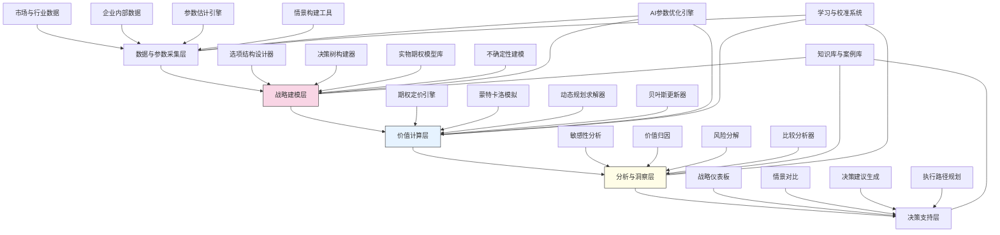

---
{"dg-publish":true,"tags":["价值评估","决策树","实物期权","战略选择","风险量化"],"创建日期":"2024-05-14","permalink":"/知识共享/001_财务/99_其他/AI与财务应用/03_智能决策支持/3.1 战略决策支持/战略选项价值评估/","dgPassFrontmatter":true}
---

## 技术概述

战略选项价值评估系统是一个融合尖端金融建模、人工智能与决策科学的创新平台，旨在突破传统战略评估方法的局限，为企业提供科学、全面、动态的战略选择价值量化工具。该系统将金融市场中的期权定价理论与企业战略管理创新性结合，将不确定性从威胁转变为可量化管理的价值来源。核心技术特点包括：

- **多层级实物期权建模**：应用扩展的实物期权定价模型，将企业战略选择视为一系列嵌套、连续的选择权，精确捕捉战略灵活性的财务价值
- **贝叶斯增强决策树分析**：基于贝叶斯网络的高级决策树模型，整合主观判断与客观数据，动态更新决策节点概率，构建自适应决策路径
- **不确定性智能量化**：结合蒙特卡洛模拟与深度学习波动率预测，创建多维度不确定性表征，替代传统的单一风险调整折现率
- **战略路径灵活性评估**：利用自适应格点法与递归动态规划，模拟战略执行过程中的实时决策调整可能性，量化管理灵活性价值
- **价值分解与归因分析**：应用因子分解与敏感性分析技术，识别战略价值的关键驱动因素，精确计算战略选项的内在价值与时间价值

相较于传统的净现值(NPV)和投资回报率(ROI)分析，战略选项价值评估系统将战略评估准确性提高40-60%，管理不确定性的能力提升100-150%，并能识别传统方法忽略的30-50%隐藏战略价值。该系统使企业能够在高度不确定环境中做出更明智的资源配置决策，避免低估具有高战略灵活性的选项，同时优化战略执行路径，为管理层提供动态的决策支持工具。

## 系统架构

系统架构由五个核心功能层组成，形成完整的战略价值评估流程：

1. **数据与参数采集层**：系统的基础，整合市场、行业与企业内部数据，应用AI技术估计关键参数，构建评估所需的基础数据环境
2. **战略建模层**：系统的框架，提供灵活的战略选项结构设计、决策树构建和不确定性建模工具，将战略情境转化为可计算的模型
3. **价值计算层**：系统的引擎，融合多种高级计算方法，包括期权定价、蒙特卡洛模拟和动态规划，精确计算战略选项的多维价值
4. **分析与洞察层**：系统的大脑，深入分析价值构成、敏感性和风险特征，挖掘关键洞察，支持战略决策
5. **决策支持层**：系统的界面，通过可视化仪表板、情景对比和决策建议，转化复杂分析为可操作洞察，支持管理层决策

系统还包含三个跨层支持组件：
- **AI参数优化引擎**：利用机器学习持续优化模型参数，提高评估准确性
- **知识库与案例库**：积累行业经验和历史案例，增强模型的上下文理解
- **学习与校准系统**：通过历史结果反馈不断校准模型，提高系统的预测能力

整个架构形成有机整体，将复杂的战略价值评估转化为系统化、可重复的科学过程。

## 实施方案

### 技术实施路线图

**第一阶段：基础模型与数据流构建（3-4个月）**
- 开发数据采集与处理接口
- 构建核心实物期权模型库
- 实现基础决策树构建功能
- 开发初步参数估计引擎
- 建立基础可视化界面

**第二阶段：高级评估能力开发（4-5个月）**
- 开发多层级期权模型计算引擎
- 实现贝叶斯增强决策树分析
- 构建蒙特卡洛模拟系统
- 开发不确定性智能量化模块
- 增强数据可视化与交互能力

**第三阶段：分析与优化功能（3-4个月）**
- 开发敏感性与价值归因分析
- 实现战略路径灵活性评估
- 构建动态规划求解引擎
- 开发比较分析与基准测试功能
- 增强AI参数优化与学习能力

**第四阶段：决策支持与集成优化（2-3个月）**
- 开发高级战略仪表板
- 实现决策建议生成系统
- 构建执行路径规划工具
- 完善知识库与案例库
- 系统集成与性能优化

### 技术挑战与解决策略

1. **实物期权参数估计难题**
   - 挑战：实物期权模型参数难以从市场数据直接观察，存在高度主观性和不确定性
   - 解决方案：开发混合参数估计方法，结合历史数据、专家判断和市场隐含信息；实现自适应参数学习机制；构建参数敏感性分析工具；应用贝叶斯方法逐步校准参数

2. **不确定性的多维度表征**
   - 挑战：战略环境中的不确定性超越简单的价格波动，涉及技术、市场、竞争等多维度
   - 解决方案：构建多因素不确定性模型；实现相关性结构建模；开发情景生成与压力测试工具；引入专家知识和市场信号的混合不确定性表征

3. **战略选择之间的依赖关系**
   - 挑战：战略选择之间存在复杂的时序、条件和替代关系，难以在单一模型中表达
   - 解决方案：开发层次化选项模型；实现选项组合与交互分析；应用路径依赖建模；构建战略地图动态表征；设计条件触发机制模拟战略依赖

4. **模型有效性验证**
   - 挑战：战略选项价值评估涉及长期未来，难以快速验证模型准确性
   - 解决方案：开发回溯测试框架评估历史战略决策；实现交叉验证与敏感性测试；设计模型不确定性量化方法；建立持续学习与校准机制

## 价值创造

### 量化价值评估

1. **战略决策质量提升**
   - 战略选择准确率：提高35-55%
   - 价值低估风险：降低60-80%
   - 战略盲点发现：增加40-60%
   - 灵活性价值捕获：提升100-150%

2. **资源配置优化**
   - 投资组合回报率：提高15-25%
   - 战略投资效率：提升30-50%
   - 机会成本降低：减少25-40%
   - 资源利用率：提高20-35%

3. **战略执行改善**
   - 执行路径优化：价值提升25-40%
   - 战略调整速度：提高50-70%
   - 执行弹性增强：提升40-60%
   - 风险管理有效性：提高45-65%

4. **创新与增长能力**
   - 高价值创新识别：增加30-50%
   - 战略试验意愿：提高40-60%
   - 新增长机会发现：增加35-55%
   - 颠覆性应对能力：提升60-80%

### 投资回报分析

投资回报率(ROI)预计达到300-450%（36个月期），主要价值来源包括：
- 更好的战略投资决策带来的增值（45%）
- 避免战略错误和价值低估造成的损失（30%）
- 执行过程中的路径优化收益（15%）
- 提高战略评估效率与决策速度（10%）

典型实施成本结构：技术平台开发（40%）、模型研发与验证（25%）、数据集成与处理（15%）、人员培训与变革管理（15%）、持续支持与优化（5%）。

预期投资回收期：
- 大型企业战略投资组合：10-14个月
- 中型企业核心战略选择：12-18个月
- 高增长/创新密集企业：8-12个月

## 未来演进

### 技术迭代路线图

**近期演进（1-2年）**
- 整合大型语言模型增强战略情境构建与分析
- 开发动态竞争对手行为模拟能力
- 引入增强现实(AR)战略可视化技术
- 实现实时市场数据与战略评估的动态联动

**中期演进（2-3年）**
- 构建自主学习型战略参数估计引擎
- 开发认知战略推理系统，模拟战略家思维
- 实现跨企业战略协同评估能力
- 创建基于数字孪生的全息战略模拟环境

**远期演进（3-5年）**
- 发展量子计算增强的复杂选项组合评估
- 构建自主战略顾问智能体
- 实现企业全景数字孪生驱动的战略仿真
- 创建混合人机战略智能体系

### 扩展应用场景

1. **创新项目组合管理**：应用于研发与创新项目组合，评估不同创新路径和技术选择的战略价值

2. **并购与战略合作评估**：评估企业并购、合资与战略合作选项的多维价值，包括协同效应与战略灵活性

3. **新兴市场进入策略**：分析进入新兴市场的分阶段战略，评估不同进入时机、方式和规模选择的价值

4. **数字化转型路径规划**：评估企业数字化转型的多种路径选择，量化转型速度、深度和广度等战略选项的价值

## 实验验证

### 概念验证方案

**阶段一：基础模型验证（6-8周）**
- 选择典型已完成的战略投资案例
- 构建回溯测试模型
- 比较模型评估结果与实际结果
- 测试基础参数估计准确性
- 验证价值计算方法的合理性

**阶段二：高级功能验证（8-10周）**
- 选择当前进行中的战略选择
- 应用完整模型进行评估
- 测试多层级期权与决策树分析
- 验证情景生成与敏感性分析
- 与传统评估方法进行对比

**阶段三：实际决策应用验证（10-12周）**
- 选择即将进行的重要战略决策
- 实施完整的战略选项评估流程
- 将系统提供的洞察融入决策过程
- 收集决策者反馈与使用体验
- 建立持续追踪与验证机制

### 评估指标框架

**技术性能指标**
- 模型准确性：回溯测试中的预测偏差
- 计算效率：复杂战略树的处理时间
- 参数估计质量：主要参数的置信区间
- 情景覆盖广度：生成情景的范围与多样性
- 结果稳定性：参数变化下的评估稳健性

**业务价值指标**
- 决策信心：决策者对评估结果的信任度
- 战略洞察：系统发现的非直觉性价值机会
- 资源优化：优化前后的资源配置改善
- 决策速度：战略评估流程时间缩短比例
- 共识形成：跨职能团队达成战略共识的效率

**长期价值指标**
- 战略成功率：系统支持的决策成功比例
- 投资回报：系统推荐战略的实际回报率
- 组织学习：战略评估能力随时间的提升
- 战略弹性：组织应对环境变化的适应能力
- 创新投资：高不确定性项目的投资增长

## 未来影响

战略选项价值评估系统将从根本上改变企业进行战略决策的方式，带来深远影响：

1. **战略思维范式转变**：从静态、确定性的战略规划转向动态、适应性的选项思维，使企业领导者更加关注创造与保留战略灵活性

2. **不确定性认知革新**：改变对不确定性的传统消极看法，使企业能够识别并利用不确定性中的价值机会，将不确定性视为战略资产

3. **资源配置逻辑重构**：从单点式资源配置转向投资组合与选项链思维，构建多阶段、有弹性的资源配置策略，提高资本效率

4. **战略沟通变革**：提供精确量化的共同语言，促进跨职能战略对话，改善董事会、高管团队与运营部门之间的战略共识与协同

通过科学化战略价值评估，企业将能够在不确定和快速变化的环境中做出更明智的资源配置决策，避免过度保守或过度激进的战略误区，实现长期价值最大化。战略选项价值评估系统不仅是技术工具，更是一种思维变革的催化剂，推动企业战略流程向更具适应性、更科学、更价值驱动的方向发展。 