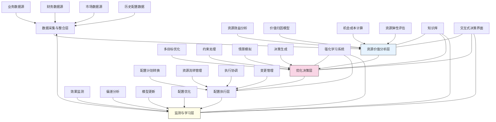

---
{"dg-publish":true,"tags":["资源优化","动态规划","预算分配","效益最大化","智能决策"],"创建日期":"2024-05-14","permalink":"/知识共享/001_财务/99_其他/AI与财务应用/03_智能决策支持/3.1 战略决策支持/资源动态配置引擎/","dgPassFrontmatter":true}
---

## 技术概述

资源动态配置引擎是一套前沿的资源管理决策支持系统，融合人工智能、运筹学与动态规划算法，实现企业资源的智能化、动态化与最优化配置。该系统打破传统静态资源分配模式，建立以数据驱动、价值导向、实时响应的资源配置新范式，帮助企业在复杂多变的经营环境中实现资源效益最大化与战略目标协同。核心技术特点包括：

- **多目标资源优化框架**：整合多种优化算法，构建考虑财务回报、战略符合度、风险水平等多维目标的资源配置决策框架，解决传统单一目标优化的局限性
- **实时效益感知系统**：利用时序分析与因果推理，构建资源投入与产出效益的动态关联模型，实现资源效益的实时监测与预测
- **情境自适应分配引擎**：基于强化学习与贝叶斯优化，根据业务环境变化自动调整资源配置策略，实现对市场波动、战略转向的智能适应
- **约束智能处理器**：运用约束满足编程与智能搜索，处理资源配置中的复杂约束条件，包括预算上限、资源依赖、合规要求等
- **协同决策支持平台**：结合可视化分析与情景模拟，支持多部门参与的交互式资源配置决策过程，平衡集中控制与分散自主的资源管理需求

相较于传统的资源规划与分配方法，资源动态配置引擎可将资源效益提升25-40%，资源分配效率提高50-70%，资源利用率增加30-45%，同时将资源配置响应时间缩短60-80%。系统通过持续学习与优化，形成企业资源管理的智能中枢，使有限资源在正确的时间、以正确的方式分配到最需要的业务领域。

## 系统架构

系统架构由五个核心功能层组成，形成闭环的资源智能配置流程：

1. **数据采集与整合层**：系统的基础，整合来自业务、财务、市场和历史配置的多源数据，构建资源配置决策的数据底座
2. **资源价值分析层**：系统的评估核心，通过多种分析模型评估资源在不同配置选项下的潜在价值、效益弹性和机会成本
3. **优化决策层**：系统的决策中枢，运用多目标优化算法，在处理复杂约束条件下，生成多种资源配置方案并进行情景模拟评估
4. **配置执行层**：系统的行动单元，将优化决策转化为可执行的资源调配计划，协调跨部门资源流转，管理配置变更过程
5. **监测与学习层**：系统的反馈机制，持续监测资源配置效果，分析实际与预期的偏差，更新模型参数，优化未来配置决策

系统还包含三个跨层支持组件：
- **知识库**：积累历史配置经验、效益模式与行业基准，为资源价值分析与优化决策提供知识支持
- **强化学习系统**：通过持续学习资源配置结果，优化决策策略，提高系统对复杂环境的适应能力
- **交互式决策界面**：为管理者提供直观的资源配置分析视图与情景模拟工具，支持人机协同决策

整个架构形成自适应优化循环，从数据采集到效果反馈，再到策略优化，构建持续进化的资源配置智能体系。

## 实施方案

### 技术实施路线图

**第一阶段：基础构建（3-4个月）**
- 开发多源数据采集与整合接口
- 构建资源分类与标准化框架
- 实现初步资源效益分析模型
- 开发基础优化算法框架
- 建立配置执行管理机制

**第二阶段：核心功能开发（4-5个月）**
- 构建多维度资源价值评估模型
- 开发多目标优化算法引擎
- 实现复杂约束处理机制
- 构建情景模拟与评估系统
- 开发配置执行与协调功能

**第三阶段：智能增强（3-4个月）**
- 实现动态资源价值预测
- 开发强化学习优化框架
- 构建自适应配置调整机制
- 实现多层次效果监测系统
- 开发模型自我校准与优化功能

**第四阶段：系统优化与集成（2-3个月）**
- 优化算法性能与响应速度
- 增强交互式决策支持能力
- 完善知识库与学习系统
- 系统集成与性能测试
- 用户培训与应用部署

### 技术挑战与解决策略

1. **资源价值多维量化**
   - 挑战：不同资源类型、不同业务单元的价值难以统一量化与比较
   - 解决方案：构建多层次价值评估框架；开发基于目标贡献的价值归一化方法；实现基于历史数据的价值预测模型；应用模糊逻辑处理非精确价值评估

2. **多约束条件下的优化**
   - 挑战：资源配置面临预算限制、最低配置要求、资源依赖等多种复杂约束
   - 解决方案：采用混合整数规划与约束满足技术；开发层次化约束处理方法；实现软约束与硬约束的差异化处理；应用启发式算法加速大规模约束优化

3. **配置决策的不确定性管理**
   - 挑战：商业环境的不确定性导致资源需求与效益预测的波动
   - 解决方案：引入鲁棒优化方法；开发多情景分析框架；实现自适应配置调整机制；应用贝叶斯方法量化与管理不确定性；构建动态风险缓冲策略

4. **跨部门资源协调**
   - 挑战：资源跨部门流转涉及复杂的协调与利益平衡
   - 解决方案：建立基于价值的资源分配透明机制；开发协同博弈框架；实现渐进式资源调整方法；应用智能工作流协调资源转移；提供可视化资源分配依据

## 价值创造

### 量化价值评估

1. **资源使用效益提升**
   - 投资回报率：提高25-40%
   - 资源利用率：提升30-45%
   - 资源浪费减少：降低35-50%
   - 战略目标达成率：提高30-40%

2. **决策效率与灵活性**
   - 资源分配决策时间：缩短50-70%
   - 配置方案生成数量：增加300-500%
   - 市场变化响应时间：缩短60-80%
   - 决策调整频率：提高100-150%

3. **组织协同与执行**
   - 跨部门资源协调效率：提高40-60%
   - 资源配置透明度：提升70-90%
   - 配置计划执行偏差：减少30-50%
   - 战略与执行一致性：提高35-55%

4. **预测与风险管理**
   - 资源需求预测准确率：提高35-50%
   - 资源短缺风险：降低40-60%
   - 过度分配情况：减少45-65%
   - 战略风险暴露：降低30-45%

### 投资回报分析

投资回报率(ROI)预计达到300-450%（36个月期），主要价值来源包括：
- 资源使用效益提升带来的直接收益增长（45%）
- 资源浪费减少带来的成本节约（25%）
- 决策效率提高带来的机会价值增加（15%）
- 风险管理改善带来的损失减少（15%）

典型实施成本结构：技术平台开发（40%）、模型研发与训练（25%）、系统集成与部署（15%）、用户界面开发（10%）、培训与变革管理（10%）。

预期投资回收期：
- 大型企业：9-15个月
- 中型企业：6-12个月
- 项目密集型组织：4-8个月
- 资源约束型企业：5-10个月

## 未来演进

### 技术迭代路线图

**近期演进（1-2年）**
- 整合因果推理增强资源效益预测
- 引入大语言模型处理非结构化资源需求
- 开发资源配置数字孪生模拟环境
- 增强前瞻性资源需求识别能力

**中期演进（2-3年）**
- 构建自主资源配置智能体系统
- 开发跨组织资源协同优化网络
- 实现资源配置的认知自动化
- 创建适应性极强的动态资源生态系统

**远期演进（3-5年）**
- 发展具备资源战略思维的决策智能体
- 构建混合人机资源治理框架
- 实现资源动态自组织与自优化
- 发展预见性资源配置能力

### 扩展应用场景

1. **研发项目组合管理**：动态评估研发项目价值，优化多项目间资源分配，加速创新周期，提高研发投资回报

2. **营销资源智能分配**：根据市场反馈实时调整营销渠道、区域、产品线间的预算与资源分配，最大化营销效果

3. **供应链资源优化**：动态调整生产资源、库存水平与物流能力，应对需求波动与供应中断，提高供应链韧性

4. **人才资源智能调配**：基于项目需求、个人能力与发展需求，优化人才资源分配，提高人力资源利用效率与员工满意度

## 实验验证

### 概念验证方案

**阶段一：资源效益模型验证（6-8周）**
- 选择特定资源类别与业务单元进行测试
- 部署资源效益分析模型
- 与传统价值评估方法并行运行
- 比较模型评估结果与实际业务效果
- 验证价值评估模型的准确性与稳定性

**阶段二：优化算法验证（8-10周）**
- 针对特定资源配置场景进行优化测试
- 应用多种优化算法进行对比
- 测试在不同约束条件下的优化性能
- 验证情景模拟的准确性
- 评估算法的可扩展性与响应速度

**阶段三：端到端系统验证（10-12周）**
- 选择完整业务线进行系统测试
- 部署全流程资源配置引擎
- 与现有资源分配流程并行运行
- 比较系统推荐与实际配置结果
- 评估系统带来的效益提升与效率改进

### 评估指标框架

**技术性能指标**
- 优化计算效率：不同规模问题的求解时间
- 模型准确性：资源效益预测与实际效果的偏差
- 约束满足率：满足各类约束条件的比例
- 系统响应时间：配置方案生成的平均时间
- 自适应能力：对环境变化的调整速度与准确性

**业务价值指标**
- 资源效益比：单位资源产生的价值增长
- 资源配置偏差：计划配置与实际需求的差异
- 战略一致性：资源分配与战略优先级的符合度
- 跨部门协同：资源流转的顺畅度与效率
- 决策支持质量：决策者对系统推荐的采纳率

**长期价值指标**
- 学习效率：系统预测准确性的提升速度
- 知识积累：系统知识库的扩展与价值增长
- 用户赋能：决策者能力提升与依赖度平衡
- 组织适应性：资源配置对业务变化的响应速度
- 创新支持：系统对创新项目资源分配的支持度

## 未来影响

资源动态配置引擎将从根本上变革企业资源管理模式，带来深远影响：

1. **资源管理范式转变**：从传统的周期性、静态、自上而下的资源分配，转向连续性、动态、数据驱动的智能化资源管理，使资源配置更加精准、灵活与高效

2. **决策民主化与赋能**：打破资源分配的信息不对称与权力集中，通过透明的价值评估与配置依据，促进更广泛的决策参与，同时保持战略一致性

3. **组织敏捷性提升**：通过资源的动态重配置能力，增强组织应对外部变化与内部转型的能力，使组织结构更具适应性与韧性

4. **价值导向文化形成**：促进组织从资源争夺导向转向价值创造导向，建立基于价值贡献的资源分配文化，激励价值创新与资源高效利用

通过智能化的资源动态配置，企业将突破资源约束的限制，实现资源与战略、资源与价值的最优匹配，为未来的可持续增长与创新打造坚实基础。资源动态配置引擎不仅是技术工具，更将成为企业资源治理的新方式，推动管理思维与组织能力的全面升级。 