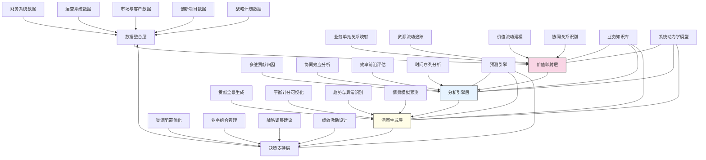

---
{"dg-publish":true,"tags":["业务单元分析","价值贡献","动态评估","资源配置","绩效归因"],"创建日期":"2024-05-14","permalink":"/知识共享/001_财务/99_其他/AI与财务应用/03_智能决策支持/3.3 绩效与价值分析/3.3 业务单元贡献动态分析/","dgPassFrontmatter":true}
---

## 技术概述

业务单元贡献动态分析系统是一个专为企业复杂业务生态设计的高级分析平台，通过整合人工智能、系统动力学和高级统计分析，实现对业务单元价值贡献的全面、动态和深度解析。该系统突破了传统静态财务分析的局限，构建了业务价值流动的动态视图，揭示业务单元之间复杂的价值创造、传递和放大关系，为战略资源配置和业务组合优化提供数据驱动的决策支持。系统的核心技术特点包括：

- **动态价值流分析**：应用系统动力学模型追踪业务单元间的价值流动路径和强度，识别价值创造、传递和放大节点，揭示传统财务指标无法捕捉的系统性贡献
- **多维贡献归因引擎**：整合财务、运营、创新和战略多维度数据，构建高级归因模型，精确量化业务单元对企业整体价值的直接和间接贡献
- **协同效应分析系统**：应用网络分析和模式识别技术，识别业务单元间的协同增强和抵消效应，评估业务组合的系统价值
- **资源使用效率评估**：结合投入产出分析和效率前沿方法，评估各业务单元的资源转化效率，识别优化空间
- **未来价值预测平台**：整合时间序列分析和情景模拟，预测业务单元在不同战略场景下的价值贡献潜力和演化轨迹

相较于传统业务单元分析方法，该系统能够提高价值贡献分析全面性40-60%，识别30-50%传统方法忽略的间接贡献与协同效应，提升资源配置决策质量35-55%，并将业务组合管理的响应速度提高40-60%。系统通过构建连接历史分析、当前评估和未来预测的完整视图，帮助管理层从静态财务视角转向动态系统视角，实现业务单元价值贡献的全景式理解与智能决策支持。

## 系统架构

系统架构由五个核心功能层和三个关键支持组件组成，形成价值分析与决策支持的闭环流程：

1. **数据整合层**：系统的基础，将分散在企业各系统的数据进行整合与标准化处理，包括财务系统数据、运营系统数据、市场与客户数据、创新项目数据和战略计划数据，构建多维度业务单元活动的全景视图
2. **价值映射层**：系统的关系建模核心，通过业务单元关系映射、资源流动追踪、价值流动建模和协同关系识别，构建业务单元间复杂交互关系的数字化表达
3. **分析引擎层**：系统的计算中枢，运行多种高级分析模型，包括多维贡献归因（分解直接与间接价值贡献）、协同效应分析（评估协同增强或抵消效应）、效率前沿评估（衡量资源使用效率）和时间序列分析（识别发展趋势）
4. **洞察生成层**：系统的智能解读中心，将复杂分析结果转化为可理解的洞察，包括贡献全景生成（构建全面价值贡献视图）、平衡计分可视化（多维绩效展示）、趋势与异常识别（发现关键变化）和情景模拟预测（评估未来可能性）
5. **决策支持层**：系统的行动转化枢纽，将分析洞察转化为具体决策建议，包括资源配置优化（合理分配资源）、业务组合管理（优化业务结构）、战略调整建议（识别战略调整机会）和绩效激励设计（优化激励机制）

系统还包含三个跨层支持组件：
- **业务知识库**：积累业务规则、行业洞察和历史经验，为分析提供上下文和领域知识支持
- **预测引擎**：提供机器学习和统计分析能力，支持预测性分析和情景模拟
- **系统动力学模型**：构建业务生态系统的动态行为模型，理解复杂系统中的因果循环和时滞效应

整个架构设计形成自我学习和持续优化的闭环系统，通过不断积累业务单元交互数据和分析结果，持续提升对复杂业务生态系统的理解和预测能力。

## 实施方案

### 技术实施路线图

**第一阶段：基础构建（3-4个月）**
- 开发核心数据整合接口与数据模型
- 构建初步业务单元关系映射功能
- 实现基础财务贡献分析能力
- 开发贡献可视化仪表板
- 建立业务知识库基础架构

**第二阶段：核心功能开发（4-5个月）**
- 优化多维贡献归因算法
- 开发价值流动建模功能
- 实现协同效应分析模型
- 构建初步系统动力学模型
- 开发资源配置优化工具

**第三阶段：高级分析与应用（3-4个月）**
- 开发效率前沿评估功能
- 实现时间序列分析与预测
- 构建业务情景模拟系统
- 开发战略调整建议引擎
- 增强趋势与异常识别能力

**第四阶段：系统集成与优化（2-3个月）**
- 完善绩效激励设计功能
- 增强业务组合管理工具
- 实现端到端决策支持工作流
- 系统集成与性能优化
- 用户培训与应用试点

### 技术挑战与解决策略

1. **价值流动的精确追踪**
   - 挑战：企业内部价值流动路径复杂，直接与间接贡献界限模糊，难以精确量化
   - 解决方案：开发多层级价值归因模型；应用流程挖掘技术追踪价值流；实施统计因果推断方法；采用混合测量方法；构建价值流动的数字孪生；实施持续验证与校准机制

2. **协同效应的识别与量化**
   - 挑战：业务单元间的协同效应复杂多变，包含正向与负向影响，难以分离与量化
   - 解决方案：应用图神经网络分析业务关系；构建协同效应模式库；实施对比实验设计；开发基于规则和数据的混合评估；实现多重假设验证框架；建立协同效应检测预警系统

3. **预测的准确性与可靠性**
   - 挑战：业务环境变化迅速，历史模式可能不再适用，影响预测准确性
   - 解决方案：采用集成预测方法；实施概率预测与区间估计；开发自适应模型更新机制；整合外部环境因素；实现预测偏差跟踪与校正；建立预测验证与学习反馈机制

4. **系统复杂性与解释性平衡**
   - 挑战：高级分析模型复杂度高，对决策者的可解释性和可操作性构成挑战
   - 解决方案：构建分层解释模型；开发定制化可视化界面；提供多粒度分析视图；实施交互式探索工具；开发案例库与类比推理；建立决策支持翻译层

## 价值创造

### 量化价值评估

1. **分析全面性与深度提升**
   - 贡献分析覆盖面：提高40-60%
   - 间接贡献识别率：增加50-70%
   - 协同效应捕捉率：提升30-50%
   - 价值分析时效性：提高45-65%

2. **决策质量与速度改善**
   - 资源配置决策准确率：提升35-55%
   - 战略调整响应时间：缩短40-60%
   - 预测准确度：提高30-45%
   - 业务组合优化效果：增强40-55%

3. **业务绩效与优化提升**
   - 资源使用效率：提高25-40%
   - 业务单元协同效果：增强30-45%
   - 价值创造潜力释放：提升35-50%
   - 组织灵活性：增强30-45%

4. **战略与组织能力增强**
   - 战略洞察能力：提升40-60%
   - 业务单元协作意愿：增强35-55%
   - 系统思维采用：提高45-65%
   - 价值创造文化：增强30-45%

### 投资回报分析

投资回报率(ROI)预计达到400-600%（36个月期），主要价值来源包括：
- 优化资源配置效率（30%）
- 提升业务协同效果（25%）
- 改善战略决策质量（25%）
- 增强业务预测能力（20%）

典型实施成本结构：技术平台开发（40%）、数据整合与分析模型开发（30%）、变革管理与能力建设（20%）、持续优化与支持（10%）。

预期投资回收期：
- 大型企业：12-18个月
- 中型企业：8-14个月
- 高成长企业：6-10个月
- 多元化集团：10-16个月

## 未来演进

### 技术迭代路线图

**近期演进（1-2年）**
- 整合大语言模型强化业务分析解释
- 开发自动化驱动因素分析系统
- 实现跨业务单元价值冲突预警
- 增强实时业务影响分析

**中期演进（2-3年）**
- 构建业务生态系统数字孪生
- 开发自主业务价值评估智能体
- 实现复杂系统的涌现特性分析
- 创建业务策略众智模拟平台

**远期演进（3-5年）**
- 发展认知业务价值分析框架
- 构建跨组织价值网络协同优化
- 实现业务系统自适应调整建议
- 创建混合人机业务决策生态系统

### 扩展应用场景

1. **新业务孵化评估**：全面评估新业务孵化项目对现有业务生态的潜在贡献与影响，优化孵化资源配置，设计与现有业务的协同机制，加速新业务发展

2. **全球业务组合管理**：分析跨地区、跨文化业务单元的差异化贡献模式，优化全球资源配置，识别跨区域协同机会，支持全球化战略决策

3. **并购后整合规划**：评估并购目标与现有业务单元的潜在协同价值，设计价值最大化的整合路径，预测整合挑战，支持并购后的资源配置与管理

4. **业务转型价值跟踪**：在数字化转型等重大变革过程中，动态评估各业务单元的价值贡献变化，优化转型资源配置，确保整体转型协调推进

## 实验验证

### 概念验证方案

**阶段一：基础分析能力验证（6-8周）**
- 选择2-3个具有明确关联的业务单元
- 部署初步价值流动追踪与多维贡献归因模型
- 与传统财务分析方法结果对比
- 评估直接与间接贡献识别的全面性
- 收集业务决策者对分析结果的反馈

**阶段二：协同分析能力验证（8-10周）**
- 扩展分析范围至更多相互关联的业务单元
- 部署协同效应分析与系统动力学模型
- 评估协同关系识别与量化准确性
- 验证系统动力学模型的预测能力
- 优化协同效应分析方法与可视化

**阶段三：决策支持应用验证（10-12周）**
- 基于系统分析结果制定资源配置决策
- 应用情景模拟评估决策方案
- 追踪决策实施效果与价值实现
- 评估系统对决策过程的支持效果
- 验证系统学习与优化能力

### 评估指标框架

**技术性能指标**
- 分析覆盖度：系统考虑的价值贡献维度范围
- 预测准确率：价值贡献预测与实际结果的偏差
- 处理能力：系统处理的业务单元数量与关系复杂度
- 学习适应性：系统从新数据中改进分析模型的能力
- 用户交互效率：分析探索与决策支持的用户体验

**业务价值指标**
- 隐藏贡献发现率：识别传统方法未发现贡献的比例
- 决策采纳率：基于系统分析制定决策的比例
- 资源配置改善：资源使用效率与回报的提升程度
- 协同价值释放：业务单元间协同效应的增强程度
- 战略调整速度：识别需求到实施战略调整的周期缩短

**长期价值指标**
- 系统思维深化：组织决策中系统观念的应用程度
- 数据驱动文化：基于数据进行业务决策的文化转变
- 组织协作增强：业务单元间主动协作的增强程度
- 战略敏捷性：组织响应环境变化的速度与准确性
- 价值创新能力：组织创造新价值模式的能力提升

## 未来影响

业务单元贡献动态分析系统将彻底改变企业对业务单元价值的理解与管理方式，带来深远影响：

1. **从静态到动态的价值观**：转变传统静态、分立的财务绩效观，建立动态、系统性的价值贡献观，认识到价值在业务生态系统中的流动和放大特性

2. **从竞争到协作的管理模式**：打破业务单元间的"条块分割"与资源竞争，转向理解相互依存关系与协同价值，推动协作共创的管理范式

3. **从简化到复杂的系统思维**：提升管理者理解和应对复杂系统的能力，从简化线性思维转向接纳并驾驭复杂性的系统思维方式

4. **从短期到长期的价值创造**：将短期财务指标拓展为长期价值创造潜力，平衡当前贡献与未来价值，推动战略性资源配置与长期竞争力构建

通过重新定义和衡量业务单元的价值贡献，该系统不仅是分析工具，更是企业管理模式的变革推动者，它将帮助组织从传统的孤立业务管理迈向整体系统的价值优化，形成动态响应、协同高效的业务生态系统，在复杂多变的环境中持续创造和捕获价值。 