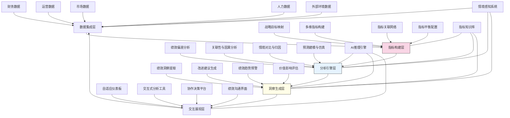

---
{"dg-publish":true,"tags":["绩效评估","多维分析","战略对齐","数据可视化","预测分析"],"创建日期":"2024-05-14","permalink":"/知识共享/001_财务/99_其他/AI与财务应用/03_智能决策支持/3.3 绩效与价值分析/3.3 多维绩效评估系统/","dgPassFrontmatter":true}
---

## 技术概述

多维绩效评估系统是一个融合人工智能、数据科学与组织行为学的前沿绩效管理平台，突破传统单一财务指标评估的局限，构建全方位、多层次、动态演进的绩效度量框架。该系统通过整合财务与非财务指标，建立绩效指标间的关联网络与动态平衡机制，实现从静态评估到动态洞察、从结果衡量到价值创造的绩效管理转型。核心技术特点包括：

- **自适应绩效框架**：结合战略目标与组织特性，自动构建多维度、多层次的绩效指标体系，动态调整指标权重与组合，确保绩效衡量与战略执行的持续对齐
- **绩效关联网络分析**：应用图分析与因果推断，揭示不同绩效指标间的相互影响关系，识别关键绩效驱动因素与业务杠杆点，构建绩效因果地图
- **情境智能与异常检测**：整合内外部环境数据，构建绩效情境理解引擎，识别绩效波动的真实原因，区分环境变化与内部执行偏差导致的绩效变化
- **预测性绩效分析**：融合时间序列预测与情景模拟，前瞻性评估当前行动对未来绩效的影响，实现从滞后指标到领先指标的绩效管理转型
- **个性化洞察生成**：针对不同管理层级与职能角色，自动生成相关性强、操作性高的绩效洞察与改进建议，支持精准行动与持续优化

相较于传统的绩效评估方法，多维绩效评估系统能够提高绩效评估全面性35-55%，增强战略与绩效对齐度40-60%，改善绩效预测准确率30-45%，缩短绩效分析周期50-70%，并发现25-40%传统方法未能识别的改进机会。系统通过构建连接战略、流程与个体的绩效生态系统，帮助企业实现从简单的绩效报告到深度绩效洞察的根本转变，推动持续的组织学习与价值创造。

## 系统架构

系统架构由五个核心功能层和三个核心支持组件组成，形成闭环的绩效评估与改进流程：

1. **数据集成层**：系统的基础，整合财务、运营、市场、人力与外部环境数据，构建统一的绩效分析数据平台，提供多维度绩效视角
2. **指标构建层**：系统的框架，映射战略目标，构建多维指标体系，建立指标关联网络，实现指标间的平衡配置，确保绩效评估的全面性与战略对齐
3. **分析引擎层**：系统的核心，执行绩效偏差分析，挖掘指标间关联与因果关系，进行情境对比与归因分析，开展预测建模与仿真，提供绩效动态洞察
4. **洞察生成层**：系统的智能，从分析结果中提取关键绩效洞察，生成针对性改进建议，发出绩效趋势预警，评估不同行动的价值影响，支持决策优化
5. **交互展现层**：系统的界面，提供自适应仪表板，交互式分析工具，协作决策平台，绩效沟通界面，满足不同用户的信息需求与交互体验

系统还包含三个跨层支持组件：
- **指标知识库**：积累行业最佳实践、标杆对比与指标定义体系，为指标构建与分析提供知识支持
- **AI推理引擎**：提供机器学习与因果推断能力，是系统智能分析与洞察生成的技术基础
- **情境感知系统**：整合内外部环境变化，为绩效分析提供情境上下文，支持准确的绩效归因与解释

整个架构形成自我完善的智能循环，推动企业从被动报告走向前瞻管理，从结果导向转向价值创造，构建真正的战略驱动型绩效生态系统。

## 实施方案

### 技术实施路线图

**第一阶段：基础构建（3-4个月）**
- 开发核心数据集成接口与转换逻辑
- 构建初步多维指标框架
- 实现基础绩效分析功能
- 开发自适应绩效仪表板
- 建立指标知识库基础架构

**第二阶段：核心功能开发（4-5个月）**
- 完善多维指标体系与关联网络
- 开发绩效归因分析引擎
- 实现情境感知与对比分析
- 构建基础预测模型
- 开发初步洞察生成功能

**第三阶段：高级分析与应用（3-4个月）**
- 开发高级因果分析算法
- 实现多情景绩效预测与仿真
- 构建个性化洞察与建议引擎
- 开发价值影响评估工具
- 增强交互式分析与决策支持

**第四阶段：系统集成与优化（2-3个月）**
- 完善预测模型与仿真系统
- 增强系统自学习与优化能力
- 实现端到端绩效管理工作流
- 系统集成与性能优化
- 用户培训与应用试点

### 技术挑战与解决策略

1. **多维指标的平衡与集成**
   - 挑战：不同维度、不同时间尺度、不同性质的指标难以有机集成并保持平衡，容易出现顾此失彼的局面
   - 解决方案：开发动态权重平衡算法；构建指标间的关联影响模型；实施指标冲突识别与调和机制；设计多时间尺度指标协调框架；建立战略导向的指标调整机制；提供情境化指标组合推荐

2. **绩效归因的准确性**
   - 挑战：绩效变化可能源于多种内外部因素的复杂交互，难以精准区分真实原因与表面现象
   - 解决方案：整合因果推断与反事实分析；实施自然实验设计；构建多层次归因模型；开发情境匹配与对比分析；引入专家知识辅助归因；实现混合归因方法（数据驱动+领域知识）

3. **预测模型的可靠性**
   - 挑战：绩效预测涉及多变量、非线性关系与不确定性，传统预测方法难以适应复杂业务环境
   - 解决方案：采用集成预测方法提高稳健性；实现动态特征选择与权重调整；开发预测不确定性量化框架；构建情景敏感的预测模型；实施持续回测与模型调整；引入专家判断修正机制

4. **从洞察到行动的转化**
   - 挑战：绩效洞察需转化为具体行动计划与执行措施，涉及跨部门协作与资源调配
   - 解决方案：构建洞察-行动映射框架；开发基于约束的行动优化模型；实现责任分配与协作工具；设计行动影响评估机制；提供分阶段实施路线图；建立成效追踪与反馈系统

## 价值创造

### 量化价值评估

1. **绩效管理效能提升**
   - 绩效评估全面性：提高35-55%
   - 绩效与战略对齐度：增强40-60%
   - 绩效分析周期：缩短50-70%
   - 绩效预测准确率：提升30-45%

2. **决策质量与执行改进**
   - 决策响应速度：提高45-65%
   - 资源配置优化：改善35-50%
   - 跨部门协同效率：增强40-60%
   - 目标达成率：提升25-35%

3. **组织能力与文化提升**
   - 绩效透明度：增强50-70%
   - 问题识别速度：提高40-60%
   - 持续改进文化：增强35-55%
   - 员工参与度：提升30-45%

4. **创新与学习加速**
   - 创新绩效可见性：提高45-65%
   - 组织学习速度：加快40-55%
   - 最佳实践共享：增强35-50%
   - 绩效提升持续性：改善30-40%

### 投资回报分析

投资回报率(ROI)预计达到350-500%（36个月期），主要价值来源包括：
- 改善决策质量与资源配置（35%）
- 提高组织效率与执行力（30%）
- 加速问题识别与解决（20%）
- 增强战略执行与调整（15%）

典型实施成本结构：技术平台开发（35%）、数据集成与准备（25%）、模型开发与验证（20%）、变革管理与培训（20%）。

预期投资回收期：
- 大型企业：12-18个月
- 中型企业：9-15个月
- 高成长企业：6-12个月
- 转型企业：8-14个月

## 未来演进

### 技术迭代路线图

**近期演进（1-2年）**
- 整合大语言模型增强绩效叙事与解释生成
- 开发组织网络分析与团队绩效动态评估
- 实现自然语言绩效查询与对话式分析
- 增强"深潜"分析与异常根因诊断能力

**中期演进（2-3年）**
- 构建绩效数字孪生与仿真环境
- 开发预测性绩效干预推荐系统
- 实现跨组织绩效生态系统分析
- 创建自主绩效优化智能体

**远期演进（3-5年）**
- 发展认知绩效管理框架
- 构建组织适应力与韧性评估系统
- 实现价值创造的动态量化与分配
- 创建混合人机绩效协同生态圈

### 扩展应用场景

1. **组织健康动态监测**：超越传统财务与运营绩效，整合员工体验、组织文化、知识流动性等维度，构建组织健康指数，预测潜在风险与机会

2. **客户价值绩效地图**：连接内部运营绩效与客户体验绩效，构建端到端价值链绩效视图，识别价值创造与传递过程中的优化点与价值泄漏

3. **生态系统绩效协同**：扩展至合作伙伴、供应商与分销商网络，构建跨组织绩效协作平台，识别协同潜力与瓶颈，优化整体生态系统绩效

4. **可持续影响力评估**：整合环境、社会与治理(ESG)指标，建立可持续发展绩效框架，平衡短期财务绩效与长期可持续影响力

## 实验验证

### 概念验证方案

**阶段一：多维指标构建与分析（6-8周）**
- 选择具有丰富历史数据的业务单元
- 构建初步多维绩效框架与关联网络
- 部署基础归因分析与预测模型
- 与传统绩效管理方法结果对比
- 评估绩效洞察的深度与准确性

**阶段二：预测与情境分析验证（8-10周）**
- 基于多维指标构建预测模型
- 实施前瞻性绩效预测与回溯测试
- 验证不同情境下的绩效影响分析
- 评估情境感知与归因的准确性
- 收集管理层反馈与改进需求

**阶段三：决策支持应用验证（10-12周）**
- 将系统应用于实际管理决策场景
- 生成绩效洞察与改进建议
- 追踪基于系统建议的行动实施
- 评估绩效改善的实际成效
- 验证系统学习与适应能力

### 评估指标框架

**技术性能指标**
- 指标整合全面性：覆盖关键绩效维度的完整度
- 归因准确率：绩效归因与实际原因的一致性
- 预测精度：绩效预测与实际结果的偏差
- 洞察相关性：生成洞察的业务相关性与操作性
- 系统响应性：复杂分析与查询的响应时间

**业务价值指标**
- 决策影响：系统支持的决策质量改善度
- 绩效改进：系统应用后的绩效提升幅度
- 战略对齐：绩效管理与战略执行的一致性
- 管理采纳度：管理层对系统的采纳与应用程度
- 协作效率：跨部门绩效沟通与协作的改善度

**长期价值指标**
- 绩效文化形成：绩效导向行为的组织渗透度
- 组织学习速度：绩效问题识别与改进的周期缩短
- 创新支持能力：系统对非常规绩效与创新的支持度
- 适应性提升：组织响应环境变化的速度与效果
- 可持续发展：长期绩效与价值创造的平衡度

## 未来影响

多维绩效评估系统将从根本上改变企业管理绩效与价值创造的方式，带来深远影响：

1. **管理范式变革**：从静态结果考核转向动态价值创造管理，从滞后指标监控转向领先指标引导，构建前瞻性、整体性的绩效生态系统

2. **决策模式转型**：使决策从基于历史绩效的经验判断，转向数据驱动的多维视角与情境模拟，平衡短期绩效与长期价值创造

3. **组织结构重塑**：促使组织从层级控制模式转向自主协作网络，打破部门壁垒，形成围绕价值创造流动的敏捷组织形态

4. **价值认知进化**：拓展价值创造的定义与衡量维度，从单纯财务结果到包含创新能力、组织健康、社会影响在内的整体价值观

通过构建连接战略、流程与个体的绩效生态系统，多维绩效评估系统不仅是评估工具，更是组织转型与价值创造的关键驱动力，推动企业从传统绩效管理走向智能价值管理的根本转变，在数字时代塑造更具适应力、创新力与可持续发展能力的组织形态。 