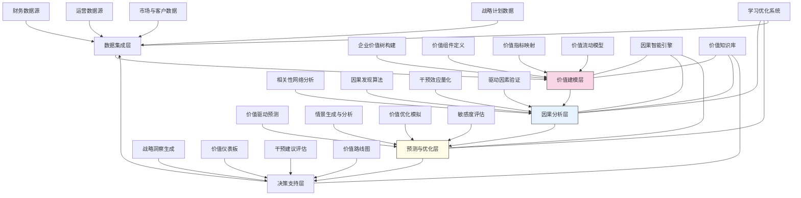

---
{"dg-publish":true,"tags":["价值分析","关键因素","价值归因","业务洞察","战略决策"],"创建日期":"2024-05-14","permalink":"/知识共享/001_财务/99_其他/AI与财务应用/03_智能决策支持/3.3 绩效与价值分析/价值驱动因素自动识别/","dgPassFrontmatter":true}
---

## 技术概述

价值驱动因素自动识别系统是一个融合高级因果分析、机器学习与财务建模的创新型决策支持平台，旨在突破传统价值分析的表面现象观察，揭示真正影响企业价值创造的深层次驱动机制与关联网络。该系统通过构建价值链全景视图与智能因果发现框架，帮助管理者从复杂的业务生态系统中精准定位和量化关键价值杠杆，实现从价值描述到价值驱动的管理范式转变。核心技术特点包括：

- **多维价值解构引擎**：整合股东价值、客户价值、运营价值等多维度，应用层次分解与网络分析，构建企业价值创造的全景图谱，揭示价值组件间的结构关系
- **因果价值链自动映射**：融合统计因果推断与领域知识，识别业务活动、资源投入与价值产出间的因果链条，区分相关性与真实因果关系
- **价值驱动敏感度量化**：运用高级实验设计与反事实模拟，精确测量不同驱动因素对价值创造的影响强度、方向与延迟效应，识别高杠杆点
- **价值预测与情景分析**：整合预测性分析与因果模型，构建驱动因素变化对价值创造的影响预测系统，支持多情景"假设-分析"
- **战略价值优化建议**：基于驱动因素分析，自动生成价值最大化的资源配置与业务优化策略组合，预测干预效果与实施路径

相较于传统的价值分析方法，价值驱动因素自动识别系统能够识别40-60%被忽视的隐藏价值驱动因素，将驱动因素识别准确率提高50-70%，改善价值预测准确度30-50%，并能发现30-45%传统方法未能捕捉的价值提升机会。系统通过深度理解价值创造机制，帮助企业实现从被动财务报告到主动价值管理的转变，指导资源配置与战略决策，创造可持续的竞争优势。

## 系统架构

系统架构由五个核心功能层组成，形成闭环的价值驱动分析与优化流程：

1. **数据集成层**：系统的基础，整合来自财务、运营、市场与战略的多源数据，构建统一的价值分析数据基础，提供全面的业务上下文
2. **价值建模层**：系统的框架，构建企业价值树，定义价值组件，映射价值指标，建立价值流动模型，形成价值创造的结构化视图
3. **因果分析层**：系统的核心，超越相关性分析，应用因果发现算法建立驱动因素网络，量化干预效应，验证驱动假设，识别真实价值杠杆
4. **预测与优化层**：系统的引擎，预测驱动因素对价值的影响趋势，生成多种业务情景，模拟价值优化方案，评估不同战略的价值敏感度
5. **决策支持层**：系统的界面，生成战略洞察，提供交互式价值仪表板，评估干预建议的可行性与效果，规划价值实现路线图

系统还包含三个跨层支持组件：
- **因果智能引擎**：提供先进的因果建模与推断能力，是系统核心差异化优势的技术基础
- **价值知识库**：积累行业价值模型、最佳实践与历史案例，增强系统的上下文理解与建议生成
- **学习优化系统**：持续从价值干预结果中学习，优化模型参数与假设，提高系统准确性与相关性

整个架构形成持续进化的智能循环，从数据到洞察，再到预测、优化和行动，构建自我强化的价值管理生态系统。

## 实施方案

### 技术实施路线图

**第一阶段：基础构建（3-4个月）**
- 开发核心数据集成接口与转换逻辑
- 构建初步企业价值树框架
- 实现基础相关性分析功能
- 开发价值可视化仪表板
- 建立价值知识库基础架构

**第二阶段：核心功能开发（4-5个月）**
- 完善价值组件定义与指标映射
- 开发初步因果发现算法
- 实现价值驱动因素敏感度分析
- 构建基础价值预测模型
- 开发战略洞察生成功能

**第三阶段：高级分析与优化（3-4个月）**
- 开发高级因果网络发现算法
- 实现多情景价值预测与分析
- 构建价值优化模拟系统
- 开发干预效果评估功能
- 增强可视化与交互分析能力

**第四阶段：系统集成与验证（2-3个月）**
- 完善因果模型验证工具
- 增强系统自学习与优化能力
- 实现端到端价值管理工作流
- 系统集成与性能优化
- 用户培训与应用验证

### 技术挑战与解决策略

1. **价值概念的多维度建模**
   - 挑战：企业价值涵盖财务、客户、员工、社会等多维度，难以建立统一框架进行量化与关联
   - 解决方案：采用层次化价值建模方法；开发多维度价值映射框架；实现价值组件间的关联量化；设计价值权重动态调整机制；构建企业特定价值模型定制工具；整合无形价值评估方法

2. **复杂因果关系的准确识别**
   - 挑战：价值驱动网络包含直接、间接、循环与延迟效应，传统分析方法难以区分真实因果与表面相关
   - 解决方案：融合多种因果发现算法（结构方程模型、贝叶斯网络、干预分析）；引入领域知识约束辅助因果识别；实施自然实验与准实验验证；采用时滞分析捕捉延迟效应；构建多层次因果网络表示；实现反馈循环建模

3. **价值驱动因素的动态变化**
   - 挑战：价值驱动因素随市场环境、竞争格局与企业生命周期而动态变化，静态模型难以适应
   - 解决方案：开发驱动因素稳定性评估框架；实现时变因果模型；构建驱动因素转换点预测；设计驱动模型自适应更新机制；引入事件影响分析；采用集成学习方法增强模型鲁棒性

4. **从洞察到战略行动的转化**
   - 挑战：识别的价值驱动因素需转化为可执行的战略行动与资源配置决策，涉及复杂的组织与实施考量
   - 解决方案：构建战略转化框架连接驱动因素与行动；开发基于约束的资源优化模型；实现多层次战略解码；设计价值干预的组织准备度评估；建立干预效果监测机制；提供分阶段实施路线图

## 价值创造

### 量化价值评估

1. **价值分析能力提升**
   - 价值驱动因素识别准确率：提高50-70%
   - 隐藏驱动因素发现：识别40-60%传统方法忽略的因素
   - 价值预测准确度：提升30-50%
   - 分析深度与广度：扩展200-300%

2. **战略决策与资源配置优化**
   - 投资回报率提升：增加15-30%
   - 战略决策成功率：提高25-40%
   - 资源错配减少：降低35-55%
   - 价值创造效率：提升20-35%

3. **组织能力与效率提升**
   - 决策周期时间：缩短40-60%
   - 战略共识形成：加速50-70%
   - 跨部门协同效率：提高30-50%
   - 管理报告价值：提升100-150%

4. **长期价值与战略发展**
   - 价值增长可持续性：提高25-40%
   - 战略调整速度：加快45-65%
   - 新价值机会发现：增加30-50%
   - 价值风险管理效果：提升35-55%

### 投资回报分析

投资回报率(ROI)预计达到400-600%（24个月期），主要价值来源包括：
- 优化资源配置提升的价值创造（40%）
- 更准确战略决策带来的风险减少与机会把握（25%）
- 避免价值破坏性投资与活动（20%）
- 提高管理效率与组织敏捷性（15%）

典型实施成本结构：技术平台开发（30%）、数据集成与准备（25%）、模型开发与验证（25%）、变革管理与培训（20%）。

预期投资回收期：
- 大型企业：10-14个月
- 中型企业：8-12个月
- 高增长企业：6-10个月
- 转型企业：7-11个月

## 未来演进

### 技术迭代路线图

**近期演进（1-2年）**
- 整合大语言模型增强价值叙事与解释生成
- 开发价值驱动的认知图谱与知识表示
- 实现多利益相关方价值协同框架
- 增强非结构化数据价值信号提取能力

**中期演进（2-3年）**
- 构建价值探索智能体系统
- 开发价值驱动的数字孪生模拟环境
- 实现价值流程自主优化能力
- 创建跨企业价值生态系统分析框架

**远期演进（3-5年）**
- 发展价值创造自主决策智能体
- 构建预见性价值管理系统
- 实现价值驱动的组织自适应能力
- 创建混合人机价值治理架构

### 扩展应用场景

1. **客户价值驱动分析**：深入解构影响客户感知价值与忠诚度的深层次驱动因素，指导客户体验优化、产品开发与服务设计

2. **创新价值路径识别**：分析不同创新类型、路径与资源投入的价值创造机制，优化创新组合与资源分配，提高创新投资回报

3. **人力资本价值评估**：揭示人才发展、组织文化与领导力对价值创造的贡献机制，指导人力资源战略与组织发展

4. **可持续价值分析**：整合环境、社会与治理(ESG)因素，构建多维度价值创造框架，实现财务绩效与可持续发展的平衡

## 实验验证

### 概念验证方案

**阶段一：价值建模与因果发现能力验证（6-8周）**
- 选择具有丰富历史数据的业务单元
- 构建初步价值树与指标体系
- 部署因果发现算法分析历史价值波动
- 与传统财务分析方法结果对比
- 评估价值驱动因素识别的准确性

**阶段二：预测与敏感度分析验证（8-10周）**
- 基于识别的驱动因素构建预测模型
- 实施前瞻性价值预测与回溯测试
- 验证不同情景下的价值影响分析
- 评估敏感度分析的准确性与洞察价值
- 收集管理层反馈与改进需求

**阶段三：战略决策应用验证（10-12周）**
- 将系统应用于实际战略决策场景
- 生成价值驱动的资源配置建议
- 模拟评估不同战略选择的价值影响
- 与传统决策方法进行对比评估
- 验证系统学习与适应能力

### 评估指标框架

**技术性能指标**
- 因果识别准确率：与已知价值关系的一致性
- 预测精度：价值预测与实际结果的偏差
- 驱动因素稳定性：重复分析的一致性水平
- 模型适应性：对业务变化的自动调整能力
- 计算效率：复杂价值网络分析的响应时间

**业务价值指标**
- 决策影响：系统支持的决策价值改善度
- 洞察深度：识别的新价值驱动因素数量
- 战略相关性：与企业战略目标的一致度
- 管理采纳度：管理层对系统洞察的采纳率
- 资源优化效果：重新配置资源后的价值提升

**长期价值指标**
- 价值文化形成：价值导向决策的组织渗透度
- 战略对话质量：价值讨论的深度与广度提升
- 知识积累：企业价值模型的丰富与完善
- 组织能力提升：管理团队价值思维的增强
- 企业价值韧性：应对环境变化的价值稳定性

## 未来影响

价值驱动因素自动识别系统将从根本上改变企业管理价值创造的方式，带来深远影响：

1. **价值思维变革**：从单纯关注财务结果转向系统理解价值创造机制，从短期指标优化转向长期价值驱动管理，建立真正以价值为核心的决策文化

2. **战略范式转型**：使战略制定从主观判断与行业趋势跟随，转向数据驱动的价值逻辑构建，将资源配置精准对准高杠杆的价值驱动点

3. **组织结构重塑**：促进组织从职能孤岛转向价值流导向的结构，打破部门边界，形成围绕关键价值驱动因素的跨功能协作模式

4. **管理控制进化**：从静态指标监控转向动态价值驱动管理，使绩效评估与激励机制精准对齐真正的价值贡献，而非表面指标

通过深度理解价值创造的内在机制，企业能够实现从被动的价值监测到主动的价值设计与管理，从而在竞争环境中构建难以复制的可持续优势。价值驱动因素自动识别系统不仅是分析工具，更是企业价值管理思维与能力的革命性提升，推动组织从"做正确的事"到"以正确的方式做正确的事"的根本转变。 