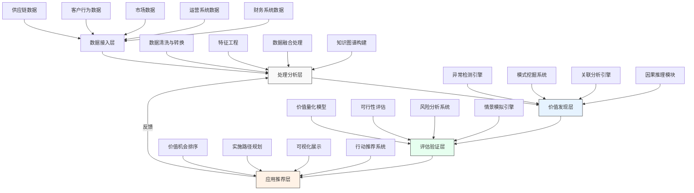

---
{"dg-publish":true,"tags":["AI财务应用","价值挖掘","模式识别","数据挖掘","财务分析"],"创建日期":"2024-04-27","permalink":"/知识共享/001_财务/99_其他/AI与财务应用/03_智能决策支持/3.3 绩效与价值分析/隐藏价值挖掘助手/","dgPassFrontmatter":true}
---

## 技术概述

隐藏价值挖掘助手是一套融合前沿AI技术的智能分析系统，专注于从企业海量财务与运营数据中发现被忽视的价值机会。该系统打破传统财务分析的局限性，通过深度模式识别、异常检测和关联分析，揭示常规分析难以发现的潜在价值点和优化机会，为企业释放隐藏资产价值和提升运营效率提供数据驱动的智能支持。

### 核心技术栈

1. **多维异常检测引擎**：基于深度学习和统计模型识别数据中的异常模式，发现偏离预期的价值机会
2. **图神经网络分析框架**：构建业务实体关系网络，发现隐藏的价值关联和影响路径
3. **无监督模式挖掘算法**：自动发现数据中的隐藏模式和聚类，无需预设假设
4. **多模态数据融合技术**：整合结构化财务数据与非结构化业务信息，提供全景视角
5. **因果推理分析系统**：识别价值驱动的因果链，区分相关性和因果性

### 技术协同工作机制

隐藏价值挖掘助手通过"采集-清洗-分析-挖掘-验证-推荐"的闭环机制发现隐藏价值：

1. **数据整合层**融合企业各系统财务与非财务数据，建立统一分析基础
2. **模式识别层**应用多种算法自动探索数据中不明显的规律和模式
3. **价值量化层**将发现的模式转化为可操作的价值机会，并进行财务量化
4. **优先级排序层**基于价值潜力、实施难度和风险评估对机会进行排序
5. **实施规划层**为高价值机会生成详细的实施路径和资源需求

### 技术创新点

1. **自适应异常界定**：根据业务环境动态调整异常定义，避免静态阈值局限
2. **关联价值挖掘**：超越单点优化，识别跨部门、跨流程的系统性价值机会
3. **隐式知识提取**：从历史数据和专家行为中提取隐性规则和判断模式
4. **情境感知分析**：考虑业务周期、市场环境等外部因素的影响
5. **解释性价值评估**：为每个发现提供可解释的价值分析和实施建议

### 与传统解决方案对比

| 特性 | 传统财务分析 | 基础BI工具 | 隐藏价值挖掘助手 |
|------|--------------|-----------|-----------------|
| 分析范围 | 预定义财务指标 | 可视化报表与仪表板 | 全域数据无边界探索 |
| 分析方法 | 人工假设验证 | 描述性统计与查询 | 自动模式发现与因果分析 |
| 识别能力 | 已知价值点优化 | 预定义KPI异常 | 未知价值机会发现 |
| 分析深度 | 单维度线性分析 | 多维交叉分析 | 网络关系与系统性分析 |
| 智能程度 | 人工经验驱动 | 规则触发提醒 | 自适应学习与推荐 |
| 价值评估 | 定性描述 | 简单数值对比 | 多情景模拟与量化 |

## 系统架构

### 组件功能说明

1. **数据接入层**：整合多源异构数据，建立统一分析基础
   - 财务系统数据：GL、AP/AR、成本核算、预算系统等
   - 运营系统数据：ERP、CRM、SCM、HR系统等
   - 市场数据：竞争情报、行业标杆、市场趋势等
   - 客户行为数据：销售记录、互动历史、满意度评价等
   - 供应链数据：采购记录、库存水平、物流信息等

2. **处理分析层**：转换原始数据为分析就绪的结构化信息
   - 数据清洗与转换：处理缺失值、异常值和格式标准化
   - 特征工程：构建高价值派生特征，提取隐含信息
   - 数据融合处理：整合不同来源和格式的数据
   - 知识图谱构建：建立业务实体间的关系网络

3. **价值发现层**：应用多种算法发现隐藏模式和价值机会
   - 异常检测引擎：识别偏离正常模式的数据点
   - 模式挖掘系统：发现数据中的规律和重复结构
   - 关联分析引擎：揭示不同业务实体间的隐含关联
   - 因果推理模块：区分相关性和因果关系，识别价值驱动因素

4. **评估验证层**：量化和验证发现的价值机会
   - 价值量化模型：估算优化机会的财务影响
   - 可行性评估：评估实施难度和所需资源
   - 风险分析系统：识别潜在风险和缓解策略
   - 情景模拟引擎：在不同假设下测试优化方案

5. **应用推荐层**：转化分析洞察为可执行的行动建议
   - 价值机会排序：基于价值、可行性和风险排序机会
   - 实施路径规划：为高价值机会设计实施步骤
   - 可视化展示：直观呈现分析结果和价值机会
   - 行动推荐系统：提供具体可操作的优化建议

### 数据流说明

1. **采集流**：从各业务系统和外部来源持续收集数据
2. **处理流**：原始数据经过清洗、转换和融合成分析就绪状态
3. **分析流**：处理后的数据通过多种算法进行模式识别和价值挖掘
4. **评估流**：发现的价值机会经过量化评估和风险分析
5. **推荐流**：经过验证的价值机会转化为优先级排序的行动建议
6. **反馈流**：实施结果和用户反馈回流到系统，优化模型和算法

## 实施方案

### 技术实施路线图

**第一阶段：基础构建（1-3个月）**
- 建立数据接入框架，连接核心财务和运营系统
- 开发数据清洗和转换管道，确保数据质量
- 构建基础特征工程模块，提取关键分析维度
- 搭建初步可视化界面，展示基础分析结果

**第二阶段：算法实现（3-6个月）**
- 开发异常检测算法，识别数据异常点
- 实现无监督模式挖掘功能，发现数据规律
- 构建初步关联分析引擎，揭示简单关联关系
- 设计价值量化模型，评估发现机会的潜在价值

**第三阶段：高级功能（6-9个月）**
- 实现知识图谱构建，建立业务实体关系网络
- 开发因果推理模块，识别价值驱动因素
- 构建情景模拟引擎，测试不同优化方案
- 完善用户界面，提供交互式分析体验

**第四阶段：系统集成（9-12个月）**
- 集成各功能模块，构建端到端解决方案
- 开发自动化推荐引擎，生成优先级排序的行动建议
- 实现持续学习机制，优化模型和算法
- 构建完整反馈闭环，跟踪价值实现情况

### 技术依赖与资源需求

**硬件资源**
- 计算服务器：用于数据处理和模型训练（建议配置：32核CPU，256GB RAM，4-8张GPU）
- 存储系统：支持大规模数据存储和快速访问（建议：分布式存储，初始容量10TB，可扩展）
- 网络设施：支持安全高效的数据传输（建议：10Gbps网络，加密传输）

**软件资源**
- 数据处理框架：Apache Spark、Hadoop、Databricks
- 机器学习平台：Python科学计算栈、TensorFlow、PyTorch
- 图数据库：Neo4j、TigerGraph
- 可视化工具：Tableau、Power BI、D3.js
- 工作流管理：Airflow、Luigi

**人力资源**
- 数据科学家：2-3人，负责算法开发和模型训练
- 数据工程师：2-3人，负责数据管道和基础架构
- 财务分析专家：1-2人，提供领域知识和验证结果
- 业务分析师：1-2人，协助需求定义和结果解释
- 可视化开发者：1人，负责界面设计和交互实现
- 项目经理：1人，协调资源和进度

### 潜在技术挑战与解决策略

**挑战1：数据质量与完整性问题**
- **解决策略**：
  - 实施强大的数据验证和清洗流程，自动识别并处理异常
  - 开发缺失值智能填充算法，基于上下文和相似性推断
  - 建立数据质量评分机制，为分析结果提供可信度指标
  - 设计增量处理机制，随着数据质量提升逐步扩展分析范围

**挑战2：跨系统数据整合复杂性**
- **解决策略**：
  - 构建统一数据模型，对不同系统概念进行映射和标准化
  - 实施主数据管理，确保关键实体的一致性识别
  - 开发语义层，屏蔽底层数据复杂性，提供业务友好视图
  - 采用渐进式整合策略，先解决高价值数据源整合问题

**挑战3：模式识别中的误判控制**
- **解决策略**：
  - 实施多算法交叉验证，减少单一方法的偏差
  - 建立分级置信度评估，明确标识不同确定性水平的发现
  - 引入领域知识约束，过滤不符合业务逻辑的结果
  - 设计人机协作验证流程，关键发现经专家确认

**挑战4：价值量化的准确性**
- **解决策略**：
  - 结合历史数据和案例研究校准价值评估模型
  - 采用区间估计而非点估计，反映价值预测的不确定性
  - 实施分阶段验证，通过小规模试点验证价值预测
  - 构建多情景分析框架，在不同假设下评估价值范围

### 风险管理

**技术风险**
- **过度依赖自动化**：保持人机协作模式，关键决策由人类专家审核
- **算法黑箱问题**：强化可解释性设计，提供决策依据和推理路径
- **计算性能瓶颈**：采用分布式计算和增量处理策略，优化资源利用

**业务风险**
- **误导性发现**：建立严格的统计显著性测试和假设验证机制
- **实施阻力**：提供清晰的价值证明和分步实施指南，降低采纳障碍
- **期望管理**：设定合理的价值预期，强调循序渐进的价值释放过程

## 价值创造

### 财务价值量化

**成本优化**
- 识别并减少隐藏浪费，预计可降低运营成本2-5%
- 优化采购和供应商管理，平均节省采购支出3-7%
- 发现低效流程和冗余，提高人力资源利用率10-15%

**收入增强**
- 发掘未充分利用的资产和能力，创造增量收入机会
- 识别交叉销售和追加销售机会，提升客户价值2-4%
- 优化定价和折扣策略，改善产品组合利润率1-3%

**资本效率**
- 优化库存和应收账款管理，减少营运资本占用8-12%
- 发现未充分利用的资产，提高资产利用率15-20%
- 识别投资优化机会，提升资本回报率2-4个百分点

### 投资回报分析

| 投资类别 | 估计成本(万元) | 预期年化回报(万元) | 投资回报期 |
|---------|--------------|------------------|-----------|
| 技术平台建设 | 200-350 | 不适用 | 纳入总体ROI |
| 数据集成与治理 | 100-200 | 不适用 | 纳入总体ROI |
| 算法开发与验证 | 150-250 | 不适用 | 纳入总体ROI |
| 人力与培训 | 100-200/年 | 不适用 | 纳入总体ROI |
| **总体投资** | **550-1000** | **1100-2200** | **6-12个月** |

> 注：回报估算基于年收入10亿元的企业，回报率随企业规模和数据成熟度而变化

### 战略价值创造

**数据资产价值释放**
- 将沉睡数据转化为可操作洞察，释放数据资产潜力
- 建立数据价值图谱，识别高价值数据领域
- 培养数据驱动文化，提升组织数据素养

**决策质量提升**
- 减少基于经验和直觉的决策，增加数据支持的判断
- 提供更全面的情景分析，优化决策质量
- 缩短决策周期，提高组织敏捷性

**创新能力增强**
- 发现非常规市场机会和业务模式创新点
- 支持资源优化配置，促进创新投入
- 降低创新风险，提高成功率

### 企业转型加速

**流程优化**
- 发现并消除流程瓶颈和冗余环节
- 优化跨部门协作流程，减少摩擦和延迟
- 支持流程自动化，提高运营效率

**业务模式创新**
- 识别新的收入来源和盈利模式
- 支持产品和服务创新，发现差异化机会
- 促进商业模式演进，适应市场变化

**组织能力提升**
- 增强分析决策能力，构建数据驱动组织
- 优化资源配置，提高组织敏捷性
- 培养价值挖掘思维，建立持续优化文化

## 未来演进

### 技术迭代路线图

**短期演进（1-2年）**
- 增强自动异常检测能力，减少人工干预
- 扩展数据源整合范围，纳入更多外部数据
- 提升价值量化模型精度，优化ROI评估
- 增强可视化和交互体验，提高用户采纳率

**中期演进（2-3年）**
- 引入预测性分析能力，前瞻性识别价值机会
- 实现更复杂的因果网络分析，深化系统理解
- 发展自主学习能力，持续优化模式识别
- 构建知识累积机制，沉淀价值发现经验

**长期演进（3-5年）**
- 实现自主价值探索，无需人工指导
- 构建端到端价值实现闭环，从发现到执行
- 发展跨组织价值网络分析，识别生态系统机会
- 建立价值创造智能体，主动推动优化实施

### 与未来AI技术结合点

**生成式AI**
- 自动生成优化方案和实施路径建议
- 创建"假设性价值情景"，探索非线性创新机会
- 生成解释性叙述，优化分析结果沟通

**强化学习**
- 通过模拟环境测试优化策略效果
- 学习最佳价值挖掘策略，适应不同业务环境
- 优化资源分配和探索顺序，最大化价值发现

**联邦学习**
- 在保护数据隐私的前提下进行跨组织价值基准比较
- 构建行业模式库，保持企业数据隐私
- 支持供应链和合作伙伴网络的协同价值优化

**认知计算**
- 整合结构化分析与非结构化信息理解
- 构建领域专家思维模型，模拟专家判断
- 实现多模态价值信号识别，包括文本、图像和时间序列

### 扩展应用场景

**战略规划与资源配置**
- 识别高增长和高回报机会领域
- 优化资本和资源配置决策
- 支持并购后整合和协同价值挖掘

**产品与服务创新**
- 发现未满足的客户需求和偏好
- 识别产品改进和创新机会
- 支持服务设计和用户体验优化

**风险管理与合规**
- 前瞻性识别潜在风险和控制薄弱环节
- 优化风险缓解策略和资源分配
- 提高合规效率，降低合规成本

**人力资本优化**
- 发现人才配置和技能差距机会
- 优化团队组成和工作分配
- 识别员工敬业度和生产力提升机会

### 长期价值影响

**决策文化转型**
- 从直觉驱动向数据驱动决策模式转变
- 建立价值量化评估习惯，强化投资回报思维
- 培养系统性思考能力，避免孤立优化

**持续改进机制**
- 构建自动化价值监控系统，持续识别机会
- 建立价值实现跟踪机制，闭环管理
- 发展迭代改进文化，追求卓越运营

**组织学习加速**
- 将隐性知识转化为显性资产，促进知识分享
- 加速最佳实践识别和推广，提高组织学习速度
- 建立价值挖掘能力中心，培养专业技能

## 实验验证

### 概念验证方案

**第一阶段：范围界定与基线建立（4-6周）**
- 选择1-2个高价值业务领域进行初步验证
- 收集历史数据并建立关键指标基线
- 定义成功标准和价值衡量指标
- 构建初步数据处理和分析环境

**第二阶段：算法开发与初步挖掘（6-8周）**
- 实现核心异常检测和模式识别算法
- 应用算法发现初步价值机会
- 与业务专家合作验证发现的价值点
- 量化初步发现的潜在价值

**第三阶段：小规模试点实施（8-10周）**
- 选择2-3个高价值发现进行实施试点
- 设计详细的实施计划和资源需求
- 执行优化行动并监控结果
- 评估实际价值与预测价值的差距

**第四阶段：验证结果与系统调优（4-6周）**
- 分析试点结果，总结成功因素和挑战
- 优化算法和评估模型，提高准确性
- 扩展数据源和分析范围，识别更多机会
- 设计大规模部署方案和路线图

### 评估指标

**技术性能指标**
- 发现准确率：经验证的有效价值机会 > 60%
- 分析处理效率：处理30天数据周期 < 4小时
- 误报率：无效或低价值发现比例 < 30%
- 模型自适应性：性能下降触发自动优化

**业务价值指标**
- 财务影响：实现的价值/预测的价值 > 70%
- 实施效率：从发现到实施的平均周期 < 8周
- 投资回报率：每投入1元产生的净价值 > 4元
- 价值多样性：跨至少3个业务领域发现价值机会

**用户采纳指标**
- 活跃用户比例：目标用户群中的活跃用户 > 60%
- 使用频率：关键用户每周使用系统 > 2次
- 实施率：被采纳实施的价值机会 > 50%
- 用户满意度：系统有用性评分 > 4（5分制）

### 试点设计与实施

**试点领域选择**
- 采购与供应链管理：寻找采购优化和供应商合理化机会
- 应收账款与信用管理：识别收款优化和坏账减少机会
- 库存与物流管理：发现库存优化和配送效率提升点
- 客户价值管理：挖掘客户盈利性提升和流失预防机会

**实施方法**
- 成立跨职能试点团队，包括IT、财务和业务代表
- 确立明确的基线和目标指标，便于效果衡量
- 采用敏捷实施方法，短周期迭代优化
- 建立实时监控和反馈机制，及时调整策略

**价值验证流程**
- 建立分阶段价值确认机制，从预测到实现
- 实施前后对比分析，隔离其他因素影响
- 收集定量和定性反馈，全面评估影响
- 编制详细案例研究，记录经验和最佳实践

### 扩展与规模化策略

**能力建设计划**
- 培养内部数据科学和价值分析团队
- 建立知识转移机制，增强自主能力
- 开发用户培训计划，提高系统使用技能
- 构建持续学习与支持体系

**渐进式扩展路径**
- 基于初始成功，逐步扩展到相关业务领域
- 优先扩展到高价值、低复杂性的领域
- 建立成熟度评估机制，确保扩展就绪
- 制定明确的扩展里程碑和成功标准

**持续优化机制**
- 建立定期算法和模型更新机制
- 实施用户反馈收集和功能改进流程
- 建设经验知识库，积累最佳实践
- 建立价值挖掘创新论坛，鼓励创新思维

**成功扩展标准**
- 初期（6个月）：3-5个业务领域成功部署
- 中期（12个月）：覆盖50%关键业务流程
- 长期（24个月）：全企业部署与价值实现

## 总结

隐藏价值挖掘助手代表了财务分析与AI技术融合的前沿应用，突破了传统财务分析的局限，实现了从被动报告到主动价值发现的转变。通过集成多种先进AI技术，系统能够自动识别数据中的异常模式、关联关系和系统性优化机会，将企业沉睡的数据资产转化为可操作的价值创造点。

从实施角度看，该系统采用渐进式方法，从高价值领域入手，通过验证-优化-扩展的循环，确保价值持续释放。其价值不仅体现在直接的财务收益上，更重要的是构建了企业的数据驱动决策文化和持续优化能力，为组织的长期竞争力提供了支撑。

随着AI技术的不断演进，隐藏价值挖掘助手将持续增强其自主学习和价值发现能力，不断扩展应用场景，最终成为企业战略决策和资源优化的核心智能支持系统，实现从价值发现到价值创造的完整闭环。 