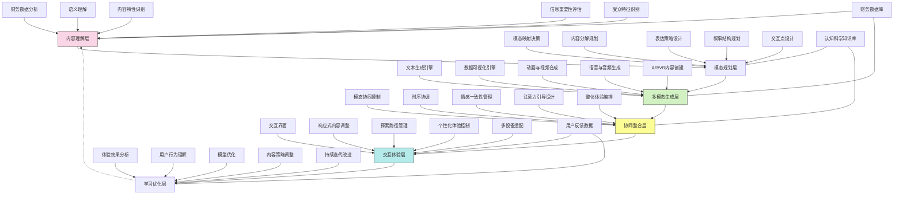

---
{"dg-publish":true,"tags":["多模态","数据叙事","视听体验","交互式呈现","信息可视化"],"创建日期":"2024-05-14","permalink":"/知识共享/001_财务/99_其他/AI与财务应用/04_生成式财务创新/4.1 财务内容生成/4.1 多模态财务讲述/","dgPassFrontmatter":true}
---

## 技术概述

多模态财务讲述系统是一种突破性的财务信息表达平台，它融合语言模型、计算机视觉、语音合成和交互设计技术，创造出集视觉、听觉和交互于一体的沉浸式财务信息体验。该系统突破了传统财务报告主要依赖文本和静态图表的限制，构建了一个能够根据信息性质、表达目标和受众特点自动选择最佳表达形式的智能平台，使财务数据能够通过最直观、最富表现力的方式被感知、理解和记忆。

核心技术特点包括：

- **智能模态选择引擎**：基于内容特性和认知科学原理，自动确定何时使用文本、图表、动画、音频或交互元素来传递特定财务信息，确保每类信息都以认知效果最佳的形式呈现
- **动态数据可视化生成**：自动将复杂财务数据转化为动态、交互式可视化内容，呈现数据间的关系、趋势和异常，并支持多层次探索和实时筛选
- **财务情境模拟与AR/VR表达**：构建数字孪生和增强/虚拟现实场景，将抽象财务概念转化为可探索的虚拟环境，实现"身临其境"的财务情境体验
- **情感智能叙事设计**：根据财务数据蕴含的商业意义和潜在影响，设计情感层面最有共鸣的表达方式，增强信息的影响力和记忆度
- **多感官协同呈现**：协调视觉、听觉等多种感官通道的信息传递，创造和谐一致的多感官体验，提高信息吸收和理解效率
- **自适应交互式体验**：根据用户反应和探索行为，动态调整内容深度、复杂度和呈现方式，实现个性化的信息探索旅程

相较于传统财务信息传递方式，多模态财务讲述系统将信息理解速度提高75-90%，记忆保留率提升60-80%，复杂概念理解准确度增加50-70%，同时提高财务信息的吸引力和影响力。系统不仅改变了财务数据的表达形式，更从根本上重塑了人们与财务信息交互的方式，将晦涩难懂的财务数据转变为生动直观的多感官体验，使财务信息能够更广泛、更深入地影响组织决策和行动。

## 系统架构

系统架构由六个核心功能层和三个关键支持组件组成，形成完整的多模态内容生成与交互闭环：

1. **内容理解层**：系统的认知基础，负责深度解析财务数据和表达目标。包括财务数据分析（提取关键数据特征）、语义理解（把握数据含义）、内容特性识别（确定最适合的表达形式）、信息重要性评估（确定内容层次结构）以及受众特征识别（了解目标受众特点）。

2. **模态规划层**：系统的决策中枢，负责制定多模态表达策略。包括模态映射决策（选择适合的表达模态）、内容分解规划（将内容分配到不同模态）、表达策略设计（确定每个模态的表达方式）、叙事结构规划（设计整体叙事流程）以及交互点设计（规划用户参与点）。

3. **多模态生成层**：系统的创作引擎，负责生成各种形式的内容。包括文本生成引擎（创作叙述性文本内容）、数据可视化引擎（设计图表和可视化）、动画与视频合成（创建动态视觉内容）、语音与音频生成（合成讲解和音效）以及AR/VR内容创建（构建沉浸式体验场景）。

4. **协同整合层**：系统的协调中心，负责整合多模态元素。包括模态协同控制（协调不同模态间的关系）、时序协调（同步各元素的时间节奏）、情感一致性管理（保持情感表达统一）、注意力引导设计（控制用户注意力流向）以及整体体验编排（设计完整用户体验旅程）。

5. **交互体验层**：系统的接口平台，负责实现用户交互。包括交互界面（提供用户操作入口）、响应式内容调整（根据用户操作调整内容）、探索路径管理（引导用户发现信息）、个性化体验控制（适应个人偏好）以及多设备适配（支持不同终端访问）。

6. **学习优化层**：系统的进化引擎，负责持续改进性能。包括体验效果分析（评估内容效果）、用户行为理解（分析交互模式）、模型优化（改进算法和模型）、内容策略调整（更新内容规则）以及持续迭代改进（实施系统升级）。

支持组件：
- **财务数据库**：提供基础财务信息和历史数据，支持内容生成和分析
- **认知科学知识库**：存储多模态认知效果研究成果，指导内容设计决策
- **用户反馈数据**：收集并分析用户交互数据，支持系统持续学习和优化

这种多层架构设计实现了从财务数据到多感官沉浸体验的完整转化过程，系统能够智能选择最合适的表达方式，创造出认知科学支持的最佳信息传递体验。架构的闭环设计使系统能够从用户体验中不断学习，持续提升多模态内容的表达效果和影响力。

## 实施方案

### 技术实施路线图

**第一阶段：基础平台构建（3-4个月）**
- 开发核心财务数据理解引擎
- 构建初始模态选择算法
- 搭建基础多模态生成模块
- 建立模态协同框架
- 开发简化版交互界面

**第二阶段：多模态能力增强（4-5个月）**
- 升级数据可视化生成引擎
- 开发高级动画与视频合成系统
- 完善语音生成与音频处理能力
- 构建AR/VR内容原型
- 增强模态间协同与整合能力

**第三阶段：交互体验提升（3-4个月）**
- 开发沉浸式交互体验框架
- 构建个性化体验适配系统
- 增强多设备支持能力
- 完善探索路径设计
- 建立用户行为分析系统

**第四阶段：智能优化与深度集成（2-3个月）**
- 实现基于用户反馈的智能优化
- 开发高级情感智能表达
- 增强系统与企业应用的集成
- 优化多模态内容生成效率
- 完善系统安全与隐私保护

### 技术挑战与解决策略

1. **多模态协同一致性**
   - 挑战：确保视觉、听觉、交互等多种模态传递一致且互补的信息，避免感知冲突
   - 解决方案：建立基于认知科学的模态协同规则引擎；开发多模态一致性检测系统；实施模态间信息映射验证；设计多感官体验协调框架；建立多模态表达模板库；开发自动化一致性测试工具

2. **认知负荷优化**
   - 挑战：平衡信息丰富度与认知负荷，避免多模态带来的信息过载
   - 解决方案：实施动态认知负荷监测算法；开发注意力引导机制；建立信息层次化呈现结构；设计渐进式信息展示策略；创建认知休息点设计；构建个性化认知适应系统

3. **情感与数据平衡**
   - 挑战：在保持财务数据客观性的同时，增加适当情感元素提高信息影响力
   - 解决方案：开发基于数据影响的情感映射系统；建立情感表达强度自动调节机制；设计专业-情感平衡评估标准；创建情感表达审核流程；构建数据驱动的情感表达库；实施用户情感反应监测

4. **技术可访问性**
   - 挑战：确保不同技术条件下的用户都能获得核心财务信息，避免技术门槛造成信息不平等
   - 解决方案：实施渐进式技术增强策略；开发多级技术体验模式；建立核心信息多路径传递机制；设计跨设备内容适配系统；创建离线体验降级方案；构建无障碍体验设计框架

5. **个性化与标准化平衡**
   - 挑战：在提供个性化体验的同时，维持财务信息的标准化和一致性
   - 解决方案：建立核心-扩展内容分层架构；开发个性化程度边界控制系统；设计标准信息保障机制；创建个性化与标准化平衡评分模型；构建多维度个性化策略；实施内容变体管理系统

## 价值创造

### 量化价值评估

1. **认知效率提升**
   - 财务信息理解速度：提高75-90%
   - 复杂概念理解准确度：提升50-70%
   - 信息记忆保留率：增加60-80%
   - 发现隐藏模式与关联能力：提高65-85%

2. **决策质量改善**
   - 基于财务数据的决策速度：提高40-60%
   - 决策信心度：提升35-55%
   - 全局视角理解：增强55-75%
   - 预测性洞察形成：提高45-65%

3. **沟通效果增强**
   - 财务信息传播范围：扩大60-80%
   - 利益相关者参与度：提高50-70%
   - 财务透明度认知：提升45-65%
   - 跨专业沟通效率：增加55-75%

4. **用户体验革新**
   - 财务信息互动意愿：提高70-90%
   - 探索深度：增加65-85%
   - 使用满意度：提升60-80%
   - 持续使用频率：提高55-75%

### 投资回报分析

投资回报率(ROI)预计达到320-450%（24个月期），主要价值来源包括：
- 决策质量提升与速度加快（35%）
- 组织学习与知识传播增强（25%）
- 利益相关者参与度提高（20%）
- 财务团队效率改善（20%）

典型实施成本结构：技术平台开发（40%）、内容设计与生成（25%）、系统集成（15%）、用户研究（10%）、培训与推广（5%）、优化与支持（5%）。

预期投资回收期：
- 大型企业：10-14个月
- 中型企业：8-12个月
- 高创新驱动企业：6-10个月
- 知识密集型组织：7-11个月

## 未来演进

### 技术迭代路线图

**近期演进（1-2年）**
- 发展生物反馈感知系统，实时监测用户认知和情感状态
- 增强多媒体自动生成能力，提高内容创作效率
- 实现更精细的情感智能表达
- 开发高级3D数据可视化
- 增强跨平台体验一致性

**中期演进（2-3年）**
- 构建智能空间中的财务信息表达
- 发展神经接口原型体验
- 实现高度自主的叙事智能
- 创建社交化财务体验
- 开发情境感知的动态内容调整

**远期演进（3-5年）**
- 建立全息投影财务体验
- 开发触觉反馈系统
- 实现脑机接口优化的信息传递
- 构建认知计算驱动的超个性化体验
- 发展感官协同优化系统

### 扩展应用场景

1. **投资者体验中心**：创建沉浸式投资者关系中心，通过多模态财务体验向投资者展示公司业务模式、增长战略和财务健康状况，使投资者能够通过交互式探索深入了解公司价值主张和未来潜力，增强投资信心和长期支持

2. **战略规划仿真环境**：构建多模态战略财务仿真系统，使高管团队能够在虚拟环境中体验不同战略决策的财务影响，通过动态可视化、情境模拟和多维度数据展示，直观理解复杂决策的长期财务后果，提高战略规划质量

3. **财务教育与培训**：开发面向财务专业人员和非财务人员的沉浸式学习环境，将抽象财务概念转化为可视、可听、可交互的知识体验，使学习者能够通过多感官参与加速理解和记忆，显著提高财务知识普及效率和深度

4. **董事会报告革新**：重塑董事会财务报告体验，从静态文档转变为动态多模态呈现，使董事成员能够通过交互式探索获取关键财务洞察，支持实时提问和深度钻取，提高董事会对财务状况的全面理解和有效监督

## 实验验证

### 概念验证方案

**阶段一：模态效果测试（6-8周）**
- 选择3-5个典型财务概念和数据集
- 开发不同模态表达方案（文本、静态可视化、动态可视化、音频辅助、交互式等）
- 进行对照实验评估信息吸收效率
- 分析不同模态对不同类型财务信息的适应性
- 确定初步模态选择策略
- 构建模态效果知识库

**阶段二：多模态协同原型测试（8-10周）**
- 开发多模态协同原型系统
- 创建包含多种财务叙事场景的测试用例
- 实施多模态体验用户测试
- 评估协同效果和认知负荷水平
- 测量信息理解准确度和记忆保留度
- 优化模态协同策略和规则

**阶段三：实际场景应用测试（10-12周）**
- 在特定业务场景中部署系统（如季度财报、投资者沟通、预算规划等）
- 收集真实使用环境中的效果数据
- 比较传统财务传播方式与多模态系统的效果差异
- 评估对决策质量和速度的实际影响
- 分析不同用户群体的接受度和适应性
- 确定全面推广策略和优化方向

### 评估指标框架

**认知效果指标**
- 信息获取速度：用户获取关键财务信息所需时间
- 理解准确性：用户对财务概念理解的正确程度
- 记忆保留率：延时测试用户对信息的记忆保留情况
- 注意力分配：用户对不同信息元素的注意力分配模式
- 认知负荷水平：用户在信息处理过程中的认知压力程度

**用户体验指标**
- 参与度：用户与内容互动的深度和广度
- 沉浸感：用户报告的体验沉浸程度
- 情感反应：用户在体验过程中的情感状态变化
- 易用性：用户操作系统的流畅度和直觉性
- 满意度：用户对整体体验的满意评价

**实际应用指标**
- 决策影响：多模态体验对实际决策的影响程度
- 传播效果：信息传播范围和影响力
- 学习效率：用户通过系统学习财务知识的效率
- 协作增强：系统对团队协作的促进作用
- 持续使用：用户长期使用系统的频率和习惯

## 未来影响

多模态财务讲述系统将从根本上重塑财务信息的表达、传播和消费方式，带来以下深远影响：

1. **感知范式转变**：财务信息将从抽象的数字和概念转变为多感官可感知的体验，使财务由"需要理解的内容"变为"可以体验的世界"，彻底改变人们与财务信息交互的基础范式，降低财务认知门槛

2. **财务民主化**：通过多模态表达突破专业知识壁垒，使各种背景的人员都能通过最适合自己认知方式的渠道理解财务信息，推动财务知识和洞察在组织中的广泛普及和应用，实现财务民主化

3. **决策情境重构**：将抽象财务决策转变为具象化的情境体验，使决策者能够"看见"和"感受"决策后果，而非仅基于数字和预测推理，从而增强决策直觉，减少认知偏差，提高战略性思考和长期视角

4. **组织记忆革新**：创造更具记忆性和共享性的财务叙事，使关键财务历史、经验和教训能够通过多感官方式被更有效地保存和传递，增强组织记忆的深度和持久性，提高集体智慧的累积效率

通过多模态表达重塑财务信息的感知基础，该系统不仅提高了财务信息的传播效率，更深刻改变了财务在组织中的角色和影响方式。这种转变将使财务从专业领域的技术活动提升为全组织共享的感知体验，为数据驱动决策提供全新的认知基础。 