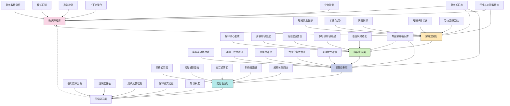

---
{"dg-publish":true,"tags":["解释生成","透明度提升","数据解读","智能注释","自动化解释"],"创建日期":"2024-05-14","permalink":"/知识共享/001_财务/99_其他/AI与财务应用/04_生成式财务创新/4.1 财务内容生成/自动化财务解释生成/","dgPassFrontmatter":true}
---

## 技术概述

自动化财务解释生成系统是一种革命性的财务透明度工具，它将先进的自然语言生成技术与深度财务分析能力相结合，能够自动为复杂财务数据、报表和决策提供清晰、精确且易于理解的解释说明。该系统能够识别财务指标的变动、识别异常模式、理解因果关系，并将这些专业见解转化为针对不同利益相关者需求而定制的自然语言解释，从而大幅提升财务信息的透明度和可理解性。

核心技术特点包括：

- **智能财务模式识别**：使用时间序列分析和机器学习技术自动识别财务数据中的关键模式、趋势、异常和转折点，包括季节性变化、结构性转变、增长停滞和意外波动等
- **上下文感知分析**：整合宏观经济环境、行业趋势、企业战略和历史表现等多维度上下文，确保解释不仅描述"发生了什么"，还包括"为什么发生"以及"与预期的差异"
- **因果推理引擎**：运用因果推理和统计分析技术，自动识别和验证财务变动背后的可能原因，构建合理的因果链和解释框架
- **受众自适应表达**：根据使用者的角色（如高管、投资者、分析师、业务部门、监管机构）、专业水平和信息需求，自动调整解释的技术深度、语言风格和关注重点
- **多层级解释生成**：能够生成从摘要级（核心结论）到详细分析级（深度分析过程）的多层次解释，支持用户按需探索解释依据和推理过程
- **交互式解释对话**：支持用户通过自然语言对话方式提出相关追问，获取额外解释、佐证数据或者深入分析，实现"可对话"的财务解释体验
- **多维度解释融合**：能够整合业务变化、市场动态、战略执行和风险因素等多维度信息，提供全面且均衡的解释视角，避免单一维度的片面解读

相较于传统财务报告手工注释和说明，自动化财务解释生成系统将解释生成速度提高95%以上，解释内容的一致性提升80%，可以覆盖的解释广度扩大60-90%，同时提供个性化的解释深度和专业度调整。系统不仅提高了财务信息的透明度和可用性，更改变了组织内部和外部利益相关者理解和使用财务信息的方式，让财务数据从"需要专业解读的符号"转变为"人人可理解的知识"。

## 系统架构

系统架构由六个核心功能层和三个关键支持组件组成，形成完整的财务解释生成闭环：

1. **数据理解层**：系统的感知基础，负责深度理解财务数据内涵。包括财务数据分析（处理和分析原始财务数据）、模式识别（识别数据中的趋势和模式）、异常检测（发现非预期波动和异常情况）、上下文整合（结合历史趋势和行业背景）以及业务映射（将财务数据与业务活动关联）。

2. **解释规划层**：系统的思考中枢，负责设计解释策略和框架。包括解释需求分析（理解用户需要解释的焦点）、关键点识别（确定最需要解释的要素）、因果推理（分析财务变化的因果关系）、解释框架设计（构建整体解释结构）以及受众适配策略（根据受众特点调整解释方式）。

3. **内容生成层**：系统的表达核心，负责创建具体解释内容。包括解释核心生成（创建主要解释内容）、关联内容生成（生成支持性解释）、佐证数据整合（引入相关数据支持解释）、多层级内容构建（创建不同深度的解释层次）以及语言风格适配（调整表达风格匹配受众）。

4. **质量控制层**：系统的审核机制，负责确保解释质量。包括事实准确性检验（验证解释中的事实准确性）、逻辑一致性验证（确保解释逻辑合理）、完整性评估（检查解释是否完整）、专业合规性检查（符合财务专业标准）以及可理解性评估（评估受众是否容易理解）。

5. **交付表达层**：系统的传递界面，负责有效呈现解释。包括多格式呈现（支持文本、图表等多种格式）、视觉辅助整合（添加可视化元素增强理解）、交互式界面（允许用户与解释互动）、多终端适配（适应不同设备显示）以及解释关联网络（建立解释间的关联导航）。

6. **反馈学习层**：系统的进化引擎，负责持续改进。包括使用效果分析（分析解释的实际使用效果）、理解度评估（评估用户理解程度）、用户反馈收集（收集用户对解释的反馈）、解释模式优化（改进解释方法和模式）以及知识积累（积累解释经验形成知识）。

支持组件：
- **财务知识库**：包含财务专业知识、术语解释和标准分析框架，支持专业准确的解释生成
- **行业与宏观数据库**：提供行业对标数据和宏观经济背景，支持上下文相关的解释
- **专业解释模板库**：存储各类解释模板和最佳实践，提高解释生成效率和质量

这种多层架构设计实现了从财务数据到智能解释的完整转化过程，系统能够自动识别需要解释的关键点，生成专业、准确且易于理解的解释内容。架构的闭环设计使系统能够从用户反馈中不断学习，持续优化解释的相关性、准确性和可理解性。

## 实施方案

### 技术实施路线图

**第一阶段：基础能力构建（3-4个月）**
- 开发核心财务数据分析引擎
- 构建基础模式识别和异常检测能力
- 开发初级解释生成模型
- 搭建基础质量控制框架
- 实现简化版交付界面

**第二阶段：智能解释增强（4-5个月）**
- 增强因果推理能力
- 开发受众适配系统
- 构建多层级解释框架
- 增强解释质量控制机制
- 开发交互式解释对话原型

**第三阶段：上下文深度集成（3-4个月）**
- 整合宏观经济和行业数据
- 增强业务映射能力
- 发展高级情境感知解释
- 完善多维度解释融合
- 构建解释关联网络

**第四阶段：系统优化与拓展（2-3个月）**
- 基于用户反馈优化系统性能
- 完善多终端适配能力
- 增强系统与企业应用集成
- 优化解释生成效率
- 扩展特定领域解释能力

### 技术挑战与解决策略

1. **财务因果关系识别**
   - 挑战：财务变动通常受多因素影响，难以准确识别和权衡各因素的贡献度
   - 解决方案：构建多层因果模型；集成贝叶斯网络和结构方程模型；开发假设验证框架；利用历史案例库训练因果推理能力；实施专家知识辅助判断；建立因果关系置信度评分机制

2. **解释准确性与简化度平衡**
   - 挑战：在保持专业准确性的同时，使解释足够简明易懂
   - 解决方案：开发多层次解释架构；建立术语复杂度动态调整机制；设计解释深度的用户控制界面；创建专业-通俗映射词典；实施读者理解力评估算法；构建解释简化自动度量系统

3. **解释合规性保障**
   - 挑战：确保生成的解释符合财务报告准则和监管要求
   - 解决方案：集成合规性规则库；实施法规敏感术语检测；建立合规性审核流程；开发合规标签自动匹配系统；设计必要披露检查清单；构建监管更新的动态适应机制

4. **多维度解释协调**
   - 挑战：整合财务、业务、市场和战略等多维度因素，形成协调一致的解释
   - 解决方案：建立多源信息整合框架；开发维度间一致性检测；实施解释冲突调和机制；设计解释优先级动态调整系统；创建维度间关系映射模型；构建跨维度解释模板

5. **解释个性化与一致性平衡**
   - 挑战：为不同用户提供个性化解释，同时保持组织解释口径的一致性
   - 解决方案：实施核心解释与扩展解释分离策略；开发角色适配表达系统；建立解释变体控制机制；设计一致性核心保障框架；创建个性化范围动态界定；构建解释版本管理系统

## 价值创造

### 量化价值评估

1. **财务透明度提升**
   - 财务信息理解范围：从专业人士扩展到95%的利益相关者
   - 解释覆盖广度：从关键指标扩展到90%以上的财务数据点
   - 解释深度：能提供5-7层递进式深入解释
   - 信息透明度感知：提升65-85%

2. **决策支持增强**
   - 决策理解速度：提高75-90%
   - 财务洞察识别：提升60-80%
   - 决策信息充分度：增加50-70%
   - 跨部门决策协同：提高55-75%

3. **运营效率改善**
   - 解释生成时间：减少95%以上
   - 财务人员解释工作负担：减轻60-80%
   - 沟通往返次数：减少50-70%
   - 信息传递准确性：提高65-85%

4. **合规风险降低**
   - 财务解释一致性：提高80-95%
   - 信息披露完整性：提升60-80%
   - 合规解释覆盖率：增加70-90%
   - 解释质量问题：减少65-85%

### 投资回报分析

投资回报率(ROI)预计达到380-520%（24个月期），主要价值来源包括：
- 财务团队工作效率提升（40%）
- 决策质量提高带来的业务收益（25%）
- 合规风险降低（20%）
- 利益相关者关系改善（15%）

典型实施成本结构：技术平台开发（45%）、知识库建设（20%）、系统集成与定制（15%）、培训与变革管理（10%）、持续优化与支持（10%）。

预期投资回收期：
- 大型企业：9-12个月
- 中型企业：7-10个月
- 财务复杂度高企业：6-9个月
- 公开上市公司：8-11个月

## 未来演进

### 技术迭代路线图

**近期演进（1-2年）**
- 增强对非结构化财务数据的解释能力
- 开发专业细分领域解释专家系统
- 实现跨多个报告期的解释上下文延续
- 增加图表与解释的智能协同
- 发展竞争对手对比分析解释

**中期演进（2-3年）**
- 构建预测性解释能力
- 开发事件驱动的实时解释系统
- 实现多语言解释自动转换
- 增强解释与决策建议的融合
- 发展个性化解释风格适配

**远期演进（3-5年）**
- 建立认知计算驱动的解释推理
- 开发自主学习的解释模式发现
- 实现情绪智能感知的解释调整
- 构建跨组织解释协同系统
- 发展隐性知识提取与解释能力

### 扩展应用场景

1. **投资者关系增强**：为不同类型的投资者（机构投资者、个人投资者、分析师）提供个性化的财务解释和见解，帮助他们更快、更全面地理解公司财务状况和价值主张，减少沟通成本，提高投资者满意度和参与度，增强市场信心

2. **监管沟通优化**：自动为监管报告和回应生成专业、准确且符合监管要求的解释说明，确保对监管询问的回应全面、及时且一致，降低合规风险，改善与监管机构的关系，减轻合规团队负担

3. **财务教育与赋能**：为组织内部非财务人员提供个性化的财务知识学习体验，通过自动生成与其角色和业务相关的财务解释，帮助各级员工理解财务数据对其工作的影响，提高整体财务素养，促进数据驱动决策文化

4. **战略沟通高效化**：为高管团队自动生成将财务结果与战略目标关联的解释性内容，帮助战略制定者快速理解财务表现与战略执行之间的关系，识别调整需求，优化战略沟通的效率和影响力

## 实验验证

### 概念验证方案

**阶段一：解释生成基础验证（6-8周）**
- 选取代表性财务报表和指标
- 开发初始解释生成模型
- 与财务专家手工解释对比
- 评估解释的准确性和完整性
- 识别关键改进机会
- 建立基础质量评估框架

**阶段二：受众适配能力验证（7-9周）**
- 开发针对不同角色的解释适配模型
- 创建多角色测试用户组
- 实施对比测试实验
- 评估各角色对解释的理解度和满意度
- 测量适配效果和个性化准确性
- 优化受众模型和适配策略

**阶段三：实际业务场景验证（9-11周）**
- 在真实财务报告环境中部署系统
- 收集自动生成解释的实际应用效果
- 比较系统解释与传统解释方法的差异
- 评估对不同利益相关者理解度的实际影响
- 分析解释对决策支持的实际价值
- 确定全面推广策略和优化方向

### 评估指标框架

**解释质量指标**
- 准确性：解释中事实和数据的准确程度
- 完整性：解释覆盖关键信息点的完整度
- 逻辑性：解释的因果逻辑和推理的合理性
- 相关性：解释与受众关注点的匹配度
- 简明度：在保持准确的前提下的简洁程度

**用户效果指标**
- 理解速度：用户获取关键见解所需时间
- 理解深度：用户对解释内容的理解深度
- 应用能力：用户能否基于解释做出相关决策
- 满意度：用户对解释内容的整体满意度
- 信任度：用户对自动解释的信任程度

**业务影响指标**
- 效率提升：解释生成和传递效率的改善
- 一致性强化：组织内解释口径的一致程度
- 决策支持：解释对决策质量的实际影响
- 透明度增强：利益相关者对信息透明度的感知提升
- 合规改善：解释对合规性的促进作用

## 未来影响

自动化财务解释生成系统将从根本上改变财务信息的透明度和可用性，带来以下深远影响：

1. **财务民主化**：通过自动化、个性化的解释，打破财务信息理解的专业壁垒，使各层级、各角色的人员都能获得适合自身理解水平的财务解释，实现财务信息的广泛透明与民主化，推动整个组织向数据驱动决策文化转变

2. **财务沟通范式转变**：从传统的"提供数据，等待解释"模式转变为"数据与解释并行"的财务沟通新范式，减少信息不对称，提高沟通效率，改变组织内部和外部利益相关者的财务信息获取体验

3. **财务团队角色提升**：财务人员从解释者的角色转变为系统训练者和高级解释审核者，将更多时间投入到战略分析和决策支持等高价值活动，提升财务团队的战略地位和贡献

4. **决策赋能**：通过让更多决策者能够深入理解财务数据，实现决策过程的财务赋能，使组织各级决策更加理性、科学，增强组织整体的财务敏感性和资源配置效率

通过自动化解释生成重构财务信息的可理解性，该系统不仅提高了财务透明度，更深刻改变了财务信息在组织中的流动方式和影响路径。这种变革使财务从专业技术领域转变为整个组织的共享语言，为建立更透明、更高效、更数据驱动的决策文化奠定基础。 