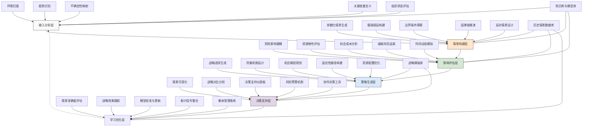

---
{"dg-publish":true,"tags":["创意生成","边界思考","假设推演","情景构建","战略思维"],"创建日期":"2024-05-14","permalink":"/知识共享/001_财务/99_其他/AI与财务应用/04_生成式财务创新/4.2 创意财务分析/4.2 假设情景生成助手/","dgPassFrontmatter":true}
---

## 技术概述

假设情景生成助手是一种面向财务和战略决策的前瞻性智能工具，它结合了生成式人工智能、因果推理和策略模拟技术，能够系统性地构建和探索各类可能的未来情景、极端事件和边界条件。该系统突破了传统财务规划中对历史趋势的依赖和对未来的线性外推，通过结构化的假设推演和情景构建，帮助组织识别潜在机遇与风险，测试战略韧性，并为不确定环境下的决策提供全方位的准备。

核心技术特点包括：

- **结构化情景构建引擎**：采用参数化情景生成技术和因果推理模型，能够基于关键变量和驱动因素的组合，系统性地生成各类可能情景，包括基线情景、极端情景、对立情景和混合情景
- **假设空间探索系统**：利用蒙特卡洛方法和智能边界测试算法，能够系统性地探索假设空间的边界和临界点，发现常规思维之外的情景可能性和非线性效应
- **因果链推演模型**：结合因果推理和事件树分析技术，能够构建事件连锁反应网络，模拟一系列事件的连锁效应和级联影响，揭示复杂系统中的脆弱点和隐藏风险
- **反向情景构建**：采用目标导向反推技术，从期望或避免的结果出发，反向推导可能的路径和关键节点，识别战略机遇和防御点
- **多维财务影响模拟**：整合财务建模和系统动力学方法，能够量化评估不同情景对组织财务状况、资源配置和价值创造的潜在影响
- **适应性战略规划支持**：基于情景分析结果，提供战略选项组合和适应性路径建议，支持在高度不确定环境下的稳健决策和灵活规划
- **协作情景探索平台**：支持多用户协同情景构建和评估，整合不同视角和专业知识，提升情景的全面性和创造性

相较于传统的财务预测和情景规划方法，假设情景生成助手能够将情景覆盖范围扩大5-10倍，将边界条件识别效率提升60-80%，将战略准备前置1-3年，同时将意外事件的应对准备度提高40-60%。系统不仅为组织提供了应对不确定未来的思维工具，更为财务和战略决策注入了系统性的创造力和前瞻性，形成针对多种可能未来的适应性准备。

## 系统架构

系统架构由六个核心功能层和三个关键支持组件组成，形成完整的假设情景生成和战略规划闭环：

1. **输入分析层**：系统的感知和基础数据层，负责收集和处理环境与组织信息。包括环境扫描（收集外部环境信息）、趋势识别（识别主要发展趋势）、不确定性映射（确定高不确定性因素）、关键变量定义（确定关键影响变量）以及组织状态评估（评估组织当前状况）。

2. **情景构建层**：系统的创造核心，负责生成多元化的假设情景。包括参数化情景生成（基于参数组合生成情景）、极端假设构建（创建极端情况）、边界条件探索（探索各种极限条件）、因果链推演（模拟事件连锁反应）以及反向情景设计（从结果反推过程）。

3. **影响评估层**：系统的分析引擎，负责评估情景影响。包括财务影响建模（预测财务影响）、资源弹性评估（评估资源适应能力）、机会成本分析（分析不同选择的机会成本）、级联风险追踪（分析风险连锁效应）以及时间动态模拟（模拟情景随时间演变）。

4. **策略生成层**：系统的应对方案层，负责设计战略选项。包括战略选项生成（创建应对策略）、防御机制设计（设计风险防御机制）、机会捕捉规划（规划机会利用方案）、适应性路径构建（设计柔性战略路径）以及资源配置优化（优化资源分配）。

5. **决策支持层**：系统的呈现和互动界面，负责辅助决策过程。包括情景可视化（直观展示各种情景）、战略对比分析（比较不同战略效果）、决策支持仪表板（整合关键决策信息）、风险预警机制（提供风险预警）以及协作决策工具（支持团队决策）。

6. **学习优化层**：系统的进化机制，负责持续改进和调整。包括情景准确度评估（评估情景预测准确性）、战略效果跟踪（跟踪战略实施效果）、模型校准与更新（调整预测模型）、新兴信号整合（融入新出现的信号）以及集体智慧吸收（整合团队智慧）。

支持组件：
- **知识库与模型库**：包含行业模型、经济模型、历史事件模式和专家知识
- **历史情景数据库**：存储历史情景、实际发展轨迹和影响结果数据
- **战略模板库**：收集各类策略框架、应对方案和最佳实践

这种多层架构设计突破了传统财务预测的单一视角，能够系统性地探索多种可能的未来，并为组织提供相应的适应性战略选项。系统的闭环设计使其能够从实际发展中不断学习和优化，持续提高情景构建的准确性和战略建议的针对性。

## 实施方案

### 技术实施路线图

**第一阶段：基础能力构建（3-4个月）**
- 开发环境扫描和趋势分析框架
- 构建参数化情景生成引擎
- 设计基础财务影响模型
- 实现初级情景可视化功能
- 建立情景评估基本机制

**第二阶段：高级情景构建（4-5个月）**
- 增强边界条件探索算法
- 开发因果链推演系统
- 构建反向情景生成能力
- 扩展财务影响模拟模型
- 实现多维情景分析工具

**第三阶段：战略规划增强（3-4个月）**
- 开发战略选项生成引擎
- 构建适应性路径规划框架
- 实现资源配置优化模型
- 设计协作决策支持平台
- 建立战略效果评估机制

**第四阶段：系统集成与优化（2-3个月）**
- 整合各功能模块形成完整系统
- 优化用户界面和体验设计
- 增强情景学习和调整能力
- 开发行业特定模型和模板
- 建立持续改进和更新机制

### 技术挑战与解决策略

1. **情景多样性与质量平衡**
   - 挑战：需要在生成足够多样化情景的同时确保每个情景的质量和相关性
   - 解决方案：实施多阶段情景筛选机制；开发情景质量评分系统；建立情景相关性检验框架；设计情景多样性指标；实施专家评审机制；构建特定领域情景模板

2. **不确定性定量化**
   - 挑战：将高度不确定的未来事件和变量转化为可模拟和量化的参数
   - 解决方案：采用贝叶斯概率网络；实施区间估计方法；开发模糊逻辑评估系统；引入集成专家判断机制；设计多模型综合分析；建立情景可信度评分

3. **系统复杂性管理**
   - 挑战：真实世界的因果关系和影响网络极其复杂，难以全面模拟
   - 解决方案：开发模块化因果模型；实施复杂性分层管理；设计关键节点识别算法；采用系统边界动态调整；引入自适应细化机制；建立核心变量提取框架

4. **用户认知负担**
   - 挑战：大量复杂情景可能导致用户认知过载，难以有效决策
   - 解决方案：设计分层次情景呈现；开发情景聚类和分类系统；实施关键洞察自动提取；创建情景导航地图；建立个性化重要性排序；提供决策辅助简化框架

5. **情景到战略的转化**
   - 挑战：将多种可能性情景有效转化为可操作的战略决策
   - 解决方案：开发多情景适应策略框架；设计共同行动识别系统；建立战略弹性评估模型；实施决策树转化工具；创建实时调整触发机制；构建战略选项组合优化器

## 价值创造

### 量化价值评估

1. **战略前瞻性增强**
   - 战略视野扩展：从单一预测扩展到10-15个多元情景
   - 前瞻时间延长：提前1-3年识别关键趋势和转折点
   - 战略准备深度：增加40-60%的应对选项覆盖面
   - 战略韧性：提高30-50%的环境适应能力

2. **风险管理提升**
   - 黑天鹅事件准备：提高50-70%的极端事件应对能力
   - 风险识别覆盖：扩大35-55%的潜在风险识别范围
   - 预警提前期：平均提前4-8个月发现风险信号
   - 风险缓解选项：增加25-45%的风险防御措施

3. **机会捕捉能力**
   - 新机会识别：提升40-60%的潜在机会发现能力
   - 机会响应速度：加快30-50%的机会抓取速度
   - 资源调配灵活性：提高35-55%的资源重新配置效率
   - 先发优势获取：增加20-40%的市场先机把握能力

4. **资源优化效益**
   - 投资组合韧性：提升45-65%的投资组合韧性
   - 资源浪费减少：降低20-35%的无效资源配置
   - 机会成本优化：减少15-30%的战略转向成本
   - 长期价值创造：提高25-40%的长期价值实现概率

### 投资回报分析

投资回报率(ROI)预计达到380-550%（36个月期），主要价值来源包括：
- 危机预防和应对能力提升带来的损失避免（35%）
- 战略机会识别和把握带来的增值（30%）
- 资源配置优化带来的效率提升（20%）
- 决策质量提高带来的长期价值（15%）

典型实施成本结构：技术平台开发（45%）、模型和知识库建设（25%）、团队培训与能力建设（15%）、系统集成与定制（10%）、持续更新和支持（5%）。

预期投资回收期：
- 高风险行业企业：12-16个月
- 大型复杂企业：14-18个月
- 快速变化行业企业：10-14个月
- 资源密集型企业：15-20个月

## 未来演进

### 技术迭代路线图

**近期演进（1-2年）**
- 集成实时数据流增强环境感知能力
- 开发多层次因果网络自学习能力
- 增强跨情景模式识别和分析
- 实现更精细的财务影响量化
- 发展更智能的战略选项生成引擎

**中期演进（2-3年）**
- 构建动态适应型情景更新系统
- 开发集体智能增强的情景构建
- 实现自主情景质量评估与优化
- 增强战略实施路径动态调整
- 发展预见性风险信号检测系统

**远期演进（3-5年）**
- 建立情景构建的认知计算框架
- 开发战略决策的人机协同生态系统
- 实现通用决策智能和假设推理
- 构建组织记忆与前瞻学习系统
- 发展分布式协作的战略预见网络

### 应用场景拓展

1. **战略重塑先导**：在战略转型或重大业务调整前，系统性探索多种可能的市场、技术和竞争情景，评估不同战略方向的韧性和长期价值。通过构建多元化的未来情景，测试战略假设，识别潜在障碍和机会窗口，为组织提供更全面的战略选择和适应性路径规划，显著降低战略失败风险。

2. **资本配置优化**：创建多维度的财务和市场情景矩阵，模拟不同投资组合在各种未来条件下的表现和风险特性。通过情景分析，识别具有跨情景韧性的投资机会和潜在的脆弱点，设计更加灵活的资本分配策略，包括分阶段投资、选择权设计和防御性缓冲，实现更高的风险调整回报。

3. **危机预防与准备**：系统性构建各类潜在危机情景，从财务危机、市场断裂到供应链中断和声誉风险，全面评估组织脆弱点。通过危机情景推演，开发先导指标监控系统，设计分层次应对预案，进行情景模拟演练，建立危机响应能力，将潜在损失降至最低，同时发现危机中可能出现的战略机会。

4. **创新路径探索**：通过构建多种可能的技术演进、市场需求和竞争格局情景，为产品和服务创新提供更广阔的思考空间。分析不同创新路径在各种未来情景下的适应性和潜力，识别具有跨情景价值的创新方向和关键技术能力，设计阶段性验证点和资源灵活调整机制，提高创新投资的成功概率和回报。

## 实验验证

### 概念验证方案

**阶段一：情景构建能力验证（6-8周）**
- 选择3-5个历史转折点案例进行回测
- 评估系统能否构建出包含实际发生情景的情景集
- 测试边界条件探索和极端情景生成能力
- 分析情景的多样性、相关性和启发价值
- 验证因果链推演的准确性和完整性
- 识别情景构建的关键改进点

**阶段二：财务影响模拟验证（7-9周）**
- 在历史数据基础上测试财务影响模型
- 比较模型预测与实际结果的差异
- 评估不同类型情景的财务影响精确度
- 验证资源弹性评估的实用性
- 测试级联风险追踪的有效性
- 优化财务模型和影响评估框架

**阶段三：战略应用验证（10-12周）**
- 选择1-2个实际业务单元进行试点应用
- 引导管理团队使用系统进行战略规划
- 评估生成战略的质量和创新程度
- 测量决策过程改进和团队共识形成效果
- 跟踪初期战略实施结果
- 收集用户体验反馈和改进建议

### 验证指标体系

**情景质量指标**
- 多样性：情景覆盖的假设空间广度
- 内部一致性：情景内部逻辑的连贯性
- 相关性：情景与组织面临挑战的关联度
- 启发性：情景能激发新思考的程度
- 可行性：情景在合理范围内的发生可能性

**战略价值指标**
- 战略适应性：应对多种情景的能力
- 机会识别率：发现潜在机会的效率
- 风险预警能力：提前识别风险的效果
- 资源配置优化：资源使用效率的提升
- 决策信心：管理团队决策自信度的提高

**系统使用指标**
- 用户采纳度：系统在决策过程中的使用频率
- 学习曲线：用户掌握系统的时间和难度
- 团队协作：促进团队协作决策的效果
- 洞察转化：系统洞察转化为行动的比率
- 持续使用：初期采用后的持续使用情况

## 未来影响

假设情景生成助手将从根本上改变组织面对未来的思维模式和决策方法，带来以下深远影响：

1. **战略思维范式转变**：推动组织从单一预测和确定性规划，转向多情景思维和适应性战略。这种思维转变使组织从"预测未来"转向"为多种可能未来做准备"，从刚性战略计划转向灵活战略选项组合，培养系统性思考不确定性和风险的能力，形成更富韧性和前瞻性的战略文化。

2. **决策流程与治理改革**：重塑组织的决策制定过程和治理结构，使其更适应不确定环境。通过情景思维融入核心决策流程，组织将建立更灵活的资源分配机制、更敏捷的决策审批流程、更有效的风险评估框架，以及更具前瞻性的治理结构，提高整体环境适应能力和决策质量。

3. **创新思维与文化促进**：激发组织更开放的思维方式和创新文化。通过系统性探索各种可能性边界，组织将培养"边界思考"习惯，挑战既有假设，拓展创新空间，减少认知偏见，增强面对颠覆性变化的适应能力，从而在日益复杂和不确定的环境中保持竞争优势。

4. **长期价值创造视角**：深化组织对长期价值和可持续发展的关注。多情景思维自然引导组织超越短期财务目标，考虑更广泛的价值创造维度和长期发展路径，增强对系统性风险和长期机遇的感知，培养更平衡的决策视角，实现更可持续的增长和价值创造。

通过系统性的假设情景构建和探索，该系统不仅提供了应对未来不确定性的技术工具，更引导组织形成全新的思维模式和决策文化。这种转变使组织能够在波动、不确定、复杂和模糊的环境中保持方向感和适应力，将潜在危机转化为战略机遇，在变化中创造持久价值。 